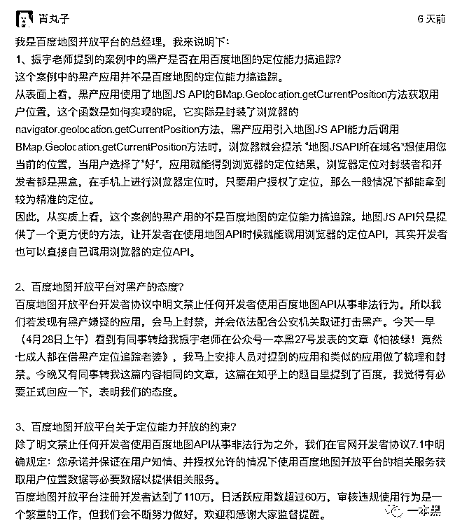
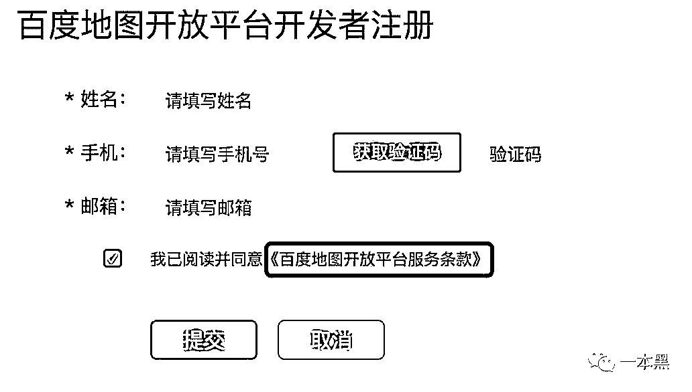

# 百度的回应，让我不得不说说「快播的黄」、「则西的死」

> 原文：[`mp.weixin.qq.com/s?__biz=MzU4ODAwNzUwMQ==&mid=2247483691&idx=1&sn=f4048d0aac55415704c218f190915dd2&chksm=fde21009ca95991ff4b116ec508172a5b6c575d2d1c1ce2f75dbde7beeb37737440f37f99c5e&scene=27#wechat_redirect`](http://mp.weixin.qq.com/s?__biz=MzU4ODAwNzUwMQ==&mid=2247483691&idx=1&sn=f4048d0aac55415704c218f190915dd2&chksm=fde21009ca95991ff4b116ec508172a5b6c575d2d1c1ce2f75dbde7beeb37737440f37f99c5e&scene=27#wechat_redirect)

文/振宇（微信公众号：一本黑）

【一本黑】媒体或商业转载必须获得授权，个人转发朋友圈无需授权。

读完需要

10 分钟

速读仅需 6 分钟

* * *

4 月 28 日的下午，我在知乎上发布了 xxx，意外的吸引到了百度地图负责人的关注，并且在评论区给出了自己的回应。

<inherit></inherit>

这个回应很长、讲的很细致、态度也很诚恳。

经过求证，我认为言简意赅的说法是：

1、获取用户的位置本身是经过用户授权的，用户同意后才能拿到精准的定位。百度的定位服务只是为黑产提供了便利，即使没有百度，黑产自己也可以做到。

2、百度也是坚决打击黑产的，看到你的文章，我们就去封了黑产，然后来回应下。

3、我们事先跟使用该服务的人说了，要保证用户的知情权。现在百度用户用户量太大，不好管理啊，我们努力吧。

这三个点乍看之下并没有错，却反映了一个更大的问题！

出现问题的时候，只要自己没犯错，就不必承担责任了吗？

这个观点不由得让我想到了当年的「快播涉黄案」。

当时，快播在海淀法院表演了一场精彩的当庭抗辩。其中快播那句“坏人用刀杀人，难道卖刀人也有错吗？”，被网友热议许久。

去年的「魏则西」事件，百度也是在强调自己没有做错，只是平台被莆田系所利用。

不去论及法律层面。

这两件事都是在表达一个观点，那就是“没错，是不是就代表你没有责任？是不是就不需要承担后果”。

从百度的角度看：

从这次的黑产定位追踪事件看，百度确实以「文字的形式」对使用者的行为做出了约束。

<inherit></inherit>

百度该说的都说了，所以没有错。

从用户的角度看：

定位服务是需要用户自己点「允许」才能获取位置。

而当下各式 APP、网页都会请求用户的位置授权，用户早已习之为常，心里毫无戒备。

难道因为是用户一如既往地点了允许，所以错误就在用户吗？用户是不是每次做什么操作，都应该先咨询下公安部门？

那就得出了“谁都没有错，错都在黑产”这样没意义的结论。

引用电信诈骗的例子是再适合不过了。

银行说，我们接到了转账请求，卡号、验证码、密码都对，我们没理由不批啊，我们没错啊！

运营商说，诈骗团伙通过短信或电话钓鱼，运营商也管不了啊，错也不在我们啊！

用户说，我这看到的号码也是银行的，对方伪装的和银行人员一样，所以是我的错？那九年义务制教育里没有反侦察课，没有防骗课，该当何罪？

这些都说明了一个问题，那就是各方都没有错，可是一放到一起，就产生了问题、产生了受害者。

企业在参与社会生产创造价值的同时，也得到丰厚的物质回报，就应该承担相应的「社会责任」。

不犯法是企业经营的「底线」，但不是「追求」，更不能是衡量一个企业社会价值的「标准」。

有社会责任感的企业，一定会保护用户的权益。而不是在问题发生的时候，先把自己弄干净，摆出一副“我没错，别找我”的姿态。

想起了白岩松那句，“现在我们生活中不由自主的有很多底线变成上限了，比如食品现在没有人追究是不是好吃，而是说没放其他东西。我也不希望拥有这样忍无可忍的机会。我觉得人都是为希望向前走的，我觉得希望还在。”

主动承担社会责任，保障用户的利益，或许会增加企业额外成本，但是这件事情本身的价值也不容小觑。

企业要想基业长青，就要多做“晴天修屋顶”的事，重视底层建设，才能打造信任感更强的品牌。

浮躁的时代里，最稀缺的就是安全感。

如果用户说“我在 XX 平台很少遇到骗子，比别的地方都安全些。”

这就是平台给用户的安全感，相较于同行，他拥有了一个很高的壁垒。

建立信任感，是一件需要追求「极致」并且长此以往「坚持」下去的事。

要坚持是因为用户的认知、群体的共识都需要长时间的培养。要极致，是因为体验好坏的标准不够清晰，拉开差距才容易分出好坏！

去年特斯拉和三星都遭遇了巨大的公关危机。面对产品给用户造成的伤害，三星推卸责任的态度和特斯拉主动承担表现，让两家公司在这次公关事件中得到了完全不同的口碑。

互联网时代里，衡量一家公司的发展，不该只是用户量和现金流。忽视社会责任的企业是得不到用户信任的，靠金钱买来的客户也没有忠诚可言，当潮水退去，谁笑到最后都不好说。

目前，市面上体量较大的公司，都有自己的风控系统，都设立了不同的机制来保护用户、抬高不法者的作案门槛。

体量越大，责任就越大。

特别是 BAT 级别的公司，早就建立了庞大的用户、信息、业务的三位一体的安全体系，每年都是上亿元的投入。安全圈的收入，光是 BAT 这样体量的公司就贡献了半壁江山。相比于其他企业，已经承担了较多的责任。

那么问题来了，为什么投入如此巨大，他们却还总能曝出各式各样的问题?

BAT 级别的公司业务已经渗透到了各行各业，庞大的业务线让漏洞出现的概率远大于一般公司。加上其公司自身的流量巨大，只要找到一个入口就可以攫取巨大的利益，所以黑产费尽心机也要从其身上咬下一块肉来。

体量越大，影响力就越大。

面对这样的外部环境，BAT 总是难免饱受非议。一个不起眼的事件也可以被无限放大，演变成万众瞩目的热点。

保护用户安全，承担社会责任这件事，永远是「无论你做得多好，都还不够好」，这是一个永无止境的追求。

这些并非是对百度一家说的，只是以这次的事件为例说出了我的看法。

对于百度也好，还是任何一家公司，我们应该少一些苛责和挑剔，多一些督促和建议，让企业不再对承担责任过于惧怕，敢于接受社会的监督和指点。

我们可以做些什么来保护自身呢？多关注下一本黑吧，知乎和微信平台都可以。

留言功能我已经打开了，大家有什么说的就不用憋在心里了！

大家如果想爆料，可以在公众号里跟我讲，我都会回复的。

* * *

