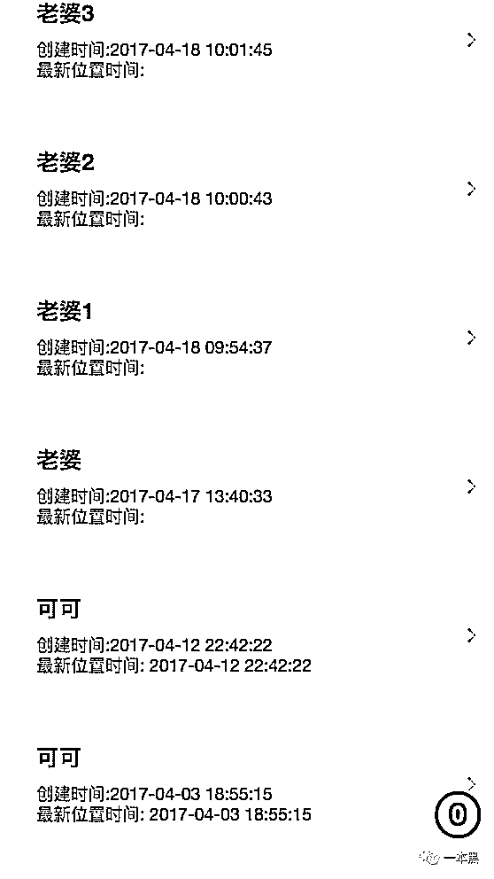

# 怕被绿！竟然七成人都在借黑产定位追踪老婆

> 原文：[`mp.weixin.qq.com/s?__biz=MzU4ODAwNzUwMQ==&mid=2247483687&idx=1&sn=ca0fbd875e4248f0e1bd8b9b78e571e4&chksm=fde21005ca959913e7dbcee1523c33747335e06650e256e0dd3f6097f5bd76d6ba35e35f5785&scene=27#wechat_redirect`](http://mp.weixin.qq.com/s?__biz=MzU4ODAwNzUwMQ==&mid=2247483687&idx=1&sn=ca0fbd875e4248f0e1bd8b9b78e571e4&chksm=fde21005ca959913e7dbcee1523c33747335e06650e256e0dd3f6097f5bd76d6ba35e35f5785&scene=27#wechat_redirect)

文/振宇（微信公众号：一本黑）

【一本黑】媒体或商业转载必须获得授权，个人转发朋友圈无需授权。

读完需要

10 分钟

速读仅需 6 分钟

* * *

<inherit>多少次，她说是在工作，但是诡异的第六感告诉我们，她在撒谎...</inherit>

究竟她瞒着自己在干什么呢？

她到底去了什么地方，又见了哪些人？

**生活中总是不乏这样的疑问和揣测，毕竟这是个浮躁的时代，在快节奏生活的高压下，「信任」越来越稀缺。**

**手机定位、位置追踪这种需求，在这样的时代背景下悄然壮大。**

<inherit></inherit>

<inherit>（搜索结果和百度指数反应的需求是最真实的。）</inherit>

虽然需求巨大，却碍于市面上的定位方法实施门槛较高，成本不够低，所以一直被诸多诟病。

**然而就在前天夜里，一个高中死党深夜来电吐苦水，痛诉着自己发现女友的不忠，却不愿放手的现状。其实他早已怀疑女友另有新欢，为了知道真相，方法用尽，其间几次想找我求助，但是碍于尊严不愿开口。最后依靠从网上买来的定位系统，证实了女友的工作、睡觉，其实都是与他人幽会的借口。**

压抑的听完朋友的惨痛经历，久久难以入眠，在我印象中这姑娘还是很纯的，会不会是弄错了呢？这定位靠不靠谱啊？

于是我找他要来了这个系统，看看到底是不是真的，别错怪了人家。

<inherit>**定位到底是不是真的？**</inherit>

<inherit></inherit>

<inherit>（外星科技寻亲定位...）</inherit>

系统的功能是分享文章或者发红包，只要对方打开，就可以获取到对方的定位。

<inherit></inherit>

<inherit></inherit>

<inherit></inherit>

文章的内容涉猎广泛，完全可以根据对方的口味来设置自己的“鱼饵”，合适的饵才能钓上想吊的鱼。

再分享给要定位的对象，微信/QQ/短信都可以，因为只是一个链接。

<inherit></inherit>

<inherit></inherit>

打开链接，会询问是否同意使用当当前位置。点击其中一个选项就会展现出文章内容，整个过程和打开普通的文章分享是一样的，只是多了一个要求位置的选项。

**现在各种 APP 和微商服务号都会请求地理位置，所以这个环节并不会很突兀，不易引起怀疑。**

<inherit></inherit>

发红包定位的打开率必然是远超文章定位的，而这个发红包的流程就和平常略有不同了。

发红包实际上是企业红包，由一家第三方的公司以代付的方式发送。

简单地说，先把红包的费用付给这家企业，企业再以红包的形式发给你要定位的目标。同时这家公司会收取 15%的手续费，1 元的红包需要支付 1.15 元。

<inherit></inherit>

收到的红包样式也和平常不同，是以链接形式发来的企业红包。

<inherit></inherit>

领取红包的时候一样会出现获取地理位置的询问。

从文章分享到发红包，一直离不开这个请求，所以对”允许“和”不允许“这两种情况，我都分别做了测试。

**如果点击允许，系统后台会判定为定位成功，因为此时对方获得了你的 GPS 定位数据。这个数据就是此时你所在地的经纬度，系统会再发送给高德地图作分析，这时用的就是高德地图的开放 API（允许外界公司使用高德地图的部分功能），分析之后，就会得到一个相应的地址。**

为了不再测试中暴露我的身份，我对位置数据做了些手脚，于是就定位到了成都...

<inherit></inherit>

**假如点击的是不允许，那么对方就无法获取到 GPS 的数据，只能得到你的 IP 地址。**

**这里面就分 WIFI 和 4G 两种情况，4G 网络下的定位系统会自动判定失败，因为这种定位只能具体到区县，定位过于模糊。假如是在 WIFI 网络中，定位就可以精确到该 WIFI 服务所在的位置。**

想跟女孩子装装逼的，就来看看原理吧：原理上的区别就在于 WIFI 的数据出口是该宽带的安装位置，比如你家 WIFI 的 IP 就是你家的地址。而 4G 网络的数据出口在运营商的基站那里，所以 IP 只能具体到[北京朝阳区]这种，因为它只知道数据是从朝阳的基站发出来的...

**文章分享的定位原理和红包是一样的，只不过文章定位用的是百度地图的服务。这两种定位方式在设计上都堪称其巧妙，先是用企业红包和文章分享，由此获取用户的位置数据，再简单的嫁接两家地图公司的开放 API，就轻松实现了追踪定位的功能。**

**这里不得不吐槽百度、高德两家公司对于自己服务接口的控制还是太松了，才导致被灰产轻松利用。**

这种定位混合了现在几种合规的操作，导致封杀的难度极大，毕竟现在需要获取位置的软件和网页多如牛毛，又很难鉴别其行为是处于何目的，

<inherit>**信任缺失的时代，滋养出畸形需求**</inherit>

<inherit>整个测试过程中，一个问题一直萦绕着我，这种定位有什么意义呢？可以被怎么利用呢？</inherit>

系统的设计的如同筛子一般，满是漏洞，为了弄清楚大家来此的目的，我在这个系统的后台放了一个“机关”，向一部分账号发送了定位成功的消息，只要他们上来查询新的定位结果，我就能拿到登录他们账号的“钥匙”。（其实就是 cookie 和域名）

果然，才一颗烟的功夫，就获取了几百个账号的钥匙。

<inherit></inherit>

<inherit>（看不懂没关系，我发着玩的）</inherit>

<inherit>凭着这些钥匙，我登录了一些账户去看了他们的定位目标。</inherit>

结果让我大吃一惊，基本上目标全都是爱人或者配偶，除此以外就是催收的人用来定位欠款人人的。

<inherit></inherit>

<inherit></inherit>

<inherit></inherit>

看着这些名字，脊背阵阵发冷，原来使用定位追踪的人大多数是为了调查另一半，这个需求的产生完全是源于对伴侣的不信任。

**生活水平日趋进步的我们，每天像工蚁似的忙碌，为的就是撑起一个家，立足于自己喜欢的城市，追逐自己向往的生活。与此同时，精神上的空虚促使孤独、焦虑肆无忌惮的蔓延，才导致人与人之间的猜疑与日俱增，就连最亲密的人也不曾例外。**

**在我看来，不信任比不忠更能杀死一段关系，我们真正恐惧的其实是恐惧本身，真正猜疑的就是猜疑本身。**

不说这些了，显得不男人。

<inherit>这样畸形的需求也足够的刚，所以尽管收费不便宜，还是有这么多人购买，且其中不乏大量的超级 VIP 会员。主要的推广渠道就是微信群、QQ 群，各种贴吧和论坛，主打低门槛的定位追踪。想必做这个平台的人借此赚了不少，从我截获的账号数量推算，保守估计用户总数在一万左右，大家可以估算下这里的收入。</inherit>

<inherit></inherit>

<inherit>（为了测试，我也买了会员）</inherit>

<inherit>**幕后公司**</inherit>

相信大家也发现了，调用高德、百度的 API 接口，还调用了支付宝和微信的支付接口，再加上代发企业红包，一切都指向这个平台背后必然是有一家实体公司存在。

<inherit>究竟是哪家公司开发了这样的平台？</inherit>

<inherit>从企业红包的来源可以查到，是一家叫 X 云网络科技的公司。调查支付接口的 API，也是属于这家公司的。</inherit>

公司的主营业务是做网站，但是连自己的网站都做得十分潦草，域名都是类似 80di.com 这种随意注册的域名，让我很是怀疑这家公司的真正业务，到底这个平台是员工私下做的，还是公司做的。

到此，已经超出了我们一开始的初衷，不再往下挖了。

<inherit></inherit>

看看窗外，天就要亮了，给兄弟留了言“该分就分吧！感情，宁缺毋滥”。

