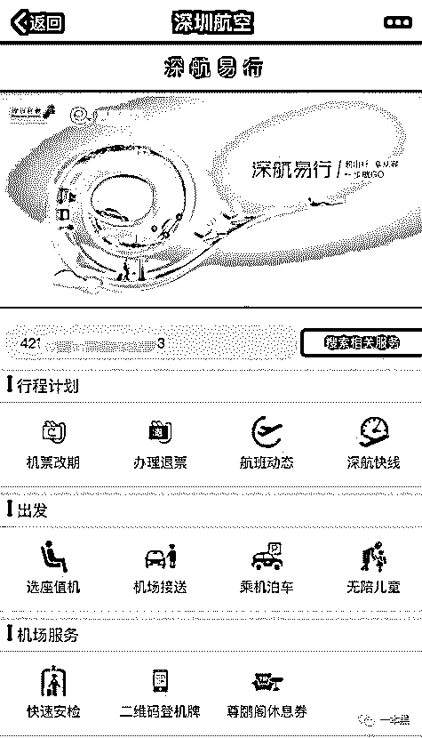

# 有了全国民航数据，我和卓伟之间只差一个女粉了

> 原文：[`mp.weixin.qq.com/s?__biz=MzU4ODAwNzUwMQ==&mid=2247483684&idx=1&sn=afaaff2d9ede9b1fba3e8bf804628a4d&chksm=fde21006ca95991046a4bff070637866a14d189ae382b5401916280e9602e1d5f1e21493307b&scene=27#wechat_redirect`](http://mp.weixin.qq.com/s?__biz=MzU4ODAwNzUwMQ==&mid=2247483684&idx=1&sn=afaaff2d9ede9b1fba3e8bf804628a4d&chksm=fde21006ca95991046a4bff070637866a14d189ae382b5401916280e9602e1d5f1e21493307b&scene=27#wechat_redirect)

文/振宇（微信公众号：一本黑）

【一本黑】媒体或商业转载必须获得授权，个人转发朋友圈无需授权。

读完需要

13 分钟

速读仅需 6 分钟

* * *

**上周的“百合出轨”事件，让“全民星探”又再次凭借明星出轨这个话题，痛痛快快的大赚一波关注!**

连续报道，主角发声，落定尘埃的论调，事件从高潮跌起至归于平淡，这一切只不过一周的时间。

这段时间里，相比别人的夫妻关系，我更好奇的是“为什么以卓伟为代表的狗仔队们，可以如此神通广大？即便是精心掩盖的事件，他们也能挖个水落石出，甚至有时当事人自己都毫无察觉。”

狗仔队，这个身处于娱乐圈暴风中心的角色，必然会接触到海量的小道消息，而把消息变成事实才是重中之重。

“一盯几个月，从早跟到晚”，是广为流传的狗仔队[挖料法]，对此我深表怀疑。

任何事情都是要考虑到时间成本和经济成本，不可能接到消息就无脑跟，还是需要些方法来提高成功率！

**安全圈从业多年，嗅觉告诉我，当下私人信息的泄露如此严重了，追踪明星的难度可能远没有想像的高。**

<inherit>**化身狗仔，追踪明星**</inherit>

记得吗？卓伟透露，是陈羽凡的女粉丝向其爆料了白百合与张爱朋暧昧。

假设我就是个狗仔，会如何进行调查？

**要做实两个人的男女关系，就一定要拍到二人十分亲昵的场景。所以，二人相聚的时间点很重要。既然相聚是在国外，想通过酒店寻迹怕是有些困难，除此以外，最好的线索就是航班了！**

**当两个人同时出现在一个地方，蹲点才可能有收获！**

安全圈的人对某些事情会十分敏感，早在两年前，中航信就被曝有信息泄露的问题，当时可谓满城风雨，航信也被迫做出调整，这里面的原因比较复杂，不知道问题是否被根治。

中航信就是中国民航信息集团，这里有中国所有民航的飞行记录。

跟圈子里的好友打探了一下，现在偶尔还是有贩卖飞行记录的情况。几经辗转，我成功卧底在了一个叫“中航信黑屏授权讨论群”的 QQ 群当中，群里不乏能够查询航班记录的大神。

<inherit></inherit>

几经攀谈，卖家为了获取信任，给我免费查一次的机会。

<inherit></inherit>

这是我朋友张先生的飞行记录，显示今年 4 月 10 日，从贵阳飞到南京。

这种架构的系统已经不多见了，一个图片已经让我知道了信息的来源。

这就是中航信的系统，所有和机票、旅客有关的操作都是在此进行，查询旅客的航班信息是其中一个功能。

机票代理商、航空公司（航司）、中国民航信息集团，三者都可以接触到这个系统。他们之间的权限是不同的，大多数代理使用的是 C 系统。

中航信在 2015 年曾经曝出过信息泄露，所以中航信限制了代理商的权限。C 系统的权限很低，不可能光凭名字和年龄就拿到如此详细信息。

“哥们，你这个中航信的 B 系统也给我用用吧，我就是在找这个！”

“你是谁？你说的我不明白。”卖家以为是网警执法，明显慌了。

软磨硬泡，掏心掏肺的一波套路，最终还是打动了卖家，答应 1500 块卖给我一个。

**这个系统其实可以直接下载，关键在于登录的账号，所以我买的其实是这个权限足够高的账号。**

<inherit></inherit>

搜索 eterm（中航信系统），随处可下。

**航司和代 理商会得到中航信下发的“母账号”，而他们有权限开更多的小账号，这次我联系到的是一家代理公司。这家公司创立早、资质深，所以拥有 B 系统的账号。**

拿到了 B 系统的账号也是不够的，还要有 eterm 的指令表，因为是很老的系统结构，查询还要依靠指令。

<inherit></inherit>

二十多页的指令中，我选择了一些这次会用得到的。

系统的设计简直反人类，操作方式我就不细说了，让 21 世纪的人用这么古老的系统，痛苦至极啊...

尝试在只有姓名的情况下查询。

<inherit></inherit>

这是名叫 （化名）的旅客最近一个月的航班记录，末尾的 OPEN 表示已预定还没飞的航班，FLOW 表示已经结束的航程。

准确反应不同飞机的状态。

<inherit></inherit>

考虑到有同名同姓的可能性，所以要确定每个江户川的身份，才能找到我们的真正目标。

**迷之指令+JIANG（姓）+航班号+飞行日期，可以查到某次航班里所有江姓旅客的 PNR 码。**

**PNR 码代表了旅客的订座记录。**

**筛选出名叫江户川的旅客所对应的 PNR 码，根据 PNR 码，可以直接调出此人的订座记录，里面包含了旅客的身份证号和电话号码。**

<inherit>****</inherit>

<inherit>**根据生日很快就能确认目标。从此有了身份证号作为唯一的标识，以后可以直接的调取此人的飞行记录。**</inherit>

<inherit></inherit>

**只要这个名字下的飞行记录不是特别的多，用这种方法逐一排查，不用多久就能确定目标。**

**这种查询方法建立在只知道姓名的情况下进行查询，但实际上对于狗仔队来说，拿到明星的某次乘机航班号应该并不难。何况明星出行很容易成为焦点，所以起降地，时间这些都是很容易确认的，凭这些查询航班号也是易如反掌。**

**姓名、航班号、日期，基本一次就能够查到这个明星的身份证号、电话号。**

<inherit><inherit>**明星追踪**</inherit></inherit>

只要有明星的真实姓名，就可以一路顺藤摸瓜，找出身份证号再调出他的所有飞行记录。

**因为明星的行程比较透明，结合新闻里的蛛丝马迹，配合上面提到的查询方法，安全可以长期监控其行程。换作我是狗仔，接到消息之后，就一直监控二人的航班行程，什么时候行程重合了，再去降落地机场蹲点一路跟踪偷拍。**

我联系了几个不同的卖家，很少有人会出售查询用的账号，因为在登录的时候会显示其公司的名字，所以为了不暴露自己，大多数人只是出售飞行记录。

价格参差不齐，平均下来的市价大概是一条 7 块。

<inherit></inherit>

这里面不乏浑水摸鱼者，有些卖家用 C 系统进行查询，查询的成功率和信息的完整度都很低。

**用 eterm 来追踪明星，其实早就有人做过，在 2016 年的时候就有人查出了邓超的飞行记录。**

eterm 的数据涵盖中国所有的民航，除了春秋航空是自己搭建的系统，不在 eterm 系统内，所以没有春秋的航班记录，考虑到春秋是廉航，名人大腕乘坐较少，对追踪明星影响不大。

<inherit></inherit>

<inherit>（超哥确实很辛苦，一周要坐两三次的国际航班）</inherit>

在这张图里，邓超的身份证号已经暴露了。

**市面上不乏打着自己有“明星追踪系统”的信息贩子，四处兜售这种名人的航空信息。声称自己连马云、库克等人的航班记录也可以查到。**

<inherit></inherit>

这是用马云的名字搜出来的记录，根据马云的行程排查筛选下肯定能找到阿里的马云，但是再查我也违法了...

**或许，我和卓伟之间的差距其实也就是那个女粉丝了...或者说有了这个系统，人人都能当狗仔了...**

<inherit>****被漠视的**信息安全**</inherit>

这种买卖信息的生意虽然是违法的，但是因为很难追查所以才一直如此猖獗。

中航信的系统已经使用了快 30 年，这个老旧的系统不只是操作困难，系统的信息安全也得不到保障，虽然这些年一直小修小补，但是却不愿意真正的更新换代。

对于这种系统，从技术上是不可能根治母账号开小账号的问题，所以出租或者出售账号就永远存在，导致系统里海量的数据处在一个近乎裸奔的状态下。

**其实不只是中航信，就连许多航空公司在设计系统的时候也缺乏必要的验证，导致只要基本的信息就可以查出航班记录。**

比如深航的微信公众号里面的接送机服务和在线值机服务，都可以被利用。

<inherit></inherit>

<inherit></inherit>

<inherit></inherit>

<inherit></inherit>

**不只是深航，其实不少航司都存在这样的情况，只要有了乘客最基础的信息，就可以在不触犯法律的情况下调查他的航班。或许你会认为麻烦，其实只要找个程序员写个脚本，就可以完全替代人的操作，反复不断的查询和提取信息！**

所有这些行为都体现了企业对于客户信息安全的轻视，不到出事的那一刻，就永远不去重视。

数据泄露不只是可以被用来追踪，还可以被用来进行诈骗，针对乘客的电信诈骗利用的就是信息泄露。

对于公民信息泄露，我之前就做了一次深度的探究，不费吹灰之力就调出了一个人的所有信息！

**有兴趣可以看看历史文章【信息泄露，那些央视没报的“内鬼"】**

