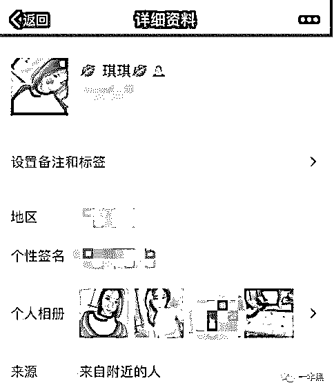
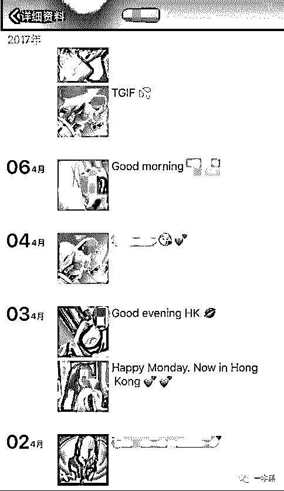
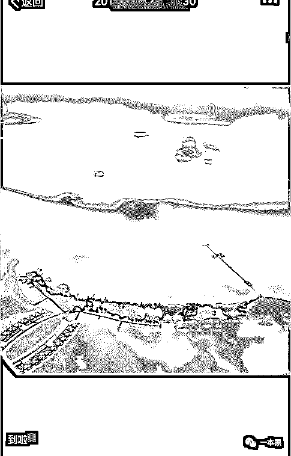
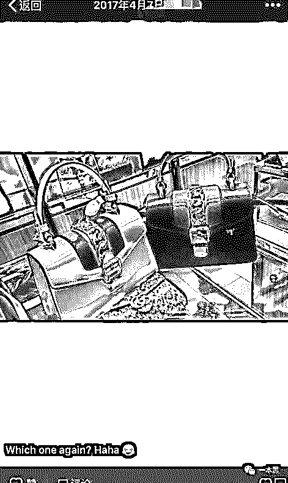
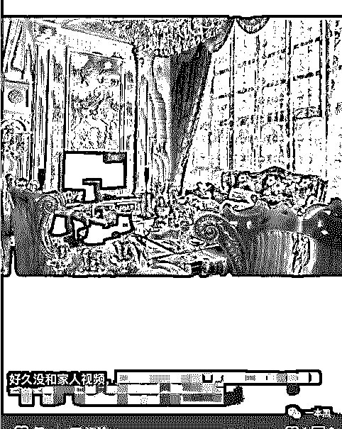
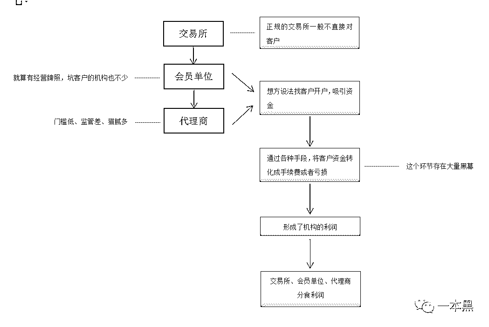
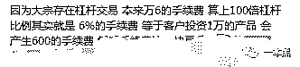

# 金融产品黑幕白皮书——机构如何蚕食鲸吞你的本金

> 原文：[`mp.weixin.qq.com/s?__biz=MzU4ODAwNzUwMQ==&mid=2247483679&idx=1&sn=f66f40c2f4ddb2fe8597adb9c02a56a6&chksm=fde2103dca95992bc11aaf00810b06fcf2934d0d9cc9f8722be247c1dc636e4a203a4452fe9c&scene=27#wechat_redirect`](http://mp.weixin.qq.com/s?__biz=MzU4ODAwNzUwMQ==&mid=2247483679&idx=1&sn=f66f40c2f4ddb2fe8597adb9c02a56a6&chksm=fde2103dca95992bc11aaf00810b06fcf2934d0d9cc9f8722be247c1dc636e4a203a4452fe9c&scene=27#wechat_redirect)

文/振宇（微信公众号：darkinsider）

媒体或商业转载必须获得授权。个人转发朋友圈无须授权。

读完需要

15 分钟

速读仅需 10 分钟

* * *

继“假黄网”后，一本黑再曝一个“闷声发大财”的商业模式。

<inherit>这次我瞄准了金融产品开火，曝出行业黑幕。</inherit>

**关于“高回报”投资的“坑蒙骗”就没有写的好的，所以我来写一篇撕的狠通俗，狠实用的！**

“先知赚后知，后知赚不知”，一群套利狐狸打着这样的口号。他们紧紧盯着我们的存钱罐，无所不用其极的想掏走我们的积蓄，他们暗中窃笑着我们的无知，趁机从居民储蓄中攫取利益，一步步走入富人阶层！

本文最大限度地通俗化，去掉了各种专有名词，力求让大家看得懂，用得上！

**白富美--美女经济的“特种兵”**

这个颜值即是正义的时代里，美女经济已然成为诸多行业攻城拔寨的作战纲领。

来自白富美的主动搭讪就是这次专题的开端。

<inherit></inherit> 

听说，好多男士都收到过这样的好友请求，虽然不认识但是出于礼貌或者可观的颜值，还是加了好友。

再看下朋友圈，就会觉得这朋友值得交！

<inherit></inherit> 

十足的软妹力，为人大方又健谈，好听的声音，越聊越亲切~

生活十分潇洒，住着奢华的大屋、各种买买买、四处旅行，完全是一副白富美的生活。

<inherit></inherit>

<inherit></inherit>

<inherit></inherit> 

同时还会配上一句“最近赚了钱，犒劳下自己”。看了这些你不禁会好奇，姑娘究竟是做什么这么赚钱？遇到这个问题，对方回答的很不情愿，但是看在朋友的份上，愿意给你介绍一个带她赚钱的“老师”。

至此，白富美的使命已经完成大半！你可能万万没想到，这些朋友圈里的图片，大部分是从网红的微博，或者真的白富美那里盗来的。图片里奢华的生活其实都是从别人那搬运来的，一直以来和你在聊天的其实是一个抠脚大汉。

就是这样一群人，每个人分管几十上百个微信，用着成套盗来的图片假扮成白富美，从而获取男人的信任，就连偶尔发来的语音，也都是让女同事提前录好的。

如此大费周章，目的就是先利用美色接近男人，再聊天建立感情博取信任，靠朋友圈发图来勾引对方上钩，还佯装勉为其难的带你入伙，从此掉进他们的炼金炉！

<inherit>为了提高转化率，目标人群往往是过去玩过股票或者做过投资的人，而这些客户的信息都是从外界买来的，市价一块钱一条，购买渠道太多，就不一一列举。</inherit>

<inherit>40 万亿的国民储蓄、中产阶级达 3 亿，各地房屋限购、人民币贬值，这一切因素都直接推动了这两年的“理财热”。负利率时代下，为了资产的保值和增值，人们纷纷拿出手里的积蓄，积极寻找着合适的投资方式。</inherit>

<inherit>正是看到了这样的市场大环境，只要稍加诱惑，大家就按耐不住，所以这种白富美式的诱导投资才会大行其道。</inherit>

**从聊天到入坑**

认识老师的同时，你会被拉入一个群，群里大家都在讨论投资，还发图炫耀自己的战果，个个都是日入几十万，放心吧，这些人都是托。

这里的投资的产品无非是邮币卡、大宗现货（就是俗称的黄金 原油这些），原油现在平台基本都下架了 换了、沥青、天然气等产品。换个名称而已，实际操作起来都是一样的。邮币卡是近几年兴起的一种文化投资金融产品，原理不需要知道，因为结果都是一样的，平民进去基本都是血亏。

一般来说，这些联系你的人都是代理商，他们的主要工作就是四处拉人来做投资、开户。按照大类来看，盈利方式就是两种。

**一、赚取客户的手续费，因为手续费是每次操作都要收取的，每天可以无限次操作。手续费虽然看起来很低，但是实际收取的时候，算法比较复杂（加杠杆什么的..），比如一百万的本金，只要买入再卖出，两次操作，可能要交高达 10 万的手续费！**

**二、代理商还可以做“头寸”，意思就是承包了客户的买卖，也就是你亏了，代理就赚了，可以这么简单的理解。**

现货交易分为三级公司，第一级是交易所或者交易中心，第二级是会员单位，第三级是代理公司。而交易所是不直接受理个人客户的，只针对会员服务，而会员单位既可以受理个人客户，也受理代理公司的代理申请。

所以个人客户接触到的单位最高就是会员单位，其次是代理商。一般交易所对会员单位的审核都有严苛的标准，没有些资源是很难拿到经营牌照的，但是对代理商则没有过多要求，水平参差不齐，监管不到位，所以上面提到的“白富美”隐蔽营销一般都是代理商搞的。

<inherit></inherit>

<inherit>代理商的门槛不算高，面对这么肥沃的市场，大量代理风起云涌般的出现。</inherit>

我身边有个例子，他 16 年来到深圳的一家大宗代理商工作，实际是为了偷师学艺，半

年后就回到了内地，在一个二线城市和几个朋友一起开了一家代理，启动资金才 500 万，就这样一个 5 人的小公司一年盈利了一个多亿。

**不要以为你可以去找正规的机构！靠打擦边球和信息不对等来赚客户的钱，基本是这个行业通行的做法，只是每家机构的尺度不同，就算名字响亮的“XX 市大宗现货交易所”，里面也可能大有猫腻。而这些运作方式，又很难被取证和定罪，所以大众就不有太多幻想。在机构眼里，这种运作手段就是正规，就是游戏规则，只是大众不懂而已！**

**别妄想在窑子里找处女，不现实！**

不论会员单位还是代理商，都不是省油的灯，他们的盈利基本都是依靠客户的亏损，后面我会讲到很多的黑幕。

**金融炼金术的黑幕**

以上两种模式，是代理商和交易所提前就约定好的两种模式。

**如果采用第一种合作模式，手续费是代理和交易所一起分。那么就导致，代理会用各种方式诱导你频繁操作，你是否赚钱无所谓，反正他赚手续费。**

**行内人透露，这行有个不成文的规律，如果你这次交易的盈利还没 10%，还不够你买卖这两下交的手续费！多折腾几次，就算投资没赔钱，手续费也收的你肉疼！**

<inherit></inherit>

**100 倍的杠杆？是的，代理商真有这么玩的，跌 1%你就爆仓，就 gameover，本金就全没了。规范的一般也是 30 到 50 杠杆左右，所有手续费真的不是小钱！大部分产品的手续费是万 8 到万 16。**

**第二种合作模式是代理完全承包，既然是代理商和客户做对赌，他当然是要诱导你反向操作，比如庄家出货让散户高危接盘，或者数据分析是看涨，还让客户买跌做空等等，方法有很多。**

**这种情况下，客户如果亏了 100 万，那代理就赚了一百万。当然，这里面交易所还是要分一部分。**

这两种模式，在市面上基本是五五开。

凭借着这个合法的“赌博牌照”，交易所哪个不是盆满钵满。

这种交易所一般都是有政府和国资背景的，名称一般都是城市名+大宗商品交易所或者石油交易所。

这种交易所有大有小，起码有几百家，大的交易所一年的交易额有几百亿，光纳税都是几亿到十几亿。

客户会被按照资产划分等级。比如开户 500 万的客户，就是 VIP 客户，就可以在 VIP 包房操作，而且有老师专门指导。其实不管是哪个级别的客户，最后结果都是一样，尽可能吸引你的资金进来，然后被机构蚕食鲸吞。

**这些金融产品的投机成分太高，可以加很高的杠杆、可以像赌博买大小一样买涨跌，可以无限次操作，每天开盘 22 个小时。不管是代理还是交易所，最大头的收入还是客户损失的资金，庄家有资金量的优势，有信息的领先优势，加上对冲操作，散户基本没有胜算，只能被庄家拔的一毛不剩！所以在这里大多数人都是亏得干干净净，赚到钱的是凤毛菱角。**

这里甚至有人自己做“黑”交易平台，尽管政府不断打击。无奈查证难度大，监管不到位，加之巨大了利益的诱惑，在市场上还是屡见不鲜。

<inherit></inherit>

这种公司会自己搭建一个受其控制的交易平台。他们会控制什么？

这里的手段已经超过了擦边球的范围，是真正的违规！

通过制造卡单、数据延迟来控制客户的交易，这样就可以在机构出货价格下跌的时候，限制客户资金出逃，让客户无法及时止损。他们可以直接修改客户的资料，制造大量交易记录，赚取更多的手续费。甚至可以操纵客户的账户，强行平仓、改单，让客户只亏不赚。

最过分的是根本不把客户的投资在市场上交易，而放在了自己的钱袋子里，再用后台操控产品价格的方式，盘面上的价格根本不是市场的真实价格，想涨就涨，想跌就跌，把客户玩弄于鼓掌中，随意宰割。

越来越多的人因此血本无归，一周折本八九成的大有人在，给社会造成了很大的不稳定因素。虽然执法部门的打击力度越来越大，但是由于缺乏完善的监管体制，这种违法经营依然靠着打擦边球牟取暴利。

**在金融市场里，要相信自己就是傻 B**

<inherit>这次我是以常见的大宗现货作为例子，因为外汇、文化金融品等等五花八门的投资品数不胜数，而且每年都在推陈出新，经过各种包装再卖给客户。这些产品普遍都是逻辑复杂，外行很难快速摸清。</inherit>

<inherit>再加上巨大的回报，无数人选择铤而走险，却不估算一下背后的风险。就是因为贪心，因为看过几个一夜暴富的例子，所以对自己的投机行为充满幻想，以为自己天赋异禀。</inherit>

就拿股票来说，靠它致富的例子谁都听过几个，但是身边这么多人玩股票，到底有几个赚了？而这些金融产品打着比股票高的多的回报来吸引客户，你知道意味着风险高到了什么地步吗？

**资金量、操作手法、信息传达的巨大壁垒，导致个人投资在金融市场里宛如汪洋中的一只小船。决定自己命运的是大海而不是自己的选择，所以个人投资的天然劣势让大多数人都是铩羽而归。**

**高杠杆的投资已经让不少人亏得倾家荡产上天台，这种新闻大家都没少看，可就是挡不住总有人认为自己可以是那个幸运儿，应了那句“后人哀之而不鉴之,亦使后人而复哀后人也”**

从古至今，利用人的贪欲和侥幸心理牟利的比比皆是，今天说的金融投资产品更是屡试不爽。

* * *

喜欢就关注我吧，期盼着有好奇心的你！

