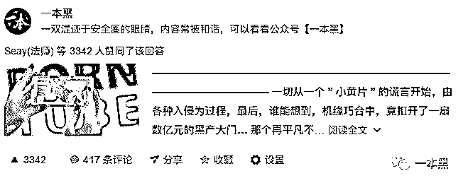
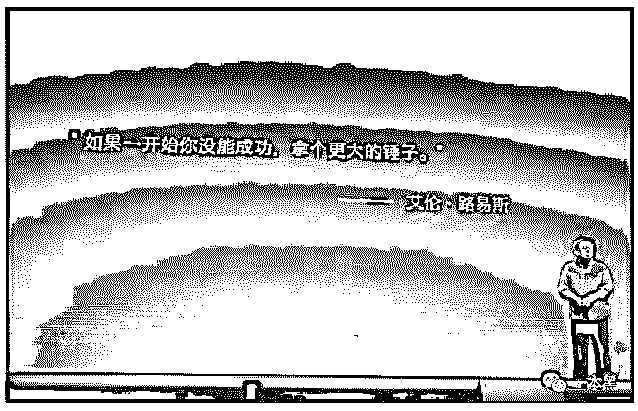

# 我们用“嘴”干死了价值数亿的“色情”黑产——文字的力量

> 原文：[`mp.weixin.qq.com/s?__biz=MzU4ODAwNzUwMQ==&mid=2247483675&idx=1&sn=21d85fadfc5aee54b6037001b8255f0c&chksm=fde21039ca95992fa51c165571ca06309494449d8afee9c053d005ddfc558b2bd2a8f1382daf&scene=27#wechat_redirect`](http://mp.weixin.qq.com/s?__biz=MzU4ODAwNzUwMQ==&mid=2247483675&idx=1&sn=21d85fadfc5aee54b6037001b8255f0c&chksm=fde21039ca95992fa51c165571ca06309494449d8afee9c053d005ddfc558b2bd2a8f1382daf&scene=27#wechat_redirect)

文/振宇（微信公众号：一本黑）
【一本黑】拥有全部内容版权。媒体或商业转载必须获得授权，违者必追究法律责任。

个人转载朋友圈或发给朋友无需征得授权。

* * *

<inherit>机缘巧合之下，我决定要做一件有影响力的事，要做一件能够让读者为之震撼并且警醒其自身的事。</inherit>

我一直坚信文字拥有一种超过语言本身的魅力，只要使用得当，那些有价值的文字可以给人带来那种如梦初醒的领悟。

当这种文字力量足够强大的时候，人们还会纷纷用自己的方式，去扩散它放大它，无意间正悄然地放大这股力量，去影响着客观事物！

可惜文字的力量却常常被低价值的使用，用来操纵大众的舆论，为娱乐消费而服务，变成了印钞的工具。

我希望力量能被用来改善我们的生存环境，消灭那些“不道德”和“不公平”，而创立“一本黑”就是源于这个念想。

复盘此役，证明文字的力量

3 月 29 日我在[一本黑]的知乎专栏率先发布了[上了个“假”黄网，误入了 7 亿黑产的大门]。

<inherit></inherit>

在一片哗然声中，除了几家联系要转载授权的媒体之外，还引来了一位 21 新世纪报的记者。

与此同时，他也在类似的专题报道，希望能援引我挖掘出来的数据。

于是我们决定一起曝光，把这件事的影响力放到最大！

3 月 30 日我在[一本黑]发稿，同时得到了宅客、即刻等 50 余家的媒体的转载，事件不断发酵。

3 月 31 日 21 新世纪报发稿[涉黄 APP 骗局一年收入 7 亿 可支付宝、微信支付]，该文的发布彻底将舆论推至顶峰。

就在昨天下午，各大涉黄的诱导 APP 开始纷纷暂停服务，渠道商接到通知，开始下线所有的广告和安装包。至此这个价值数亿的产业彻底停止了活动。

支付宝和微信开始调查被黑产利用的支付接口，直接终断了黑产的现金来源，此举一出，不只是重创了色情 APP，更是打击了许多需要支付功能来获取现金的黑色产业，致使黑产的现金通道陷入瘫痪。

<inherit></inherit>

<inherit>（一个后台留言）</inherit>

一件有意义的事，吸引到了一群人的注意，就会有一群认同的人加入进来，然后所有微小的努力最终会带来了质的变化。网络放大了个体的声音，从而汇集了人的力量，所以这次我们真的改变了这个世界。

文字的力量总是出人意料，谁能想到十年前南派三叔的一句话，竟引得无数“稻米”在十年后把长白山挤得水泄不通，只为付那“盗墓笔记”的十年之约！

这是场我们一起打赢的战争，意义不只是我个人受到了鼓舞，更是让我们见证了文字的力量，相信有价值的事一定会带来有意义的变化！

我知道，我们不可能每一次都能成功。

这让我想到了老罗在发布会上为锤子人打气的那句话。

**“如果一开始你没能成功，拿个更大的锤子冲上去！”**

  

* * *

