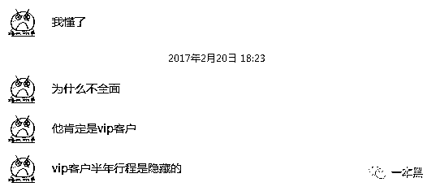

# 信息泄露，那些央视没报的“内鬼"

> 原文：[`mp.weixin.qq.com/s?__biz=MzU4ODAwNzUwMQ==&mid=2247483665&idx=1&sn=dea25da7c925ef5e915e3c721ec34cc1&chksm=fde21033ca959925886a3b7ea282687c847551f5b05a67e837649c873e01e59cdc08342113f1&scene=27#wechat_redirect`](http://mp.weixin.qq.com/s?__biz=MzU4ODAwNzUwMQ==&mid=2247483665&idx=1&sn=dea25da7c925ef5e915e3c721ec34cc1&chksm=fde21033ca959925886a3b7ea282687c847551f5b05a67e837649c873e01e59cdc08342113f1&scene=27#wechat_redirect)

<inherit>文/振宇（微信公众号：一本黑）</inherit>

<inherit>【微信号】darkinsider</inherit>

<inherit>【一本黑】拥有全部内容版权。媒体或商业转载必须获得授权，违者必追究法律责任。</inherit>

读完需要

15 分钟

速读仅需 7 分钟

* * *

<inherit>在过去的日子里</inherit>

<inherit>深夜里，你曾几度和“知己”钻进隐秘的小旅馆？去过哪些地方放飞自我？</inherit>

<inherit>你又和谁曾在电话里窃窃私语？</inherit>

<inherit>辛苦打拼这些年，到底都攒下了多少财产？</inherit>

<inherit>这些或许在你的脑海中逐渐的模糊...知道吗，只要几百元，就能拿到这些信息</inherit>

<inherit>成套的信息兜售，明码标价的查询、所在位置实时定位...</inherit>

<inherit>这一切都随着央视对于信息“黑市”的曝光而浮出水面。</inherit>

<inherit></inherit>

 <inherit></inherit>

<inherit>这中大批量且信息精确度媲美官方数据的信息泄露，以前从未发生过。到底是谁在提供这些信息？又是谁会来购买这些资料呢？买来又是为了做些什么呢？</inherit>

<inherit>**灰色产业的畸形需求**</inherit>

<inherit>信息泄露，我们先从买方说起。首先，灰产就有着十分庞大的需求！</inherit>

<inherit>就拿催收（追债）这个行业来说，“要催收首先要拿到欠款人的信息，确定欠款人的位置。充分了解他，才能制定催收的策略，从而收回款项。”</inherit>

<inherit>由于缺少法律的监管，常年无序发展的催收、私人侦探等灰色产业，一直在给信息贩卖这个黑色产业源源不断的输送养分。凭借着这些灰产对公民信息的高度依赖，信息黑市得以遍布生长在这些 QQ 群当中，这些群随便一搜都是几百个。</inherit>

<inherit></inherit>

<inherit>春节前，根据贴吧或者论坛的蛛丝马迹，我更换了新的微信号、QQ 号，进入各大催收、私人侦探群，暗中观察着他们的一举一动。</inherit>

<inherit></inherit>

<inherit>（这样的广告，每天能收到多达一百五十次）</inherit>

<inherit>能如此大规模的提供公民信息，背后定是有着一个巨大的渠道在源源不断的输送。</inherit>

<inherit>**步入黑色地带，以身作鉴**</inherit>

<inherit>为了找出幕后的罪魁祸首，我选择从一个声称“无所不能查”的信息贩子下手。</inherit>

<inherit></inherit>

<inherit>攀谈两句之后，对方发来了一份报价单...</inherit>

<inherit>映入眼帘的是一个个触目惊心的名字</inherit>

<inherit>户籍、身份证、财产、人的轨迹、定位....</inherit>

 

<inherit></inherit>

<inherit>黑产可以提供的信息之全面，程度简直堪比国安局，并且宣称只要有电话号码，就可以调出一个人的所有信息。</inherit>

<inherit>废话不多讲，为了取得信任从而获取情报，我决定花钱买一个朋友的信息（以下简称 Q 先生）。</inherit>

<inherit>【第一步】先用电话号码，调出身份证信息。</inherit> 

<inherit>获得身份证号和手机号是第一步，从这些就可以查到一个人所有的资料。</inherit>

16 日当晚我就将 Q 的电话号码发了过去，并且按照卖家的指示，通过微信支付了 600 元的查询费。收款后，卖家说“晚安，静候佳音”。

<inherit>第二天早上，卖家就发来一张图片，并且附了一句，“运气不错，号码就是他本人的，一次就查了出来”</inherit>

<inherit></inherit>

<inherit>照片上的信息就是 Q 的户籍信息、户口所在地、住址都是完全正确的，从这个系统的界面来看，与公安的系统十分相似。</inherit>

<inherit>我尝试着探探其来源，问了句“这信息可靠吗？哪来的？”。</inherit>

<inherit></inherit>

<inherit>“公检法出的！包准！这是人家用手机拍的照，因为怕拍到自己的工号，所以没拍全屏，但是光这些信息就够用了。”</inherit>

<inherit>画面中除了身份证号和户口信息之外，还能看到驾驶人信息、机动车信息、违法犯罪人员信息等选项，可以推断出，这些数据的来源极有可能是公安或者交警的警务系统流出的。</inherit>

<inherit>据我所知，机关内人员确实可以查询人口信息，因为系统是用自己的编号登录，所以会在系统中留下自己的查询记录。这个记录也是现在公安内部抓捕信息泄露者的方法之一。</inherit>

<inherit>**央视发威，一道霹雳震颤黑产**</inherit>

<inherit>2 月 16 日这天，央视强力发稿揭露“信息黑产”，当日的新闻联播和焦点访谈也都在不断声讨这种泄露公民信息的行为。</inherit>

<inherit></inherit>

<inherit>一看到央视的稿件，我赶紧尝试联系了几个信息查询商人，试探他们的反应。</inherit>

<inherit>然而，都说在“开会”，或者根本不回复。</inherit>

<inherit></inherit>

<inherit>（“无所不能查”回复开会）</inherit>

<inherit>晚上十一点，卖家发来“久等了，今天央视发文报道，我们开会商量这事呢！”</inherit>

<inherit>从那时开始，群里的广告从每天 150 次骤减到了每天 70 次。黑产的敏锐嗅觉显然已经嗅探到了这次的风声骤变。</inherit>

<inherit></inherit>

<inherit>风浪太大，为了谨慎行事，信息贩子从此只做熟人单，陌生人一概不理。</inherit>

<inherit>即便是被央视曝光，信息查询的活动仍未停止。为了均衡收益和风险，黑产借机大规模提价，价格普遍翻番。</inherit>

<inherit></inherit>

<inherit>一次大规模的曝光，着实可以拨动黑产的那颗敏感神经。但是如果不斩断这个产业的命脉，噩梦就永远不会结束。</inherit>

<inherit>而这条命脉，就是那些信息泄露的源头！</inherit>

<inherit>如今，只有“无所不能查”还愿意做我的生意，趁过去的信任依旧还在，我加紧了刺探情报的步伐。</inherit>

【第二步】用身份证号可以调出身份证的使用轨迹，包含了（火车、飞机、酒店、网吧、银行等）

<inherit>用自己身份证或者家人身份证，办理的任何信息都可以找到，银行账户的余额，名下的房产，公司等，都可以找到。</inherit>

<inherit>有了 Q 先生的身份证号之后，我又付了 1600 元来买 Q 先生的开房和航班记录。</inherit>

<inherit>这次查询用了两天的时间，卖家一直在解释“最近抓的严了，查航班和酒店的下线不太敢冒头，我们也不敢太催他们，毕竟他们踩红线，风险是很大的。”</inherit>

<inherit>这段时期，网上也不断爆出有政府的基层人员被抓，罪名就是涉嫌窃取公民信息。</inherit>

<inherit></inherit>

信息贩子狂妄的宣称可以反侦察，可以不留痕迹。经过多方考证，所谓的反侦察并非是技术手段，其实就是了解警察的行事风格，发现情况稍有不对就不再回话。这种手段缺陷很大，不过是不法分子虚张声势而已。

<inherit>继续说信息查询，这是 Q 先生的开房记录。</inherit>

<inherit></inherit>

<inherit>（详细的开房记录）</inherit>

<inherit>酒店名称、入住时间、房号都十分详细。</inherit>

<inherit></inherit>

<inherit>（航班信息）</inherit>

<inherit>突然发现这里缺少近期航班记录，赶紧接机盘问。卖家连忙解释“航班记录是从民航系统里调的，高级客服已经潜水了，只能找普通客服，因为 Q 先生是 VIP 客户，普通客服查不到最近六个月的记录。”</inherit>

<inherit></inherit>

<inherit>“但是绝对是真实的，因为记录是从中航信的系统里出来的，不信去看看新闻”</inherit>

<inherit></inherit>

果然，中航信的数据泄露已经被确认。

<inherit>既然此法有效，我故技重施，又开始追问开房记录的来源。卖家此刻已经对我完全信任，透露出“酒店的记录出自公安的天网系统和 sis。如果这都不准，警察早下岗了。"</inherit>

<inherit></inherit>

<inherit>**天网是什么？什么叫 SIS？**</inherit>

<inherit>经过多方考证，这是警方近些年一直在建设的系统，目的是为了强化追踪罪犯的能力。简单的说：道路上遍布的摄像头，酒店登记的开房信息、乘坐飞机火车的记录等等，都属于天网系统的一部分。</inherit>

<inherit>系统的风控也做了充分的准备，通过权限来防止信息大规模泄露。比如，最基础的权限（姑且称为三级权限吧，专有名就不透露了），是查身份证号码、姓名、住址，二级权限是多了省内的开房记录、网吧纪录等敏感性稍低的信息，一级权限是多了乘机纪录和火车记录。</inherit>

另外，像镇级派出所这样的地方一般都是三级权限，县级公安局里的刑侦大队这样的核心部门里才会有一级权限的，而且基本都是队长或副队掌握密码账号吧。警察只需要用自己的数字证书（可以理解成账号）在公安的电脑或者警务通上就可以登陆内部的 sis 系统。

<inherit>尽管防范措施做足，但是终究不能避免人性的丑陋，所以才会出现基层公务员利用职权牟利。</inherit>

<inherit></inherit>

<inherit>（警务通）</inherit>

<inherit>【第三步】顺丰、京东、饿了吗三箭齐发，确定 Q 先生的家庭和公司地址。</inherit>

<inherit>买这三家企业用户信息的价格是 1300 元，一般被用来确认某人常用地址。</inherit>

<inherit>一般来说，常用地址一般就是家或者公司。</inherit>

<inherit>风声越来越紧，查信息也越来越困难。</inherit>

<inherit></inherit>

<inherit>期间卖家曾一度与下线失联。由于情况不妙，企业的内线躲躲藏藏，暂时切断了与外界的联系。</inherit>

<inherit>一周后，我才收到货。</inherit>

<inherit>（京东收货信息）</inherit>

<inherit>整个界面都是详细的物流信息，送货时间、包裹的重量等等。从这个照片可以判断出，极有可能是某个仓库或者物流站的内部人员盗摄的。</inherit>

<inherit></inherit>

<inherit>（顺丰某笔订单的收货地址）</inherit>

<inherit></inherit>

<inherit>（饿了吗最近一笔支付记录）</inherit>

<inherit>（饿了么所有用过的地址）</inherit>

根据这些电商、物流和外卖的收货信息，可以推敲出 Q 先生的家庭住址是深圳市南山区 xx 路 xx 公寓 xx 单元、以及公司地址是科技园 xxx。

<inherit>这一次的查询用了一周的时间，卖家一直表示很难联系到查信息的下线。“我们这个城市就已经抓了 50 多个人了，今天还有一个系统在家里被微信定位找到了，警察直接去家里抓的人。”</inherit>

<inherit>“就连滴滴的一手都折进去了，京东、饿了吗的人都不敢露面了。”</inherit>

<inherit>尽管知道信息是正确的，为了能套出更多的内幕。我反复的质疑信息的可靠性和来源，卖家万般无奈下透露出“最近出的信息确实质量不如以前，信息量比较小，不算很全。但是顺丰是物流点出的，京东是仓库出的，饿了吗是公司内部出的全地址，保证真实。”</inherit>

<inherit>由此可见，这三家公司的信息泄露直指内鬼，完全是内部人员利用 ERP 或者 OA 系统查询的。</inherit>

<inherit>事到如此，可以断言，黑客并没有能力进行大规模的信息窃取，即使得到了一部分数据，也很少流入市面。</inherit>

<inherit>这次打击的信息黑市，信息来源主要是依赖企事业单位的内鬼、代理商、产业下游（物流站等），其间并没有黑客直接参与的迹象。</inherit>

<inherit>此次查询的成本费用：身份证查询（600）+飞机、酒店（1400）+饿了么、京东、顺丰（1300）=3300</inherit>

尽管曝光之后价格上涨，但是 3300 元就能买到如此详细的信息，可见信息泄露的严重。银行账户和房产查询需要的时间较长，加上 Q 先生并没有什么财产...所以并没有购买。

<inherit>贩卖信息者，该当何罪？</inherit>

刑法对于盗窃的判罚根据金额计算，大概是三到十年。

而对于“”非法获取公民个人信息罪“”，情节严重的，判处三年以下。

也就是说，情节再严重，三年有期徒刑是到顶了。

<inherit>**这个时代的字典里，没有隐私**</inherit>

泄漏的数据保存在哪里： 

*   名下资产：各大银行

*   手机通话记录、实时定位：网络运营商

*   开房记录：公安系统

*   身份户籍：各类网站

*   打车记录：公交公司、网约车公司

这些组织中，数据库管理员、开发者，那么多人有权读取数据，只要有一个人动动邪念，数据就进入了黑色产业链。所以，隐私信息的泄漏是不足为奇。

在这个信息时代，我们真的没有隐私！

