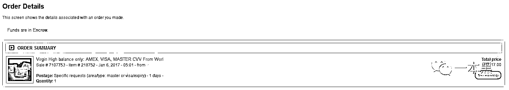
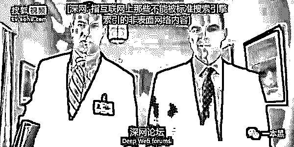

# 暗网买银行卡纪实：盗刷无门槛

> 原文：[`mp.weixin.qq.com/s?__biz=MzU4ODAwNzUwMQ==&mid=2247483654&idx=1&sn=f32981996c83125a4669f4d192c70a2e&chksm=fde21024ca95993211eaad0ec12520ba6686dbef95504cdc561116f1c07153fa65bb03c64ee1&scene=27#wechat_redirect`](http://mp.weixin.qq.com/s?__biz=MzU4ODAwNzUwMQ==&mid=2247483654&idx=1&sn=f32981996c83125a4669f4d192c70a2e&chksm=fde21024ca95993211eaad0ec12520ba6686dbef95504cdc561116f1c07153fa65bb03c64ee1&scene=27#wechat_redirect)

****文/振宇（微信公众号：一本黑）****

****【微信号】darkinsider****

****【一本黑】拥有全部内容版权。媒体或商业转载必须获得授权，违者必追究法律责任。****

读完需要

15 分钟

速读仅需 7 分钟

虽然都快出正月了，但是我还是想跟大家讲个故事，讲讲我春节前夕试图用盗刷银行卡的方式来买票回家。希望让大家能认识到保护好银行卡信息的重要性。

*****起因：被贱人逼上暗网 *****

<inherit>“TMD，两只产品贱人居然在背后议论我没钱回家。</inherit>

呵呵，我就笑了。究竟是谁走漏了风声！”

<inherit>刚毕业的运营宝宝容易吗，还没攒出什么钱，就要过年了。</inherit>

别人过年回家几千几万的花。

我就厉害了，不回家，没钱！

<inherit>本来都打算自己在公司过年了，但是实在咽不下这口恶气。忽然想到，一个黑客哥们跟我说暗网里面什么都有。我觉得或许有能帮上我的。</inherit>

<inherit>切入正题前，先让你们知道什么是暗网</inherit><inherit>*会“隐形”的暗网*</inherit>

举个例子，互联网上的搜索服务就像在地球的海洋表面的拉起一个大网的搜索，大量的表面信息（Surface Web）固然可以通过这种方式被查找得到，可是还有相当大量的信息由于隐藏在深处而被搜索引擎错失掉。传统的搜索引擎“看”不到，也获取不了这些存在于暗网的内容。

简而言之：搜索引擎无法抓取到的部分组成暗网

所以，对于公众来说暗网就是隐形了。

<inherit></inherit>

<inherit>暗网中的内容大概占到了互联网总量的 96%，而我们平时通过搜索得到的内容只有 4%。也就是说，暗网的内容几乎是搜索引擎收录的 4000~5000 倍！</inherit><inherit>***暗网之父可是有“军”字背景的***</inherit>

<inherit>1996 年 5 月，美国海军研究实验所提出打造一个[隐藏路径信息]的系统，使用者在连接因特网时不会向服务器泄露身份。</inherit>

访问暗网必须要使用 TOR（洋葱路由），因为保护数据的口令像洋葱一样层层迭迭。后来源代码被泄露，成为了访问暗网的主要入口，才让我这种纯洁的宝宝也可以去暗网浪一把....

<inherit></inherit>

<inherit>（正在连接中）</inherit>

暗网的设计极致精密，以至于其创建者也无法摧毁它。

不受审查的匿名服务器、中继设备干扰、比特币作为货币，使暗网得以长期存在。

美国政府为何要建造这样一个系统？

具体原因没人知道。但是不难想到，利用它，警方可以调查非法网站而不打草惊蛇；军方和情报机构可以进行秘密联络.... 

<inherit>（洋葱浏览器连接成功）</inherit>

<inherit>进了“暗网”，感觉像是开了挂~</inherit>

光是把浏览器连上是不够的，暗网的域名是加密的,都是类似 http://xxxxx.onion 这样的域名。

先百度了一个暗网 hidden wiki 导航页的域名。有了这个类似于 hao123 的导航站，就免去找域名的麻烦了。

这种 WIKI 都是暗网里的老司机为了方便后人，把找到的网站链接添加到这的，也会不定期清理一些失效的链接。

<inherit></inherit>

<inherit> （好人一生平安）</inherit>

反正也都没上过，就随便打开了一个网站。AlphaBay Market，看名字，貌似是个电商网站。

<inherit></inherit>

妈呀，看了下商品分类，我被惊呆了

完全是个地下黑市，只要是犯法的东西，在这都全了。

<inherit></inherit>

<inherit>（粗略翻译，都是犯罪工具和违禁品）</inherit><inherit>先上图，给你们过过眼瘾</inherit> 

<inherit></inherit>

<inherit> （110 美金=500 毫克的海洛因）</inherit>

<inherit></inherit>

<inherit>（50 欧元假币卖 52 美元）</inherit>

<inherit></inherit>

<inherit>（AK47 步枪买 2599 美元）</inherit>

搜索了一下 china，发现天朝的护照，银行卡，连户口都在标价出售。

<inherit></inherit> 

<inherit></inherit>

<inherit> （户口可以申请护照，身份证。连找工作也没问题，因为他们还会提供“真实”的学历证明。）</inherit>

忍不住好奇问了问买个北京的户口是多少钱，毕竟全宇宙中心的户口一直是我的梦想。结果卖家并没有回复。从图里可以看到，从 15 年 6 月到现在，一次都没卖出去过，生意太差...估计卖家都已经放弃了.....只能说和我一样有梦想的人还是少数~

***好了，各位游客。观光到此为止，该办正事了***

既然是想解决钱的问题，那还是搞张银行卡才是最合适的。

我选择了一个评价比较高的卖家。

对，你没听错，暗网也有评价制度。

<inherit></inherit>

蓝色框里写的是卖家等级三，红色框里写的是信用等级四。小伙伴们，购物还是要找信誉好的卖家哦~

<inherit></inherit>

这里还有卖家的留言，各种赞卖家讲信用，发货快，好评一片...找到了在逛淘宝的感觉....

看来“互联网+黑市”，也是有一套规范的体制。

<inherit></inherit> 

 <inherit></inherit>

商品说明是这样写的：“账户都是两天内新注册的，而且都是实名注册。不同的卡有不同的余额，可以随意的消费或者取现。” 

<inherit></inherit>

粗略的算了一下，卡片的售价大概只是余额的五分之一

售价比余额低这么多，那卖家岂不是在做“亏本生意”？这些银行卡又是从哪里来的，安不安全？

我给卖家发私信，先弄清这些问题。

卖家的私信很快就来了

***为了获取我的信任，卖家透露了卡的来源***

<inherit>很多”倒霉蛋“在消费的时候没注意，被收银员偷偷在复制机上刷了一下，卡里面所有的数据，包含密码，卡主信息，都被复制了。然后再被制作成了复制卡，与原卡的功能是完全一样的。</inherit>

而且复制卡都是磁条卡，因为芯片卡不能被复制...

<inherit>假身份开户是指先盗取他人的身份信息，然后在银行开户。卡主自始至终都不知道这张银行卡的存在，也更不知道有人在使用。</inherit><inherit>贴心的卖家还给了我安全使用 TIPS...好感动~</inherit>

热情的卖家告诉我最安全的用法是网购，不用本人出面，收货地址填一个中转站，然后自取就是了，没人会去追查。

取现或者线下消费的话，尽量别露脸，毕竟 ATM 上都是摄像头。

而且演技要好，就像电视剧的情节一样，一定要自然，就像是用自己的卡。人生如戏，何时领便当全靠演技。

<inherit></inherit>

内心 OS：买卡如果赠送头套什么的就好了~

因为这些卡都是别人的身份信息，所以也可以洗钱和受贿。即便被发现，也不容易追查到自己。

***卖家为啥不自己留着用呢***

之所以卖家低价出售银行卡却不自己使用，是因为在暗网出售复制卡的风险很低，几乎不会被抓到。

但是使用这些银行卡消费、洗钱要承担更大的风险，因为银行的资金去向、消费记录，更容易被追查。所以机智的卖家为了驶得万年船，甚是小心，宁可自己少赚点。

交易方式堪比电影桥段

<inherit></inherit>

卖家告诉我，如果不要卡片只要卡上的信息（CVV，名字，地址等），那么在网络上就可以完成交易。（因为网购只需要卡上的信息）

如果想要卡片可以用 DHL 快递，或者在线下交易。线下交易卖家会把卡放到某个特定地点，可能是某个小巷的角落，也可能是某个废弃的信箱，再告诉你地点。这种方式无疑是最刺激的，如果不是远隔大洋，真想亲身体验一次。

***卡的主人不会发现吗？***

为了打消我的顾虑，卖家也答复了我这个问题

这些银行卡大多数是长期闲置的银行卡，或者是没有开通短信提醒的账户。所以等卡主发现的时候，卡上的钱早被花光了。

要是被发现，卡主也是去找银行撕比，这些卡基本都是境外的，为了这点钱还不至于跨国来抓人。

我还特意问了一个被盗刷过的朋友，据说信用卡如果不设密码，而被盗刷后赶紧去 ATM 进行操作，证明卡就在自己身边，那么银行就只能自己填这个坑。

***放心了，这张卡值得拥有***

兴致勃勃的点击了“购买”，然后出现了一个我得借助谷歌翻译才能看懂的页面。

<inherit></inherit>

大概的意思是暗网用比特币交易，要我充值比特币，而充值账户就是这个神秘的代码...更刺激的是，这个地址几个小时后就会失效。

<inherit></inherit>

赶紧去恶补了一下比特币的用法。

简单地说就是一种全球通用的加密电子货币，账户地址都是匿名的，而且存储比特币的地址会不断的变化，一个地址几个小时后就消失了，很难被追查，所以黑市交易、洗钱都是用比特币进行。

买了一点比特币充值到这个账户中。之所以叫“一点”，因为现在 1 比特币要 8000 元人民币，我只买了 0.02 来完成这次交易。

<inherit></inherit>

<inherit>                （等待卖家发货中）</inherit>

果不其然，几个小时后，货到了

<inherit></inherit>

<inherit>（信用卡所有信息）</inherit>

这是一张中国的 MasterCard，卡号、CVC 码、到期时间、卡主姓名、地址、电话一应俱全。

从信息来看，卡主是个杭州人，住在湖州街 XX 号，电话是 1861283XXX，卡号是 52010xxxx3373279

卖家说这些卡可以在网上消费。应该指的是国外的电商平台。

因为据我所知，绑定银行卡的时候，中国的电商平台需要和银行确认，需要确认发送给绑定手机的验证码。

所以我选择了美国的亚马逊。

信息正确，成功添加信用卡！

<inherit></inherit> 

现在这张卡已经可以随意使用了。

试试是不是真的可以购买。

<inherit></inherit> 

<inherit></inherit>

购买成功。国外电商平台对于信用卡支付的管制很松，难怪听说跨境电商经常发生盗刷。

试验完成，马上取消订单。

<inherit></inherit>

勿忘初心.....赶紧订张票。

 <inherit></inherit>

截图发票圈，让他们看看，春节一个飞机直接到家。

不过在出票前我就取消了，无奈本宝太善良，不想偷别人的钱回家。

春节还是在公司过吧，呜呜呜~

***卡主安全意识的匮乏令人汗颜***

既然知道卡主的信息和电话，还是觉得应该通知下卡主。

卡主知道信息泄露以后，全然一副无所谓的反应。认为只要密码没泄露就不会有风

险，卡面上的卡号、有效期、CVC 码都不重要。

<inherit></inherit>

光凭短信就能感受到满满的敌意。连卡上信息的作用都不清楚，也难怪盗刷如此猖獗。

***国内对盗刷银行卡如何处理***

简单的说，复制他人的银行卡信息，冒用他人信用卡等行为，都可能构成信用卡诈骗罪，对于不同的数额和作案情节，会处以不同的量刑，下到两年，上到十年以上，以及不同金额的罚款。

从过往的案例来看，归根结底，银行由于技术漏洞而未能保证银行卡的唯一性和不可复制性，才会导致盗刷的现象存在，银行有义务对卡主受到的损失负全责，所以目前“银行全赔”是普遍规则。

<inherit>暗网让你知道，美剧并没有什么想象力</inherit>

从毒品枪支到被标价十万美元的中国户口，想到以前看美剧的时候，犯罪分子总是可以轻而易举的偷换身份，从而隐藏在人海中与警方周旋。各种精巧的细节，手到擒来的伪造证件，让人大呼过瘾。不觉会赞叹美剧中对各种网络犯罪的精彩描写，总是佩服导演和编剧的想象力，竟然能设计出如此新奇刺激的情节。

<inherit></inherit>

<inherit>（纸牌屋情节）</inherit>

面对着真正的暗网，身处与网络黑市当中，看着被标价出售的“罪恶”，才醒悟到其实他们没有想象什么，甚至连写实都不算到位。

***残暴的欢愉，必然带来残暴的结局***

暗网确实无奇不有，让我大开眼界，但是太多的丑恶与污秽已经超过了猎奇的范畴。如果就是想尝尝鲜，找点刺激，大可不必颇费周章的寻找暗网的入口。据说有人因为长期沉迷暗网而精神崩溃...

暗网虽然已经享有极高的隐蔽性，但是在技术日新月异的今天，这些潜伏在网络深层的黑色产业也不再安全，号称"毒品 ebay"的"丝绸之路"轰然倒下已经是很好的例子。

引用莎翁的那句名言：“残暴的欢愉，必然带来残暴的结局”。

****