# 一桩性丑闻揭开艺考培训乱象

> 原文：[`mp.weixin.qq.com/s?__biz=MzU4ODAwNzUwMQ==&mid=2247484912&idx=1&sn=f76cfcd2c2a000b523acd30a289ba75d&chksm=fde214d2ca959dc4baa366f037b0c7123b031d348a21865014cfc9e8151c3fae02eb9a66afce&scene=27#wechat_redirect`](http://mp.weixin.qq.com/s?__biz=MzU4ODAwNzUwMQ==&mid=2247484912&idx=1&sn=f76cfcd2c2a000b523acd30a289ba75d&chksm=fde214d2ca959dc4baa366f037b0c7123b031d348a21865014cfc9e8151c3fae02eb9a66afce&scene=27#wechat_redirect)

十三行的事一夜之间发酵爆发却又在短短几天之内悄无声息；取而代之的是杨幂离婚、王祖贤减肥以及景甜擤鼻涕这样的花边新闻。

我们不喜欢深刻和苦难，就像我们不关心教育的真相。天价培训费、考试泄题、走后门拉关系，诸多乱象由来已久，但是见的多了，我们竟都习以为常。

社交媒体用满屏的娱乐新闻抢占我们的注意力，轻而易举就瓦解掉我们全部的愤怒与不甘。

文 | 喵叔

教育本是社会的根基，在充满谎言的社会里，人的基本道德，诸如诚实守信，竟成为了人性的最高追求；而懒惰与贪婪便成为人性的常态。

电影天才枪手里，小琳和班克帮助同学作弊的场所是一家名叫“诚信”的铅笔厂。尚未成年的孩子一边唾弃成人世界里的潜规则；一边拙劣而又卖力地模仿大人的行为。

小善不积大德不成,小恶不止终成大罪。教育的恶若是不止，贻害的或将是千万人。

第一次见到老俞是在一个阴雨天。和所有搞艺术的一样，老俞一头飘逸的长发，浑身散发着浓郁的艺术气息。

*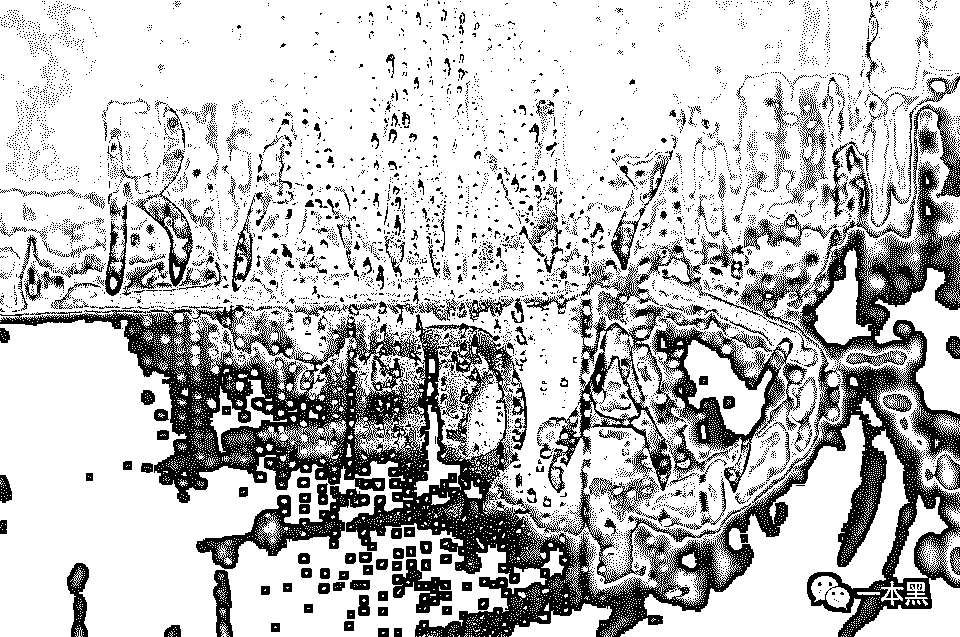*

*（图文无关）*

“这天真冷，流浪猫怕是过不了冬了”，老俞盯着窗外的猫悠悠地说到。

随后老俞和我讲述了他在艺考培训八年来的见闻，零零总总。等到全部讲完，窗外的猫早已不见了踪影，路灯在夜雨里闪闪烁烁。

*（以下内容为老俞口述，老黑整理而成）*

2010 年的 3 月，我即将大学毕业，不想考研也不想挤进浩然的求职大军。我决定先找一份兼职美术老师的活，一边工作一边思考未来。凭借央美的名气，毫无工作经验的我很快就找好了工作。

MF 画室，在当地也算小有名气，投简历的时候我有些忐忑，因为我没有任何的教学经验，也没有教师资格证，但还是被录取了。

**“或许他们是看重学院的实力吧”！**我想。

这是我跨进艺考培训的开端。往后的八年时间里，我陆续辗转于各大画室，见到了这个行业最美好也最丑陋的一面。

**01** **从一桩性丑闻说起**

“孩子们都叫我老俞。虽然我也才三十出头，但是和他们比起来，我的确是老了。”老俞笑笑点了根烟。

有时候看着他们的天真恣意，再看看这个行业荒诞的现实，心里真是说不出的味。

沉思了一会，老俞娓娓说来......

我现在待的画室是当地最好的一间，在全国也排得上名号。很多家长挤破头都想把孩子送进来。塞红包的、托关系的，想尽各种法子。他们以为进了好的画室，孩子就能上的好的学校。

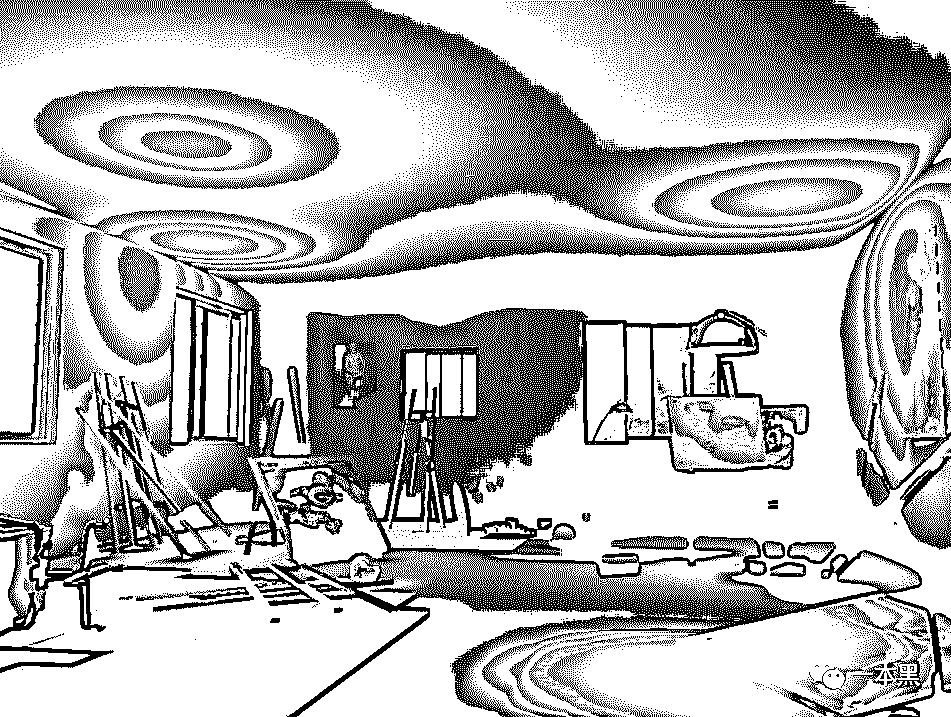

其实未必，每个画室的水平都半斤八两。要是遇上好的老师还好，万一碰上像 Z 那样的老师，别说上大学了，孩子都要毁他手上。

Z，今年四十岁，是行业里大部分人不耻的对象。别看他人看起来老实巴交，其实蔫坏蔫坏。丫的成天介打骂学生，一会叫买烟，一会叫买饮料。

这还不够，要是学生表现不让他满意，就找借口让家长进贡红包。收了红包又如何，还不是该怎样还是怎样。

“就没有家长去举报他吗？”我问老俞。

老俞摇摇头说，其实家长们也都知道这个行业是什么德行，换了这家画室，其它画室也有这样的老师。起码 Z 的专业水平还过得去。所以这么多年了，他还能在这行混。虽然名声差，但也不愁饭碗。

不过要只是收收红包，骂骂学生也就算了。TM 的，简直不是人，叫人渣都算便宜他了。

老俞突然拔高声音，激动地说到。烟灰也窸窸窣窣地落了满桌。

原来 Z 那个人渣背地里**借着给学生辅导课业的名头，勾引女孩子上床**，还不止一个。好些个学生为此耽误了学业。

直到去年冬天，这事才被揭发。一女孩在和 Z 发生关系后，害怕出事便和家长坦白，之后这事闹到学校，我们才知道。

难怪那丫整个人干瘪得和被吸干了精气一样。老俞气狠狠地骂道。

这 TMD 干的还是人事吗？好些个孩子还没成年呢，他也下得去手。

说到这，老俞用力地把烟头怼进了烟灰缸。

“那后来呢？这事怎么解决的？”我问。

后来啊，他肯定在画室待不下去了嘛。

不过这事也算是一个愿打一个愿挨，要是事闹得太大以后孩子也没法做人。所以家长也没告他，听说最后是拿钱私了，孩子好像也退学了。

名声臭了，Z 呆不下去就走了。听说是去了沿海一个城市，继续当培训老师。

后来的事，我也没有继续打听。山高路远的，只要培训机构不声张，也不会有人知道。

只要能赚钱，谁在乎你的品性呢？现在专科生、大学生冒充专业老师的大把，毕竟学生水平都不高，只要唬得住人就行，管你有没有真材实料。

说完，老俞又点了根烟。

**02 ****不报班就开除学籍**

“哎！你知道为什么画室水平再差，也不差钱吗？”老俞叼着烟问我。

没等我开口，他又自顾自说起来了。

干我们这行的，只要有考试，就不愁没生意。好多画室都和学校有合作的，推荐一个学生返 20%-50%的学费。有些画室为了抢人，那叫一个狠，直接返 60%。

个别老师为了赚钱还会威胁学生，说不去指定画室报班就开除学籍处理，学生和家长都不敢惹学校，只能忍气吞声。

这部分生源，用我们行话来说叫渠道生。赔钱赚吆喝，想也不用想这些学生的待遇了。

可即便这样，画室还是有的赚。

学生随便报个班都上万，再细分一下强化班、精英班，价格直接翻倍。还可以按学校分，什么央美班、清华班，价格还能翻上一番。

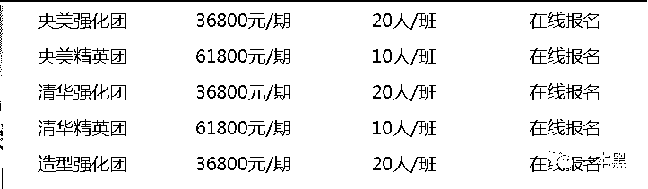

此外还有散招生、复读生。

散招生是画室来钱的大头，他们大多是朋友介绍来的或者看街边广告自个报名的。看着画室那一堆吹得天花乱坠的资料，家长们都会动心的。**什么师资力量、历年成绩、证书通通可以作假。**

这里面猫腻大着呢，不过家长们也不会较真到要一个个核实。横竖都靠一张嘴，画室爱怎么吹怎么吹。

要真遇上了，就说画室有入学考试，不是交钱就能进。得先过了考试这关再说其他的。

如果孩子能力真的很差，家长也不会好意思再追根究底，而是想着法子塞钱打点关系把孩子弄进来。临了还觉得画室实力强。

复读生最招画室喜欢，他们的实力是一个画室的底气。这部分学生的底子都不错，稍加培养有机会进美院或是其他重点学院。画室会把最好的师资和辅导都用在他们身上，毕竟来年招生，这就是最好的招牌。

同一家画室，同样的课程，交同样的钱，到头来也不是每个学生都能得到尽心的辅导学。

有的画室收了钱，连课都不上，直接把学生转手卖给其它的小画室。

这就是空手套白狼，啥也没干，还赚了个差价。

*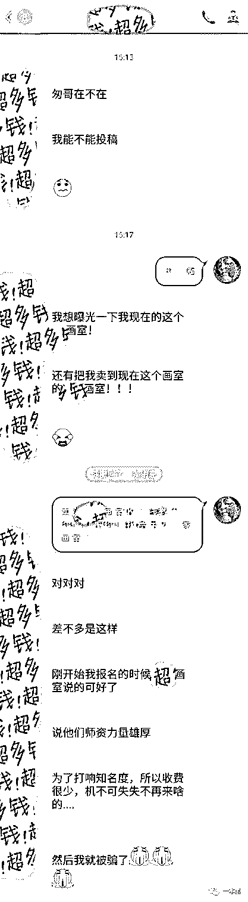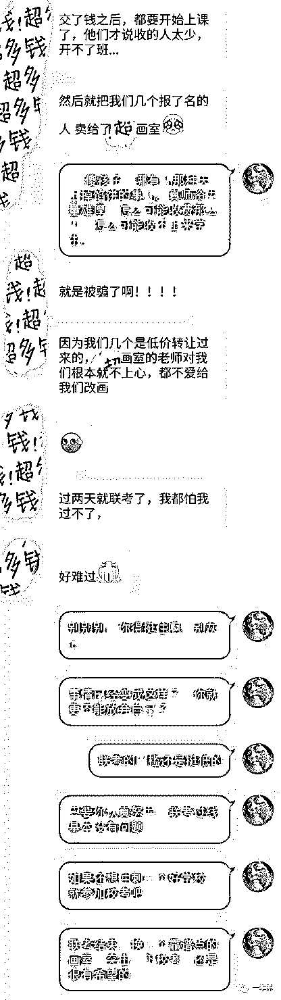*

*（图片来自微博：艺考王撕匆）*

只是那些孩子，原本是冲着画室名头去的，结果什么都没学着，还白浪费了时间。

**说到底这只是一门生意，和教育没有半点瓜葛**。学艺术的或多或少会有点自己的追求，但在名利场里久了，那点追求也就被磨平了。比较谁会和钱过不去呢。

**03** **无所谓的提线木偶**

不管学校和画室怎么折腾，吃亏的还是学生。好些个底子不错的也被耽误了。

做咱们这行的能够担得起“老师”这两个字的不是没有，但不多。**每行每业应该都这样吧，好坏掺杂。**老俞侧过身对我说。半是疑问，半是肯定。

我好歹也是央美毕业，真有想学的孩子，还能指点一二。但是很多来学画的孩子都是半路出家，快高考了，文化成绩不行，家里又不愿意这么小的孩子出去闯，就给报个速成班。

你知道的，这世界根本没有捷径。短短两年就想和打小学画的孩子一样，除非是天才，否则压根不可能。

这些孩子又吃不了苦，一样东西画个十来遍就撂挑子，怎么能成器。就算勉强过了分数线，到了大学还是要回归本性。

*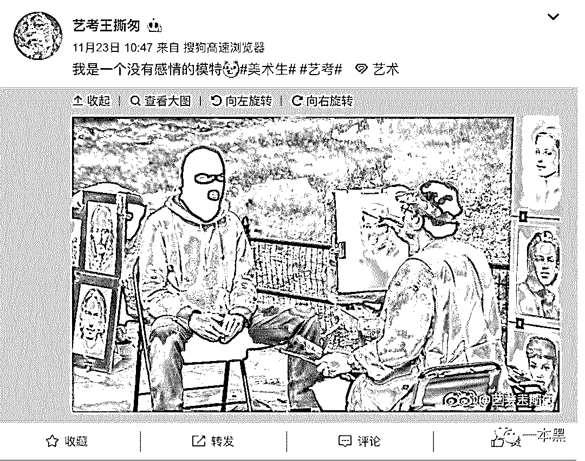*

*（图片来自微博：艺考王撕匆）*

我以前带过一个孩子，在画画这方面有些天赋，人也机灵。但人心思根本不在这上面，他直接和我挑明说，自己只要过线就行了，要考个好学校太累，自己干不了。让我也别对他太严格。

老俞无奈地扯了扯嘴角。

这样的孩子未必真心喜欢美术吧。他们自己的人生根本没有规划，活的像个提线木偶似的。父母指哪，他们动哪。玩游戏、谈恋爱对他们来说才是正事。上大学也只为了那一纸文凭。

*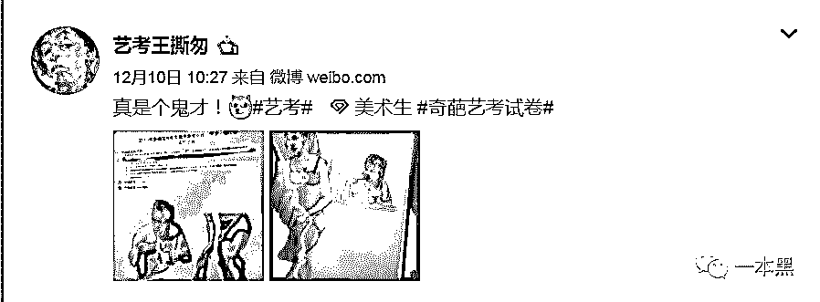*

*（图片来自微博：艺考王撕匆）*

这些还算好的，有些学生平时不上课，到关键时刻就想走捷径，买考题、贿赂考官是他们入学的底牌。

每年艺考总会爆出泄题作弊的事件，今年也不例外。

12 月 15 日，山东 2019 年高考美术类、文学编导类统考开考当天，微博上就有人爆出菏泽地区疑似泄题。编导艺考开考仅四分钟网上就曝光了试题，随后济宁、泰安等地均爆出试题泄露。甚至有学生反应，一些考场没有屏蔽信号，手机可带入考场。

据了解，当天考试时间为上午 8 点 30 至 11 点，但从网上曝光的时间来看，最早在 8 点 42 分，考题就已泄露。

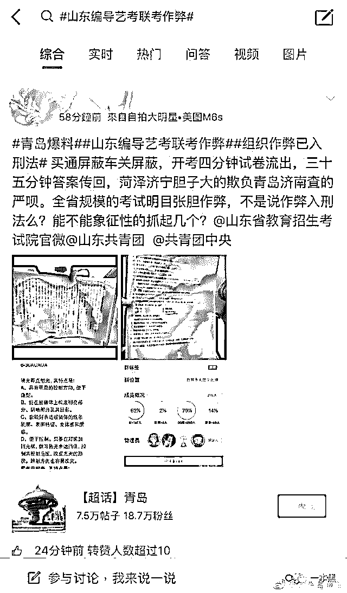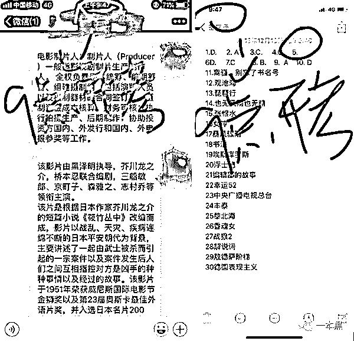

两天后，江西也爆出编导类考题泄露，开考四十分钟后，网上就有考卷和答案出现。

有部分考生发圈称他们所在的培训机构押题命中率接近 80%，甚至连影评原题都中。**这世上真有这么凑巧的事吗？**

培训机构与泄题者沆瀣一气，各取所需。机构打出“神押题”、“包过”的名号来吸引学生，甚至有机构自称出 29 万包上北影中戏。靠的就是这一手买题的好本事。

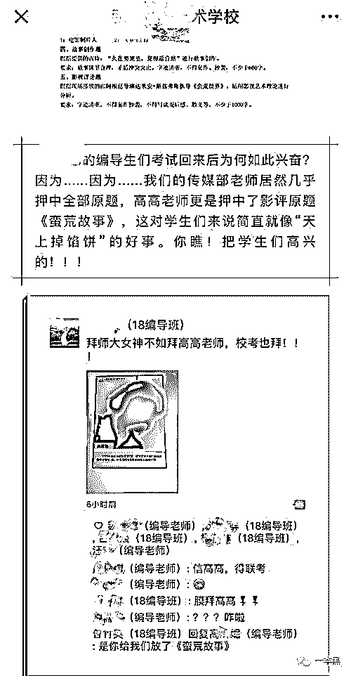

艺考泄题一事还未查清楚，网上又爆出研究生考试发答案的事情。

12 月 23 日，有网友爆料称，在参加山东师范大学 2019 年的研究生入学考试时，主考官竟直接将试题答案发给众考生。事后，校方表示该考官将会接受严肃处理，相应考生也会重新补考该门考试。

【天才枪手】里，小琳和班克靠帮富家子弟考试牟取暴利。现实里有人靠帮学生替考来营生。

2018 年研究生考试前夕，郭某因荒于学业考研无望，便买通枪手参加考试，却在考试录指纹环节被监考官识破。

泄题、作弊事件频发，除了监管不严外，还有另一个更重要的原因。

艺术不像其他科目考试，主观题占了考题的分值很大，而判题大多是靠阅卷者的个人经验和偏好，并没有统一的鉴定标准。但是只要提前知道考题，再和主考官达成一致，想通过就是易如反掌的事了。

百度上搜索考试作弊，显示有 754 万条信息。最早的一篇来源于中国青年报 2001 年发表的**【我看考试作弊：作弊与羞耻心】。**

*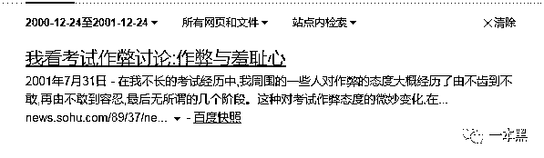*

*2001 年的新闻*

*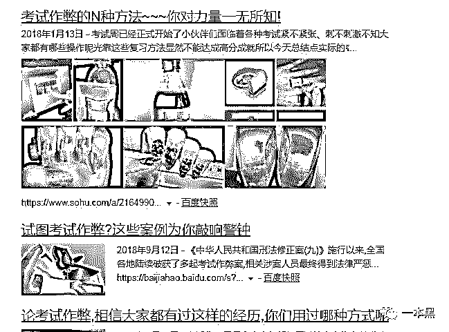*

*2018 年的新闻*

这些见不得光的事，不是这两天才有的，往后也将继续存在。

** 尾   声 **

后来我还见过老俞两三次，不过都是聊些家常，老俞再没和我说起过关于艺考的任何事情。

**老俞曾经说过，隐藏在艺术这个光鲜的表皮之下，有着无尽的肮脏与龃龉，自己无能也无力去改变这个现状。**

尽管他手里握有很多确凿的证据，但出于种种原因，自己不会曝光也不会将这些证据公开。

人人心中都有一个英雄梦，哪怕这英雄不是自己，也想极力去促成。我也同样如此。

起初我并不赞同老俞的做法，觉得他是个懦夫，但后来也慢慢理解老俞的处境。这世上没有那么多所谓的英雄，对于你我这样的凡人，承担不起太多的冒险与变故，平淡一生就是最大的追求。

*（部分资料由微博“艺考王撕匆”提供）*

**THE END**

历史的车轮滚滚向前，一切阴暗也终将随着潮水退去......

另：一本黑微博 **@一本黑 007** 现已开通，欢迎来杠。

还原事实｜专扒黑产

微信 ID：darkinsider

知乎 一本黑

微博 一本黑 007

投稿、爆料、招聘、转载

请联系微信：chenchen_19940612

**圣诞快乐****，****请点好看**