# 色情网站的“小姐上门服务”是真的吗？

> 原文：[`mp.weixin.qq.com/s?__biz=MzU4ODAwNzUwMQ==&mid=2247484907&idx=1&sn=f98577e2a12153e77bcc664af2af5610&chksm=fde214c9ca959ddf8258a7a8f07bd18f4f4da0a8f20a105410e99a057405c0a021ff35b886de&scene=27#wechat_redirect`](http://mp.weixin.qq.com/s?__biz=MzU4ODAwNzUwMQ==&mid=2247484907&idx=1&sn=f98577e2a12153e77bcc664af2af5610&chksm=fde214c9ca959ddf8258a7a8f07bd18f4f4da0a8f20a105410e99a057405c0a021ff35b886de&scene=27#wechat_redirect)

本文由【浅黑科技】授权转载（ID:qianheikeji)

为庆祝【一本黑 007】微博正式开张，浅黑幺哥耗时 5 分钟纯手工制作了一份大礼送给我们。

受宠若惊的黑哥不敢藏私，想和大家一起分享这份喜

礼物如下：

**特此感谢！**

好了，下面进入正文

在年少懵懂的年纪，我和大多数男生一样，会定期来到一些带颜色的网站，补习自己缺失的性教育知识。

学习之余，小小的眼睛里藏着大大的疑惑。比如：

美国联邦调查局为何总在片头发出警告？

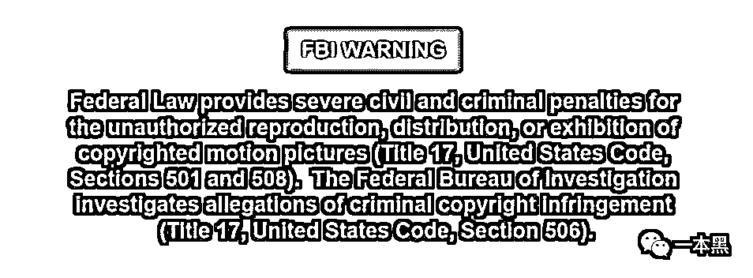

澳门首家线上赌场为何频频传来上线喜讯？

以及……电影里的修水管的工人为什么上门如此迅速、日本小姐姐通勤电车为什么总要坐一两个小时等等……

随着我年龄的增长，以上问题都得以解答。但出于阅历限制，有个疑惑始终未解：那些“站长推荐”的“美女小姐上门服务”究竟是真是假？提供的又是什么服务？

就在上周，一位浅友帮我们找到了答案！不过，这个答案伴随着一个略显悲催的故事……

**Let's Rock !**

01

那天，一个叫林书镜（化名）的人加了我们微信，自称“某大学的大四狗一枚”，浅黑科技的忠实读者，有一事相求。

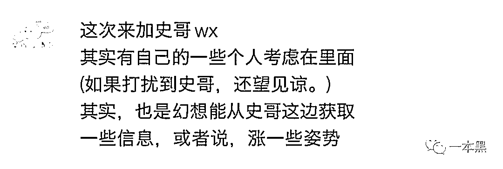

本来不想理他，因为最近总有人找我们帮忙黑进赌博网站找回赌资，或者入侵学校教务系统改成绩之类的，烦球得很。

可我见他言辞恳切，颇有礼貌，便决定先听听来龙去脉。

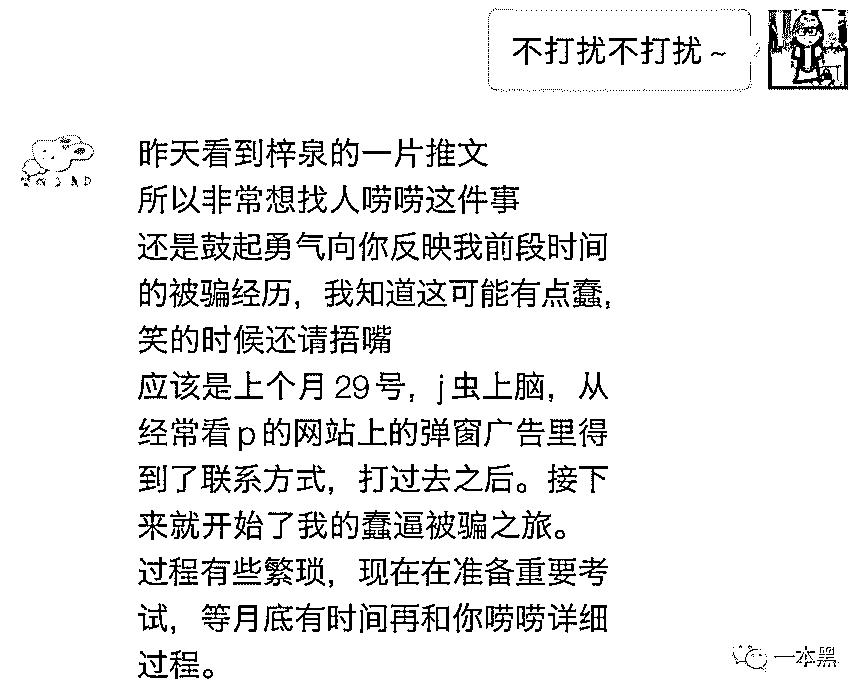

他说，自己上个月精虫上脑，点进了黄色网站里的“美女小姐上门服务”，结果被对方一顿套路，骗走整整一年多的生活费，一万五千多！现在已经啃了半个多月的馒头……

他试过去警察局报案，可警察说“这种情况 80%破不了”。无奈之下，他想起浅黑科技揭露过不少黑灰产，他便找到我们，不求把钱找回来，**但求把真相告诉更多人，防止大家也被骗**……（不得不说这位同学还挺善良）

下面，我将以他的口吻复述这段奇幻经历，整个事情有点长，可能需要个几分钟看完。

02

口述：林书镜

整理：谢幺

临近考试，我从图书馆忙了一天回来，已是傍晚。头脑昏昏沉沉，遂打开常用的那个网站看看视频，舒缓一下头脑。

看完几段，全身被荷尔蒙和多巴胺占据，网站上方的广告一闪一闪，令人浮想连篇。

没控制住寄几，我点了进去。

网址经过一次跳转后，来到了一个名叫“**朝阳天尊国际娱乐会所**”的网站，里面看着很“专业”，不仅有详细的会所简介、服务流程，还有一些“温馨提示”引导第一次进来的人。

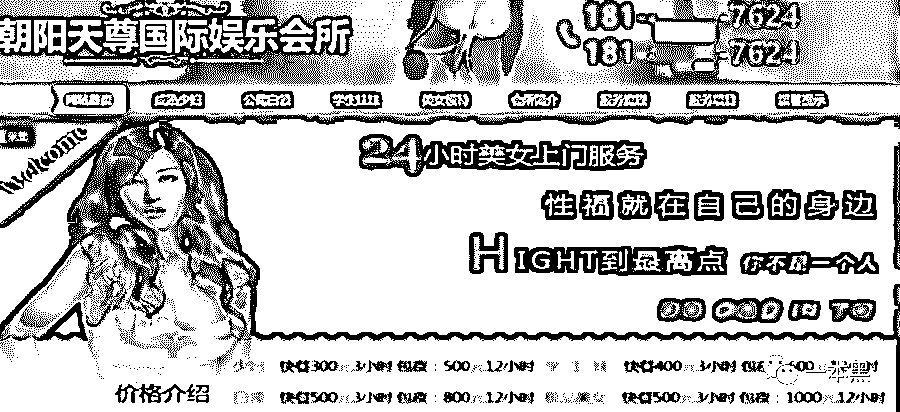

我在里面瞎点了几下，网页跳转到一个自动拨号界面，上面显示着一串手机号。此时只要我点下绿色的拨号图标，号码就能打出去。

我的心怦怦直跳。

……

……

……

号码拨出，显示为“成都移动”，通了。电话那头的人简单介绍完业务后说让我加客服的 QQ 号。

加上 QQ 客服，对方介绍了大致业务和价目表，发来一个一个微信收款码：

1）600—3600

按照标价，我选的“学生妹包夜”是 600 元。

QQ 客服说，转账并截图发给她确认，之后会有专门的大堂经理跟我联系。我把钱转了过去。

两分钟后，果然有另一个电话打进来，是一个安徽芜湖的号码。

对方又跟我沟通了一些具体的服务项目和细节，要了我的具体地址，仔细问了问我有没有什么特殊的爱好，到最后关头，她说：“之前有客人留我们的妹妹在那边过夜，整个过程拍了裸照和视频，还提出很多不合理的要求。为了确保妹妹的安全，需要交 3000 元的安全保证金。”

意思很明确：如果“服务过程”中客人“玩嗨了”提出新的需求，可以直接从 3000 元里扣，服务完成后会退还剩余款项。

我稍稍有些犹豫，但对方沟通服务项目时非常“专业”，细节也很真实。所以我没有过多怀疑就打过去 3000 元。

**此时我并不知道，自己正踏进一个连环陷阱。 **

对方问：“需要叫两个妹妹还是三个过来？可以自己挑喜欢的。”

我在这方面没什么经验，就随口说“三……三个吧？”

“好的先生，您这边付完款我就马上给您安排，单据正在打印，到时候会由上门的妹妹交给您……”

此时对方刻意避开了一个问题：一个人三千押金，还是总共三千押金。

2）3600—9600

过了几分钟，我问 QQ 客服：“保证金我已经转过去了，怎么还没人联系我？”

客服说：“稍等先生，为您查一下订单…………查到了，您刚才下单叫了三个小妹，对吧？您目前只交了三千元，一个人的押金，需要缴清剩余两位妹妹的安全保证金才可以派哦，请您在订单失效之前尽快缴清，否则那边订单就没办法了。”

听完这个说法我就感觉有点坑了，就问：“那……能只派一个吗？”对方说不行，因为订单已经生成。

我打过去电话，对方理直气壮地说：“先生，刚才跟您沟通的时候有明确说是‘每一个小妹三千’，您是以前从没叫过吗？还是刚才没有听清楚？我们肯定要确保每一位妹妹的安全啊。”

当时我的脑子有点懵，加上她的语气非常肯定，争辩了几分钟，我反倒有些心虚了，心想“难道真是自己听错了？”

没办法，我找到平时关系不错的几个同学和朋友，花了半个多小时软磨硬磨东拼西凑借到 6000 元，给对方转了过去。

**原以为事情到这就该结束了，没想到另一个坑又来了。**

3）9600—12600

当我把六千元的转账截图发过去，QQ 客服很快回复：“先生，刚才不是提醒您要尽快转账吗？您看一下时间，这笔支付订单距离上一笔订单已经超过 45 分钟，之前的订单已经失效了，您这样转账是不行的！”

OMG……什么鬼？！你一开始好像也没说 45 分钟内必须转账完啊！？？？我翻看聊天记录，对方好像确实提醒过我要尽快支付，否则订单会失效……

九千多就这么过去了，此时我已经慌得手都开始颤抖。打电话过去又跟那人吵了半天，可对方依然坚称“必须再打 3000 元和刚才的 6000 元连成一笔订单，完成 9000 元的保证金支付才能让订单生效。”

（一个简单示意图）

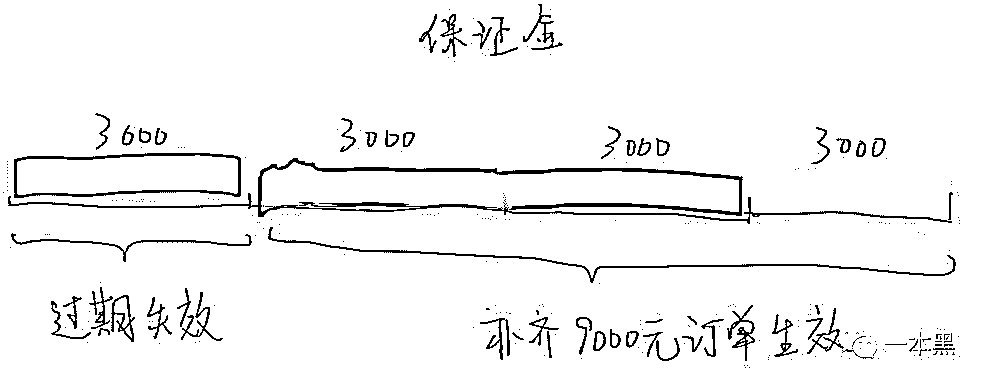

对方说，“完成这笔订单之后，之前滞留的 3000 元可以退款，不用担心。”

此时我的心情已经糟透，恨自己“这方面经验不足”，弄得九千多就这么搭进去了。

其实我的脑子里闪过被骗的念头，可对方说话的语气和描绘的细节又感觉这一切都是真的，好像她们真的是做“那行”的。

不能白瞎了之前转过去的 9600 元，我赶紧又找别的同学借钱。

很快，一个同学借给我 2400 元，为了防止订单再失效，我赶紧给转了过去。过了几分钟，又向另一个同学借到 600 元，又转了过去。

这下总行了吧？

QQ 客服又开始刁难，她说“您这样不行的，我们这边每天都会有很多客人的转账订单，必须三千一笔付过来，像您这样分很多笔转账，我们系统没法识别和确认这笔钱是您转账过来的。”

4）9600—12600

刚燃起的一点点小希望又被扑灭，我的额头一下子冒出豆大的汗，整个人非常紧张。赶紧打电话给客服大堂经理，对方开始安慰我：

“您先不要着急，目前有两种解决方法，一是等到明天中午给我打电话，我和上一级的客户经理沟通审批，需要他和我一起签字；二是您再交三千元，补上刚才无法识别的两笔转账，完成订单后，我保证可以给您派妹妹过来，剩余的钱也能退给你。

周围同学已经被我借了个遍，我只能厚着脸皮向一位平日里关系不错的一位老师又借了三千，转了过去。

过了二十多分钟，没有任何应答。

我给客服拨去电话，那边开始推脱：“先生您好，我刚才查了一下您那边一共转了一万五千六对吧？我这边后台看了一下这个数额实在太大了，超出了单笔订单额度限制，暂时提不出来，也没法给你派妹妹过去了，如果订单没完成，我也就没法给您退钱。

听到这话，我脑子里嗡地作响，心想多半被骗了，可也没别的办法，我就问那咋办啊，她说现在有两种方法：

“一是办一个我们这边的会员卡，原价是两万八，考虑到您这种情况也确实没钱了，我和财务沟通一下最低可以便宜到两万一千六，您只需要再补齐 6000 元就可以，您看需要把之前的转账办成一张卡吗？如果现在办卡的话，您的服务可以从这张卡里直接扣钱。我们也会立刻派上门的妹妹给您把卡带过去。实在不行的话就第二种办法，您第二天给我打电话，和经理沟通之后签字退款。”

**到这一步，对方还在继续让我打钱，此时才彻底反应过来，这特么百分之百就是个骗子。**

当时我只想找个地洞钻进去，这么大一笔钱居然就这么给对方直接打过去了，简直不敢相信！

挂了电话，此时已经十一点多。

我躺在床上，胸口像灌了铅一样憋得慌。

睡不着，又给客服打过去电话，放下了最后的一点自尊，用很可怜很难过的语气问对方是不是骗子，“是不是真的不会退钱啊？”

结果对方语气却很平静地说：“啊先生请您放心，不是跟您说了吗，第二天您联系我，就会给您解决的吗，请您相信我。”

听她这么安慰，我反倒好受了些，可还是睡不着，躺在床上全身不禁发抖。一万五千多，一年多的生活费就这么没了，当时打死自己的心都有了。

5）拖时间

第二天一早，我给对方打过去电话，准备找“经理”试试协商退款，没人接，打了很多次也没人接。

前一天联系我时明明说的时 24 小时客服，网站里也说的是“24 小时美女上门服务”。

于是我打最开始那个成都移动的号码，对方说要等到十一点才上班，让我十一点再打过去。

没办法，硬着头皮熬到十一点，电话通了，可对方却又说：“先生，我上午已经跟经理沟通这件事了，他说这个钱肯定要退给您，但是这样子，我们这边会所的规定是每个月十五号结账，所以您这边需要等到下个月十五号，财务那边清点完毕之后才能统一退过去，非常抱歉。

如果您真的非常需要这笔钱的话，只有按照我之前说的那个办法，办一张卡，两万一，这样我们的钱就能直接存进卡上，然后可以随时派妹妹过去，顺带把卡给您……“

等一夜已经这么难受，还要等到下个月 15 号？

6）报警

当天下午两三点，经过一番思想斗争，我找到平时关系最铁的哥们说了这个事，聊了一会儿最后决定去报警。

我们找到学校不远的警察局，登记了半天，和警察聊了聊。他说这种网络诈骗案件八成最后破不了，因为太难追踪……。

接下来几天，我时不时给那两个电话打过去，问能不能早点退钱，实在不行退一点点，一两千也行啊，对方依然语气平静，“先生，我们不是说了嘛，每个月 15 号财务结账才能退钱，您放心吧到时候一定退的。”

可能担心我报警，对方还继续安慰我，“肯定退的，我们这边如果骗你钱的话，肯定不会接你电话了对吧，你看现在都四五天了我们不是还接你电话是吧，就放心吧……”

我也试着从最初那个网站找些线索，却发现**之前许多可以点击的图片超链接已经被全部改掉，变成后缀名为.jpg 的纯图片。**

（点开是一张图片，之前会跳到自动拨号）

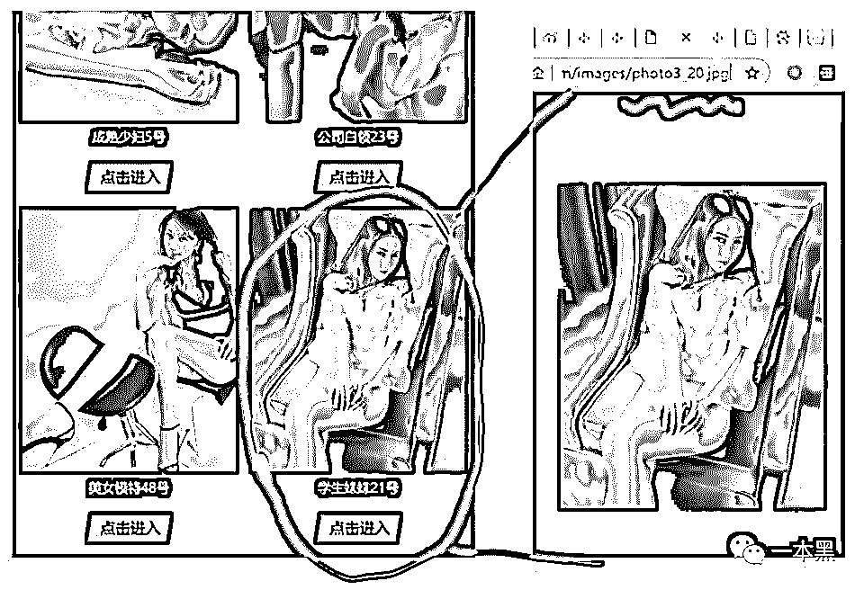

我每天都给那边打电话催款，到了第五天，两个电话都拨不通了，提示关机。

慌乱之后，我赶紧再去网站上找联系方式，发现上面的电话已经改掉，底下还又多了一个微信号。

名称也从“朝阳天尊娱乐会所”改成了“朝阳区维也纳娱乐会所”。

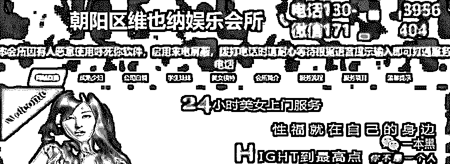

顺着微信加进去，对方依然发来价目表和另一个电话号码，让我自己电话联系，跟之前套路如出一辙。

我没有再打过去。

直到现在，这个骗子网站一直都还在，只是网站内容时常变化，上面的联系方式也隔几天一换……

之前骗走我一万多的收款二维码扫进去也提示**“不支持当前支付方式”**。

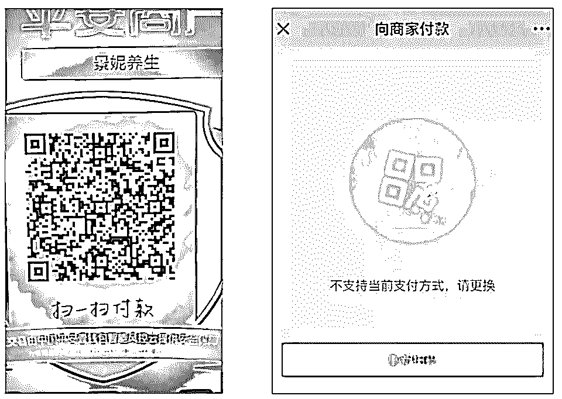

临近期末考试，我需要抓紧复习功课，纠结了几天之后，见找回钱财无望，就决定放弃。

哎！我自诩看过不少揭露诈骗的文章，以为自己“社会经验丰富”，可没想到还是活在象牙塔里，图样图森破，对方稍微换个包装手法，自己就晃头晃脑中招，这次被打脸真是痛……

非常惭愧，很难想象这样一件事居然发生在我这样一个大四学生身上，自己真是太蠢了，让大家见笑了，哎……

03

看完小林同学的遭遇，可能有人觉得“这个大学生真蠢，如此拙劣的骗术也能受骗？”

我听完之后其实也不老实地笑了……但是，接触过很多诈骗案例之后，深知防骗这事真没那么简单。 

我给大家简单分析一下这个案例里骗子用到的技巧：

1）细节就是证据

写故事的作者、写报道的记者们大多信奉一个原则：细节创造真实感。

一个好作者善于调用各种视觉、听觉、味觉上的细节来激发读者想象力，在你脑子里构建一幅画面。（比如我们读金庸小说，眼睛看的是文字，但是脑子里却是一个个鲜活的人物）

骗子也善于用细节塑造真实感，骗局是一个完整的视听体验。

在小林受骗的案例里，骗子有完整而详细的会所介绍、服务项目、客户评价、对接流程。

（网站上的介绍）

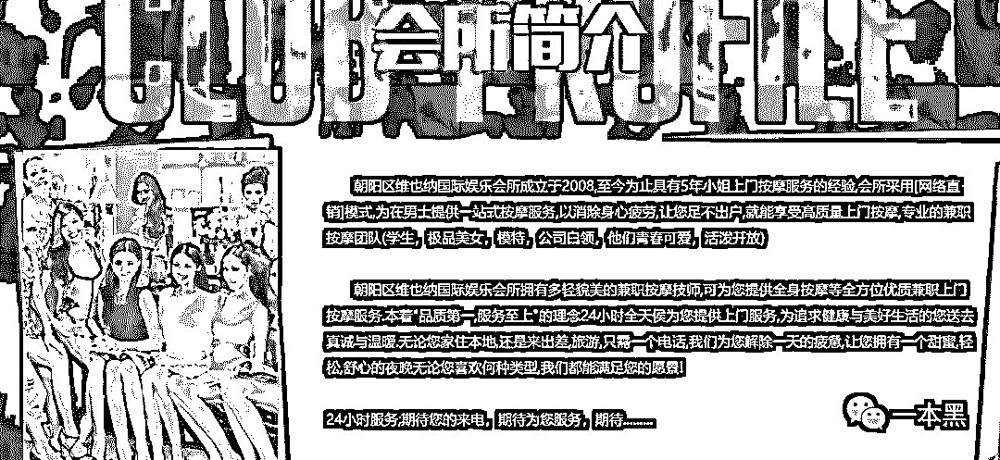

服务项目一栏罗列着七八种不同的项目，什么“一马平川、排山倒海、倒挂金钩、海底捞月……”，写得非常详细，画面感十足：

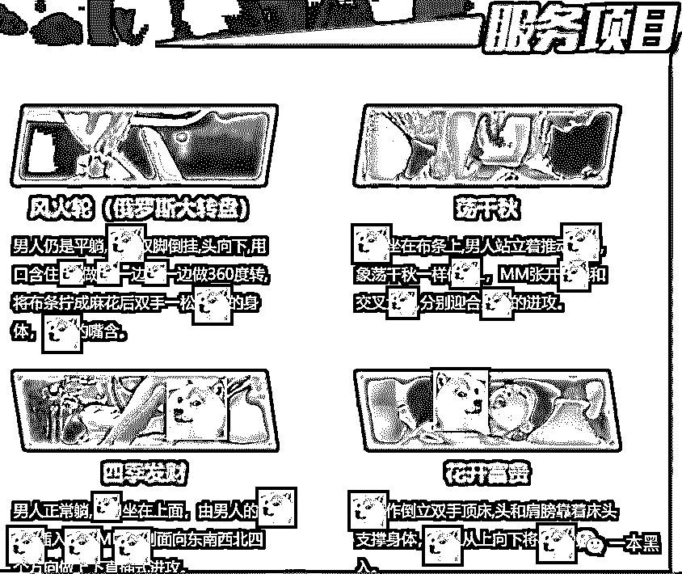

评论区不仅有用户点评，还有不少“预约”和“正在服务中……”

（底部还有一些点评和服务信息）

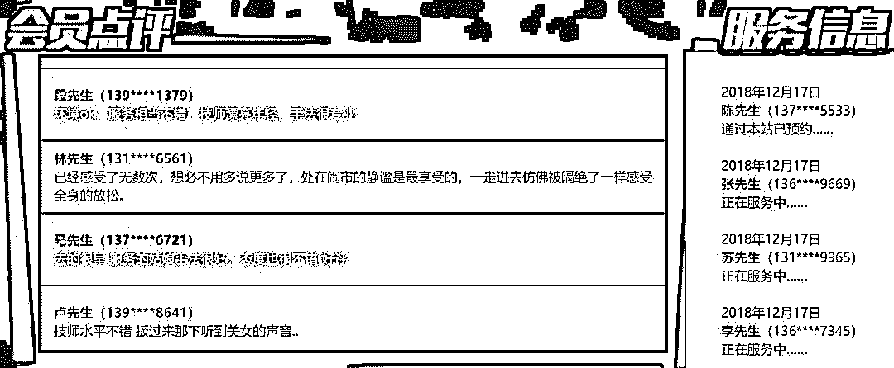

连骗子中途提到的“办卡”情节，网站上也写得清楚。

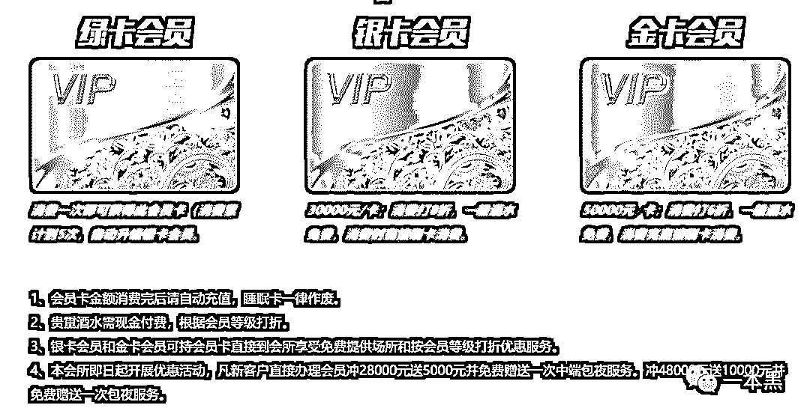

服务流程更是明明白白，骗子甚至会建议“为了避免不必要的麻烦，地址请选在酒店、宾馆。”

（点击可以看大图）

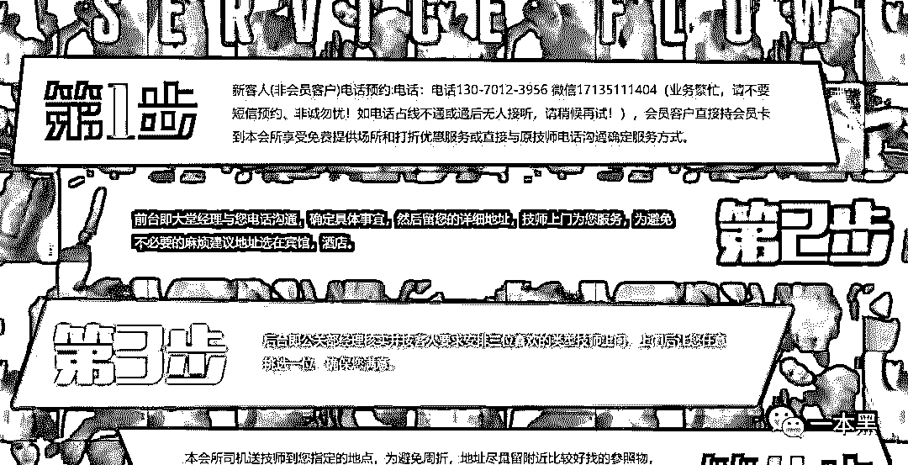

打电话时，骗子也还不忘提到“打印票据”，这让电话那头的人不禁联想起在饭馆买单结账时的场景，仿佛对方面前真摆着一台电脑、一台发票打印机和一部电话。

总之，**一切都让人感觉，电话那头真的有一个网络直销的“会所"。**

2）“沉没成本”

人并不总是理性的。做决策时，大脑会被“沉没成本”影响。（沉没成本：已经发生且无法收回的投入）。

旅游景区的人会用一句“来都来了”让许多人买不太划算的门票，顶着人山人海逛没什么看头的景点。

赌场的人会说“都已经输了这么多，不如拼一拼搏一搏，单车变摩托”，怂恿赌徒借钱回本。

各种店铺让你交钱办会员打折卡，一旦办了卡，你只有多消费才能摊薄办卡的费用。

**各行各业的都在用“沉没成本”套路消费者，诈骗团伙也不例外。**

在小林的案例中，骗子不停地刻意制造“沉没成本”。

第一次告诉他需要交 3000 元保证金，否则 600 元的嫖资打水漂。

第二次让他补缴 6000 元的保证金，否则上一笔 3000 元会失效。

第二次告诉他订单已超时，头一笔 3000 元已经失效，必须补缴 3000 元，否则第二笔的 6000 元就会失效。

第三次、第四次……骗子就这样利用“沉没成本”逼迫小林同学做选择，要么放弃之前的所有投入，要么再投入一点点，有机会收回成本。

除此之外，骗子会建议客户把地点选在酒店、宾馆，其实开房间的钱也是一种沉没成本，许多人会心想：“老子连房间都开好，澡都洗了，你跟我说来不了？”，然后继续受骗。

3）“高级”的控制

**把表面的控制权交给对方，才能达到更“高级”的控制。**

罗振宇曾讲过一个案例，全世界最知名的视频网站 Youtube 的视频广告有个特点：倒计时五秒之后，用户可以自由选择是否跳过广告。

表面上，它把看不看广告的选择权给了用户，但其实 Youtube 用这种方法真正“控制”了用户。

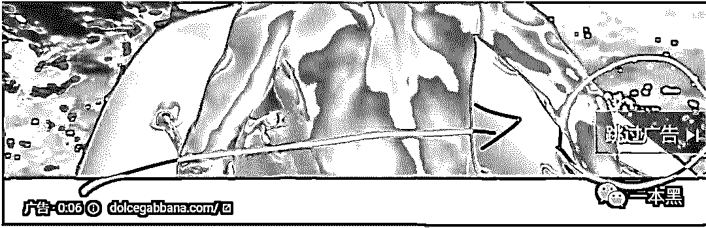

如果一个广告不能跳过，用户很可能在播放广告的时候跳出去干别的，根本就不看广告，可一旦有了跳过按钮，用户起码会看 5 秒钟的广告，这极大地增加了广告的“到达率”，缩减了成本。

类似的案例在其他地方也有所体现，比如微博的开屏广告，不论你跳过或不跳过，其实你都已经看过了。

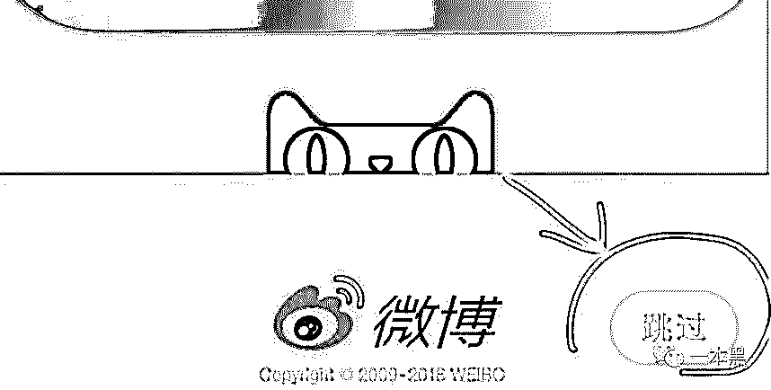

回到骗局。

骗子在整个过程中，**并没有强迫小林打钱，而是不断地给出小林“两个方案”。**

第一次给了小林出两个方案：等到第二天经理签字退钱，或者再打一次钱，立刻退钱并且派“妹妹”过去；

第二次又给出两个方案：等到第二天经理签字退钱，或者加钱办卡，直接把钱充到卡里，并立刻派“妹妹”过去；

每一次都看似把选择权交还给小林，让渡一部分控制权。

人的大脑就是这样，**得到的控制权越多，安全感就越强**，做事的积极性就越高，当人感觉控制权在自己手里，逆反心里就不会那么强。

于是骗子实现了“更高级的控制”。

04

骗子用到的技巧远不止此，出于篇幅限制，只能列举一二。限于文字，骗子的很多语气、话术、氛围都难以表达。（**有兴趣的可以听本文末的录音：“浅黑科技上门服务初体验”**）

我想说的是，普通人在骗子面前，真的就像业余广场舞爱好者对战职业拳击手，人家可是职业的，每天冒着极大坐牢的风险作案。

骗术剧本都是经过几个月甚至好几年反复演练打磨，一些诈骗团伙里还有心理学背景的成员……

真的没那么好防。

也许我们都受过一些防骗教育，在网上看过几个案例，但千万不要自我感觉良好。

许多被骗的人，他们描绘被骗时的感觉都用了“懵”字 —— 仿佛喝多了“上头”了一样，不知为什么就转账了。

那种感觉难以描述又确实存在，这就好比平常状态下，大家都觉得自己能控制住情绪，不会冲动。

可是谁又都有过冲动和情绪失控的时刻，**情绪一旦上来了，一切理智都无用。**

而职业骗子们恰恰善于各种人性的弱点营造出令人“上头”的氛围，让人们做出平日里想都不敢想的举动。

被骗的小林能维权则维权，不能维权也不用太过愧疚，二十一二岁血气方刚，谁还没犯过错呢，一两万块钱也不是遥不可及。（庆幸他没点进上方的各种赌博网站广告，否则输得更多）

吃一堑长一智，以后记得用广告屏蔽软件，涉及转账的多长个心眼，除此之外还能怎么着呢？

好在现在网络比较发达，林书镜同学愿意鼓起勇气把自己的惨痛经历分享出来，希望他吃的这一堑，也能帮更多人长一智。

**One more thing **

“美女上门初体验”

正片终于来了，骗子不仅用了语言压迫，而且还会人身威胁。

“如果中途不叫了，敢耍我们，一会儿 6 个马仔拿刀去你房间砍你，等着吧！”，**这对于射世未深的大学生来说，恐怕是个不小的惊吓……**

****

为了一探究竟（大饱眼福），黑哥还是亲自去网站深度体验了一番（真的只是看看），发现他们变得更骚了。

点开网站一看，朝阳区维也纳娱乐会所摇身一变成了南山区威尼斯娱乐会所，感情这会所名字还根据 IP 地址随时变化。等我回到家打开怕不是就变成拉斯维加斯了吧。

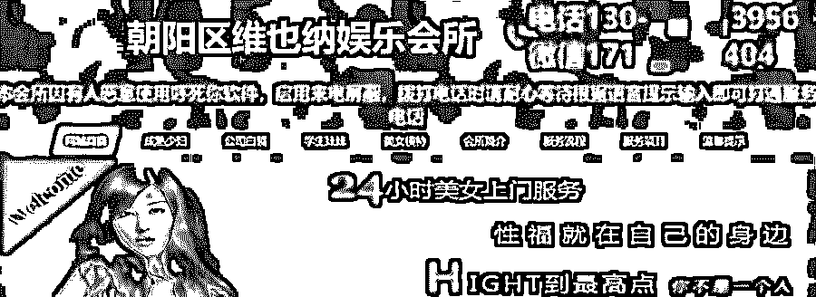

（浅黑打开的网页）

（一本黑打开的网页）

其它内容倒是没什么变化，项目还是那些项目，美女也还是那些美女，就是加了个实时滚动的服务信息窗口，百家姓挨个轮了个遍。

原先的收款二维码也变了，改成了建行卡号。（隐私关系，就不放出来了）

就这么个色情网站，啥内容没有，但是坑起人来倒不含糊。不要问我网址，我是不可能给你们的。

*本文授权转载自浅黑科技，一个骚得一逼的黑客自媒体。*

还原事实｜专扒黑产

微信 ID：darkinsider

知乎 一本黑

微博 一本黑 007

投稿、爆料、招聘、转载

请联系微信：chenchen_19940612

拒绝白嫖，请点好看