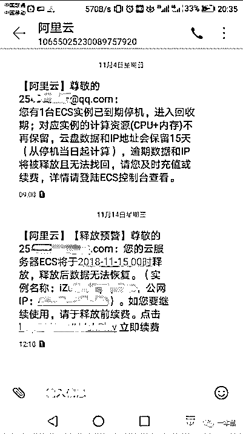
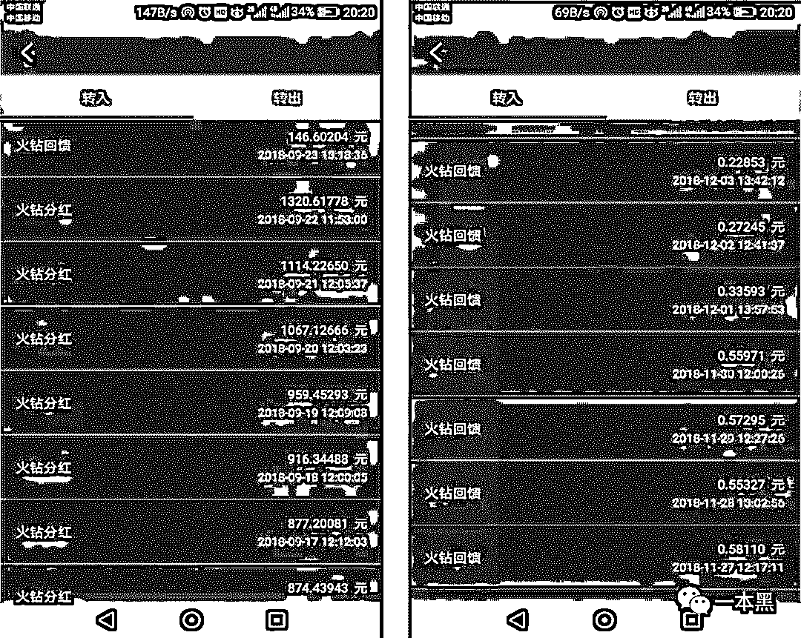
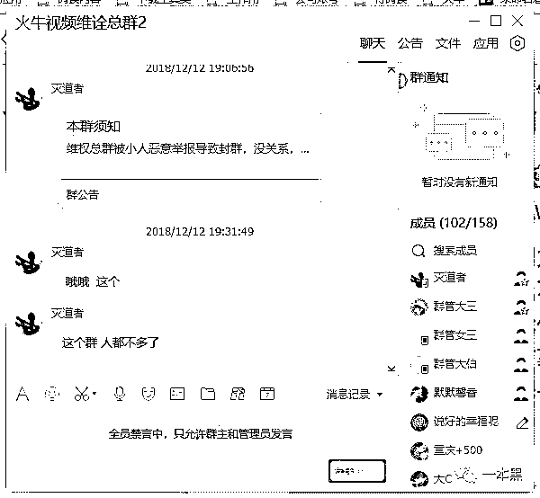
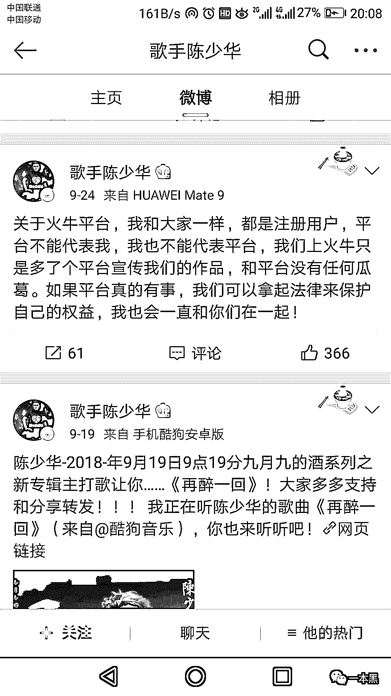
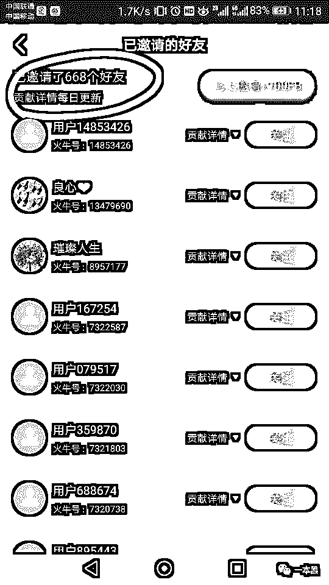
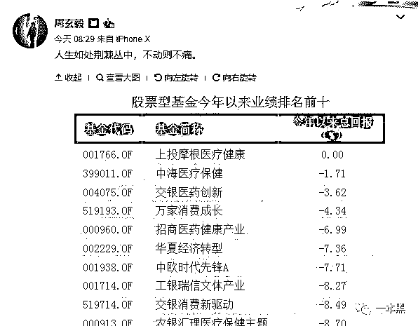

# 火牛视频的数亿骗局与生意：80 万元一夜蒸发，300 万用户被套牢

> 原文：[`mp.weixin.qq.com/s?__biz=MzU4ODAwNzUwMQ==&mid=2247484893&idx=1&sn=1045982e61aaa529f828e3573e34c1d2&chksm=fde214ffca959de9a13f6197ae04d717a4e5c2b3549de53f878c15cbedc7aabd830a9d60fce0&scene=27#wechat_redirect`](http://mp.weixin.qq.com/s?__biz=MzU4ODAwNzUwMQ==&mid=2247484893&idx=1&sn=1045982e61aaa529f828e3573e34c1d2&chksm=fde214ffca959de9a13f6197ae04d717a4e5c2b3549de53f878c15cbedc7aabd830a9d60fce0&scene=27#wechat_redirect)

不管当初他们为何被骗，但火牛崩盘中的受害者可能是最有执行力的一群人。

他们去过工商投诉，找过警察，甚至还三次去北京上访。

“ 消协，法院，经侦，北京上访，这些我们都做了，根本没有办法。公安一直说已经立案，在侦查当中，把我们所有递交的资料都已经移交到北京公安部了”

他们还尝试过劫持火牛视频的 DNS.

“ 我想的是强制劫持火牛的 DNS，进行引流， 火牛用户在当时是日 ip 访问量在 700 万左右，我们劫持引流插播广告，获取广告收益。 ”

“虽然火牛在美国服务器的 SQL 我们进不去，但是火牛我们可以正大光明的强制劫持它，它又不敢出来。”

当然，最后因无力承担租用服务器的费用，劫持 DNS 的想法以失败告终。

“已经被狗日的火牛诈骗干净了，我没有再做后续的维护”

但最终他们还是要开始自己的新生活。在火牛视频里失去的那些钱，将成为他们生活重担的一部分。

一些人需要加倍努力工作，去偿还债务；还有一些人，决定成为骗局制造者。

“我已经不抱什么希望了，以后互联网诈骗会更多，我自己也会去从事的。”

文 | may

# 

**01 ****中秋惨案**

FCoin 版抖音——“火牛视频”，首创“打赏挖矿”+“收入分红”+“回购销毁”模式，以全新的形式、丰富的内容、扎实的用户体验，开启了区块链与视频行业相结合的新时代。”这是火牛视频宣传软文中对自己的定位。

9 月 23 号之前，在火牛平台上，投入 10000 元，每天可以拿到约 900 元的分红。投入更多的，有人每日分红可以达到 80 万元。在巨额收益的吸引之下，火牛视频用户不断增持手中的“火币”。

毕竟，就算有所怀疑，真金白银的撒钱才是最大的诱惑。尽管最终到手的币，被平台自动稀释。

出事就在 9 月 23 日那一天，中秋节，号称“中秋惨案”。

当潮水退去，高企的利润率快速下降。按平台的分红比例，每天 100 火钻可以分到 1 元，然而，9 月 23 日，分红利率从 100 火钻：1 很快下降到 10000 火钻：1，而且，这一比率还在不断下降。

“一开始，火牛平台共发布火币总量 100 亿，后又增发 1000 亿。一夜之间，钱就这样蒸发不见了”。

             

（前后收益对比，火牛平台更改规则，后期将分红改为回馈。）

爆料人在火牛视频中共投入 11 万元，按照这样的返现速度，他想要全部拿回这 11 万元，此生大概是无望了。

“火牛的最终目的就是绑架我们用户，消耗我们时间，然后随着时间的推移我们手里的股份被彻底稀释干净，火牛也就成功洗白了。”

     

号称要打造区块链+抖音模式的火牛，在刚刚到达自己目标山脚下的时候就已经停滞不前。

曾经的赚钱工具，转眼间就成了骗子的代名词。

“火牛视频？那是骗子区块链视频平台！用每天高额分红诱惑网友，等大家大量投资的时候突然修改平台白皮书，关闭提现入口，网友的钱全被套走，欺骗网友人数达到 800 万人投资火牛视频平台，估计非法集资高达 30 亿人民币。”

# 

**02 ****多方促成的骗局**

一场骗局的成功，参与其中的每一个人都不无辜。

尽管有界面等媒体平台曝光，时至今日，火牛视频表面上仍在正常运行。对这些维权的人来说，这是极大的痛苦。

“ 这个平台每天都在运行，是拿刀在我们心脏扎”

**主播**在其中扮演着重要角色。

火牛视频平台在一开始是没有直播模式的，只是一个小视频平台。火牛视频一开始就不是一个他所声称的内容制造平台。小视频内容都是从别的平台搬运而来，连水印都不用去。

但不能不说，主播的入驻，更像是一个发动机的作用，驱动着整个平台的活跃，最终带来投资者的狂欢。

部分入驻主播本身已是 X 手 X 音上的成名主播，他们提供的信用背书是部分用户加入的重要原因。

然而，在一切过后，原本捧场的主播纷纷表明立场，洗刷火牛与自己的关系。

原本的深度合作关系，被他们洗白为自己也是被蒙蔽其中的受害者。曾经炫耀自己与创始人的亲密关系，被他们洗白为自己早就发觉其中的不堪而早早收手。

在火牛视频平台上的主播，有更多更像是传销难民，直播只是他们进行传销的一种形式。

他们在直播中诱导用户充值，让用户用信用卡贷款，甚至利用网贷进行充值打赏。言语之间，全是生意。氪金打赏女主播不能说是知识付费，更像是给智商充值。

但是，成年人的行为，很难说是仅仅因为主播的几句撩拨就愚蠢到为智商缴税。在巨额利润面前，**用户**的贪婪者无畏也是骗局成功的原始动力。

在最疯狂的时候，有人不惜举债“投资”打赏，还有人利用各种方式发展下线。转发朋友圈太过小儿科，爆料人称，他通过投放广告和积分墙渠道发展了 600 多个下线，分布在世界各地。

     

打赏主播，当然最主要的还是把钱打赏给自己。开发多个账号，互相打赏，增长积分，将自己在平台的投入一步步扩大。 

当火牛视频平台停止提现，有警觉的用户率先举报，财付通和银行卡的诸多支付渠道因举报被封。易宝付中，火牛在里面的近两千万用户资金被冻结。

对此，火牛方面给出的解释是受到竞争对手和过激用户的有组织攻击。

很多用户对支付渠道被封却十分不满。他们自认为是跟火牛绑在同一根绳上的蚂蚱，账户被封损害了他们的利益。

同为受害者，但彼此却并不是依靠，毕竟，被封的钱他更想放在自己的钱包里。

你以为你在保护彼此利益，他们却认为你影响了他们全身而退。

当然，罪魁祸首正是**景风**，从一开始，他的目标就不是一个改变格局的创新，而是一个老套的资金盘游戏，然后赚一笔就走。

他在这场事件中却毫发无损。

头戴清华大学光环，手中拿着各大投资机构的资金，这一切也都是骗局成功的背书。在其团队介绍中，还有其在谷歌学术上的论文链接，这一切都放大了他的光环，增加了人们对他的信任。

受害者的泄愤方式对他没有丝毫影响。P 各种诅咒图片，在互联网上进行辱骂泄愤，但我们对真实的景风只能说是一无所知，更不用说将其绳之以法。

（图片来源于网络）

爆料人称，尽管有警方介入，自始至终，他们都没有找到景风这个人。

# 

**03 ****名存实亡**

火牛视频的模式并不新鲜，老套的资金盘游戏，加上区块链噱头，再加上主播打赏。只不过打赏的氪金变成火钻（FB），主播自己也成了传销者中的一员。

每一次骗局之后，都会有人问“有没有一种熟悉的感觉？” 但为什么每一次骗局都能凑效？

在火牛视频的骗局中，一开始的无需充值，零门槛进入吸引大批用户进入。看小视频、看直播都能赚钱，这是八线城镇最受欢迎的薅羊毛方式。

但很多情况下，薅羊毛不成却成为狼爪下的小绵羊。

在 QQ 中，各种薅羊毛群中也是被骗受害者集中的地方。

邀请有奖励，上车薅羊毛，庄家又跑路，我们要维权。这样的故事每天都在上演，邀请好友，发展下线，说是刚出的资金盘，但发现自己才是最终的接盘侠。庄家跑路，损失惨重，然后就是漫长的维权之路。

“所有下沉市场，什么趣头条，今日头条极速版，百度，一点资讯，微鲸看看，中青看点，等等这些上面都是黑五类产品”

骗局的成功，这些平台也是得力助手。

火牛视频表面上仍在正常运营，这像是打在每一个人脸上的耳光。

据知情人士透露，火牛视频平台**总计充值用户大概在 290 万左右，总充值金额 6 亿以上。**

尽管在其粉丝群，管理员仍不断放出充值渠道更新等内容，据知情人士透露，火牛视频后台数据显示，已连续多日仅有千元充值金额。

而每日的提现金额则是 0，包括微信、支付宝和银行卡的各类渠道均无提现记录。

火牛视频已经名存实亡，App 的正常运营只是个“面子”。

它正要做的或许是开发新的平台。他们早在十月份就曾开发了一个新的视频叫有矿小视频，网友戏称其意在把你家里的矿掏干榨尽，但在后来销声匿迹。

从蛙趣视频到火牛视频，从火牛视频又将变成下一个视频平台。韭菜割过一茬之后，长得好像更加茂盛了。

刷微博时看到周玄毅的一条内容，“人生如处荆棘从中，不动则不痛”。

     

像火牛视频这种所谓的投资，就是步子太大，直接给个人带来生理阵痛。

但所有的痛楚只能一人承担，老师傅感叹一下这个庞大的数字，够他吸上多少年的芙蓉王，但这是每个受害者需要偿还的债务。

没有稳赚的买卖，投资就是风险。更可怜的是，在局外人眼里，反而是维权者自己缺乏契约精神，跟房价掉了去打砸售楼处的人一模一样。

另：一本黑微博 **@一本黑 007** 现已开通，欢迎来杠。

还原事实｜专扒黑产

微信 ID：darkinsider

知乎 一本黑

微博 一本黑 007

投稿、爆料、招聘、转载

请联系微信：chenchen_19940612