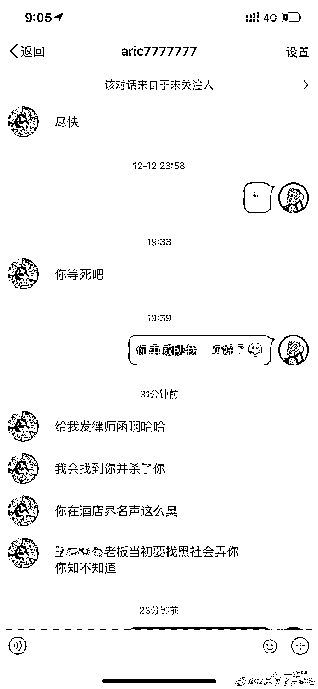
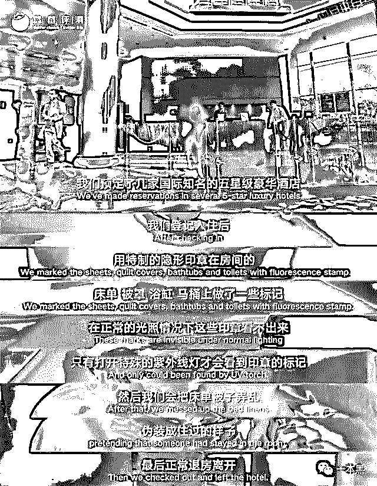
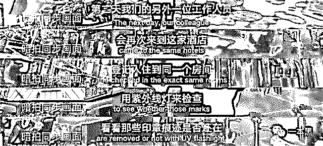
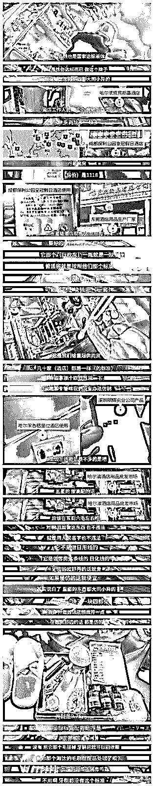

# 被免职、威胁、灭口、不知所踪，这就是曝光行业黑幕的后果？

> 原文：[`mp.weixin.qq.com/s?__biz=MzU4ODAwNzUwMQ==&mid=2247484874&idx=1&sn=801148873760a0f8f26e8d32b1e1084c&chksm=fde214e8ca959dfe572ef8c7bbf3b8ee035bd912b39770ca3ddf6c00541a9b30b59eec7eaa8c&scene=27#wechat_redirect`](http://mp.weixin.qq.com/s?__biz=MzU4ODAwNzUwMQ==&mid=2247484874&idx=1&sn=801148873760a0f8f26e8d32b1e1084c&chksm=fde214e8ca959dfe572ef8c7bbf3b8ee035bd912b39770ca3ddf6c00541a9b30b59eec7eaa8c&scene=27#wechat_redirect)

12 月 15 日，微博用户“花总丢了金箍棒”发文称自己遭受死亡威胁，有人扬言说要杀死他。

事件起因是花总在微博曝光了一大批酒店存在的卫生乱象，其中包含多家五星级酒店。此后花总的个人信息被泄露，不断有人对其进行骚扰和人身威胁。

事件回顾

11 月 14 日，“花总丢了金箍棒”在微博发布【杯子的秘密】视频，曝光自己六年来拍摄下的中国酒店卫生乱象，多家知名酒店使用脏毛巾同时擦洗马桶和口杯，毛巾不清洗消毒就进行二次使用，涉事酒店覆盖率高达 100%。视频涉及 14 家五星级酒店，包含希尔顿、宝格丽、喜来登等。

*图片来源：花总丢了金箍棒微博*

11 月 16 日，花总接受新浪采访，表示自己曝光酒店乱象的初衷和目的，希望能够让更多人了解到真实的中国酒店现状。

11 月 22 日，花总表示不再接受媒体采访，希望相应酒店能够及时针对自身问题进行整改。

12 月 10 日，花总在微博曝光，有酒店将其个人身份证及护照信息公开。

12 月 11 日，花总悬赏十万元寻找身份信息泄露线索。

12 月 12 日，花总点名上海新虹桥希尔顿花园酒店、无锡太湖新泽假日酒店曝光其私人信息，希望获得合理的解释。

12 月 15 日，花总曝光**有人对其进行人身威胁**并表示已报警处理，威胁人微博昵称为【明媚阳光吴东吴增】。

**图片来源：花总丢了金箍棒微博 * *

12 月 16 日，【明媚阳光吴东吴增】发博否认其威胁行为，声称只是一句玩笑话，并于次日更改微博昵称及头像。

 *图片来源：harriettang 微博 *     

**01** ** 一条抹布暴露酒店乱象**

花总说自己应该是中国入住酒店最多的人，从 2012 年到 2018 年的六年时间里，他入住超过 140 家五星级酒店，共计超过 2000 晚。但直到 2017 年无意撞破清洁人员使用脏浴巾擦拭口杯才发现这个秘密。

根据《旅业客房杯具洗消操作规程》各大酒店应该及时对客房内的杯具进行消毒清理，这不仅是国家规定更是行业操守，但实际上能够严格执行的酒店屈指可数。

连中国最顶级的酒店尚且如此，更不要说连锁酒店和私人旅馆。毛巾擦马桶、房间不换床单、烧水壶煮泡面等诸多乱象一直存在。在媒体曝光之后，酒店都会表示会严格处理、及时整改。但风头一过，又故伎重演。

2017 年，一篇名为【五星级酒店，你为什么不换床单】的文章在朋友圈刷屏，一家评测机构对北京三里屯洲际、希尔顿、万豪等 5 家酒店进行暗访，发现 5 家酒店均未彻底更换床上用品、清理浴缸、消毒马桶，三家未消毒口杯。在曝光之后，这 5 家酒店的态度是：我不是-我没有-别瞎说，并且死不悔改。

 *图片来源：蓝莓测评*

被爆出问题之后，部分酒店不对自己问题进行自查整改，反倒呼吁评测机构不要私自对酒店用品进行检测，以免给员工和客人造成健康隐患......

为了节约成本，有的酒店回收顾客使用后的牙刷，不消毒就进行二次生产包装。有的酒店甚至仿冒名牌，勾兑洗涤用品，供顾客使用。与动辄上千元的房费相比，一套洗护用品的成本价甚至不到 10 元。

这些现象早已是行业内公开的秘密，只是在曝光之前每家酒店都假装不知情。在巨大的利润面前，监管形同虚设，媒体的指责和督促成为阻碍酒店赚钱的拦路虎。

**02**  **藏在暗处的针孔摄像头**

花总自曝在长达一年的时间里，他利用 gopro、针孔摄像头在各大酒店采集素材，拍摄了约 30 多家酒店。在这么长的时间里，除了最开始用 gopro 被服务员发现两三次之后，没有任何一家酒店发现真相。

五星级酒店在安保方面竟如此的松懈，藏在毛巾里的 gopro、伪装成闹钟的摄像头，这么明显的摆放居然没被发现。

这也就不难想象市面上流传的酒店偷拍视频是怎么来的了。不法分子将摄像头隐藏在开关/路由器/接线盒等地方，只要房客不仔细检查，十有八九不会被发现。

不管是五星级酒店还是你租住的出租屋，一定要留心那些不起眼的小物件，说不定里面就藏有监控。

一般来说偷拍者最喜欢的位置是床和浴室，因此可以仔细检查周围的插座，天花板上的灯具/床头的闹钟等物件，避免被偷拍。

2017 年 2 月，有网友爆料称，自己在台湾租住的 airbnb 民宿内，藏有针孔摄像头，分别隐藏在浴室和卧室的烟雾报警之中。

类似的事件，每天都在发生，谁也不知道摄像头是何时装上。安保设施再先进，租客的个人隐也私依旧得不到保障。没有哪一家酒店敢保证自己的房间绝对不存在摄像头。

**03 ****还记得三聚氰胺吗？**

法律不完善，监管不到位，消费者的个人权益得不到保障。我们寄希望于花总这样的勇者替我们揭开行业的遮羞布，让我们看清真相。

然而，大多数曝光行业内幕的人不仅得不到尊重反而还要担心自己的人身安全。

每次在酒店乱象被曝光的时候，曝光者的私人信息都会被泄露。去年，有网友曝光济南全季酒店清洁人员使用毛巾清洁坐便器。

当再次入住华住旗下酒店时，发现自己被酒店标注 “此客人入住会在卫生间安装摄像头取证”这样的信息。

收到多次威胁恐吓之后，花总在微博悬赏十万元寻找身份信息泄露的线索，希望以此保障个人信息安全。

在打假维权的道路上，许许多多个花总踽踽独行，许许多多个我们冷眼旁观。人人都渴望真相却又不敢揭开真相。因为我们害怕，所以我们沉默。

中国药品打假第一人高敬德坚持以真实信息举报违法行为，身为医药公司的采购经理，在听同行介绍后，他购买了一种“云仙牌”的天胡荽护肝片，但服用过后出现恶心呕吐的现象，经查询发现该款药物存在两家生产商。

为查清真相，他深入云南药厂实地调查，最终确定其中一家为假药生产公司。随后向上海药监局举报，对该制药公司进行了处罚。

这一次打假让老高开始出现在众人视野。2004 年到 2007 年的三年间，他共参与药品打假 105 次，曝光多家知名药店、医院销售假药、仿冒药，累计花费 11 万，最终只得到 4 万元的赔偿。

不仅掏空了积蓄，老高因为打假还丢了饭碗。**由于实名打假，老高多次遭受打击报复，甚至被医院拉入黑名单，无法正常就医看病。**

2007 年的 10 月 12 号，**老高被一辆白色面包车带走后，再也没回来过。**

11 月 12 日媒体发布老高的死讯（具体死亡时间为 10 月 26 日）。官方解释是老高因罹患获得性免疫缺陷综合征（也就是艾滋病），最终不治身亡。

在官方报道中，老高在返回上海地途中突发高烧腹泻，后在海军 411 医院确诊为艾滋病”晚期“，因治疗期间出现肺部感染等并发症，最终抢救无效。从确诊到身故，只有短短半个月，谁都不愿意相信这是事实。

中国乳业打假第一人蒋卫锁在 2006 年曾发《中国西部乳业濒临崩溃边缘》的调查报告，揭露乳品行业掺假内幕，两年后三鹿奶粉案浮出水面引发中国乳业大变革，食品免检制度被取消。

因乳业造假横行影响奶农的生存，他自费开启“中国西部乳业万里行”的采访调查，让大众看清乳业真相。为调查他卖掉自己的产业，共走访西部多个省市，总行程达 5 万里。

因调查损害他人利益多次被人威胁。为不牵连妻女，他无奈选择离婚。

在央视焦点访谈曝光事件后，他以为自己的付出终于得到了回报。不料想 2012 年的 11 月，在出席公司年度经销商订货会议后的**第二天却遭人袭击，最终因伤势过重抢救无效身亡。**

对此，媒体的解释是，蒋卫锁因多年打假对家庭生活造成严重影响，夫妻关系不睦。在离婚后因为夫妻矛盾被妻子连同家人在内的 9 人殴打致死。最终 9 人被刑拘。

在这场轰动全国的三聚氰胺事件中，被曝光的远不止三鹿一家企业，大陆几乎所有的乳制品公司都被卷入其中。广东雅士利等 22 个厂家 69 批次产品中均检出三聚氰胺。

其中三鹿因在婴儿奶粉中掺假，导致全国近 5 万名婴儿健康受到严重影响，腹泻、营养不良、佝偻病。仅安徽阜阳就出现一百多名大头娃娃，其中 12 名婴孩因长期重度营养不良而死亡。

那些侥幸活下来的孩子，他们的双手摊开却永远伸不直食指！他们沉默寡言，内向孤僻，再也无法拥有同龄人的快乐，无法上学读书，甚至连生活都无法自理难。而这仅仅是冰山一角。

**十年过去了，举报者已身故，幸存者尚在苟活。**

曝光毕节五名流浪儿童被冻死的记者李元龙不知所踪；

曝光问题疫苗的记者王克勤被免职；

曝光地沟油的记者李翔身中 10 余刀被惨杀; 

曝光“红毛”药酒的谭秦东被跨省追捕；

......

其实想想是挺悲凉的，一个曝光行业黑幕的人，没有得到足够的尊重，反而受到人身威胁。

这就是我们的社会，**说真话被封口，揭露事实被威胁。**

有时候现实真的魔幻得像个舞台剧，底下的观众都知道它荒诞不堪，甚至可笑，但他们还是会拍手叫好，仿佛一条狗。

**或许我们更应该相信大多数媒体所说的，事件的发生与结果并无关联。**

**THE END**

最后，我想说。

**国内形势一片大好，改革开放四十周年**。

 还原事实｜专扒黑产

微信 ID：darkinsider

知乎 一本黑

头条 一本黑

微博 一本黑 007

投稿、爆料、招聘、转载

请联系微信：chenchen_19940612