# 色情擦边、谣言蛊惑、金钱诱导，新闻没有价值，用户没有思想

> 原文：[`mp.weixin.qq.com/s?__biz=MzU4ODAwNzUwMQ==&mid=2247484868&idx=1&sn=fda2880f874b0c263c19553bd638537e&chksm=fde214e6ca959df00afe370f5d02b4b0f94193594f08772addc407801d886cc44a0e0409f8d9&scene=27#wechat_redirect`](http://mp.weixin.qq.com/s?__biz=MzU4ODAwNzUwMQ==&mid=2247484868&idx=1&sn=fda2880f874b0c263c19553bd638537e&chksm=fde214e6ca959df00afe370f5d02b4b0f94193594f08772addc407801d886cc44a0e0409f8d9&scene=27#wechat_redirect)

所谓开卷有益，掩卷有味。在新媒体蓬勃发展的今天，我们靠着各类资讯 App、网站及公众号来获取资讯，传统媒体内容为王的根基被瓦解，眼球经济和资本崇拜是大部分媒体的生存现状。资讯平台用钱刺激用户，用户想着法子从新闻里赚钱。

当媒体成为谋利的工具，新闻就失去价值。

当媒体不再坚守价值底线，民众便无法看清真相。

文 | 喵叔

**01**  **一份自动挂机脚本**

大家好，我是老黑。

上回和老师傅去买烟，买完后我习惯性打开记账 App，看到今日头条的广告。便和老师傅说，现在看新闻也能赚钱了。

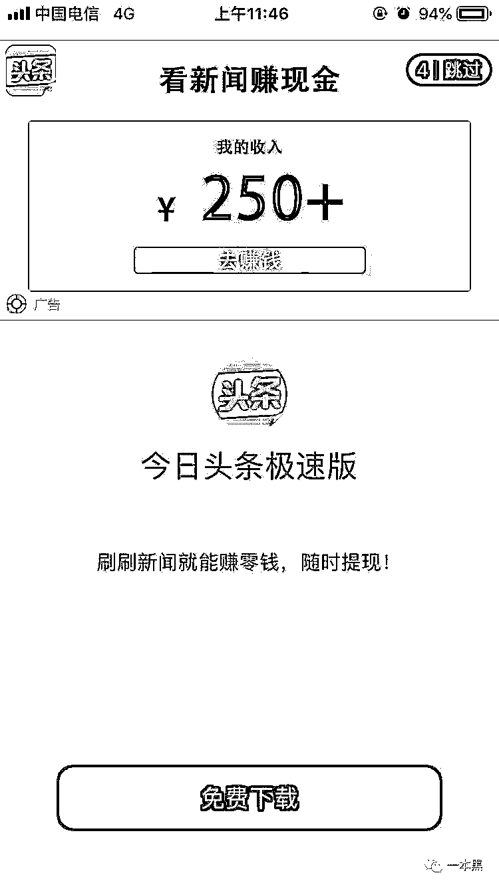

老师傅顿了一下，说“你们村是刚联网吗？”

受到嘲讽的我，回家之后便去网上了解相关话题。原来刷新闻赚钱这事还挺火，难怪朋友圈里的大叔大妈一天到晚刷屏，甭管是朋友圈还是微信群。发的还都是些标题夸张，封面露骨的文章或性感美女写真。

譬如，【这个女人真漂亮，忍不住分享给大家】其实讲的是孝顺长辈的故事；【看胖子如何调戏一帮美女，太坏了，委屈你们了泳装美女们】打开一看是洪金宝的电影片段。

大叔大妈有没有看这些文章我不知道，但是大叔说他靠这个每天可以赚包烟钱。

半信半疑下，我下载了趣头条、瞎转、惠新闻几个 App，想看看究竟是怎么回事。其中，趣头条的任务最多，瞎转玩法最简单，惠新闻版面最简洁。

一打开趣头条，系统就提示领取价值 18 元的新人红包，可点击之后却只有 1 元。

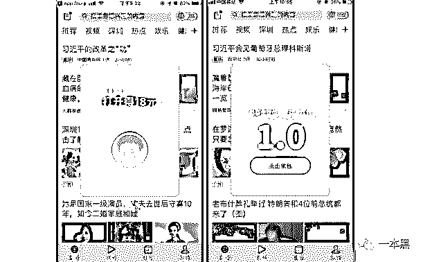

此外完成各项任务也可以得到相应的奖励。邀请一位好友可得 8 元现金奖励，每邀请多 5 人，单人奖励增加 0.5 元。

其它的任务如阅读、拆红包、签到、评论、转发等奖励，则以金币的形式返还。1600 个金币可兑换一元人民币，账户余额满一元就可提现。

       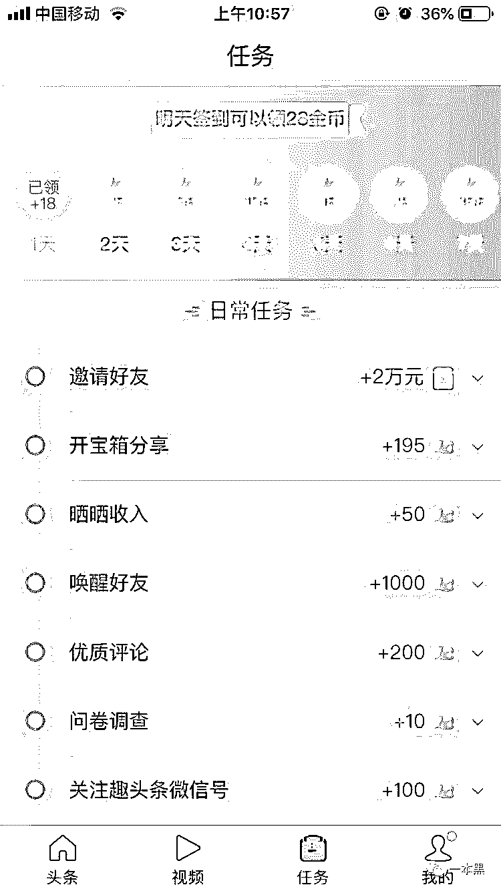       

瞎转的玩法很简单，只要转发文章即可赚钱，0.1 元每篇。你可以选择分享至朋友圈或者微信群。或是直接复制链接发送到任何地方。

了解清楚规则后，我也开始了每天刷新闻赚金币的任务。但是好几天过去，也才不到 10 块钱。

一天在某个群里看到这样一段视频。

[`v.qq.com/iframe/preview.html?width=500&height=375&auto=0&vid=j1354xdcb5e`](https://v.qq.com/iframe/preview.html?width=500&height=375&auto=0&vid=j1354xdcb5e)

呵，感情这手机能自动刷新闻赚金币。为了摸清情况，我联系上了卖家，对方说加脚本 220 一台。      

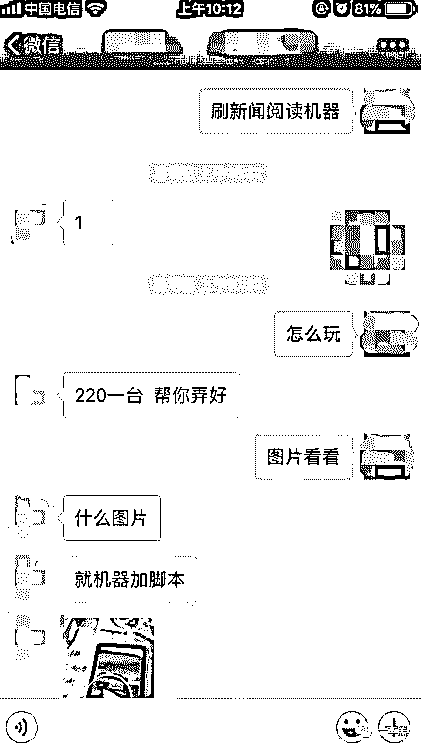

加上脚本，手机就可以自动刷新闻赚钱，怕我不信，他还发来一段视频。只需轻轻一按，金币就自动入账。短短 10 秒钟里，就收了 500 个金币。

卖家还说只要有了这个挂机脚本，一小时轻轻松松就可以赚到上百。每天工作之外花上三四个小时，业余收入就能过万。

[`v.qq.com/iframe/preview.html?width=500&height=375&auto=0&vid=r1354fogtw4`](https://v.qq.com/iframe/preview.html?width=500&height=375&auto=0&vid=r1354fogtw4)

对于这套脚本，我十分好奇。但是想想 220 一套的价格，又摸了摸自己干瘪的口袋。

于是我决定请老师傅出马。

老师傅看完视频后没说话，只丢给我一个网址。

打开网站，我看到了许多的脚本制作教程，包括我要的自动刷新闻赚金币的。在折腾了大半天之后我还是没弄好，于是我下载了一个现成的挂机脚本。

按照说明设置文章点击次数、阅读时间及篇数等参数后，脚本便开始自动阅读新闻。      

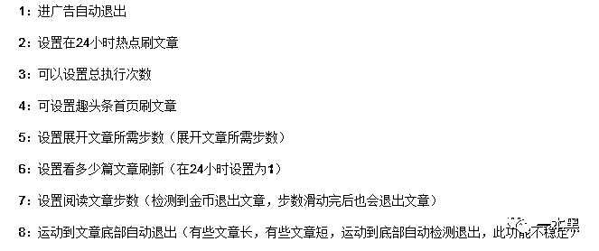*    脚本功能 *

半小时过去了，系统显示我的收入为 2.5 元。     

一小时赚 5 块，与卖家所说的一小时上百，似乎出入有点大。

为了防止作弊，趣头条这类 App 设置了每篇文章的阅读时限，只有在单篇文章停留时间超过 30s，并且不时滑动屏幕，才能获得 10 金币。即使有脚本加持，也不可能实现卖家所说的 10 秒钟获得 500 金币。

“这卖家是骗人”。我很开心地和老师傅讲述我的发现。

然而，老师傅只给了我一个漠然的背影。

这类脚本在网上一搜一大把，没想到真的有人愿意花大价钱买。     

### 

**02**  **不差钱的平台**

趣头条这类 App 内的文章大多打着色情或者谣言的擦边球，其中，养生、风水、玄学、八卦占据主要篇幅。

用户只要转发文章就能获得收入。这些钱从哪来？平台靠什么盈利？

广  告

趣头条、东方头条主要靠广告盈利。

App 参差不齐的内容里夹杂着大量的广告，如租房、二手车、游戏、护肤品等。广告多为各类 App 的下载链接或是网站，其中多为瓜子二手车、英语流利说、安居客这类知名 App。

            

在趣头条的抽奖任务里，我共点击抽奖转盘八次，其中有七次为英语流利说的下载链接。

尽管文章内容低俗，但广告主似乎根本不在乎平台的内容质量，预算一笔又一笔往里投。

我们对趣头条的广告进行了简单的统计，在文章信息流中，每加载 10 篇文章，有 2 篇是广告；在视频信息流中每加载 9 条视频，有 1 条是广告。

总的来说趣头条的广告曝光率大概是同类产品今日头条的 1.5~2 倍。所以这些 App 不愁赚不到钱，仅 2018 年上半年趣头条的广告收入就高达 6.70 亿。

**趣头条的广告策略就是：满上！都满上！把所有的缝隙都塞上广告。**因为只要有钱，用户就不会在意体验。

成立至今，趣头条共完成了四次大规模的融资，并于 2018 年 9 月成功上市。腾讯、人民网动辄上亿的投资足够趣头条维持经营。       

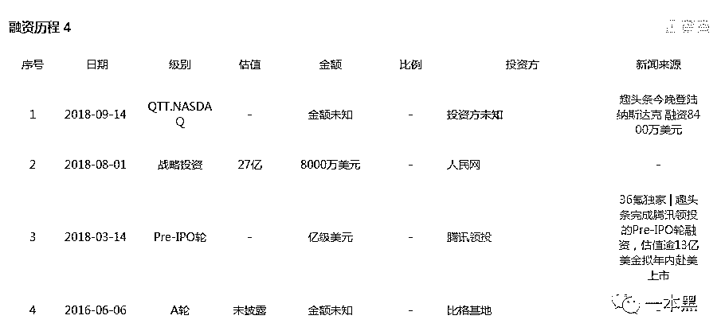

分级佣金模式让用户主动参与转发拉新，但实际上能够完成大额提现的不足 20%，大部分人在提现之前账户就已经因为违规操作被封禁。

在互联网企业人均获客成本高达上百的情况下，趣头条却依然能够用均价 8 元左右的价格实现大规模拉新。巨大的资金支撑和极低成本的获客价格，让趣头条在三四线城市愈战愈勇。

**若说今日头条是一二线城市的霸主，那么二线城市以外便是趣头条的天下。**

商城返利

惠新闻则是依靠商城+广告的方式盈利。

打开惠新闻的商城，显示的商品链接均来自淘宝或者天猫。商城通过为用户提供商品优惠券的形式，引导客户前往淘宝下单购物。

成交之后，店家会给予惠新闻相应的回扣或是广告费。这和花生日记、一淘等 App 的具体运营模式相同（也就是所谓的 CPS 广告）。

惠新闻的广告以 CPC 为主，广告以关键词形式展示，当用户点击广告时，广告主根据点击次数给惠新闻结算广告费。主要广告类型有租房、减肥、交友、整容、人流等。

       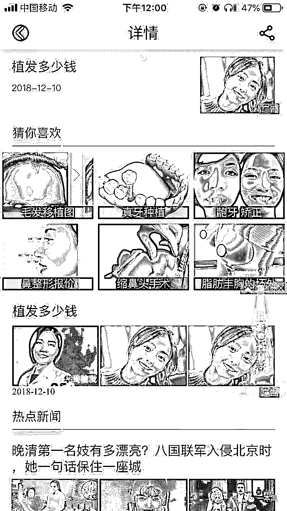

随机点击一个整容的广告，页面跳转至百度排名，出现四家当地医疗整容机构，经查询其中三家存在经营或司法风险：要么因为医疗事故被告，要么是违法广告被处罚。

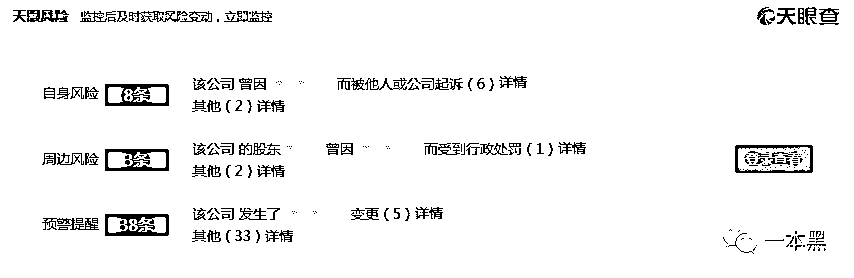

在点开一个人流广告时，惠新闻推荐了几家家妇产科医院，其中排名第一的医院，在百度和天眼查上显示公司经营数据一切正常，百度前三十页以内全是好评。

但在大众点评仅有的 26 条评论里，20 条是吐槽医院收费贵，过度医疗。仅有的 8 条好评是对医院环境的认可。

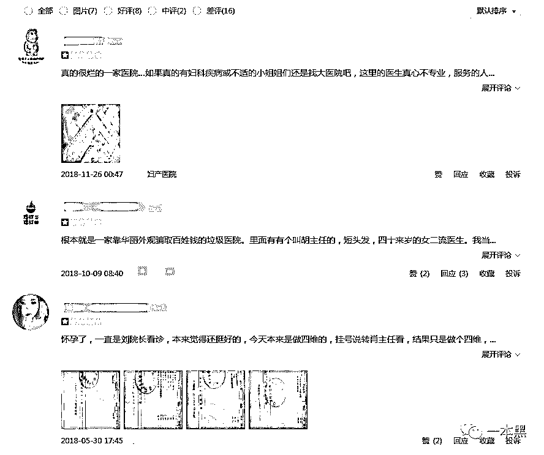

显然惠新闻在承接广告的时候，并未对机构资质及业务真实性进行审核。魏则西事件过去已经两年，但是医疗广告乱象却依然存在。为了应对差评，医院投入大量的人力物力粉饰真相。

在该医院的微博上我们可以看到 XX 主人再来两个喜报这样的文字，不知情的还以为这是销售喜报。

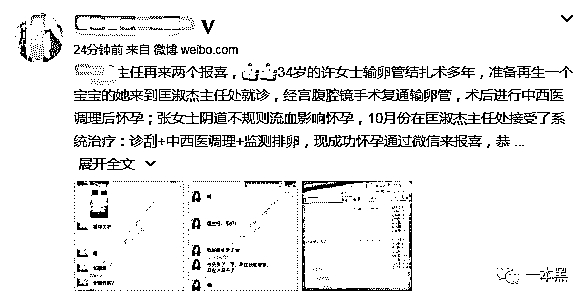

医疗机构的竞价广告在冷却一段时间后又卷土重来，没有人在乎谁会是下一个魏则西。

毕竟，在金钱面前，良心又算得了什么呢？

 ### 

**03**  **失调的内容市场**

文化虽有雅俗之分，却没有高下之见。

自媒体时代，人们接收信息的渠道各不相同。**传统媒体的公信力流失，自媒体开始引领舆论的方向。**

求快求新是所有自媒体的共性，于是部分新媒体写手不再像传统记者一样追根究底、刨根溯源。新闻的真实性得不到保障，于是谣言提笔而来。

夸大其词、断章取义、凭空杜撰这些惯用手法催生了一篇又一篇的假新闻。如今年 6 月份，一篇名为《飞利浦发布公告：从 5 月 31 日起解散公司，正式停止运营》文章在网上疯传。但真相只是位于深圳的飞利浦家居灯饰制造（深圳）有限公司被关闭，而非飞利浦总公司倒闭。

对不明真相的群众来说，这篇文章似乎有理有据，于是一传十十传百，却不知自己传了个谣言。

更有甚者，靠写文诽谤企业收取保护费年入千万。他们如同网络黑社会一般，隔三差五组团精准打击某家企业，力求在最短时间内榨干企业的媒体投放费用。

**监管如同达摩克利斯之剑，但为了钱，不少媒体宁愿铤而走险。**

为了赚取更多的流量，标题党层出不穷。

【超红嫩模当街全裸，频换 poss 任市民拍照】配图是一裸体模特雕塑；【国家一级保护动物缘何命丧公安局长之手？】说的是武松景阳冈打虎。

娱乐至死的年代，一切公共语言以娱乐化的形式出现，人们心甘情愿沦为娱乐的附庸。比起政治、文学、民生，人们更愿意关心明星八卦和奇闻怪谈，那些流于表象的肤浅言论似乎更符合大众的喜好。

人们不再愿意深入阅读和深度思考，碎片化的阅读习惯让人们更加相信所见即所得，没有人在乎新闻的伦理性与真实性。也正是因为这样，标题党、谣言才可以在互联网上野蛮生长，毫无禁忌。

无论是趣头条、惠新闻还是瞎转。他们都自称资讯阅读平台。但实际上平台既没有给用户带来高品质的文章，也没有带来足够优良的使用体验。

变味的内容平台远不止这些，网易、百度、搜狐也纷纷踏上了这条路。。

**趣头条的 slogan 是“让阅读更有价值”**。可这类内容平台真的为大众提供了有价值的资讯吗？

**THE END**

网络不是法外之地，媒体需要有序生长。

【最近微信改版，为了能够第一时间看到我们的最新内容，大家可以把一本黑设为星标】

**可按以下步骤操作：**

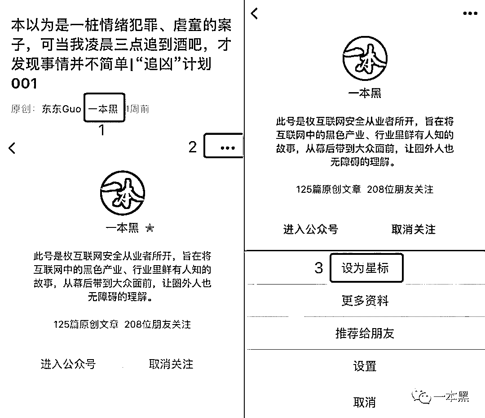

还原事实｜专扒黑产

微信 ID：darkinsider

知乎 一本黑

头条 一本黑

投稿、爆料、招聘、转载

请联系微信：chenchen_19940612 

# 

> 原文：[`mp.weixin.qq.com/s?__biz=MzU4ODAwNzUwMQ==&mid=2247484847&idx=1&sn=153efd3de2e269551e2955b48ab11ca6&chksm=fde2148dca959d9ba478526e41410afbe68005cd64e5be95817b7f334e1704b95af5f25a65e5&scene=27#wechat_redirect`](http://mp.weixin.qq.com/s?__biz=MzU4ODAwNzUwMQ==&mid=2247484847&idx=1&sn=153efd3de2e269551e2955b48ab11ca6&chksm=fde2148dca959d9ba478526e41410afbe68005cd64e5be95817b7f334e1704b95af5f25a65e5&scene=27#wechat_redirect)