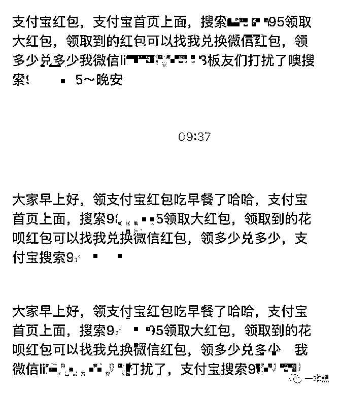
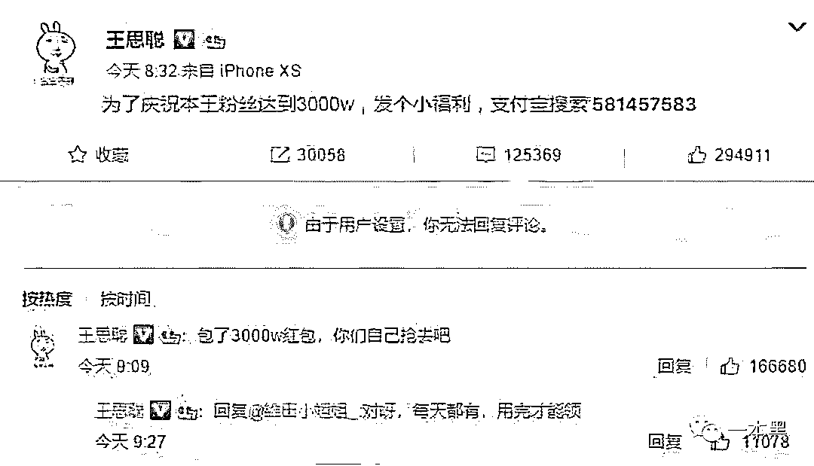
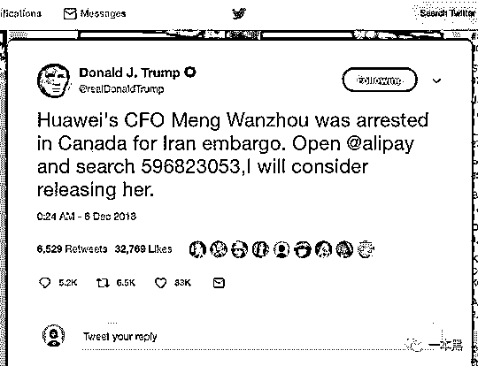
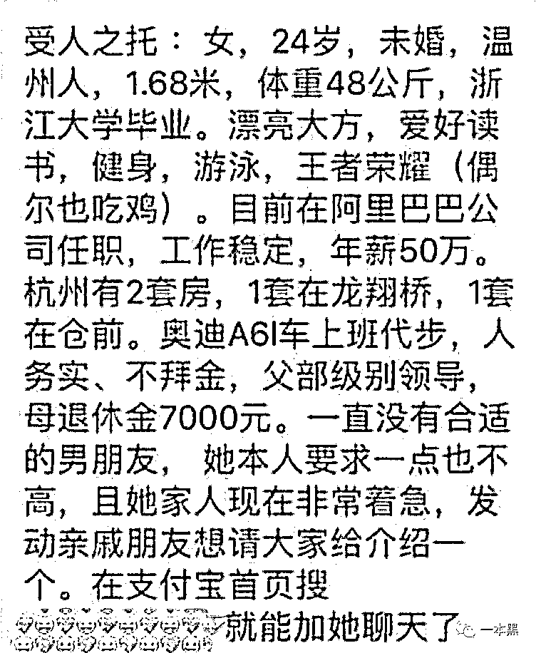
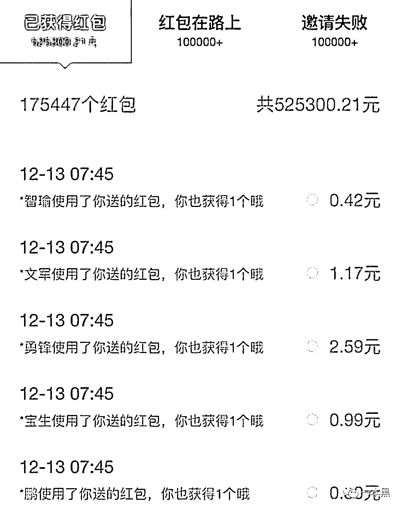
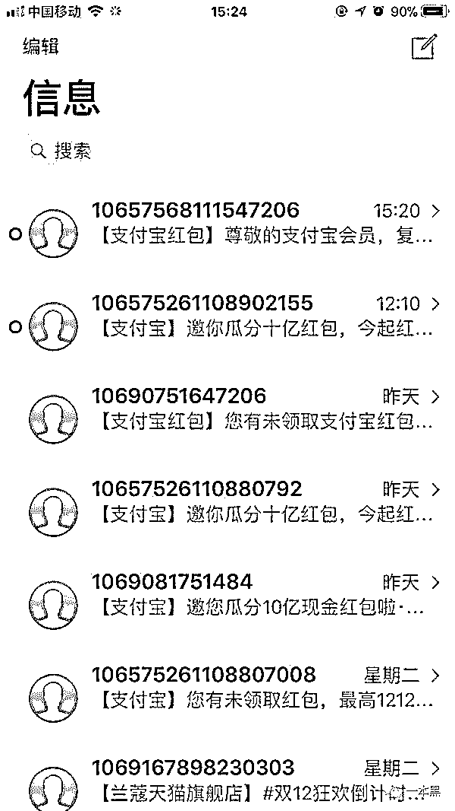
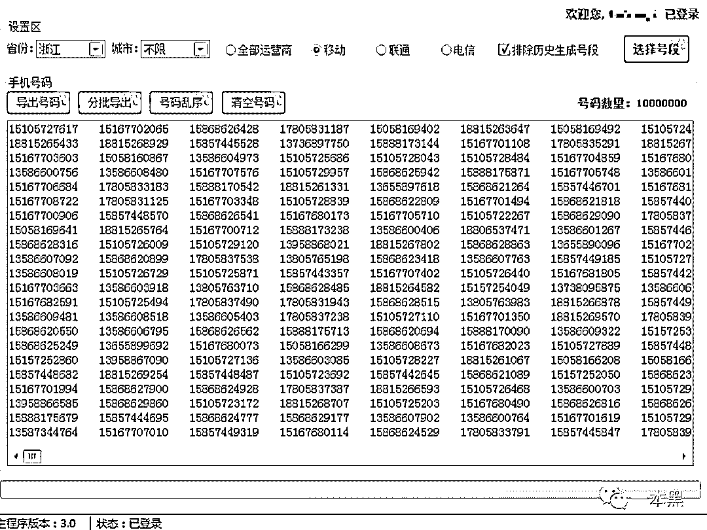
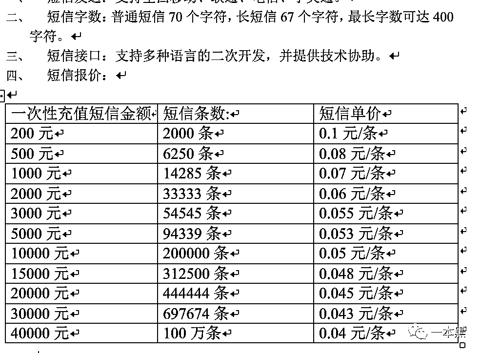
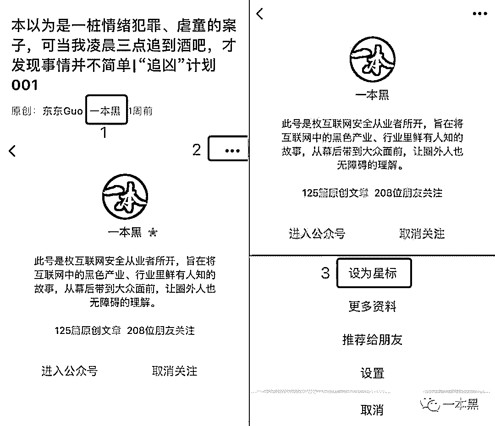

# 饕餮羊毛党，盛宴支付宝

> 原文：[`mp.weixin.qq.com/s?__biz=MzU4ODAwNzUwMQ==&mid=2247484842&idx=1&sn=89ef57b90e51842c6416a3a5eb9033db&chksm=fde21488ca959d9e58a81ad28e7854a784f7ec8539fc992f4da733e90c54348d7d4dfdc344a4&scene=27#wechat_redirect`](http://mp.weixin.qq.com/s?__biz=MzU4ODAwNzUwMQ==&mid=2247484842&idx=1&sn=89ef57b90e51842c6416a3a5eb9033db&chksm=fde21488ca959d9e58a81ad28e7854a784f7ec8539fc992f4da733e90c54348d7d4dfdc344a4&scene=27#wechat_redirect)

从当年除夕夜的集五福到如今的 15 亿瓜分活动，支付宝的浩荡声势卷起层层巨浪，在势必要扛起移动支付这杆大旗的同时，也迫使各种散户和“羊毛党”接踵而至。

在这场千军万马参与的饕餮盛宴中，有人用小米加步枪，有人用飞机和大炮......

文 | 老黑

大家好，我是老黑。

昨晚和老师傅喝酒，无意间说起最近支付宝推出的**“12 月瓜分 15 亿”**的活动，回顾以往，曾经的集五福、去年的瓜分 10 亿，到现在瓜分 15 亿。

一出手就是上 10 亿的支出，支付宝可以说是财大气粗，相当阔气。

但活动一出，很多人的手机就出现了关于支付宝的短信轰炸，就连朋友圈都是红包消息的刷屏。

就活动本身来说确实是做到了惠民，大家不但可以自己领红包还可以分享给别人，一旦分享出去的红包被领取，自己还可以获得“赏金”，何乐而不为呢！

不过但凡是有肉吃的地方就一定会有豺狼或是蚊虫之类的物种，更何况是支付宝这种动辄上十亿的活动。

于是“各大门派”收拾着装陆续赶往“光明顶”，途中当然还有各路不知名的虾兵蟹将，他们有的驾马而去，有的只能徒步而行；有人顺路欺诈混吃混喝，有人偷奸耍滑，不胜其烦......

今天，我们就来讲一讲“驾马而去”的**“羊毛党”**和那些“徒步而行”的**散户们**，是怎样参与支付宝这场浩浩荡荡的盛宴的。

**01 ****脑洞大开的散户们**

我相信你最近一定收到过一些类似支付宝的推广短信，或者朋友圈一定有人发一些搜索数字领红包的消息。

除此之外，沉睡许久的群，**常年不联系的僵尸好友也陆续给你发来骚扰信息。**

熟悉支付宝红包玩法的人当然知道，只要在支付宝里搜索一串数字，就可以得到大小不等的红包。假如红包再分享出去，一旦有人成功领取，你还可以得到部分赏金。

正是在这样的赏金激励下，越来越多的人开始加入进来，靠着分享赚取赏金，红包领的人越多，得到的赏金当然也就越多。

所以我最近经常收到一些很久不联系的僵尸好友发来消息，“搜索 98XXX 领大红包，领到的花呗红包可以找我兑换微信红包，领多少兑多少”。

除了给好友群发消息，还有不少人整天刷屏朋友圈，仅仅是为了推广自己的“红包”。

这可能就是前面提到的只能“徒步”的散户们，他们通过在自己的社交账号上发布推广消息，以此来吸引好友。

不过这种小米加步枪的战术确实是笨拙了些，不但频繁地打扰到别人，得到的效果还不尽如人意。

俗话说背靠大树好乘凉，也有一些稍微聪明的人，他们知道自己的传播能力有限，于是想到了伪造微博大 V 发红包的形式。

各位都知道前段时间王思聪为庆祝 IG 夺冠，在微博抽奖送出上百万元。所以有人伪造了一张王思聪发福利的微博截图，声称只要支付宝搜索一串数字，就可以领取。

虽说王思聪也确实发过类似福利，但是能想出这种方法推广自己红包的也算是人才一个。

不仅如此，还有人结合最近华为的热点 P 了一张 Twitter 上的图。

翻译过来的意思是“华为 CFO 孟晚舟今日于美国被捕，打开支付宝搜索这串数字，我可以考虑将其释放。”

**更让人啼笑皆非的是，账号信息居然是普朗特。**

？？？

虽说明眼人看上去就知道是恶搞，但较真的我还是忍不住翻开了普朗特的主页。

不得不说，**这届网友是真的脑洞大开。**

除了这类背靠大树伪造出来的图片外，还有人在微信里编造各种各样的故事，诱导人们去支付宝搜索那串“神秘”数字。

最出名的当属阿里巴巴女青年年薪 50 万，杭州两套房的故事。（说实话，真羡慕）

****

**（有这等好事？）**

不得不说，支付宝的这次活动着实炸出了一批编故事高手，我想恐怕连知乎都得甘拜下风。

**编故事不是目的，诱导你去搜索那串数字才是目的。**

如果你觉得这些“散户”们的小米加步枪已经足够优秀了，那你可能就错了。因为还有一群人操作着飞机和大炮，他们不像朋友圈刷屏或者群发的散户们一样小打小闹，也不会挖空心思 P 图诱导。

他们要做的是批量、强制性地给尽可能多的人发送口令短信。

**他们强调效率、强调躺赚。**

**02 ****耍尽手段的羊毛党**

同样是瓜分红包活动，去年 11 月，支付宝推出 10 亿元瓜分红包的活动，主要针对小商家。玩法是用户在线下付款，扫描商家推荐的二维码即可领取红包，用户使用后商家还可以获得相等的赏金。

玩过的人都知道，虽然每次只有几毛钱，但正是这几毛钱的收益也被羊毛党给盯上了。

网上流传的一张截图显示，竟然有人在短时间内就狂赚 137.8 万元，还有的赚了 52.5 万，并且显示还有 10 万多个红包还在路上。

这到底是什么样的一种玩法，居然能在这么短的时间收获这么大额的赏金。

后来，老师傅告诉我，**这些人是专业的羊毛党**，他们利用支付宝的红包赏金规则，**找人大批量发送营销短信传播自己的口令**，这样一来简直就是躺着就把钱给挣了。

高，实在是高。

****

**（这种短信你一定收到过）**

那又是谁能做到大批量的发送营销短信呢？**老师傅点了一根烟说：“****这你都不知道，当然是短信平台啊。”**

原来，短信平台可以提供群发指定信息的服务，包括支付宝红包的口令，只要生成相关支付宝红包的短信口令，就可以群发给指定号段的手机用户。

短信平台有两种，一种是要下载安装到本地的软件版，一种是通过浏览器登录的网页版。

应用领域那就多了去了，从医院体检报告信息的发送、到房产领域的楼盘宣传，也就是说你平时收到的各种骚扰短信，基本都是由商家对接短信平台进行发送的。

**说到短信平台，不得不说的当属金融领域。**

那时候风靡的现金贷，几乎没有不使用短信平台进行营销的，短信营销可以说是他们获客的一个重要渠道。

少则三四千，多则大几千万，你能想象一天上千万的营销短信分发到用户的手机上是个什么样的壮观，虽说是虚拟了一点，但这在短信营销行业可以说是一段辉煌往事。

可能有人会说，这些搞短信营销的是怎么知道用户的手机号的？

恰巧我知道一种手机号码生成器，这种软件可以按省份、城市和手机号段批量生成三网手机号，生成 1000 万个号码只需要 6 秒。

另外，你现在随便注册个什么平台不都得使用手机号来接受验证码吗，比如你注册一个赌博网站的账号，他们会进行信息收集，最终形成一个数据库。

不仅自己可以给你发送营销短信，还可以把这些数据卖给别的赌博网站。

**一颗韭菜不薅个几遍都不配说自己行业里的人。**

其实短信营销是个挺大的行业，这里简单提一下。

好了，回到主题。

以群发短信的需求询问了某个短信平台后，对方给我发来了报价表。

看到这张报价报我才恍然大悟，原来平时收到的领红包口令是羊毛党发出来的，从中能看出**短信条数在 100 万条的价格仅仅只需要四分钱。**

一百万条短信就算只有百分之十的人去搜索了口令，满打满算也一点都不亏，相比散户们的小打小闹，这些羊毛党就显得专业多了。

**03** **挥霍 15 亿用意何在？**

支付宝这种领红包反赏金的活动不是第一次了，可能有人会说，现在谁不知道支付宝，难道还有做广告的必要吗？

当然有必要，现在都在谈用户下沉，拼多多就是其中玩得最溜的，各企业通过“下沉”尝到甜头后，纷纷转移战场，不难看出，支付宝也是如此。

所谓的用户下沉，就是企业为了带来更多的新用户，必须从满足一二线城市用户的需求扩展到三四线城市，甚至是农村用户的需求。

说人话就是，**一二线城市的韭菜割得差不多了，大家得跑到三四线去，没准农村的还长得更茂盛。**

所以，支付宝还是为了扩展三四五六线城市的市场。除此之外，因为有些大的红包需要开通花呗才能使用，不难看出支付宝推广红包的活动不仅仅是为了扩展市场，还为了培养用户的消费习惯。

但活动一出，很多人的手机就出现了关于支付宝的短信轰炸，就连朋友圈都是红包消息的刷屏。

羊毛党为了薅到更多的羊毛，也是费尽了心思，耍尽了手段。

但是不管你是散户还是羊毛党，其实对支付宝来说只是挠了个痒痒。

**THE END**

**不过，在这场调动了上亿网民的活动中，没有千军万马的饕餮，必然也不会有这场宏大的盛宴。**

【最近微信改版，为了能够第一时间看到我们的最新内容，大家可以把一本黑设为星标】

**可按以下步骤操作：**

还原事实｜专扒黑产

微信 ID：darkinsider

知乎 一本黑

头条 一本黑

投稿、爆料、招聘、转载

请联系微信:yibenheiTG

# 

> 原文：[`mp.weixin.qq.com/s?__biz=MzU4ODAwNzUwMQ==&mid=2247484835&idx=1&sn=aa2252d1d556b64a09f1939e31c3b72a&chksm=fde21481ca959d9715162fd7a1e8fae5a6b234fe859407c7b895c458561e89cf50da4e47e92a&scene=27#wechat_redirect`](http://mp.weixin.qq.com/s?__biz=MzU4ODAwNzUwMQ==&mid=2247484835&idx=1&sn=aa2252d1d556b64a09f1939e31c3b72a&chksm=fde21481ca959d9715162fd7a1e8fae5a6b234fe859407c7b895c458561e89cf50da4e47e92a&scene=27#wechat_redirect)