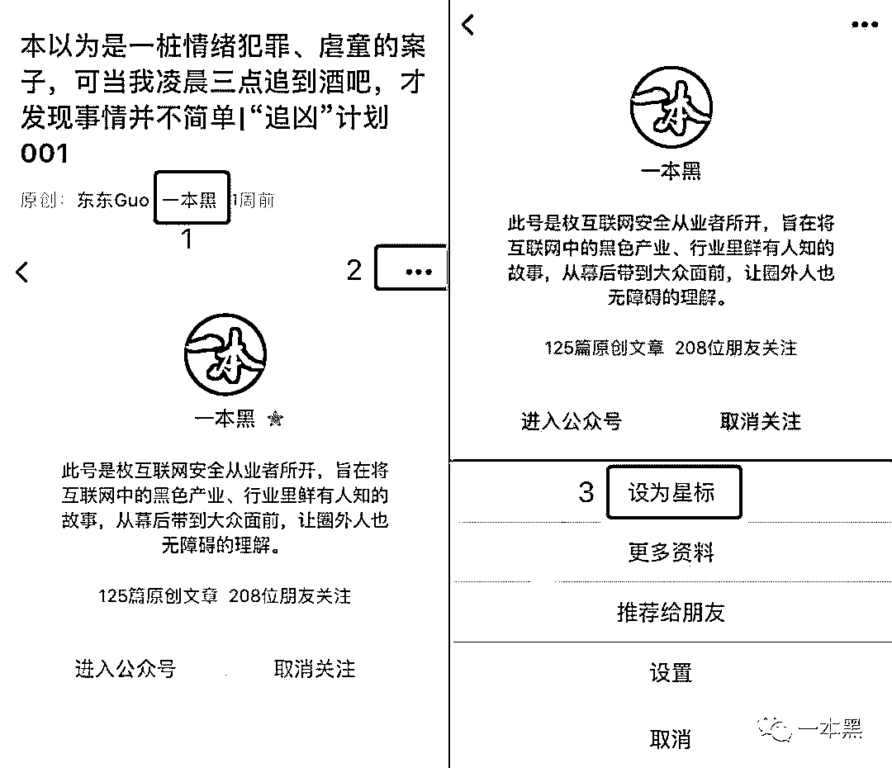

# 早起打卡赚钱？平台跑路，公司蒸发，23 万贷款谁来偿还？

> 原文：[`mp.weixin.qq.com/s?__biz=MzU4ODAwNzUwMQ==&mid=2247484767&idx=1&sn=8f67911df57d0bd281629b494f2e7dcf&chksm=fde2147dca959d6bcf419cfe5eccb5946d418c2e2fc9ca2d16e09b3ee1ce6cd4d05414f258b5&scene=27#wechat_redirect`](http://mp.weixin.qq.com/s?__biz=MzU4ODAwNzUwMQ==&mid=2247484767&idx=1&sn=8f67911df57d0bd281629b494f2e7dcf&chksm=fde2147dca959d6bcf419cfe5eccb5946d418c2e2fc9ca2d16e09b3ee1ce6cd4d05414f258b5&scene=27#wechat_redirect)

早起打卡、积极锻炼、管理碎片时间，你活得这么努力，生活却随手把你丢给骗子。

打卡赚钱的初衷，是以金钱方式激励用户培养良好习惯，做到自觉、自律。从微信群，到 QQ 运动和微博早起打卡，打卡活动总能吸引很多人参与。

一元投入即可参与挑战，打卡成功钱自动返还至账户，打卡失败则被他人瓜分。

打卡，很多人用它培养习惯，但无孔不入的骗子，把它变成赚钱的工具。

骗局的成功，不全是靠骗子的智慧，还有帮手的助力。

# 

**一**

有一天，你一直阅读的公众号发出这样一篇文章《最近抖音很火的早起打卡挑战，竟然很多人还不知道》，或者《早起打卡还能赚钱，你确定你能做到吗？》，这些公众号告诉你，自律不仅能带来自由，还能带来金钱。

              

大面积的广告投放帮助打卡赚钱平台快速获得种子用户。接着，利用邀请好友参与等营销手段快速进行粉丝“裂变”，平台在较短的时间内实现用户的快速增长。

打卡赚钱平台一般利用网赚自媒体、薅羊毛放单平台、微博大 V 等渠道进行推广拉新。这类公众号的受众对赚钱更加敏感，对各种网赚形式如数家珍。贪小便宜和薅一把羊毛就走的侥幸心理，让他们更容易进入骗局。

在打卡赚钱平台被盯上之后，这些公众号平台也纷纷删掉这些原本放在头条的文章，以示清白与无辜。用户很快就会忘记这些，毕竟互联网用户的记忆只有 7 秒。

就是在公众号上看到这样的推广软文之后，小琪交了钱。

从小琪的角度来看，打卡赚钱是一个薅羊毛的机会，也是一种投资方式，顺便还能帮助自己养成早睡早起的好习惯，一箭三雕。

与前面提到的微博早起打卡平台不同，在牛轩打卡平台上，最少需要存入 50 元挑战金，第二天早上 6 点—9 点在平台成功打卡，连续 5 天即可瓜分打卡失败用户的挑战金。存入的挑战金越多，能够瓜分的份额也就越大。

200 元投入，很快就能变成 202 元甚至更多。平台最多可以一次支付 10000 元参与打卡，而且后续还可以不断追加挑战金。远远高于余额宝等平台的收益，让更多人把这当作投资平台。

             

高收益，这也是互联网金融吸纳用户的主要方式。这些用户真的不知道自己的高收益从何而来吗？当然知道，他们只是心存侥幸，觉得自己能够在炸雷之前及时找到接盘侠。 

当然，最终结果是，投入越多损失也就越大。

# 

**二**

10 月 25 日，牛轩 App 打卡平台终止运营。用户联系不上平台人员，客服通道也持续关闭。投资者的投资金额共超过 500 万元，在平台经营者手里无法收回。

2018 年 10 月 25 号前，App 用户数量激增，19 号时曾发生服务器故障停机约 4 小时，后恢复正常，但快速提现通道关闭。

19 号-23 号，平台仅通过私人转账，选择性满足少部分用户低额度出账申请。24 号中午开始，平台客服通道间歇性关闭，25 号完全关闭，App 平台自 25 号实际无运作，所有用户均无法正常提现。

            

仔细分析，我们就会发现，该类打卡赚钱平台表面上的积极向上，以及投资的噱头，难掩其网络赌博的本质。

一群人，将金额不等的资金放入资金池，由平台按照准入资格进行资金的重新分配。

在一个封闭的系统内，用户无法与其他人联系，也就是说，用户不得不无条件相信平台提供的一切信息，包括今日可瓜的现金金额，目前平台用户数目等等。

以牛轩打卡平台为例：页面显示平台当前有 8026 人参与打卡挑战，7629 人成功，397 人失败。至于是否确实是 397 人失败，用户无法获得确切信息。

真实数据与平台出示的数据之间的差额就是平台盈利。平台数据显示有 397 人打卡失败，真实数字则可能是 500、600，甚至更多，这之间的差额就被平台吞入。

             

想想赌徒在网络博彩是怎样破产的？无规律的开奖，后台操控中奖号，赌徒处于必败之地。即便一个看似绝对公平的猜单双号，一旦有后台操控，用户也无法从中获利。打卡赚钱平台也是一样的道理。 

薅羊毛只能是赚钱方法，你见过薅羊毛还自带资金的吗？

# 

**三**

牛轩打卡平台的投入主要包括两个部分：前期的广告投入以及平台搭建。前期粉丝导入完成之后，后期投入几乎为 0，这是一个一本万利的生意。

在爆料者发来的受害者信息中，我们看到受害人范围遍及全国，包括贵溪本地人夏某某，受骗金额 14 万 7 千。

              

一开始，平台通过合理设置扣点比例，让用户尤其是早期用户能够从中得到一些甜头，以留住早期用户，并不断吸引新用户。用户越多，平台能够赚取的利润也就越多。 

按照平台说法，能瓜分多少奖励金需要看两个条件：1.当天未打卡金额；2.你所投入的金额。当天你的收入就是：未打卡金额/已打卡金额 X 自己的投入。

食髓知味，小琪一开始的投入很快就获得回报，他也开始尝试投入更多资金。据爆料人称，更有用户通过透支信用卡等方式贷款，共投入 23 万元。

渐渐地，平台会不断降低扣点比例，用户能够获得的收益也就越来越少。但是，大部分用户不会马上离开，他们会归因为运气，并且相信自己一定会时来运转。

在这一阶段，平台每日坐收巨额营利，他们是不会跑路的。

但是，利用微信生态进行推广，并依赖其支付，该类打卡平台难免要接受微信监管，而且活动页面很容易被微信以“诱导分享”为由被屏蔽。

这时，想要继续赚钱，平台就会选择不断更换名称，爆料者称：牛轩打卡首先利用公众号：牛轩电子产品 ；账号：niuxuan1234 ，10 月 19 号系统故障，该账号因用户举报被封。后新增公众号：“达飞商行” ，账号：niuxuan55 ，继续进行诈骗。

另外，牛轩也选择更换平台名称，从“牛轩”到“滕海”，再到“东方红”等等。利用多个企业服务号骗过微信后台，继续利用平台赚钱。

             

很快，牛轩打卡被微信平台屏蔽，网页无法登陆，提现失败，引起用户的质疑。此时的用户开始意识到这是个骗局，试图维权。 

但有一些旧用户不甘心投入作废，甚至在贴吧中提出不要举报平台，因为一旦举报平台，平台中止，他们的钱就再也拿不到了。

因为涉嫌金额过大，以及平台涉嫌网络赌博的性质，该类平台在后期也很可能被监管部门拿掉。这时，平台就很可能被迫自动跑路，用户们投入的钱也就真的拿不回来了。

牛轩打卡的幕后公司到底是谁也一直是个问号。从贴吧用户公开的信息来看，牛轩打卡的收款账户也不断变动。唐河县瑞成农业科技有限公司和汗牛轩电子产品销售中心，也是风马牛不相及的两家公司。其中汗牛轩电子产品销售中心这家公司目前显示已注销。

同时也有网友反映，牛轩打卡的客服说他们是位于深圳的一家科技公司。

             

# 

**四**

正如受害者所言， 不需要什么公司，他就弄一个微信端接口，去网上买几个收款账户，然后坐等鱼上钩就好了。

当下，该平台已经停止。受害者想要拿回自己的损失，但事实上的可能性不大。

我们试图找老师傅碰碰运气。

晚上 12 点，老师傅发来消息，这个团伙不简单啊。

             

时间有限，团伙反侦察意识很强，该域名并未解析到服务器，但跟踪服务器域名记录，老师傅发现该团伙的业务不仅有打卡赚钱，网络博彩、压涨跌等网络诈骗业务也均有涉及。 

为什么类似的骗局屡屡得逞？

在打卡赚钱平台上，有的人亏了 7 万之多，在最高一次支付一万元的平台上，很难说他的损失跟自己的贪婪无关。

直到今天，更换过无数次名字的平台仍在运营，仍有无数新用户加入。

太阳底下没有新鲜事，即便知道所有骗子的套路，还是会有人陷入骗局。

因为工作需要，我加了几个维权群。

虽然名为维权，但一开始的义愤填膺一过，群里讨论最多的仍然是怎样赚钱。

在这些 QQ 群里，同样的骗局持续出现。一样的噱头，甚至一样的手段，但经历过骗局的人并不从中吸取教训。

              

是不是很眼熟？

一样是从注册送钱吸引用户，一样是多投多赚。尽管在最后还要提醒你一句， 不要投入自己的钱，但真的能忍得住？

仍然有人询问，怎样加入？从哪登陆？下一次被骗已然在望。

总有人觉得自己能够全身而退，以为总会有后来者给自己接盘。骗局的成功，是骗子和我们的合谋。骗子是有意设局，我们也难以用无意的借口为自己推脱。

下一次，当有人说有一个赚钱的机会的时候，不妨想清楚，你们能赚到的钱到底是谁的。

【**最近微信改版，为了能够第一时间看到我们的最新内容，大家可以把一本黑****设为星标**】

**可按以下步骤操作：**

还原事实｜专扒黑产

微信 ID：darkinsider

知乎 一本黑

头条 一本黑

投稿、爆料、招聘、转载

请联系微信:yibenheiTG

另外，老师傅今日送福利，10 张 Freebuf  FIT2019 互联网安全创新大会”门票。 

大家通过本篇文章底部评论即可参与送票活动，我们将从中随机抽选 10 名小伙伴送票，坐标上海的优先。