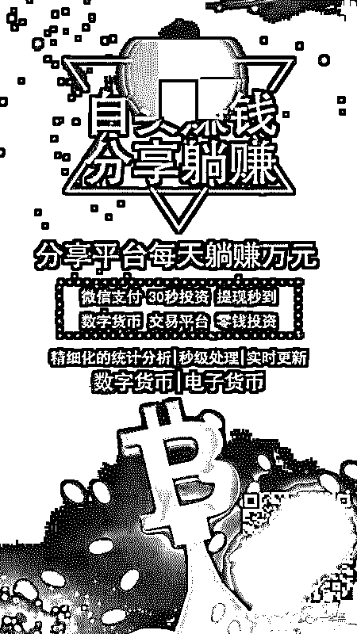
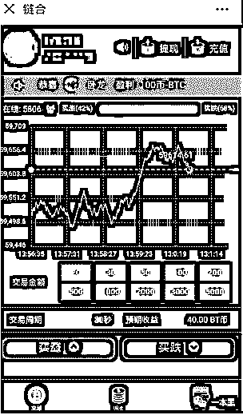
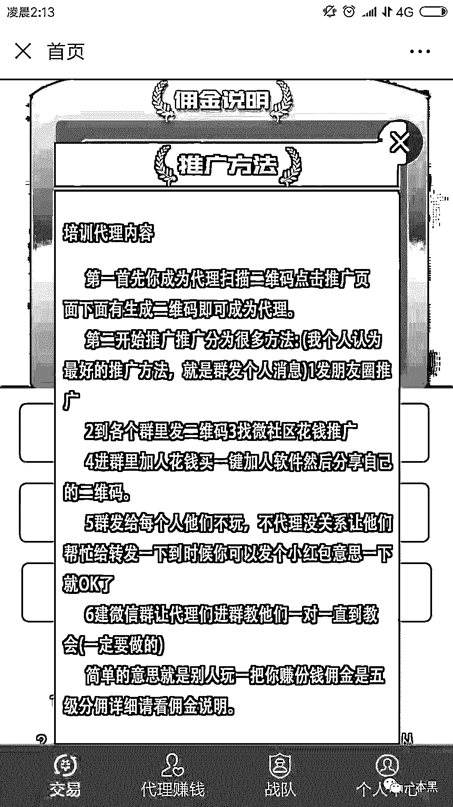
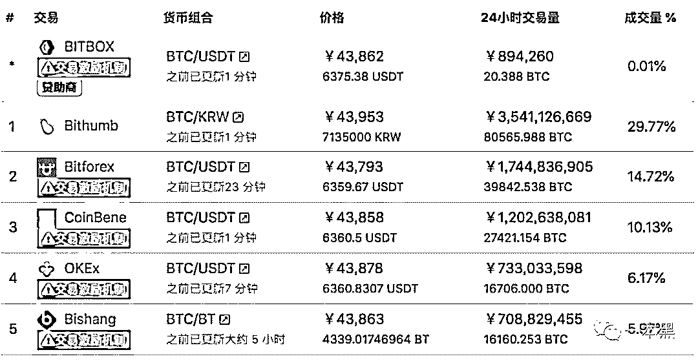
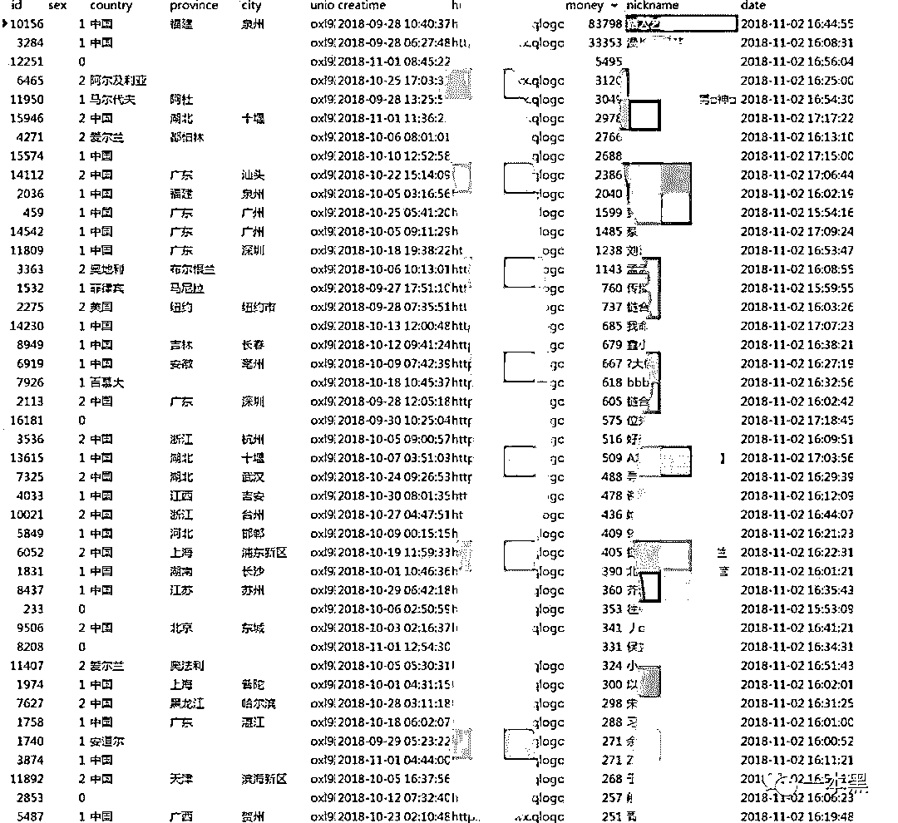
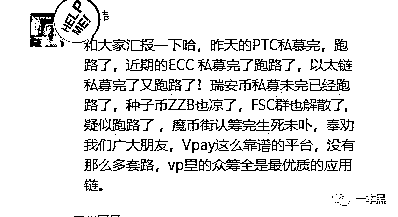

# 30 秒，从身家千万到一无所有，一个月内，16 万人陷入这场赌局

> 原文：[`mp.weixin.qq.com/s?__biz=MzU4ODAwNzUwMQ==&mid=2247484755&idx=1&sn=02eac40c89f146a690c45a1342a09026&chksm=fde21471ca959d6740472a30e87fcaaa1931cf81b32227713850b72ab71d7aaa826ab7166dcb&scene=27#wechat_redirect`](http://mp.weixin.qq.com/s?__biz=MzU4ODAwNzUwMQ==&mid=2247484755&idx=1&sn=02eac40c89f146a690c45a1342a09026&chksm=fde21471ca959d6740472a30e87fcaaa1931cf81b32227713850b72ab71d7aaa826ab7166dcb&scene=27#wechat_redirect)

有些人，尽管穷，但绝不满足于仅仅把钱放在余额宝里。

一大批非专业理财专家告诉我们，复利，让钱生钱，才是我们走上人生巅峰的途径。

股票、基金、期货，投资理财产品蜂拥而至。随着移动互联网的普及，我们在手机端就能轻松理财，但 P2P 频繁炸雷，让深处其中的我们难辨真假。

而更有一些产品，更加简单，利润更高，却更像是一个披着投资外衣的骗局，成为埋藏在我们身边的地雷。

一切要从点开朋友圈的一张图片开始说起。

     

扫描二维码，就进入了一个类似股票交易的页面。

在这场交易中，每一笔都是小额交易，但积少成多，损失上千万的不乏其人。平台圈钱成功后便金蝉脱壳，销声匿迹。

玩法简单，确定好交易⾦额，选择买涨买跌后下单即可。以买⼊时的价格为基数， 如 30 秒以后的价格⾼于这个基数， 那么买涨则赢， 反之 30 秒后低于这个基数， 买跌则赢。

平台告诉你，他们可以透过技术分析，基本面、走势图分析让你的胜率从 50%上升到 70%，甚至更高。

     

⽆论是充值还是提现， 用户都可以直接在微信⾥通过微信支付轻松完成。⼊⼝⽅便， 该平台拿到⼀堆企业认证公众号， 并使⽤这些公众号作为⼊⼝。

这与微交易在本质上并无区别。

根据互动百科：微交易是指，预测标的资产未来行情的走向，只需看涨或看跌的方向，无需考虑涨跌的幅度，在规定的时间内(1 分钟、5 分钟、 15 分钟等），根据收盘价格高于或低于入场价格的结果，来决定是否获得收益。

# 

**一**

从 2014 年开始，微交易这一形式，以投资的面目出现，简单的操作方式和规则，使其迅速推广开来。在微交易市场中，可供交易的资产众多，从传统的各类期货，到新近流行的电子货币都有涉及。

微交易平台制作成本低廉，技术门槛更低，一个相关专业的在校大学生就能轻松完成。在网络上键入关键词，也会有很多专业的平台搭建公司页面信息弹出。

平台搭建成功之后，你有两种选择：1.自己招业务员开展业务，发展客户；2.开后台给代理商，代理商发展客户，在平台下单，平台从中抽成。

平台质量影响很大，最重要的是充值通道。

一个微交易平台普遍有 2 个以上的充值通道。我们日常使用的线上支付渠道：支付宝、微信、银联、信用卡、还有其他不知名的支付平台（乐付宝，快支付等）都可以接通，不过某些渠道会有额度限制，如微信就限额 20 万。

如果客户认为平台质量不行，充值慢，那就会影响后续下单。平台质量够好，而且佣金够高，那很多人是愿意去做平台代理的。

**然而，无论是自己做还是代理公司，找到客户才是重中之重。**

这个过程就是一个“我在社交软件上，用一张假图骗了 5000 个男人”的故事。同样的套路，把微信号伪装成美女，成功人士，在各种群，或者通过微信功能“附近的人”找人聊天，吸引别人投资。

微信号上的假信息一般都是从其他网络平台上复制，也可能就是其他小号的微信好友，甚至有时就是客户，反正只要不认识，都能拿来用。

随着严打，也因为低效，这种获客方式逐渐被弃用。微交易平台转而通过在手机端浏览器、今日头条等平台投放广告，以及使用微博粉丝通，达到“吸粉”的目的。在手机端，打开相关 App，你都可能会收到这样的推广内容。

这一方式所费不资，1 万起投，有些客户一天广告花费就达数十万，平均下来，获客一个大概需要 200 元。尽管如此，一个客户在平台上下单最少 800 元，这仍然是个只赚不赔的买卖。

还有一种就是利用客户吸引客户。平台使⽤直接返现的⽅式来⿎励客户推⼴，有返现的下线⽤户都可以关联到五级， 只要下线有在平台消费， ⽆论输赢都能获得赏⾦。

   

这种类型的资金流水很少，一个客户也就赚几百块钱，然后客户会吸引客户，但是这种基本上不太可能出现一次性下单几万的客户。

# 

**二**

然而，无论获客方式如何改变，业务员对这些平台都意义重大。

“不推广哪里来的客户？客户亏钱了要退出谁去跟进？几万几万的入金，客户又不傻。我的任务除了吸引客户投资，还要跟进客户，就是在客户想要退出的时候吸引他继续下单。”

针对客户在整个过程中的心态变化，业务员们早已练就一套滴水不漏的话术和应对措施。

一开始，客户小心翼翼，只愿意投入小笔资金试水。这时，业务员就会想方设法，吸引客户投入更多。

“你这么小的仓位，不好进行补单、你加大仓位，我带你稳赚。客户一开始充值 5000，我就会唆使他加大到 2 万仓位。客户可能会砍价，加到 1 万，或者直接充 2 万。”

在微交易中，操作是 30 秒一次，假如这一单买了之后，时间没到看着行情要亏，马上补一单，挽回损失，这就是补单。因此，业务员都会说，账户中钱越多越好，也就是仓位越大越好。

客户加大投资之后，亏了。

这时，业务员就会推荐投资助理号给客户，其实助理号背后还是业务员。投资助理直接上升到理论高度，“这是一个趋势变动的轮回期，你没有把握好时机，你再投入 3 万，一定能让你翻倍赚回来。”

又亏了，那就推给老师号。

老师号会开 VIP 学习群，一群十几个人，除了客户，其他都是业务员。VIP 群继续催促下单升仓，客户不信就吹技术给客户洗脑。

为什么亏钱之后，客户还会持续入仓？

赌博心理，还有业务员的从旁诱导。

做这行的都有很多小号、假号。很多微信号一起建群，一个群一百多人的，大概有 100 个都是假号。

有的伪装成成功人士，有的伪装成美女。

成功人士负责冷嘲热讽，在客户打算退出时敲边鼓。内容无外是：没胆量是赚不到钱的，像你这种人，有钱都不会捡，到老都发不了财。

美女则负责温柔陷阱，跟客户培养感情，让他信任，诱使他不断下单入仓。

双重夹击下，很少有客户能够成功退出。

# 

**三**

“我们业务员操作久了，也有点感觉能摸个大概，带新客户第一次做单都会尽量带赚，但是我做了这么久，也有客户第一把就亏，然后就撤了，觉得就是赌博。”

如果 k 线（微交易平台趋势图上的曲线，因于股票蜡烛线类似而得名）同国际大盘走势一致，没有人为操作的话，这确实是可以预测的。但是，统计学知识告诉我们，在胜率为 50%的赌博活动中，赌资大小决定胜率，也就是说你永远不可能从庄家手中赚到钱。

而这个走势是可以后台控制的，那我们的胜率简直低到尘埃里。

在微交易平台的交易界面上，平台往往声称自己的交易资产跟国际市场价格波动⼀致， 如果不一致， 平台是不可能在微信官⽅认证公众号运营的，平台是有正规资质才能在微信公众号进行运营。

然而，果真如此吗？

⽬前国内外的 btc 交易平台， 价格不过是 43k 左右， 但是该平台上， 价格⼀直在 59k 左右浮动， 完全和国际市场价格不符。

     

该平台还会使⽤程序分析⽤户买涨跌的⽐例，由他们⾃⼰的程序控制显⽰价格， 保证平台能够賺钱。

不同等级的业务员权限不同，总监权限很高，改 k 线，拒绝出金，封号都能操作。记住，这就是一个他们一手搭建的现金池，而且，只进不出。

该平台声称平台是有正规资质才能在公众号运营的，也是完全的瞎扯。

我们决定请出老师傅出山。

经过对平台⼀些⼊⼝⽅式的简单分析，一根烟还没抽完，老师傅就发现了其中的猫腻。

很简单，之所以平台能够利用微信平台进行交易，没有其他原因，唯多而已。通过非法手段，注册多个企业认证的微信账号，注册使用多个域名，绕过微信平台监测，掩盖自己的违法行径。

不仅如此，平台还会使用多家公司信息进行支付交易，这样才能在遭到客户投诉后，持续不断地开展业务。

前面已经说过，这类平台技术门槛很低，安全方面的防护几乎为 0，老师傅轻松扒出后台数据。

**平台总⽤户量: 165488****，****第⼀位⽤户注册时间: 2018-09-27 17:51****，****总充值⾦额: 6562574****元。**（数据截⾄ 2018-11-02 17:00）

     

在不到一个半月的时间里，平台用户已经达到 16 万之多，而总计充值金额更是高达 650 万。

# 

**四**

即便你真的足够幸运，在这样的情况下都赚到了钱，能不能拿到手也不由你说了算。

后台限制出金，如果提款金额过大，你就可能会被封号，根本拿不到钱。

微交易还有新变种，不是买涨或买跌，而是选择用现价定购还是结算价定购产品。

但本质都一样。用现价定购，也就是预测短时间内会上涨；用结算价定购也就是预测下跌。当你打算抛出手中产品的时候，你就需要向平台提供 10%的手续费，被薅一波羊毛。同样被薅的还有大概 1%的仓储费。

鉴于平台搭建简单快捷，在一个平台上圈钱成功之后，换个平台，同样的套路继续进行，平台跑路的现象十分常见。

“2016 年的时候，我们老板花重金挖过一个团队。他们的一个客户，投了 4000 万在里面，拿到 4000 万之后，他们立马就跑路了。”

骗子的套路从来如此，却屡屡得逞。你的钱永远不知道会面临什么样的危险。几乎所有人都在惦记你口袋里的那点钱。有时候，真的是全靠贫穷保护了你。

在爆料人邀我进入的群里，洗脑的一大套路就是，利用别的平台的失败，来证明尚未死亡的自己的必然成功。

     

这些地雷，在炸开之前，每个人都以为不会落在自己头上。

【**最近微信改版，为了能够第一时间看到我们的最新内容，大家可以把一本黑****设为星标**】

**可按以下步骤操作：**

还原事实｜专扒黑产

微信 ID：darkinsider

知乎 一本黑

头条 一本黑

投稿、爆料、招聘、转载

请联系微信:yibenheiTG