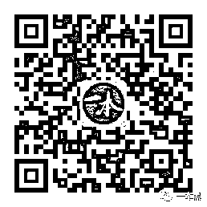

# 太阳照常升起？

> 原文：[`mp.weixin.qq.com/s?__biz=MzU4ODAwNzUwMQ==&mid=2247484740&idx=1&sn=92c30263ace7a8a75b82942e1210d612&chksm=fde21466ca959d70ec6d38116300b70f535057e6f805cf59e6d7029c812eb571b817a9309c64&scene=27#wechat_redirect`](http://mp.weixin.qq.com/s?__biz=MzU4ODAwNzUwMQ==&mid=2247484740&idx=1&sn=92c30263ace7a8a75b82942e1210d612&chksm=fde21466ca959d70ec6d38116300b70f535057e6f805cf59e6d7029c812eb571b817a9309c64&scene=27#wechat_redirect)

十一月不只是入冬，还是一本黑诞生的第二十个月。

在自媒体这个圈子里，相比各领域百万、千万用户的大号，一本黑只能算得上小众，我不敢说它小而美，但起码它独一无二。

它做了别人不敢做的事。

如今，以公众号为阵地的自媒体算是到了洗牌阶段，要想在某条赛道上冲出去，恐怕是难上加难。

抖音、王者荣耀、吃鸡等短视频平台和热门手游的出现，更是转移了一大波互联网用户的注意力。

如果细心就能发现，从博客时代到公众号，再到短视频，着实称得上是互联网用户的大迁徙。

各方压力与焦虑迫使不少自媒体人想方设法挽留用户，于是也就出现了标题党、博眼球等众多垃圾内容。

封号警告固然是避免不了的，但被推倒、再重来可不是一件容易事。

一直很欣赏打假狂人徐晓冬这类人物，觉得他们心里有一种天生的使命感，就是让那些说假话、做表名功夫的人原形毕露。

这类人往往势单力薄，但凭着心中热血，誓必要掀开行业里一些丑恶嘴脸的决心简直让人振奋。

每每看到这种人物的出现，我都会觉得真他妈的爷们，过瘾。可现实也许大多不会如意，轻则威胁警告，重则封杀除名。

但即便如此，我还是会觉得这种人挺有种的，至少他敢做、敢为。

其实，一本黑成立至今，无非就是揭露了大大小小的灰黑产，讲了一些行业里见不得光的故事，让不少读者朋友看清了当今互联网的某些黑暗角落，仅此而已。

之所以做一本黑，只是单纯觉得这事儿挺好玩，没事和老师傅喝喝酒、撸撸串，开车绕着整座城市帮人查线索。

要是有一天我和老师傅都觉得这事儿没劲了，估计那时候一本黑就不会再更新了，毕竟不管做什么都得开心不是。

很喜欢《百年孤独》里的一句话：“多年以后，面对行刑队，奥雷里亚诺·布恩迪亚上校将会回想起父亲带他去见识冰块的那个遥远的下午。 ”

要我说，多年以后，对面一本黑，我将会回想起我和老师傅“追凶”的那个快意夜晚，有烟、有啤酒，还有年轻时候的热血。

给大家解释一下昨天的文字推送，因为近期上千万的自媒体账号被封，考虑到一本黑的内容调性，为了以防万一，**我们临时准备了一个新号**。

因为是新号，加上昨天短时间的大量关注，现在已经搜索不到，过几天应该就会恢复正常。

还没关注的扫码下方二维码即可关注，新号留作备用，可能不会更新什么内容，大家默默关注就好。

**防走丢，扫描下方二维码即可关注**

昨天的文字推送发出去以后，很多人都问我们是不是被人黑了，是不是发了什么敏感内容被封了。

还有人今天发消息过来问我们等到今天的太阳了吗？

我想说的是，我们没有等到今天的太阳。

因为今天是阴天......

还原事实｜专扒黑产

微信 ID：darkinsider

知乎 一本黑

头条 一本黑

投稿、爆料、招聘、转载

请联系微信:yibenheiTG

最后，送大家一首歌......