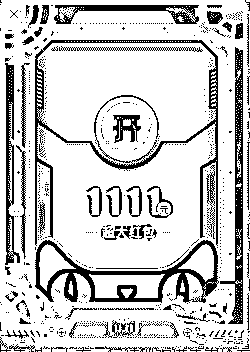
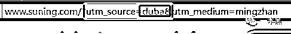
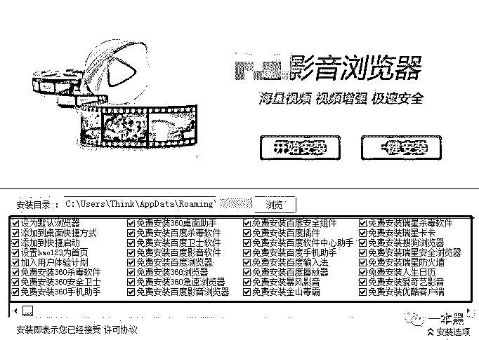

# 弹窗广告点不掉，捆绑操作套路骚，我看双十一就是流氓广告狂欢节

> 原文：[`mp.weixin.qq.com/s?__biz=MzU4ODAwNzUwMQ==&mid=2247484720&idx=1&sn=f5c49facf327b2fb1f5c52beef7eb53f&chksm=fde21412ca959d042004c2bb2df1348311ba59456fe68c269d3682ca3490dcfe6d24ebe52345&scene=27#wechat_redirect`](http://mp.weixin.qq.com/s?__biz=MzU4ODAwNzUwMQ==&mid=2247484720&idx=1&sn=f5c49facf327b2fb1f5c52beef7eb53f&chksm=fde21412ca959d042004c2bb2df1348311ba59456fe68c269d3682ca3490dcfe6d24ebe52345&scene=27#wechat_redirect)

知乎上有一个问题叫：**“最流氓的软件可以流氓到什么程度？”**

有人说：“很久以前装个软件只需要点‘下一步‘就好，现在装软件的过程已经能堪比‘扫雷‘游戏了，简直步步惊心。”

前几天，一哥们向我吐槽，家里来了几个小孩， 用过电脑后，电脑桌面出现一堆乱七八糟的捆绑软件。

“有些杀毒软件真的有毒，打着保护电脑的借口让你安装他的全家桶。”

这让我想起国庆回家时，发生在我家的一件事。

我妈说，家里新买的电脑出了问题，开个机要两三分钟，而且还特别卡。说罢，我妈还怪我买了一个质量有问题的电脑。

带着疑问，我打开了电脑。

刚进入桌面，电脑软件就开始互相掐架，各种弹窗争先恐后的弹出，这个认为这有毛病，那个认为那有毛病，让我尽快修复。

当将它们一一关闭后，我发现电脑桌面竟然有 3 个加速球...不仅如此，还同时安装了 366 安全卫士、腾腾管家、金金毒霸、鲁鲁大师、驱驱精灵等等……

这么多流氓软件，能不卡么？这时我妈走进来问我怎么样了，我告诉她是因为她安装了太多软件导致电脑延迟，但她说这些都不是她装的。

那只有可能是她在上网的过程中，不小心点到其它地方就默认下载了。

我和她说，以后电脑桌面上要有这么多软件，你就把它们都删了，留一个就好。她问我为什么。

我说：“流氓有一个就好了，你把一堆流氓放在一起，是想让他们互相干仗吗？”

像这样的捆绑式行为早已屡见不鲜，但又不能因为他耍流氓，就将他们全部卸载。总而言之，在上网的过程中，一不小心，就会被他们牵着鼻子走。

最流氓的软件可以流氓到什么程度？

我的答案是，找了一个它，来了它全家，打也打不走，骂也骂不走。

**1**

为什么捆绑软件像牛皮藓一样，一直无法打压？

正所谓羊毛出在羊身上，最本质的原因就出在用户的电脑上。在遇到自己想要的软件时，谁都会在网上找。

当然这些软件看起来都是免费的，但天下没有免费的午餐，他们拐弯抹角也得从用户身上赚点，于是就出现了弹窗广告和默认捆绑安装。

一位行业内朋友告诉我，软件捆绑牵扯最大的问题就是商家勾结赚钱和赚流量。国内最早的安装形式是预装，那时候大部分国人的电脑系统基本都是盗版的。

一开始为了方便用户，盗版系统的制作会预装一些实用软件，可是随着系统安装量越来越大，就衍生出了很多流氓软件的预装。

除此之外，软件捆绑还有两种方式，第一是广告主直接跟官方谈合作，将软件插在默认的官方安装包中，当用户在安装官方包时，会默认勾选其它软件。

其次就是走广告联盟的渠道。

国内软件下载站从广告联盟接单，然后在正常的软件安装包上封装一层安装包，当用户下载该软件后，会发现安装在电脑上的不止一个。

这就相当于你买了一颗西兰花，回家切开后却发现里面包裹着一颗白菜，更可气的是这颗白菜还他妈被猪拱过。

这些套路，小白用户是很难注意到的，等下载完后，才发现自己被“买一赠一”了。

不过这也不重要，对于这些流氓软件，大多数的用户都选择了视而不见。

**2**

这些当年频繁出现在 PC 端的小伎俩随着智能机的兴起开始肆意蔓延。

由于 IOS 系统难度太大，他们就将精力放在了安卓机上。

相对于 PC 端，移动端捆绑软件的门槛自然就高了许多。不过虽然移动端比 PC 端门槛高，但万变不离其中，它们的基本原理和电脑软件还是很相似的。

安卓装系统都是通过 Rom 的形式，一般走的商务合作，一台新手机会预装很多 App，第三方的就更不用说，各种杂牌 App 都有。

而且系统留了很多后门给这些 APP，例如提高 APP 系统权限，可以持续给用户弹广告、发推送，甚至窃取用户信息。

一有合作，二有“后门”，你说我想去你家干点啥那不轻而易举的事吗？

有一些线下的店，也会利用这个薅一波羊毛。比如说，你拿手机去一般的维修店刷系统，他除了收你的钱，还要收 Rom 渠道的钱。

也就是说，有些渠道公司，他们手里有很多广告主的单子，比如有 app 推广的、网页推广的，他们把这些单子都做到一个 ROM 里，然后找到这种刷 ROM 的线下实体店，告诉他们只要刷一个就给五块钱佣金。

这些渠道公司会把自己的单子揉在一起，一个 ROM 可以薅 20 块钱，五块一个让别人去刷，相当于纯赚 15 块。

可能有人会说，这些渠道公司是不是还得一家一家的去找这些能刷 ROM 的店合作。

是的，不过这就涉及到地推了。

地推虽然看起来很 LOW，但是很多人不知道，在中国，从来不缺地推公司，并且这些地推公司都是非常牛逼的。

经常听身边朋友抱怨，手机系统越来越卡，后来一看发现系统自动升级了，可人家压根就不想升级。

现在的手机设置里也有一个这样的选项，“在 WLAN 空闲时自动升级软件”，这对于正常的软件升级再方便不过，可那些流氓软件也可以这样做。

在系统权限足够高的情况下，它们甚至可以做到神不知鬼不觉安装更多的服务程序，这也就是行业所说的静默安装。

**3**

一年一度的双 11 马上就要到了，在这个时候往往都是有人花钱如流水，但也有人赚得盆满钵满。想必现在正有不少从业者蓄势待发、摩拳擦掌地准备着薅一把大羊毛了。

早在一个月前，各大平台就在为此次电商活动打起了广告。打开电脑，右下角随时都有可能跳出来一个双 11 红包等你领取。

            

以往，你可以选择关闭它。

但是最近这段特殊时间，你想要找到关闭按钮，难于上青天。

就算你找到，点击关闭或者不再显示弹窗，也还是没什么效果。

[`v.qq.com/iframe/preview.html?width=500&height=375&auto=0&vid=x13529vhpjl`](https://v.qq.com/iframe/preview.html?width=500&height=375&auto=0&vid=x13529vhpjl)

业内一位朋友告诉我，每年双 11 来临前，一些软件会给全国人民“种上”电商平台的 cookie，这种 cookie 有效期都有十几天。

这也就是近段时间你的电脑频繁出现关于双十一广告的原因。

这里的 cookie 可以把它当做是一个“指纹”，它可以识别你是通过什么渠道进行访问的，比如我电脑安装的金山毒霸，当我打开苏宁易购的网站时，这里显示 source=duba，也就说明金山毒霸参与了这次的推广活动。

            

等到双十一结束，电商平台会根据这个 cookie 结算佣金。业内数据显示，天猫的佣金是 3%-50%，京东的佣金在 2%-10%之间，不同品类所获得佣金也有所不同。

打个比方，你从 366 浏览器上点开京东，下单交易成功后 366 就能从中间拿到这个提成。

去年双十一天猫 1600 亿，假如说全国人民都下载了 366，又从 366 打开了天猫或者京东……可想而知那是多么大的一笔利润。

“种 cookie”也有竞争，新的 cookie 会把原来的刷新替换掉，最后从哪里下的单，这个佣金就从哪里拿。

综上来说，在双十一前，国内的这些流氓软件都会集体出动，想方设法给你的电脑刷屏。

可想而知这其中得有多大的利润。

永远不会忘记，多年前卸载 2345 浏览器的记忆。实在受不了它老是自动修改主页的操作，所以我决心将它删除。

卸载到最后一步，画面都出现了「卸载完成，期待下次与你相遇」的字样。

然后跳出了 2 个选项，一个「再见」一个「关闭」。我选择了「再见」，没想到，就真的“再见”了（把卸载的重新安装了一遍）…

**你还别说，这些陷阱玩起文字游戏来，那可是一套一套的。**

            （图片来源于网络）

有人说，将 366 安全卫士、瑞瑞杀毒、百百卫士、金金毒霸和腾腾管家装在同一个电脑上，以测试在同样的运行环境下，哪个软件最“流氓”，结果，最后发现是 XP 系统先崩溃了。

曾经看到过一个挺有意思的段子，已经追溯不到原作者，这里修改并引用作为文章的结尾。

> 银角大王将宝葫芦倒置，喊了一声：“周鸿伟。”
> 
> 周鸿伟应了一声，嗖地便被吸了进去。
> 
> 银角大王查看时，里面除了周鸿伟，还有 366 杀毒、366 压缩、366 浏览器、366 安全卫士、366 游戏大厅等熙熙攘攘一干人。
> 
> 银角大王惊讶道：“怎的来了这许多。”
> 
> 宝葫芦开口言道：“我就只点了个‘下一步’。”
> 
> 这时李彦红在旁边呵呵的笑，银角大王怒了，刚要将宝葫芦倒置，李彦红嗖的一声已经飞进了宝葫芦。
> 
> 银角大王查看时，除了李彦红，还有百渡贴吧，百渡外卖，百渡浏览器等等黑压压上万人。
> 
> 银角大王大惊道：“怎的比周鸿伟还多！”
> 
> 宝葫芦摇摇头说：“我什么都没点。”
> 
> 马化疼在边上乐得花枝乱颤
> 
> 银角大王扭头一看：嗯？你是马化疼？你也进来吧！
> 
> 银角大王查看，里面几百万青少年怀里抱着红黄蓝绿的小石头，在电脑手机上专心打游戏。就问：你们弄这么多石头做甚？
> 
> 青少年们答：你懂个屁，这是彩钻，花钱买的！
> 
> 到了晚上，宝葫芦自己叮叮当当响个不停，还飞来飞去。
> 
> 银角大王起来查看，发现周鸿伟、李彦红、马化疼在宝葫芦里打成一团，李彦红把周鸿伟和马化疼踩在脚下得意的笑到：现在这个葫芦我说了算！
> 
> 还不知道谁在什么时候把金三、优库也收了进来。
> 
> 银角大王捧着热的发烫的快爆的葫芦伤心的问：这葫芦是我的还是你们的？太嚣张了，还反了你们！
> 
> 这时候小妖跑进来，“报大王，洞口有人叫阵”，银角大王出门一看，有个眼镜男站在门口，只见他拿出个宝葫芦说道：
> 
> **“我是疼化马，我叫你一声，你敢答应吗？”……**

还原事实｜专扒黑产

微信 ID：darkinsider

知乎 一本黑

头条 一本黑

投稿、爆料、招聘、转载

请联系微信:yibenheiTG