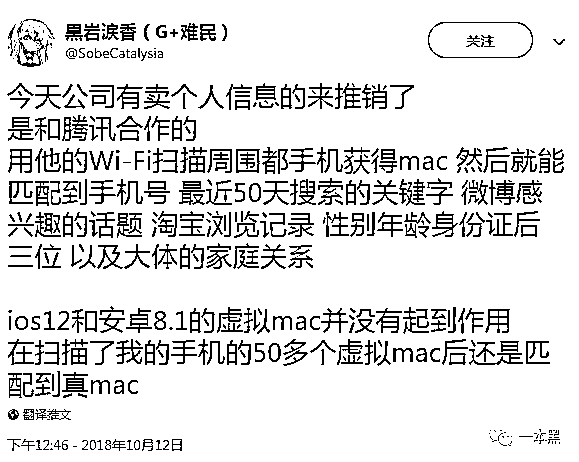
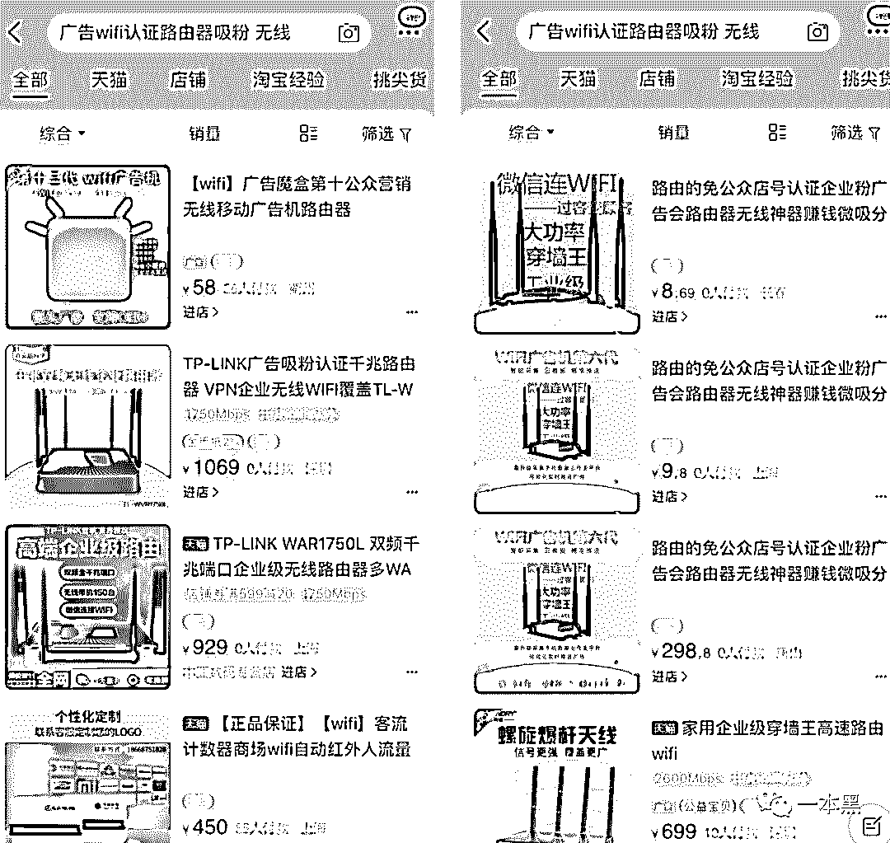
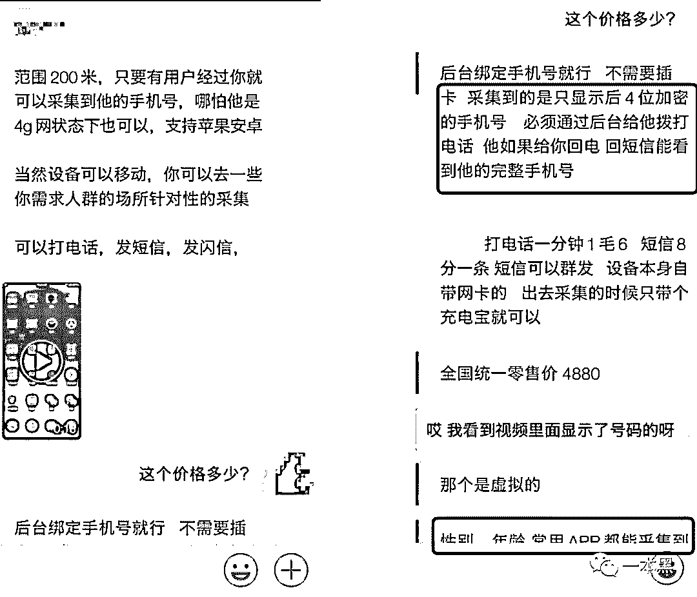
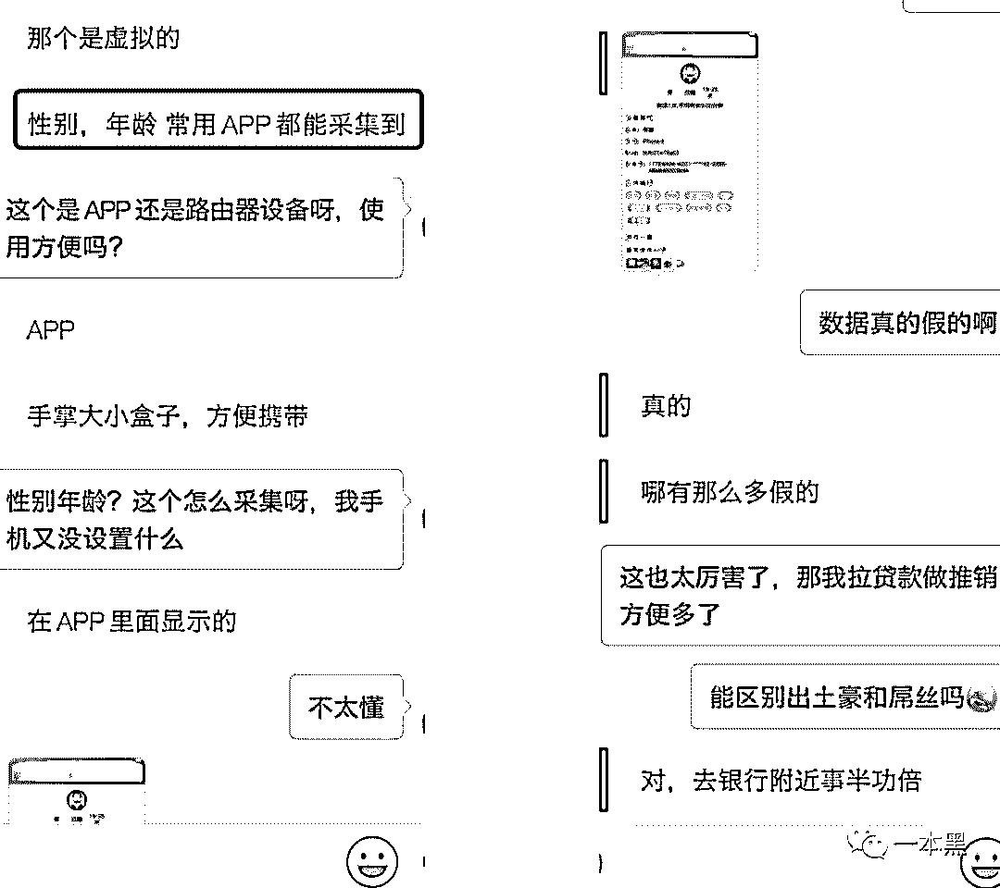
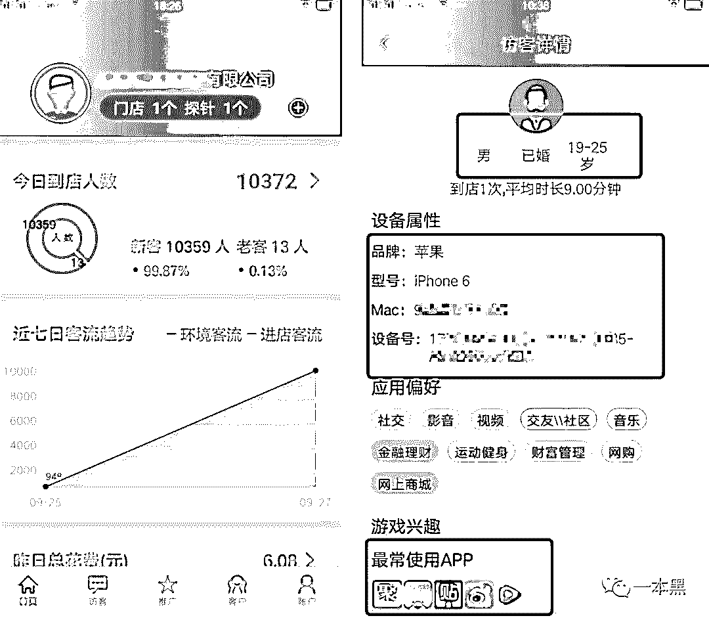
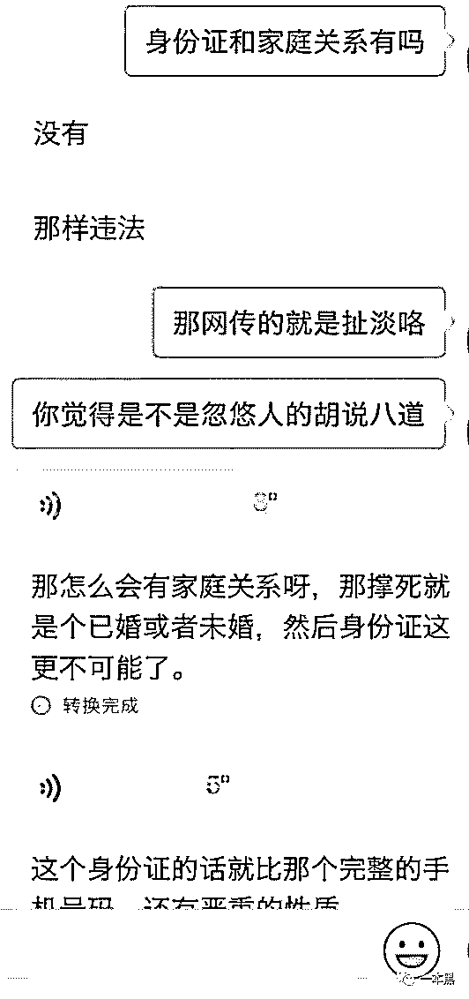
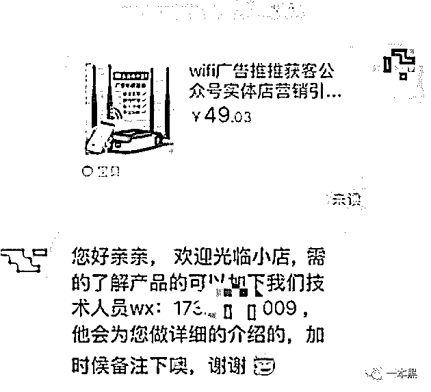

# WiFi 间谍？连上就暴露淘宝地址和身份证，果然互联网上，没有人是穿着衣服的

> 原文：[`mp.weixin.qq.com/s?__biz=MzU4ODAwNzUwMQ==&mid=2247484671&idx=1&sn=ad1b8411e0d444e1fdb5b7123e2180db&chksm=fde215ddca959ccb438c5ace083f44a57227936873093d6a32b70f857bdba159026f1f6d51da&scene=27#wechat_redirect`](http://mp.weixin.qq.com/s?__biz=MzU4ODAwNzUwMQ==&mid=2247484671&idx=1&sn=ad1b8411e0d444e1fdb5b7123e2180db&chksm=fde215ddca959ccb438c5ace083f44a57227936873093d6a32b70f857bdba159026f1f6d51da&scene=27#wechat_redirect)

昨天不是周五吗，所以约老师傅去了我们常去的一家烧烤店喝了几瓶啤酒，随便讨论了一下最近的股市情况。

期间有个好玩的事儿，我们发现有一个哥们肩上挎着个箱子，里面好像有几个路由器和几部手机，我第一反应是他是不是在搞什么测试或者是不是在做钓鱼。

总之有点懵我就问老师傅，这哥们在附近走了好几趟了，这是在干嘛呢！

老师傅下意识的说：“先看看手机信号有没有异常。”

随后又说：“应该问题不大，可能他是在做网络优化吧，伪基站应该不敢这么搞。”

因为当时正在聊别的事儿，所以就没过多在意，等散场后我不是打车回家吗，坐在车上翻手机，看着看着突然在推特上看到这样一条消息。

根据这条消息显示，有一种 WiFi 扫描能获得手机 Mac 地址，然后就能匹配手机号，还能记录手机 50 天搜索的关键词，微博感兴趣话题，淘宝记录，性别年龄等。

这倒是有点意思，感觉就像间谍一样，直觉告诉我这难道又是什么黑灰产吗？

我赶紧联系老师傅想问问他知不知道这是咋回事，结果好几个语音打过去都没人接，我估计老师傅应该是喝多了，这会正梦游呢。

没办法我只好联系上老师傅的几位朋友，和老师傅一样，他们也很酷，做着和老师傅一样的事儿。

经过短暂沟通，我们首先确定了推特爆料中提到的 WiFi 扫描叫做**WiFi 探针**，而它还有另一个名字叫 WiFi 广告魔盒吸粉神器。

我们的生活现在可以说已经离不开网络了，很多人不管是回到家还是上班，又或者是去商场，都会搜索附近有无 WiFi 网络。

这些网络当然很方便，但只要当你连上这些 WiFi 的同时，你的个人信息就有可能已经被黑产狩猎者给盯上了。

就拿这个 WiFi 广告魔盒吸粉神器来说，只需要一台手掌大的小设备就可以采集几百米范围内的用户信息。

这种路由器网上随处都可以买到，随便搜索一下，几十到上千的价格不等。

随便选取一家店铺进行咨询，得到的回应真的让我大开眼界，商家说只要带着他们的路由器去商场、小区、车站等人流量大的地方转悠几圈，就可以收集到该区域内的人员信息。

他们有两款产品，一款是正常的 WiFi 广告引流路由器，能根据周边的热点进行微信公众号的关注和广告推送。

到这里我突然想到，这种情况我还真的遇到过，有一次回老家搜索附近的 WiFi，连上后居然让我关注他们的某个公众号才能上网，可是关注以后并没有什么卵用，网还是不能上。

更可气的是在微信聊天页面的置顶位置居然还出现了一个悬浮按钮（就好比微信同时在电脑登录时出现按钮），点击这个按钮就会跳转到他们的广告页。

[`v.qq.com/iframe/preview.html?width=500&height=375&auto=0&vid=a13506eumrv`](https://v.qq.com/iframe/preview.html?width=500&height=375&auto=0&vid=a13506eumrv)

据商家所说，这种悬浮按钮的广告页可以保留 3-6 个小时。

除此之外，他们还有另一款产品，只要在 200 米范围内，有用户经过的话就可以采集到对方的手机号后四位（全部的手机号码需要对方回拨后才能看到）、手机品牌、距离范围、性别、年龄、应用偏好、游戏兴趣、常用 APP 等信息。

并且它是与手机系统无关的，也就是说安卓苹果都可以采集得到，也与是否连接 WiFi 无关，看到这里我突然想到美剧中的一些间谍，简直是太可怕了。

也就是说，如果你出门的时候没有关闭手机的无线网络，当你进入这种 WiFi 覆盖区域时，他们就会自动探测到你的手机的 mac 地址（手机网络模块的一个独一无二的识别码），从而匹配到你的个人信息，整个操作流程和你是否连上特定的无线网没有任何关系。

在随后的聊天中，商家为了验证自己产品的真实性，还给我们发来了其他客户的后台，通过这个后台，即可看到采集到的信息。

正好对应推特上的这条消息，说有人来推销产品，可以采集到周边手机 mac 等信息。

所以我们就继续问卖家是否可以采集到身份证号码和家庭关系，不过卖家却告诉我这是违法的，顶多也就采集个手机号码后四位。

感觉这东西还有点意思，想买一个来研究研究，指不定会发现其他更大的料。

所以我们就打算拍一个，结果卖家告诉我直接在微信上付款就行，不走淘宝。（在淘宝上询问他们根本就不回，只是让你加微信，用微信沟通）

后来我到家的时候已经将近晚上十二点，赶忙和老师傅的朋友们开了个电话会议，从头梳理了一遍这件事的逻辑。

整个流程其实就是，有一帮人在做一个叫做 WiFi 广告魔盒和吸粉器的人，然后他们把这东西卖给商家，全国各地的商家用这个吸粉器进行吸粉的同时还做到了给用户发送广告推送，这个广告推送可以更改成自己想到对方看到的网页。

比如销售页，产品官网、个人二维码页面、促销、甚至是黄赌毒等等。总之，他所推送的一定是和用户相关的数据或者是他们想给用户看到的消息。

不过到这步还不算完，这些商家在完成自己的吸粉、推广，给用户造成骚扰的同时，有一群人正在背后默默收集着这些数据。

真可谓“螳螂捕蝉黄雀在后”。操作真的是骚。

这些数据能干啥？

首先，全国各地的商家帮他们偷数据，这些数据是可以同步到他们的后台的，后台一览无余，简直就是上帝视角。

据老师傅的朋友们说，目前只能确定他们的设备能采集诸多个人信息和敏感数据，他们为了增加产品的卖点会和第三方数据公司合作，然后分析对比后以服务的形式卖出。

比如推特上提到的那种，数据越丰富，卖得也就越广，找人、查人、征信、能用的都卖，包括直接卖给做推广的或者咨询公司。

对了，因为这些数据没人敢买，所以他们并不会说这是从商户哪里弄来的，只能说成是和 XXX 合作。

最后，老师傅的朋友们告诉我，这种搜集用户手机 Mac 地址，并通过大数据平台匹配出手机号等信息进行贩卖的行为已经涉嫌违法，有必要的时候我们会把信息同步给公安，协助他们进行办案。

我们已经买下了对方的产品，打算到货后好好研究研究，指不定能发现更大更惊人的内幕。如果有新的消息，我们会及时公布出来。

最后，给大家一些建议，在不用 WiFi 的时候尽量关掉，需要连接的时候一定要注意是否让你关注公众号之类的提示，那些要求输入手机号等多余信息的 WiFi 就不要连接了。

世界不那么安全，也没那么可怕。

还原事实｜专扒黑产

微信 ID：darkinsider

知乎 一本黑

头条 一本黑

投稿、爆料、招聘、转载

请联系微信:yibenheiTG