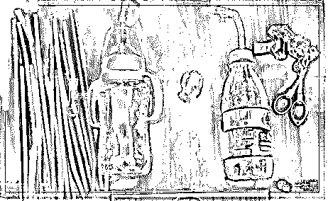
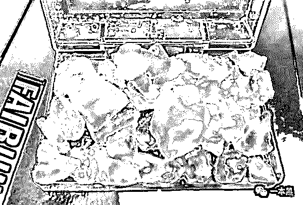
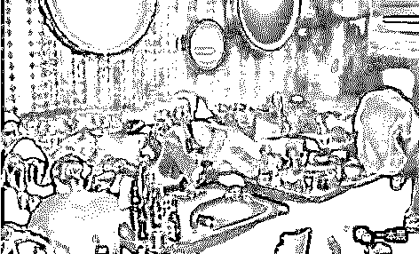
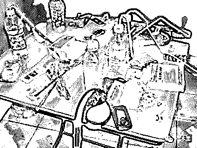
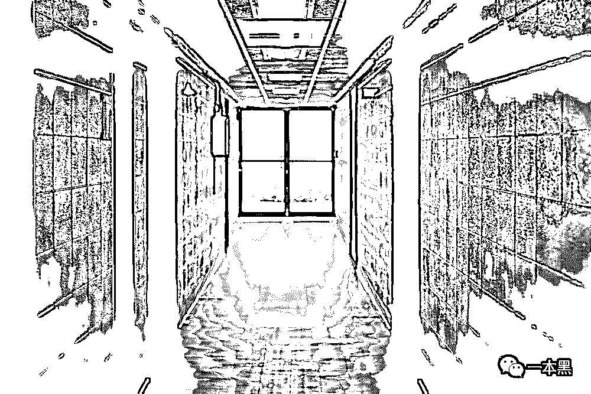

# 吸毒、致幻、“溜冰”、“开会”，叛逆少女毒瘾上身，性生活混乱差点致死

> 原文：[`mp.weixin.qq.com/s?__biz=MzU4ODAwNzUwMQ==&mid=2247484637&idx=1&sn=f50fe39f7983ecb156800e303626912f&chksm=fde215ffca959ce918911f97d62c37d12eb23f43dd1e329672d544c3a19a32f991ed11ddbe45&scene=27#wechat_redirect`](http://mp.weixin.qq.com/s?__biz=MzU4ODAwNzUwMQ==&mid=2247484637&idx=1&sn=f50fe39f7983ecb156800e303626912f&chksm=fde215ffca959ce918911f97d62c37d12eb23f43dd1e329672d544c3a19a32f991ed11ddbe45&scene=27#wechat_redirect)

三天五万块钱的工作，你心不心动？

几个月前，一本黑写了一篇不畏生死运毒的故事，可运毒的方法何止这一种？孕妇藏毒，肛门直塞、喉咙吞服、乳房藏毒……

可笑的是，人人都知毒品是危害社会的产物，但又不得不屈服于毒品带来的暴利。

穷，远比死来的可怕。

第一次鸦片战争给我们带来“东亚病夫”的耻辱称号。可就算到了今天，我们仍旧未能摆脱毒品的残害。

前几天看到一则新闻，22 岁花季少女吸毒后产生幻觉驾车失控不治身亡。倒没有伤害到其他人，但留给她家人的，却是无尽的悲痛。

毒品不仅害了自己，更是毁了一个家庭。

为了近距离触摸这个行业，我联系到一位在戒毒所工作的朋友老张。说明了我的来意，他立马应允邀约。

在一家湘菜馆，随他而来的还有一位身形偏瘦的女生。老张说，这位是之前从我们戒毒所出来的露露（化名），原本她约了我吃饭，我想你要了解的，她可能比我更清楚。 

露露微笑的和我打招呼，除了很瘦以外，丝毫看不出来她是一个吸过毒的人。

**1**

露露是一名 90 后独生子。父母整天忙于工作，她打小随外婆长大，后来外婆去世，她便一个人独自生活。

外婆走后，父母不在身边，露露少了很多拘束。她父母打算将她送到小姨那边去，她拒绝了，跟父母提的唯一要求就是，每个月的钱及时到账。

一个人住的日子，露露经常夜不归宿，和朋友们混迹在夜店或是 ktv 里。

每天麻痹在酒精，音乐，灯光之中，露露觉得有些索然无味。这时一位叫小军的朋友在她耳边叨叨了几句，想不想提提神，我有个好东西可以“助性”，还不会上瘾，你有没有兴趣？

露露示意他拿出来瞧瞧。他拿出一个透明的瓶子，瓶子里盛了半瓶水，瓶盖上弄出两个洞，将两根长吸管伸进瓶子里。然后，他从口袋里掏出一个袋子，将里面白色的东西放在锡纸上，用打火机点燃。

很快，白色块状的东西开始冒烟，小军用一根吸管对着锡纸上的白色物体，自己对着另一根吸管猛的吸了一口，并让露露过去尝。没过多久，小军的神情有了变化，开始肆无忌惮的扭动着自己的身体。

抱着好奇刺激的心态，露露学着他，吸了一口，那一瞬间，她感受到一种从未拥有过的兴奋，曾压抑在心里的烦恼、痛苦转瞬即逝。

一会儿，露露身体也有了反应，她向身边早已按耐不住的男人靠去……

在迈入这一步之时，她不知道，这种兴奋、快感用来解决放纵与逃避，无异于饮鸩止渴。片刻的放纵换来的是长久的折磨，甚至让人陷入绝望的抑郁。就这样，露露开启了“溜冰”新生活。

“其实我并不是不知道毒品的危害，也不是喜欢吸毒，只是在父母那里得不到温暖，从小性格孤僻，进入社会难又交到朋友，唯一能跟我相处的，就是那些人。他们不歧视我，愿意和我玩，所以我也愿意和他们一起玩。他们说吸毒好，能解决一切烦恼，所以我也就吸上咯。反正我的好与不好，家人都不放在心上。”

**2**

尝过“溜冰”的滋味后，露露像是找到生活的新乐趣。

露露喜欢在 ktv 里，与一大堆人“开会”。因为人很多，所以他们把“溜冰”统称为“开会”。

在黑暗中，飘来若隐若现的光，夹杂着激情的音乐，此时， 很多不敢做，放不开做的事情，玩了那东西后，他们便会放开来，不会觉得不好意思，反而还会觉得很刺激。

“那个时候的情绪是没有办法控制的，音乐也不能停，因为一旦没有节奏，就摇不起来，然后大家就会感到恶心，这个时候情绪就特别容易失控。有一次，舞曲被打断，好几个人开始呕吐不止。”

过了一个月，露露开始变得有些易怒；稍不顺心的事，就会大发脾气，乱摔东西。有时候会特别兴奋，有时候又会莫名其妙的沮丧难过。

不过这些变化丝毫没有影响露露对“溜冰”的喜爱。为了有钱购买毒品，她不断的向父母撒谎。按照她自己的说法就是：“只要染上毒品，就会渐渐成为欺诈型人格。我问他们要钱的时候，谎话张嘴就来。”

一段时间后，露露还是被父母发现了，他们收到学校的来电，说露露已经很久没去过学校了。等露露父母找到她的时候，她已经半个月没有出门，每天溜完冰，她就像一具死尸一样躺在床上，桌上还摆着溜冰的道具，和未吃完的外卖，空气中散发着一股馊味。

“空闲的时候，我满脑子不由自主想“冰”，想起嘴巴含吸管咕噜咕噜的声音，那股浓浓的烟雾，我就能立马感觉到懒洋洋的舒适，恨不得立马能吸上几口。”

露露不知，这都是冰毒的后遗症。她原以为，毒品可以帮助她”抚平“精神上的焦虑与孤寂，没想到，带给她的，却是身体和精神上的折磨。

**3**

露露的父母将她送进了戒毒所，露露进来的时候，身体已经出现多方面的问题；高烧、不停的流鼻涕、嘴里尽是大块的溃疡...

老张说，露露被送进来之前，毒瘾又犯了，她不停的嘶吼要“冰”，在拉扯中，她不断的声称要杀死所有人，还将她爸妈手抓破了，最后，她不停的用头撞着墙哭闹着求“冰”。她妈妈看到她这副样子，跪坐在地下嚎啕大哭。

冰毒这个东西，远比海洛因来的更可怕。老张跟我解释道，人们畏惧毒品的印象可能还停留在海洛因上，所以当有人提出有“新玩意”的时候，才会放松警惕。 

其实不然，冰毒远远要比海洛因来的可怕。它比海洛因更容易腐蚀意志，它令人产生幻觉，对世界充满恶意，持刀伤人是常有的事。可以说，吸食冰毒的人，和魔鬼没有区别。

老张告诉我，现在的人吸毒，大部分是得不到一个好的解决办法，由于成长环境的因素，他们得不到倾诉和帮助，不得不委身于毒品，妄想通过吸毒去逃避这一切。

一旦进戒毒所，就不存在什么自不自愿了，在戒毒所里，只有管制。你不听话，打到你听话。一次吸毒，终生戒毒。

他叹了一口气：“从我这出去又回来的人，实在太多了。我在戒毒所干了二十年，没有复吸的就只有两个人。一个是露露，她在监狱里吃了不少苦，从戒毒所出去后，就和她爸妈去了新的城市生活。还有一个，他之前是吸食海洛因的，为了真正断绝对毒品的依赖，他也付出过不小的代价。前段时间，我还和他一起吃过饭。他也算过得还不错，在一家百货店做保安，有了新家庭，孩子已经读小学了。”

老张坦露，出了戒毒所，这只是第一步——将生理上的需求断绝，真正想要戒掉，一定是能克制心理上的依赖。

其实，人活着就是个圈子，假如你活的圈子要是都抽烟，哪怕你不吸，久而久之你也难免会去尝一口，所以说，一个人的生活习惯跟他的社交圈子是有所关联的。

**要想成功戒毒，除了意志要够坚定，还必须要做的一件事，就是跟之前的朋友圈子全部断绝联系。否则，复吸的可能性百分之百。**

“在监狱中，每当复发，全身骨骼撕裂的疼痛，我都告诉自己，我不能死在这里，我要活下去，我还没有结婚，还没有组建自己的家庭。很庆幸，自己在变成精神病患者之前，我走过来了。”

在这个物质生活极度丰富的年代，人们不可避免精神压力超负荷。很多人能自我调节，但有些人会在这种状况下溃不成军，他们或许别无选择，采用极端的方式去放纵自己逃避困境。

像那些吸毒的明星，他们名利双收，仍在追求着灯红酒绿，纸醉金迷，从而陷入迷茫，不知道自己该做什么才有兴趣，日子久了，这种精神上的空虚，驱使他们不断寻找刺激的事物，而吸毒，必然会成为他们的选择。

良言难劝该死鬼，我想，任何理由和借口都不应该选择吸毒。

还原事实｜专扒黑产

微信 ID：darkinsider

知乎 一本黑

头条 一本黑

投稿、爆料、招聘、转载

请联系微信:yibenheiTG