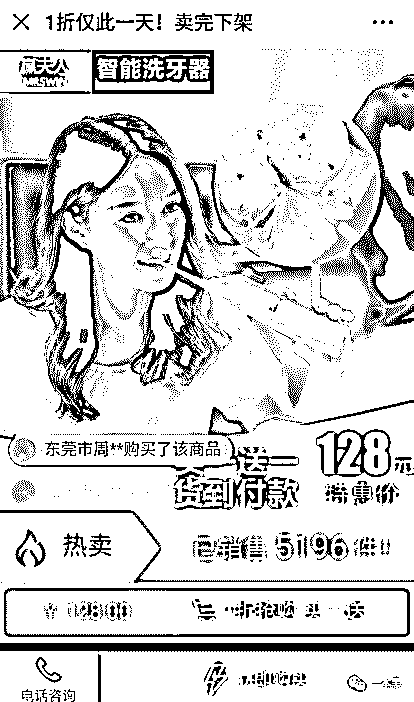
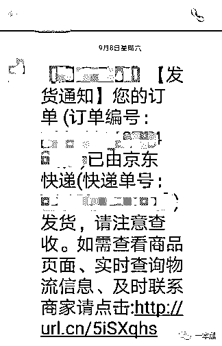
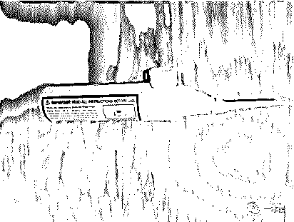
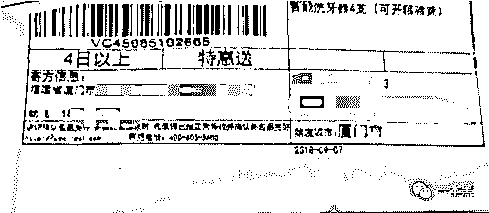
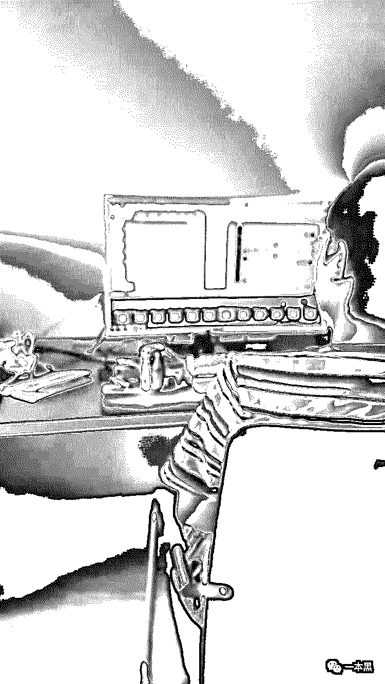
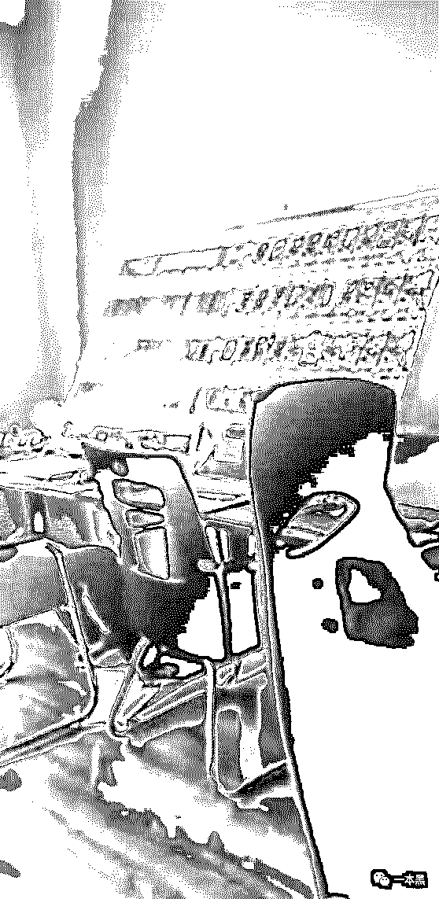
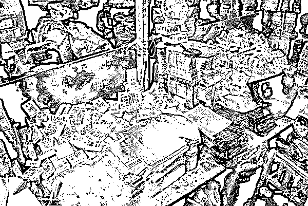
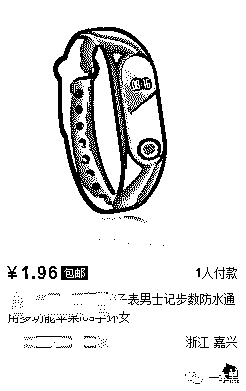
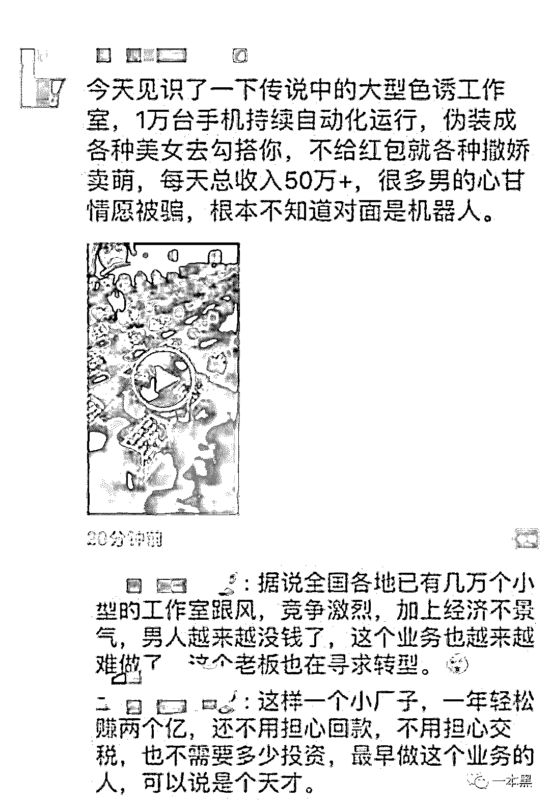

# 29 元免费送，200 万人上当被骗 8000 万，体验骗局后我发现，还是傻逼太多

> 原文：[`mp.weixin.qq.com/s?__biz=MzU4ODAwNzUwMQ==&mid=2247484607&idx=1&sn=4db536a21b8239384556f1daf77375a0&chksm=fde2159dca959c8b8c0c34f4fcdb020c55aa302b2373be0c9574e92261daa28b5b3597fc2e3f&scene=27#wechat_redirect`](http://mp.weixin.qq.com/s?__biz=MzU4ODAwNzUwMQ==&mid=2247484607&idx=1&sn=4db536a21b8239384556f1daf77375a0&chksm=fde2159dca959c8b8c0c34f4fcdb020c55aa302b2373be0c9574e92261daa28b5b3597fc2e3f&scene=27#wechat_redirect)

前几天，一本黑发了篇关于卖假货的文章。正经生意个把月都赚不到的，卖假货却能一天入账二十万的故事。

有一位朋友跟我说，现在互联网的骗钱伎俩奇招百出，某天中午他看到一条只需 29 元邮费，就可免费领取手环的朋友圈，二话不说，立马就填写收货地址下了单。

没过几天，他收到一台塑料材质的手环。

货不对版，尽管他知道被骗了，但由于数额过小，也就没有选择报警。

事实上，像这样被骗的人，数不胜数。

在这个网购盛行的时代，利用微信朋友圈进行诈骗的例子屡见不鲜，花样也层出不穷。尽管一本黑写过很多篇关于诈骗的文章，还是有不少朋友掉进圈套。

诈骗其实一直就生活在我们的周围。我始终认为，这个世上没有免费的午餐， 天上也不会无故掉馅饼。 

1

看到后台有人爆料，我便来“以身试局”，体验骗局是平日我们最爱做的事了。 

前几日，我正好在朋友圈发现一条诈骗广告，产品是冲牙器，图片显示 1 折特价出售，最后一天，买一送一，货到付款。

              

这个产品，介绍做的挺用心，它不似普通骗局，给一个产品图片加上一个二维码，直接告诉你货到付款。

下单没多久，便收到一条短信通知：京东正在为您配送。我有些诧异，或许这不是骗局？京东这么大一家公司，怎可能和骗子同流合污？

              

拿到包裹打开，wtf？这个要 128？这特么就是一个塑料材质的玩具。

              

就这玩意能进行 1200 次/分钟强劲脉冲？显然是不可能的，事实告诉我，这都是骗子公司玩的套路。

于是，我拨打了寄货人的电话，但传过来的确是忙音。            

我又立马打电话到京东投诉，京东表示物品质量问题与他们没有关系，他们没有办法帮我处理。

我很不满，京东既然选择跟他们合作，出了问题，却对这件事不负责任，难道这就是传说中的拿钱后翻脸不认人？

后来把这事跟一警察朋友说了，他告诉我，骗子得手后，再去追踪就很难了。

很多快递公司都有“货到付款”这个服务，先将货款垫付给商家，再从收件人处收取货款。在这个过程中，会对商家收取一定的手续费，并将商家登记在案。

尽管有这个规定，但实际操作起来，显然没这么容易。

一是快递公司不能确定寄件人是以公司名义还是个人名义寄送，二是物品金额数小且不易被查询到。

对于小额诈骗，警方收到报案后会进行记录但不会立案处理，这便让犯罪分子有了可乘之机。

2

为了能调查事情的真相，我又再一次给寄件人拨打电话，可依旧是无法接通。

不过，有手机号码，嘿嘿，我还怕找不他人么？是时候，请老师傅登场了。

迅速将手机号码发给老师傅，可迟迟未收到回复。走到他办公地，他没在，兴许是又偷偷跑去哪抽烟了吧。

想赶紧找到他，我立马跑到我们经常抽烟的楼道，不出所料，老师傅果然在这里。我连忙将事情一五一十的告诉他，他点点头，把烟头往公共灭烟盘上一扔，让我稍等片刻。

没过多久，我收到老师傅发来的信息，短短一个字：“来”。

我深知，老师傅搞定了。

老师傅果然是老师傅，通过手机号搜索出对方微信，用美女头像成功添加好友后给他来了个【没有脾气的文件】，这文件可就厉害了，只要对方点击进去，即可神不知鬼不觉的打开对方的摄像头。

就这样，我们看清了诈骗集团的窝点。（控制了大概一两个小时才看清楚对方所在环境，其余时间均照着天花板，看来这哥们“工作”不认真，躺在床上玩手机呢）

经过一段时间的窥察，我发现房间里共有 5 个人，他们喜欢不停的走动，经常会有事没事的指着电脑里的内容进行交流。

              

我将这个疑问反馈给老师傅。老师傅告诉我，这应该是群控系统，一旦有了这个系统，他们便可以用一台电脑控制上百部手机操作微信，实现手机群控。

而他们正是利用这个进行的批量诈骗，在加完微信好友后，他们便会将信息发给对方，一旦有人上当，他们就会进行下一步的操作。

这不，这个架子上的所有手机就是一个小型群控系统。

        

无疑，这是一个有组织的团队，在诈骗中，他们进行一步步诱导，引“鱼”上钩。

3

前不久，警方公布粉碎了一个电信诈骗团伙的新闻，而类似的案子，我们的好朋友【终结诈骗】就曾经写到过。 

这种类型的诈骗团伙别看它很简单，其实他们是有一套专业体系的，他们的分工非常明确，各司其职，有做技术的提供线上技术支持；有专门做业务拉人入坑的；也有做售后服务的。

              

他们利用人类贪小便宜的弱点，什么能吸引到人，他们的宣传产品就有哪些，再打着免费的旗帜，让那些人掉进他们的圈套中。

当你的朋友告诉你，有免费的东西可以领取的时候，平时警惕的你，或许会放松戒备。而这正是他们想要达到的目的——通过这种病毒式传播吸引更多的人。

业务员这么做，无非是利用朋友之间的信任。

反正只要拉到人下单，不管成交不成交，业务员都会有提成。

这种公司往往会招很多没有任何工作经验的大学生，然后教他们固定的话术，再不断去骗更多的人。

              

毕竟，不管成不成交，那些转发和扩散的人都会成为他们成功的垫脚石。

如果说搞业务的是诈骗公司的关键，那么技术部便是诈骗公司的前提。

像我们上篇文章中提到的小 W 系统，这就需要技术人员进行定期的维护和更新。而这种基于微信的骗局则需要技术人员操控群控设备进行批量诈骗。

其实，这种类似的商品往往很便宜，比如某手环，官方售价几百块，但是在某批发平台上，假冒伪劣的只需要一块钱。

              

或许是傻的人太多，才会让诈骗公司业务队伍越来越庞大。

根据【终结诈骗】的报道，在没有被捉前，诈骗集团一直都有在招兵买马，不少大学生还被骗了进来。为了招募到更多的人，负责人还让老员工介绍新员工，这样就可拿到不菲的提成。

每个部门在诈骗活动中分别充当不同角色，循循诱导，就这样，他们骗了 200 多万人，获得高达 8000 万元的赃款。

4

了解真相的我，默默的感叹，“什么时候骗子才会消失。” 

老师傅笑着和我说，要想诈骗集团消失，不存在的。只要人类有贪恋，那么骗子就永远都在。

的确，犯罪集团能有今天，也不是一蹴而就的。

只是那些贪小便宜的人不明白，在这个过程中，他们传递的不是免费礼品，而是更多的愚昧。

就算被骗，他们也不会为了这几十块钱“斤斤计较”。

种种原因，才让犯罪集团有机可乘。

一个人受骗，没什么大事，那么一千个人，一万个人，壹拾万个人受骗……那会是一件小事吗？如果大家都抱着事不关己的态度，那么必然会有更多的人深陷其中。

在现在大数据时代下，个人信息泄露严重已不是什么秘密。不少诈骗集团利用这一点，进行大海里捞针。当快递员打电话告知你有快递时，或许有些人能及时反应过来，但还是避免不了有人中招。

后记

‍

有个懂行的朋友告诉我，还有不少工作室利用群控软件在微信上，伪装成美女去勾搭男人，不给红包就各种撒娇卖萌。 

尽管这种骗局相当 low，但还是有许多男的心甘情愿被骗，因为他们压根就不知道对面的美女是个机器人。

就这样，每天总收入能达到 50 多万。

君子爱财，取之有道。可是这个道，不知从何时起，就这么变成了歪门邪道。

从“网恋一年多的妹纸是个男人”再到“大学生被骗学费自杀”。这个世界，大部分明眼人都能过滤掉低级的骗局，而另外一部分却深信不疑，说白了还是傻逼太多。

人人都希望自己是幸运儿，而骗子正好利用他们不劳而获的心理，诱惑使其上钩。

不要轻易的相信“天上会有免费的馅饼”掉在你身上。究竟是馅饼还是铁饼，不要被砸的头破血流才后悔莫及。

还原事实｜专扒黑产

微信 ID：darkinsider

知乎 一本黑

头条 一本黑

投稿、爆料、招聘、转载

请联系微信:yibenheiTG