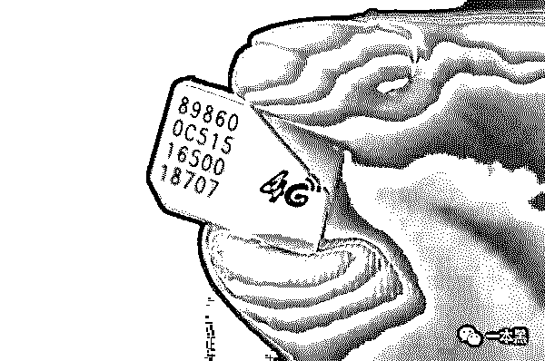

# 帮人取钱，佣金 5000，“高薪”职业取款人转移赃款近千万

> 原文：[`mp.weixin.qq.com/s?__biz=MzU4ODAwNzUwMQ==&mid=2247484576&idx=1&sn=753e7eb237baebc5ec79171329187d0c&chksm=fde21582ca959c94daa8f3d848e19a03e26e50aa120d0f4aaf9d4c034e517bfc56d47788b050&scene=27#wechat_redirect`](http://mp.weixin.qq.com/s?__biz=MzU4ODAwNzUwMQ==&mid=2247484576&idx=1&sn=753e7eb237baebc5ec79171329187d0c&chksm=fde21582ca959c94daa8f3d848e19a03e26e50aa120d0f4aaf9d4c034e517bfc56d47788b050&scene=27#wechat_redirect)

曾经有这么一群神秘的人，他们使用假身份证行走社会，避开一切人多口杂的地方，出门只乘出租车；他们具有极强的反侦察意识，不停的变换手机号码，住宿飘忽不定，每天匆忙奔走在各个银行取钱。

他们便是“职业取款人”。

靠取款为生，也因取款而亡。

近年来，电信诈骗案件高发，受害人数众多。在拿到诈骗来的钱后，诈骗犯需要将其变现，但是，他们又害怕取款时会被发现，在这种特殊背景下，“职业取款人”应运而生。

有人曾说：“一个人就像一条欲望的溪流，它流淌的不是溪水，而是人的各种欲望。人类社会却似一个永远不会干涸的欲望海洋，似乎随时都可能掀起波涛和巨浪。”

欲望，使他们一而再再而三的作案。

**他们在赚过十万块的单后，便不会回头再去打四千块一个月的工。**

都说人应当多读书，这句话果然不假。“职业取款人”，他们受雇于诈骗集团，专门替诈骗团队到银行或 ATM 机取款，以为自己跟犯罪不沾边，殊不知，早已成为犯罪集团的帮凶。

**1**

小刀向我们爆料的时候，他已经洗手不干一年多了。相比其它取款人，小刀只是这个行业大军中根本不起眼的“小不点”。

小刀说，“职业取款人”又被称为“车手”。诈骗犯将诈骗的钱由车手取出，再转到他们手上，获得实际控制权。

这个行为，叫洗钱。

**在所有有组织的诈骗犯罪中，帮忙取款的行为是其中不可或缺的环节。**

否则，诈骗犯也没必要将犯罪所得的部分资金以高额的佣金方式拱手出让。

四年前，小刀辍学从农村走出来，来到大城市，没有学历，只能打杂工，短短一年不到，他就换了好几份工作。

小刀说，当初从理发店辞职后，他就一直游手好闲。在一次上网的时候无意发现一条招聘信息，上面写着招雇工，不需学历，工作轻松、上班时间不限，包吃包住，工资 2 万一个月。

2 万块，工作轻松，不用学历，还包吃包住，这对当时的他来说，极具诱惑力。也没多想，他立马就按照招聘信息中的电话打了过去。

第二天，小刀跟着电话里的指示过去报道，跟他一起“入职”的，还有 3 男 1 女。负责人南哥拿走了他们的身份证。并告诉他们，只要通过培训，他们就可以开始“上班”了。

培训很简单，无非就是叫他们演戏，给他们一张银行卡，让他们装成有钱人去银行取钱，每天取个几千块。因为高薪，他们丝毫不愿多想为什么这样做。

刚开始南哥会亲自给他们示范，带他们体验如何表现得更自然，以及取完钱之后如何交接。

就这样，他们五个人，都过了培训。小刀说，那时候他很开心，没想到这么简单就能月入 2 万，他特别兴奋。

接下来的几天，小刀和他的同伙都在等入职消息，可南哥像是人间蒸发了一样，根本联系不到。小刀开始琢磨起这份工作：“正当我犹豫不决的时候，南哥又回来了。”

**2**

南哥回来后，给每人都发了一台新手机和若干张银行卡，还有一套较正规的服装。告诉我们，换好衣服，去指定的银行去帮他们取钱，他们会安排同伙接待。

事后小刀说：“等消息那段时间他们应该是又搞到了一笔诈骗，从取款金额来看数目不小。”

小刀表示，当他知道自己要取 8 万块钱的时候，既紧张又兴奋，随之就将不安的想法丢到了脑后。毕竟，这是长这么大以来，第一次看到这么多钱。

小刀突然向我感叹到，哎，一夜暴富的方法果然都是写在刑法里的。

经过培训，再次去取款的小刀，特别老练的走完这个流程，将取到的钱交给南哥，南哥抽取了 8%的佣金给他，并告诉他，以后就这么干，跟着他，有享不尽的“荣华富贵”。

小刀说，没想到这么轻松就拿到工资，而且远比做洗发小哥赚的钱要多的多。

这时的他并未意识到，这是在帮犯罪集团“洗钱”。

之后的每一天，他都有“取不完”的钱，但这些钱都不是他的，他只负责将钱取好之后给南哥，佣金有时候是 10%，有时候 8%，有时候 5%，偶尔会更多，但他们佣金的还是取决于取款金额的大小。

他们五个人，没“工作”的时候，不会轻易出门。南哥每次给他们换的住所，皆是高档小区，附近多是金融设施，里面生活设施一应俱全。他们几个人窝在 200 平方米的大房子，看电视、玩游戏、看书，但有一条铁的纪律，不能以任何方式联系家人。

小刀解释道，南哥之所以这么安排，是因为方便他们更好工作。

他们不能像一般的打工者，住几百元的破房子，而是要把自己弄的很富有，这样，他们的“工作”才不会令人怀疑。

**3**

我问小刀，每天都在帮人取钱，难道你就没质疑过，这中间有什么猫腻吗？

刚开始，我真的没往电信诈骗这方面想。但是日子久后，我就猜到可能是件不好的事。

可又能怎样？我不做难道它就会倒闭吗？那些贩毒的人，明知道贩毒是违法犯罪的行为，明知道吸毒害人，可他们却还是在卖。他们赚了这么多钱也没罢手。

而我，又没有害人，只是做着一些微不足道的事，要报应也报应不到我头上来。

这个行业，钱来的快，又轻松。我想，没有哪个大傻子会愿意放弃月入十万的活，回头去打四千块的工。

**我不是不想守法，只是诱惑太大。**

他们何尝不知道自己这是铤而走险，只是当尝过甜头之后便开始抱着侥幸的心理进行第二次，第三次犯罪，然后发展成为职业犯罪。

**4**

小刀说，今天的改变，是因为接到他爸的一通电话。

“你为什么不接电话，为什么联系不到人？！你妈被骗子骗走了五万块钱！”爸爸呵斥道。

妈妈在发现被骗后，一时想不开，想喝农药自杀，还好发现的及时，否则人就没了。

小刀接着说，隐约感觉到这件事跟他现在做的事有所关联，因为曾经听见南哥提到过诈骗。

了解的越多，才发现这个行业是这么黑暗。小刀仅仅是电话诈骗末端的一只小小蝼蚁，他现在所做的便是给电信诈骗洗钱，也就是俗称的“职业取款人”。

小刀告诉我，电信诈骗是一个具有专业化和组织化的团队，诈骗的手段非常高超，在进行诈骗之前，都已经写好剧本，一旦你被盯上，那便是他们算计好的，一步步请君入瓮。

A 给“受害人”拨打第一个电话，告知“受害人”卷进了洗钱大案；之后再由 B 接手，拨打第二个电话，B 扮演的角色是“侦查员”，以恐吓等方式让“受害人”慌乱；最后由 C 收网，扮演“检察官”，引导“受害人”将账户余额转进指定的赃款账户。

这是电信诈骗中常见的一个段子，他们在行使诈骗前，要受话术培训，培训内容包括语气、聊天内容、各种借贷平台方式等。

然后再利用手中收集到的信息，在诈骗过程中互唱双簧一环套一环令受害人“心甘情愿”将自己的积蓄奉上。

谁曾想到，自己的家人会成为电信诈骗的“鱼”，一通电话就被人宰割。

这几年来，职业取款人已慢慢变少，倒不是因为电信诈骗的案件减少，只是电信诈骗的玩法早已升级，洗钱方式从线下转为线上。

小刀坦露，诈骗这个东西很难瓦解，人的贪婪永远不会停止。家人的遭遇可能就是报应吧，我不会再去碰这些事了，尽管这个能带来我这一辈子都可能赚不到的钱。

后记

16 年徐玉玉案件后，引起社会很大冲动，在此之前，恐怕没人想过电信诈骗会毁了一个花季少女的人生。

这个社会，若凡事都以钱当先，那么不管它会伤害到谁，弱势群体总是先中招，尤其是年轻人。当他们正在打开一种视野，迎头而来的却是谎言和欺骗，让他们认为钱就是信仰。

人的欲望是无穷的，越是妥协越是得寸进尺。

小刀不是最后一个职业取款人，但我相信这是他的最后一次。

还原事实｜专扒黑产

微信 ID：darkinsider

知乎 一本黑

头条 一本黑

投稿、爆料、招聘、转载

请联系微信:yibenheiTG