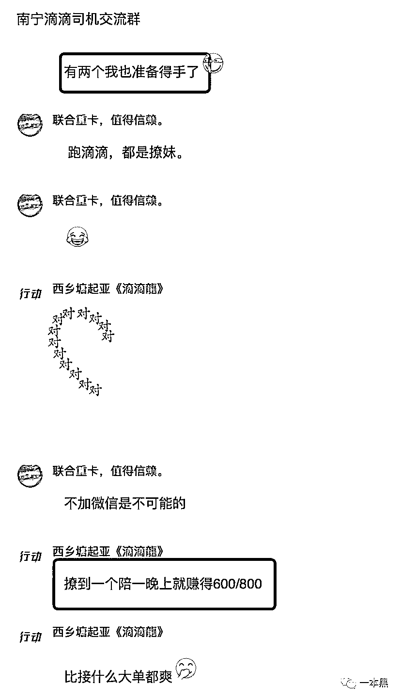
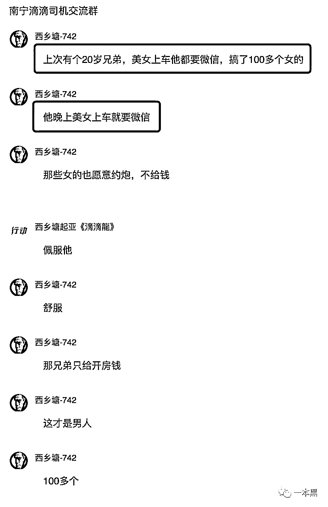
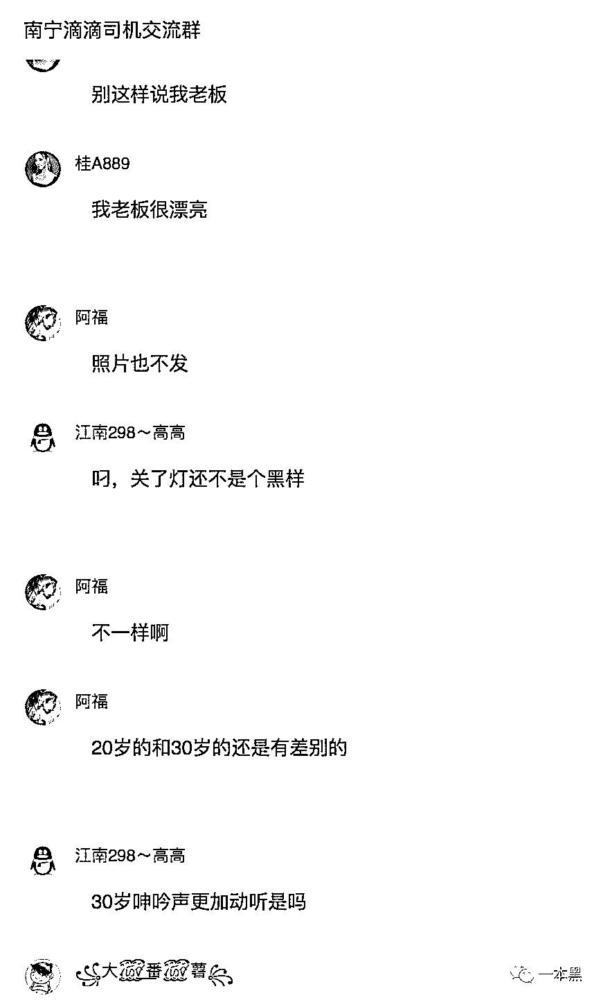
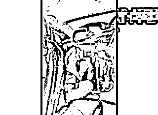
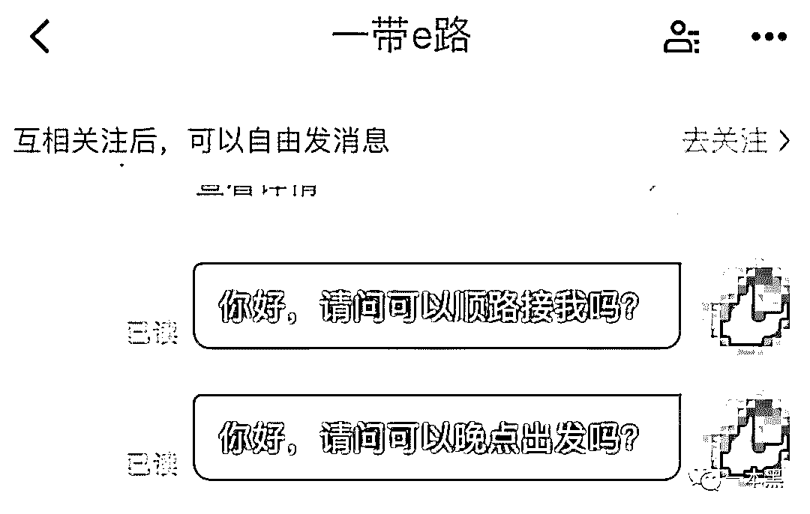
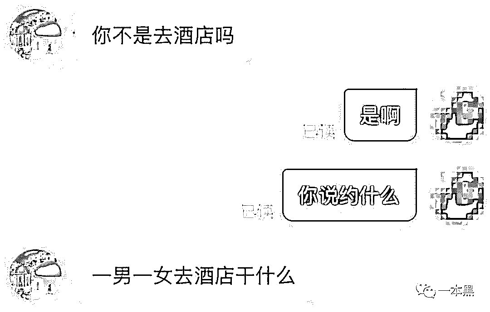
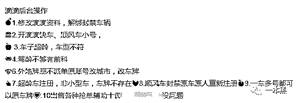
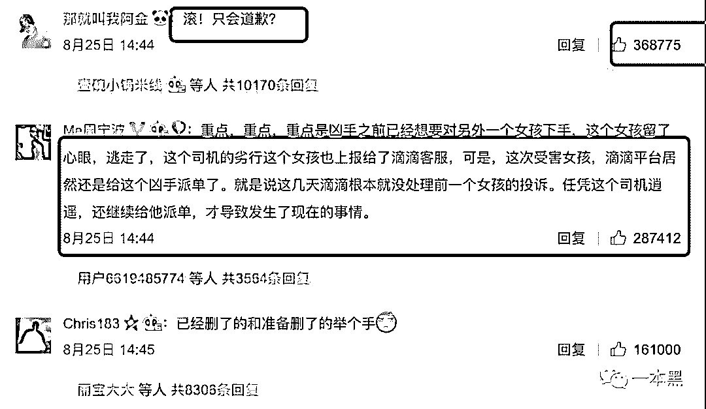

# 暗访数十个滴滴司机群，偷拍、约炮、性骚扰等露骨字眼充斥其中

> 原文：[`mp.weixin.qq.com/s?__biz=MzU4ODAwNzUwMQ==&mid=2247484491&idx=1&sn=8e1120f39b13099babc22922c91af464&chksm=fde21569ca959c7ffb80c3756e3e140251b57523c18b848f4fbed42536796fa5c4bc52d4987a&scene=27#wechat_redirect`](http://mp.weixin.qq.com/s?__biz=MzU4ODAwNzUwMQ==&mid=2247484491&idx=1&sn=8e1120f39b13099babc22922c91af464&chksm=fde21569ca959c7ffb80c3756e3e140251b57523c18b848f4fbed42536796fa5c4bc52d4987a&scene=27#wechat_redirect)



裸露的皮囊不足以洞见人心，龌龊的禽兽一抓一大把。

滴滴养活了一群拉客司机，却也“培养”了一帮内心猥琐的肉欲动物，此类事件虽然早已司空见惯，却不见得稍有好转。

从滴滴顺风车杀害空姐事件，到如今 20 岁花季少女惨遭强奸杀害，滴滴暴露出来的不再是网约车违规注册的黑产，而是那些猥琐司机直达人心的肮脏心理。

在滴滴“养虎为患”的日子里，那些疯狂肆意的行为依然大行其道，或炫耀、或自我满足。

他们在自己的圈子里侃侃而谈，从意淫聊到偷拍，从性骚扰聊到约炮。

因为之前曝光过网约车违规注册的黑产，潜伏了十几个滴滴司机 QQ 群，我发现这些司机简直就是社会的败类，他们在群里畅所欲言，有人趁女乘客睡觉，偷拍其隐私部位并发到群里讨论，交流内容污言污贿、不堪入目。

1

**偷拍女乘客视频，露骨聊天，大尺度“开车”**

**作者/东东**

在暗访中我发现，数十个滴滴司机交流群均或多或少的存在讨论女乘客的现象，其中一个群更是尤为疯狂，基本不存在讨论出行相关的经验，而是炫耀自己今天接到多少女乘客，有几个马上就要“得手”了。

用他们的话来说就是，相比去找小姐，撩到一个女乘客就相当于赚了七八百，**比接什么大单都还要爽。**

也许在他们的眼里，滴滴出行软件就是个约炮的工具。



不仅炫耀自己的“战果”，这些人还分享别人的“辉煌战绩”。

**“上次有个 20 岁的兄弟，美女上车他就要微信，搞了 100 多个女的”。**

接着有人随声附和“佩服”，还说这才叫男人。

我想说的是，男人的脸都他妈让你们这群傻逼给丢尽了。拿这种事情炫耀，就觉得自己高高在上了，这群人也就这点能耐了。



相比其他正常的滴滴司机交流群，这个将近满员的群可谓是热闹非凡，转眼就是 99+的聊天记录。

真的不难想象屏幕背后是一群多么丑恶的嘴脸。

他们交流并且无中生有的意淫曾经拉过的女乘客，比较不同年龄段女性的差别。



在这个群里，有人经常发出偷拍女乘客的不雅视频，有副驾驶的角度，也有后座的角度。

**他们甚至还会交流如何购买到便宜且效果好的针孔摄像头，并且如何在正确的位置安装，以便拍出更好的角度和画面。**

你说你没事聊聊骚就算了，居然还人为安装摄像头，还趁别人睡着了用手机拍摄，这他妈和那些在酒店安装摄像头偷窥的人有什么区别。

**垃圾。**

从视频中可以看出，群内发出的视频并没有打马赛克，我想他们也不可能打马赛克。女乘客的样貌和走光的部位一览无余。

但凡有这种真实偷拍的视频发到群里，群里就会立马炸开了锅，纷纷讨论拍摄技巧和心得，还有人问：“怎么不震一震”



看完这些你不要觉得他们只是好奇偷拍，发到群里聊聊就完了。

一个心智不受控制的人只要提起刀他就有可能杀人，这种心理变态的司机也同样如此，在经过群内这种环境的污染以后，他也可能在某一天拉客的时候出现猥亵甚至是产生强奸女乘客的冲动。

2

**滴滴打车=滴滴约炮？**

滴滴打车化身滴滴约炮，这样的网约车你还敢坐吗？

除了这些在特定 QQ 群意淫聊骚的人群外，有人甚至还光明正大的在滴滴打车软件里公然对女乘客约炮。

一本黑曾经接到过网友小刘的爆料，小刘称自己有一次打车去酒店，在和司机的沟通中，司机竟然提出想要约炮的要求。

因为打车的时候乘客需要输入目的地的位置，司机在接单以后就对女乘客发出了约炮骚扰的请求。

小刘表示打了这么多次车，居然会遇到这种情况，并在随后取消了订单，一定程度上防止了事件的进一步发展。



这种在滴滴出行软件上公然约炮的事情不在少数，18 年 2 月，南京市民王先生报案称一名滴滴司机想约自己的妻子开房，要求警方介入。

事情发生在报案的前一天晚上，司机接到王先生妻子的订单后，看到王先生妻子长得不错，随即就加了王先生妻子的微信。（这里说一句，为什么要随便加一个司机的微信？）

事后，司机给王先生妻子发了一条开房信息并在随后被王先生发现，但是妻子却说并没有看到这条信息。

最后，为了证明清白，王先生随同妻子到开房地点“生擒”了这位异想天开的网约车司机。

3

**不仅偷拍，还偷摸女大学生**

如果刚才所说的这些只是司机的图谋不轨，那接下来说的这个案子真的就更加胆大妄为了。

曾经就有新闻曝光过某大学四名大学生打滴滴顺风车回学校，因为路程比较远，其中一个坐在副驾驶的女生就睡着了。

但是这个疯狂的司机却在等红绿灯的时候用手摸自己的胸，并且还用手机对着自己的裙底拍。

当发现后这位女同学质问司机，司机却口出谎言说自己在拍对面的车。几位女同学气愤得赶紧下车并准备报警，司机见状马上开车逃跑。

最后在警察局做笔录的时候，几位女同学反应自己所乘坐的顺风车与订单上的车牌并不相符。当时只是大意没注意看清楚车牌。

其实，关于乘客所乘车辆与订单为什么会不符合的原因**一本黑早已曝光过，**无非是有工作室可以做到修改滴滴资料，解禁被封车辆。（直通车——[别上那辆网约车！“假司机”暗藏安全隐患](http://mp.weixin.qq.com/s?__biz=MzU4ODAwNzUwMQ==&mid=2247484222&idx=2&sn=1bb31736f8d9b56dd09dc7ad20fbdc64&chksm=fde2121cca959b0ab215a6973128714366bd1b3fe7600ddcf439a372df1b71dd56736b098b10&scene=21#wechat_redirect)）

不仅如此，他们还可以让车子超龄、车型不符的车辆得以接单。改改车牌更不是什么难事。



一些小小的问题，最终都可能酿成大大的祸患。

钻漏洞注册成为网约车司机，驾驶真的坐上这样的司机开的车，隐患实在巨大，一旦出事，这些虚假注册信息将成为嫌疑犯的一块遮挡布，增加警方查案的难度。

对于这次 20 岁少女惨遭强奸杀害事件，滴滴在微博上发出了声明和道歉，从评论可以看出，这次事件确实再次激起了民众的愤怒。

也确如网友所说，滴滴除了声明和道歉，还能做什么？



评论中，我觉得一条建议非常不错：“我觉得滴滴 App 上应该设置一个一键报警功能，把车子行车路线和车主信息都发到公安。”

但是，再好的建议和整改都是不可能解决根源上的问题的，这不仅是滴滴自己的问题，还跟那群极其恶心、猥琐的司机有关。

滴滴的发展固然壮大，但业务流程还得进行更加系统性的优化，希望滴滴这次的全国下线能给他们带来真正的反思。

而这些司机的国民素质在我看来还只存在于原始社会，那种脑袋里只想着肉欲的思维，在经过几千年的发展仍然停滞不前，这在泱泱大国的环境下多少显得有些低级。

另外，事件中推让、拖延的办事态度让我想到了一个段子。

一个人上街买葱准备包饺子，摊主 A 得知后反应给摊主 B，摊主 B 再次询问了一遍买葱人的述求，转而告知摊主 C，摊主 C 最后告知买葱人如果要买葱得先买猪肉。

然后再拿着猪肉来买葱，可是卖猪肉的人却说买猪肉包饺子必须先买完葱才能买猪肉。

最后买葱人说了一句：**“我可去你妈的吧”。**

 /mp/newappmsgvote?action=show&__biz=MzU4ODAwNzUwMQ==&supervoteid=521610369#wechat_redirect 

还原事实｜专扒黑产

微信 ID：darkinsider

知乎 一本黑

头条 一本黑

投稿、爆料、招聘、转载

请联系微信:yibenheiTG

**本文为腾讯新闻 Top Media 计划特约稿件，未经允许，请勿转载。**