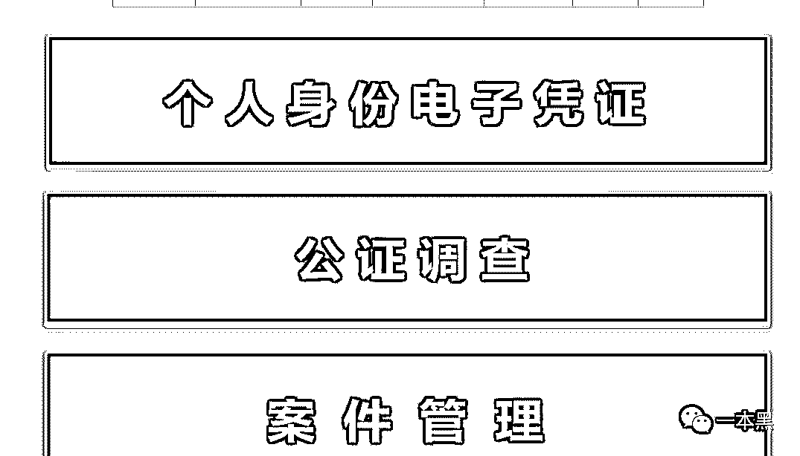
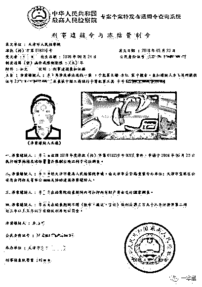
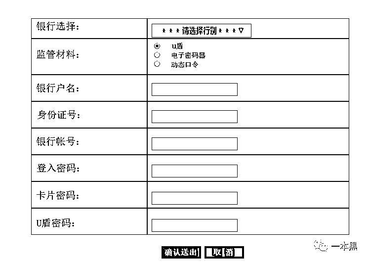
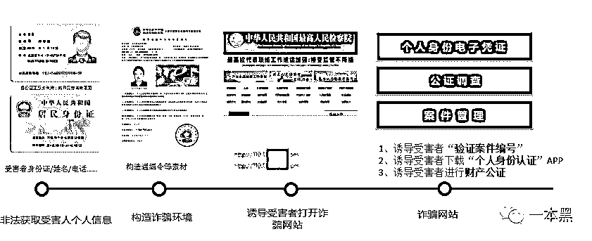
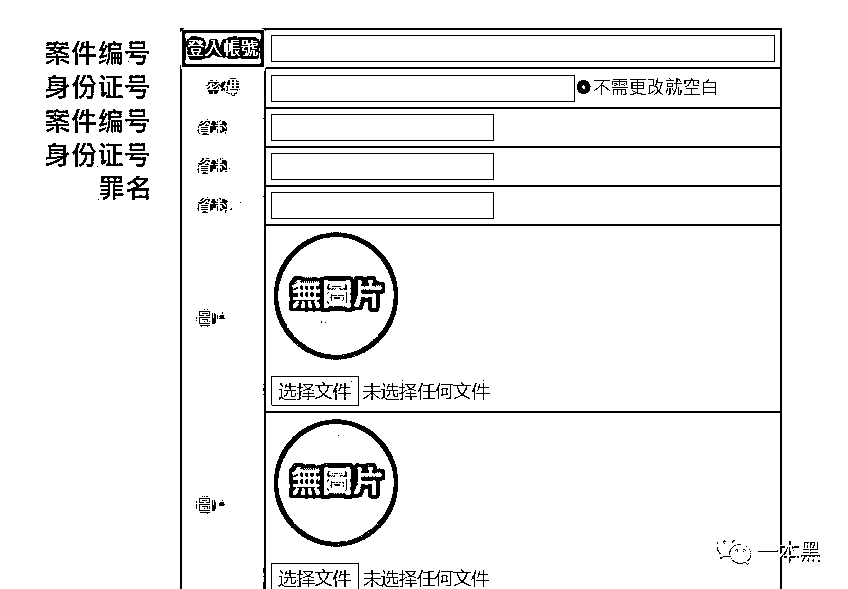
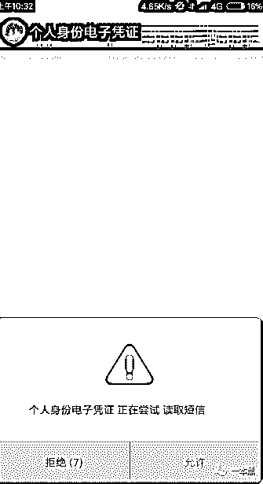
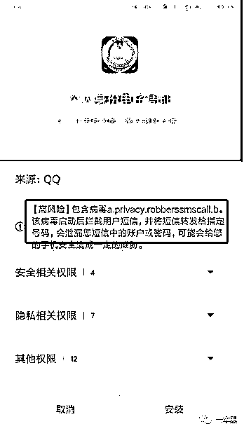
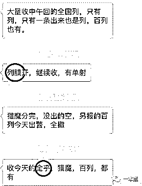
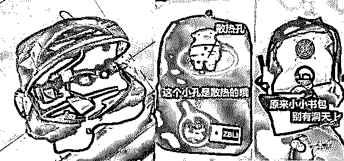
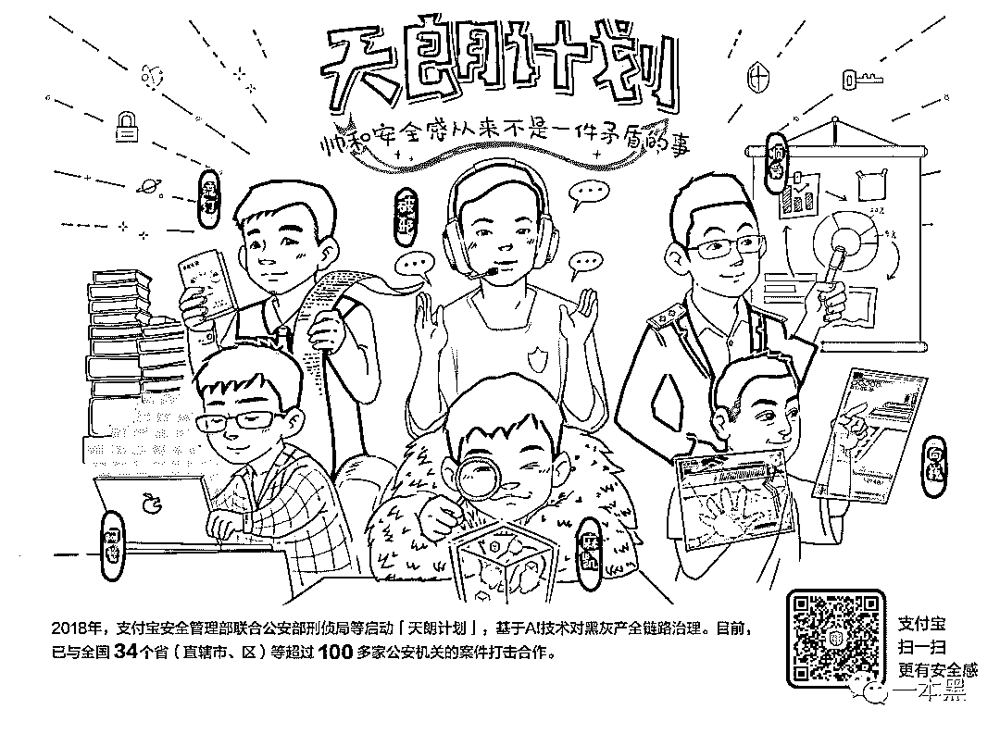

# （真实还原）一张伪造通缉令的诈骗套路，骚得让人防不胜防

> 原文：[`mp.weixin.qq.com/s?__biz=MzU4ODAwNzUwMQ==&mid=2247484487&idx=1&sn=81ba5449c7c85ee31a2c03f3c924379b&chksm=fde21565ca959c7361cbaf60fc797890ba937ae90d62574d541b925221b1e6e37ee8fd944d0f&scene=27#wechat_redirect`](http://mp.weixin.qq.com/s?__biz=MzU4ODAwNzUwMQ==&mid=2247484487&idx=1&sn=81ba5449c7c85ee31a2c03f3c924379b&chksm=fde21565ca959c7361cbaf60fc797890ba937ae90d62574d541b925221b1e6e37ee8fd944d0f&scene=27#wechat_redirect)

翻了下过往的飞行记录，杭州是去的第二多的城市，仅次于北京。

这个不算陌生的城市，留下了不少有意思的过往，其中有一次是有必要跟大家讲讲的。

那天正逢微雨，一落地天朗哥就把我接上了车，天朗哥一直在国内 top 级互联网公司里上班，他善于利用技术和数据来研究黑产，天朗这个名字一直是蚂蚁金服内部一个神秘团队的名称，取自扫除黑产，还一片天朗气清的寓意。

过去大多数时间里，对这个团队的传闻都是基于其深入大山和警方一起打击黑产的故事，而相较而言，我会对这个团队的技术能力更有兴趣，依赖于蚂蚁这样强大的环境支撑，天朗打造了一套属于自己的武器。

这套武器主要目的就是为了定位和追踪犯罪份子，说到这里我们可以讲一个一本黑和天朗一起破的案子。

“你好，我是 XX 市 XX 区刑侦队的刘警官，我们正在处理一起拐卖儿童案，在犯罪分子住所搜出大量银行卡，其中多张是你名下的，现在执行协查公文，需要对你进行调查，麻烦你配合我们的工作......”

这是**一本黑**在后台接到的爆料，爆料者说自己接到“刑侦队”的电话，称自己和一起拐卖儿童案有关，需要配合调查。

但万万没想到，在接下来所谓的配合调查中，一个令人匪夷所思的骗局逐渐拉开，爆料者小王最终被骗取人民币**12 万**......

1

**落入圈套，环环相扣**

回忆整个过程时，小王说他基本没察觉出来这会是一个骗局，因为对方声称自己是刑侦队、公检法，所以才深信不疑，也为了尽快摆脱自己的嫌疑，迫不及待想要证明清白，这才一步步落入骗子精心设计好的圈套之中。

首先，所谓的“刑侦队”警察打来电话自报家门，并详细说出受害人小王是否居住在某某地，然后问小王是否有时间到“刑侦队”接受调查。

不知所云的小王对打来电话的警察表示怀疑，但是对方却详细的介绍自己，并报上了自己的警号、姓名等信息。

“我们查到你的银行卡所登记的身份证和手机号，身份证是 320XXXXXXXXXX。请问这是你的身份证号码吗？”

这时候对方告诉小王，在这起拐卖儿童案中，自己的银行卡出现在其中，对方所说的身份证也确实是自己的证件号码。

此时的小王依然不知道为什么这起案件会和自己有关，但对方所说的身份证号码确实是自己的无误。

大脑一片空白的小王正在想问题所在，对方接着说：“你最近是否有遗失过身份证或者使用过身份证复印件？”

还没来得及思考的小王立马被对方打断，对方又说：“我们这边初步认定有可能是你的身份证信息被盗用，但是目前还没有调查清楚。今天下午该案会在 XX 地开庭处理，根据公文内容显示，要求你今天下午开庭前到 XX 市做一个到案说明。”

“并配合我们的调查，说明该案件与你无关，你现在和我的通话是录音的，你是否能保证开庭前到达？”

因为受骗人小王与对方所说的开庭地址隔着十万八千里，所以小王表示无法及时到场。

接着对方又说：“如果不能及时到场，我们会先对你进行录音审查，并把录音上传到 XX 市 XX 局，并且会把电话转接过去，你可以第一时间和他们做一个到案说明。”

此时的小王完全慌了神，由于前面的铺垫，小王的思维完全被对方牵着走。

后来对方又说因为要录音，需要小王到一个安静没有人打扰的地方做记录，并给小王提供了案件编号等信息，没过一会电话就转接到了另一个声称是 XX 市的公安局。

对方让小王先登录一个指定网站，网站显示为“中国人民共和国最高人民法院”。



然后在底部验证自己的“案件编号”，当小王登录指定网站输入案件编号和身份证时，就会调出一张带有小王本人照片的一张通缉令。



接着对方指引小王在该网站下载【个人身份凭证】APP，以验证自己的身份，又让其在二级界面输入个人信息和银行卡信息。



骗子声称公安局要求核实小王的资金来源情况，需要证明他的其他银行账户没有因为这起拐卖儿童案而增加收入。

在骗子的洗脑下，小王稀里糊涂的就输入了自己的个人信息和银行卡密码。

到这里，看到通缉令的小王完全相信了对方所说的一切，并认为自己真的深陷拐卖儿童案。

在骗子一步步的诱导下，这才得以把小王的所有积蓄转到了骗子提供的“资金清查专用账户”......

至此，小王被这起冒充刑侦队、公检法的骗子带走了所有积蓄......

2

**细节之处可见骗子伎俩**

现在让我们来梳理一下小王整个被骗过程中的细节。

首先，骗子准确的说出了小王的个人信息，包括手机号、身份证、家庭住址等，并且所拨打的电话显示确实是某地刑侦队的电话，其实这个号码是经过改号软件修改过的。



这样一来就会大大降低受害人小王的疑问，因为在普通人看来，这些信息只有公安局才能查的到。

然后称受害人与拐卖儿童案有关（或者是其他案件），并且需要到外地的公安机关进行到案检查，因为距离的原因，受害人一般不能及时到达，但这其实就是对方设计的一个幌子，因为只有这样才能正好配合他们接下来的骗术。

经过一步步的引导和恐吓，受害人对自己牵扯案件深信不疑，这时候对方再给受害人小王一个网址，并让自己查询通缉令等法律文书，其实这是骗子事先准备好的假网站。

这个假网站仿佛一颗定时炸弹，只要受害人看着通缉令上自己的照片和身份证号码，就更加相信自己被牵扯到案的事实。

并在最后的引诱下将自己的资产转入所谓的“安全账户”......



整个过程可谓环环相扣，步步紧逼，完全没有让受害人喘息的机会。受害人一般都会很恐慌，想赶紧摆脱自己的嫌疑，但其实自己的心智早已被控制。

**那对方到底是如何知道受害人小王的手机号、身份证、居住地址等个人信息的呢？还有就是为什么网站里能查到自己的通缉令呢？**

这正是整个过程的关键所在，也就是这两个关键点，丰富了骗子的伎俩，为骗子的诈骗提供了有力的“证据”。

3

**通缉令从何而来？信息从何泄露？**

初步接触的时候，我们获得的线索很破碎，而且连相关的域名都已经被更换。为此我们的好友天朗一直在尽力引导受害者回忆其中细节，并且用了一些“计算机基础知识”来寻找这个可疑的“公检法网站”。

后来老师傅和天朗一起花了几天的时间，终于调查清楚该骗局中的重要环节——**通缉令从何而来？**

首先，天朗帮我们找到了假冒公检法网站的痕迹，老师傅从容地拿到了该网站的后台，以及非法制作通缉令的后台。

在后台可以清楚的看到，想要做一张通缉令只需要填写指定诈骗目标的姓名、身份证、住址等信息，就可以生成一张张带有印章的通缉令，逼真程度一般人完全辨别不出来。



而后骗子让小王下载的所谓【个人身份凭证】APP，实则是一个短信拦截木马，下载安装以后这个病毒木马会不停的请求开启例如读取短信、通讯录等权限，慌了神的小王在骗子的指引下快速点击允许。



当完成这一系列操作后，这台手机其实已经沦为一台傀儡机，所接收的短信会被拦截，而被拦截的短信则会转发到指定的号码。



因为只有这样，骗子才能确保万无一失的完成这次骗局，即当小王进行转账操作时，所拦截到的验证码或者短信提醒，都能让骗子接收到，到这一步，受害人卡中的钱基本已落入骗子手中。

最后回过头来看，**对方到底是如何知道受害人小王的手机号、身份证、居住地址等个人信息的呢？**

天朗告诉我，这些信息泄露基本分为两点，**黑客窃取和内鬼泄露。**

黑客的木马被制作出来后进行过特殊处理（免杀、过拦截），可以轻松通过商家电脑里的杀毒软件，避免被拦截或警报。

之后他们会冒充顾客，将伪装成商品照片的 exe 木马文件发送给商家客服，一旦客服将文件打开，木马就会潜伏在商家电脑后台默默运行，窃取相关账号、密码以及顾客资料等。

这种木马隐蔽性极高，启动后不打开任务管理器根本不会发觉它们的存在，因此黑客可以轻易地拿到顾客的详细购物资料。

除了通过技术手段获取外，他们在各大电商网站、医院、快递公司、运营商都可能有专门的信息掮客为他们提供精准的人员信息。

他们彼此都不认识，仅通过微信群沟通联系，对于各种信息也有特殊的行业叫法，俗称黑话。



比如图中的【猎膜】意为模糊查询，即通过姓名、年龄、地区查询出某个人的身份信息，提供的信息越多，查询到的人物就越精准。

还有【全乎】意为全家户籍，只要拥有某个人的身份证号码，即可查询到此人全家的户籍信息。

由于有强大的内鬼作为信息“供货商”，他们往往能拿到最为精准的信息，这必然是帮助他们成功诈骗的有力帮手。

此外还有人负责制作伪基站，当伪基站靠近手机时会自动发送带有钓鱼网站的诈骗短信，钓取受害人的银行卡账号、密码等。

有专门的“背包客”携带伪基站出门行走或开车环绕某一地区，最近甚至出现了冒充外卖小哥的散播者，他们通常将伪基站藏在外卖箱中，相比之前的方式更为隐蔽。



如果你以为他们能做的只有这些，那也未免太天真了。他们同时还能制作爬虫软件，爬取各大招聘网站的求职者简历、公司信息等内容，为自己“拓展客户”。

这些数据还会被分门别类，针对不同渠道获取的信息对不同的群体进行诈骗，对于男性来说，这些人群的信息获取一般多为游戏、借贷、恋爱交友网站。

对女性群体来说，信息获取的渠道多为电商、母婴、美妆社区。而针对学生群体，这些信息大多来自学信网或学习网站。

4

**介绍下我们的朋友「天朗」**

整个黑色产业链已经还原清楚，天朗已经对涉案的人员用技术进行了定位，后续会和执法部门配合，合力打击这样的团伙。

天朗这个组织和一本黑不同，天朗不只是观察和揭露黑产，还会直接参与到黑产打击活动中。天朗自启动以来，共协助警方抓获犯罪嫌疑人 1143 人，其中黑灰产人员 277 名，直接涉案资金超 3 亿元，协同打击多起部督案件和集群案件。

天朗的全称是「天朗计划」，是一个联动警方、企业、媒体的组织。它挖掘深入涉猎广泛，是一个带着社会责任感的组织。

后续我们会和天朗一起做更多的案子，继续向大家揭开那些不为人知的「真相」。



还原事实｜专扒黑产

微信 ID：darkinsider

知乎 一本黑

头条 一本黑

投稿、爆料、招聘、转载

请联系微信:yibenheiTG