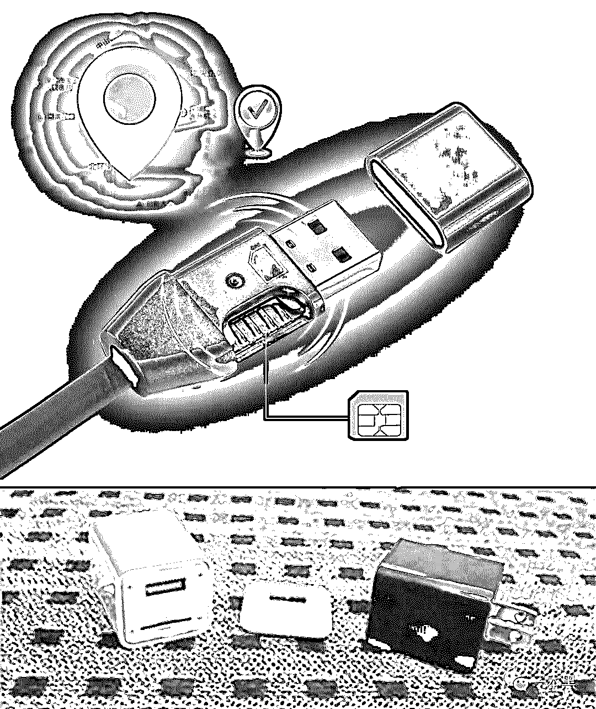
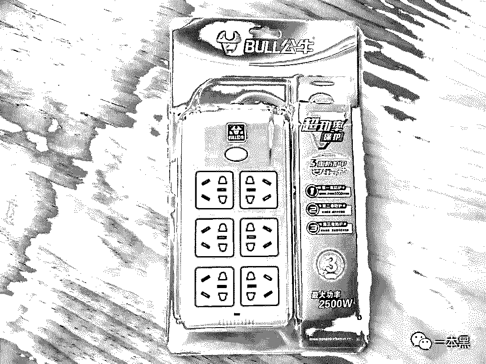
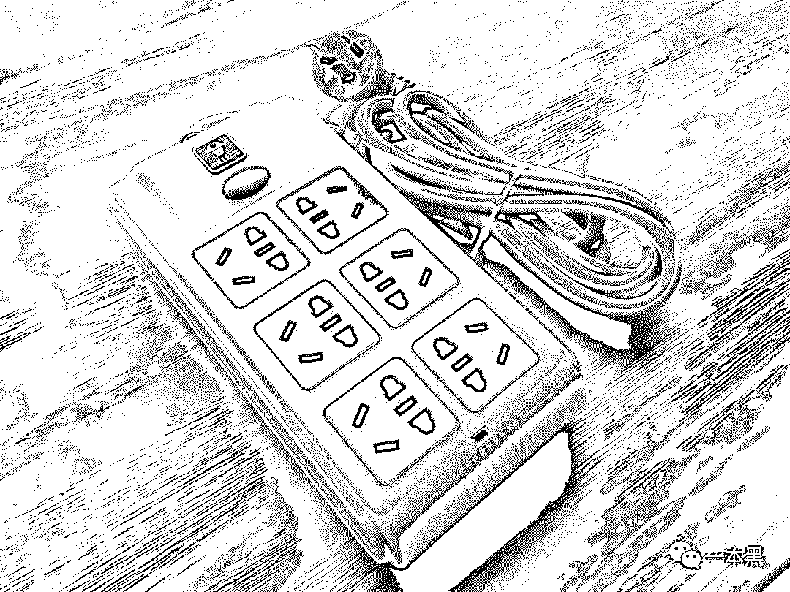
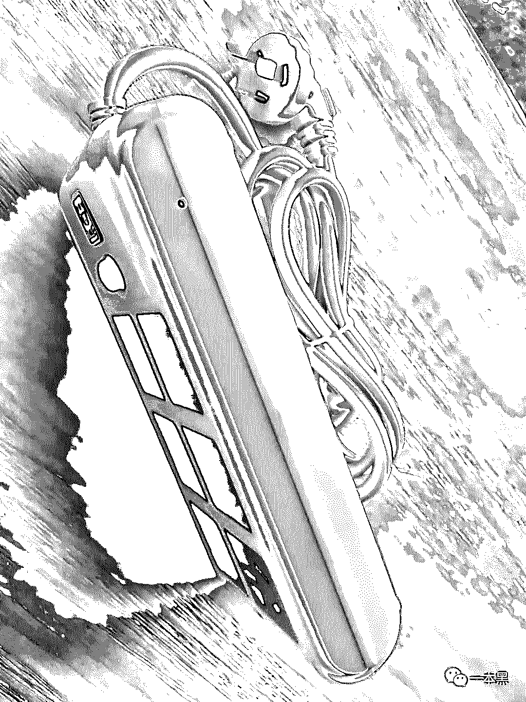
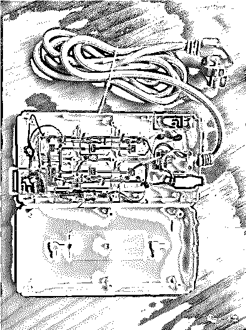
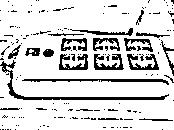
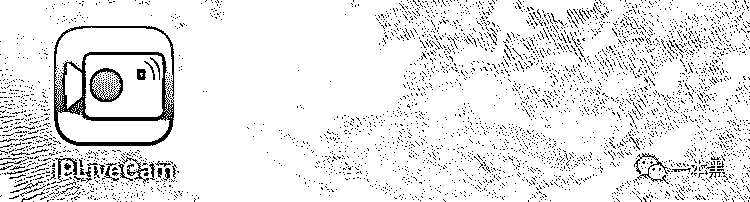
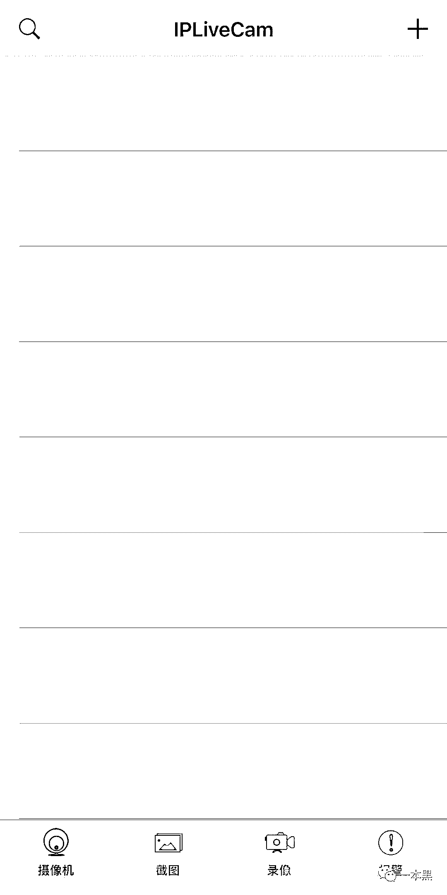
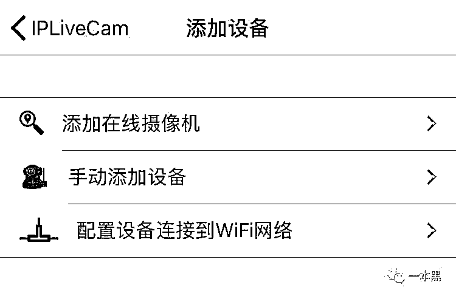
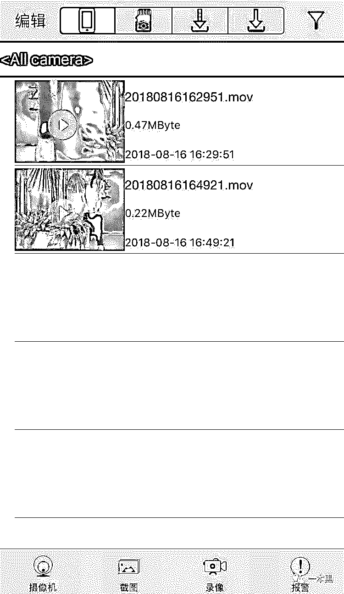

# 裸体偷窥、监听定位，请留意那些不起眼的小物件

> 原文：[`mp.weixin.qq.com/s?__biz=MzU4ODAwNzUwMQ==&mid=2247484480&idx=1&sn=930589abc87c688df2ec3fbca8449bf6&chksm=fde21562ca959c745ff29ada1bd2f6772cd417c98705000bebaff7c1a49538be1531ba2487f9&scene=27#wechat_redirect`](http://mp.weixin.qq.com/s?__biz=MzU4ODAwNzUwMQ==&mid=2247484480&idx=1&sn=930589abc87c688df2ec3fbca8449bf6&chksm=fde21562ca959c745ff29ada1bd2f6772cd417c98705000bebaff7c1a49538be1531ba2487f9&scene=27#wechat_redirect)

从偷窥到监听，那些含有隐晦、暴露的照片或视频已然成为看客脑中的幻想品，当隐私不再成为隐私，人们仿佛像原始社会的物种一样。

行走在大地之上，却又裸露在天地之间。

从偷窥到监听，那些含有隐晦、暴露的照片或视频已然成为看客脑中的幻想品，当隐私不再成为隐私，人们仿佛像原始社会的物种一样。

行走在大地之上，却又裸露在天地之间。

5 年前，美国的“棱镜门”事件一经曝出，瞬间成了爆点，而作为普通公民，大部分人，在关注事件后续进展的同时，也在暗暗窃喜自己的平凡。

殊不知，“情人眼里出西施”，你的隐私也许够不到国家关注的层面，却很可能被身边的人盯上。

从复制与对方一样的卡，到手机监听软件，再到花样翻新的监听器，它一步步从街边铺天盖地的小广告、疯狂轰炸全国人民的诱惑短信，升级到了如今众多电商平台中的热销商品，一次次撩动着不安分的人心。

之前，很多媒体都报道了伪装成充电器、数据线等商品的窃听器，这些“伪装者”的某些部位，都暗藏一个 SIM 卡卡槽，只需要插进一张电话卡，它就变身成为窃听器，你只需要用自己的手机向手机卡发送不同指令，就可以对其使用者进行位置和语音的实时监控。

而近日，我发现了一款声称不用插卡也能实现监听、录像和定位的物品，相较于插卡类窃听器，它的隐蔽性更佳，而它的用途介绍，虽然披着防走丢一类“善意”的外套，但依然掩盖不住其心机的内在 。

其实，“监控”一直就在我们身边，从未走远，它也从来不是高高在上，而就近在你我身边。

**摇身一变，排插成监听器**

经过多方询问，才找到一个据说比较靠谱的卖家，本想讨价还价一番，结果被一句「恕不议价」怼了回来，为了揭开真相，还是忍痛斥巨资，买下了这款集监听、定位、拍摄于一体的利器——排插。

几天后，我收到了这款排插，拆开快递包装一看，呦呵，还是公牛，只是细节处，隐约散发着一股山寨气息，别的不说，全长根本没有 3 米，最多 1.5 米，虚假宣传。

肉眼看这个排插的外观，右侧面有一个小孔，除此之外，没有任何异常。

赌一包辣条，这个集三大功能于一身的排插，一定不会这么简单。

果不其然，经过拆解，除了常规的构造外，我发现了隐藏在其中的摄像头和麦克风，此外，还内置了一个无线模块。

从整体构造来看，它只不过是在普通插排的基础上加了一个针孔设备而已，据老师傅所说，这个插排算是比较简单且粗暴的监控设备。

主要由三部分组成，第一部分是稳压器，因为它和插排连接在一起，自然需要调整电压；第二部分是树莓派（你可以把他当成一个只有银行卡大小的微型电脑），别看它外表“娇小”，实际上它是很强大的，可谓是“麻雀虽小，五脏俱全”。

第三部分当然还有那只偷窥的“眼睛”——针孔摄像头。（这三部分分别对应上图所示位置。）

组装复原后，把它接上电源，打开开关，这个排插立即开始了它的表演。

等待几秒后，一个红蓝交替的光点出现，并持续闪烁，这代表排插已经开启 AP 热点，可以开始配置网络。

这是整个测试过程中，它唯一异于普通排插的地方，而它也只是在初始连接时才会闪烁，设置完毕后，它便不会再亮起。

随排插寄来的，还有一本极其简陋却还强装正规的操作指南，按照指示，我在 Apple Store 中找到并下载了这个叫做 IPLiveCam 的软件。

准备工作已就绪，接下来，打开手机的无线局域网，列表中会出现这个排插的 AP 热点，名称是由一连串数字和字母组合而成，点击输入密码完成连接。

连接成功后，手机就已经接入到排插的 AP 热点，此时打开刚才下载好的 App，界面简陋到让人怀念 UI 设计师的美好。

点击右上角+号，可以通过三种方式添加设备。

我这次选择的是第二种手动添加，输入 UID 和密码，这就完成了手机和排插摄像头的第一次连接，然后，可以在软件中更改摄像头的 Wi-Fi 设置，即可将它连接到房间的网络。

总结来说，就是先把手机连接到排插的热点，然后通过软件，添加摄像头，实现手机和摄像头的联动，当排插从里到外都认识你了之后，你就可以教它加入到你自己的 WiFi，毕竟信号更加稳定。

当看到设备的状态为在线时，摄像头就开始按照我摆放的方位，开始进行“拍摄”工作了，在这个过程中，可以随时用手机控制是否同时录音，是否录像等，录制下来的文件会存储在手机中，可以随时查看。

在软件中，还可以配置可以自行设定，比如录像模式，分辨率等，你还可以设置接收文件的邮箱地址或者服务器等等，总之，功能还是比较到位。

实验了监听和偷拍，但别忘了，插排还有一个功能，就是定位。

说到定位，我们最先想到的应该会是手机。

手机的定位功能大多是通过基站、GPS 等方式来实现的，文章开头所提到的插卡式监听器，其实它就相当于一个移动通信设备，所以它的定位实现方式与手机大致相同。

那么这个无需插卡的排插，又是如何实现定位功能的呢？

不知各位有没有这样的经历。当你出门在外，使用蜂窝网络上网的时候，有时需要使用地图等软件，却发现软件的定位和自己所在的位置，有较大的误差，更甚者，根本无法定位。但这时，如果你开启 WiFi，即便手机没有接入任意一个网络，但你的定位却变得准确多了。

这是因为每个热点都有自己的位置信息，这些信息会汇成一个数据库，所以智能设备依靠周围的 WiFi 就能进行定位。

这个排插正是靠着内置的无线模块，才实现了精准度较高的定位功能，可以记录下活动轨迹。

 [`v.qq.com/iframe/preview.html?vid=o1347y0jcx5&width=500&height=375&auto=0`](https://v.qq.com/iframe/preview.html?vid=o1347y0jcx5&width=500&height=375&auto=0) 

你看它只是个充电用的排插，但它却自有一方乾坤天地，能听能看能追踪。

如果你觉得这个插排只能放在家里，定位功能是个鸡肋，别急，还有充电宝、打火机、眼镜等物品，在外观上可以说做得相当的隐蔽。

而这些与时俱进的监控设备正好满足了那些有窥探欲望的人群，他们可以把这些设备大方的放在显眼的位置光明正大的进行偷窥。

当然，事物的好坏是有两面性的，这种设备如果用在正途，比如记者暗访、警察取证，那他就体现出该有的正面价值。

然而，这种窥探设备更多的是被“有心人”用在不法途径上，那些出租屋暗藏摄像头、酒店暗藏摄像头的例子已经数不胜数。

世界之大，却藏不住一点隐私。

写在最后

人们总说“技术无罪”，有罪的是人。 但奇怪的是，有罪的人总能为自己的行为找到说辞，而受害者只能蒙蔽其中，“甘愿”成为窥探者眼中的消遣品。

世界著名心理学家弗洛伊德说: 每个人的潜意识中都有偷窥他人的欲望。

但人之所以为人，就胜在能够控制自己的欲望。

那些企图通过监视来获取安全感、满足精神需要的人，忽略了最根本的一点：人性，是禁不住试探的。

**这个世界上，总有人偷偷爱着你、的隐私。**

**如此，你怕了吗？**

还原事实｜专扒黑产

微信 ID：darkinsider

知乎 一本黑

头条 一本黑

投稿、爆料、招聘、转载

请点击菜单**【联系我们】**