# 深夜色情小广告从何而来？网络弹窗牛皮癣来者不拒

> 原文：[`mp.weixin.qq.com/s?__biz=MzU4ODAwNzUwMQ==&mid=2247484422&idx=1&sn=830263eff9b072530b5001be1763a474&chksm=fde21524ca959c321984e304fbc8a5719b43c57a0a5b0be0a779535a917c7ca304db48f6ccd2&scene=27#wechat_redirect`](http://mp.weixin.qq.com/s?__biz=MzU4ODAwNzUwMQ==&mid=2247484422&idx=1&sn=830263eff9b072530b5001be1763a474&chksm=fde21524ca959c321984e304fbc8a5719b43c57a0a5b0be0a779535a917c7ca304db48f6ccd2&scene=27#wechat_redirect)

**一本黑**曾在去年年初的时候发布过一篇《上了个“假”黄网，误入七亿黑产大门》的文章，里面讲的是振宇和老师傅**为了看个片，把黄网给黑了**的故事。（当然，前半句是玩笑话）

事情是这样，那天晚上振宇翻来覆去怎么也睡不着，于是拿出手机说刷刷新闻吧，当他点开一篇关于未来房价走势的文章时，手机页面底部弹出一个伪装成 QQ 消息的广告链接。

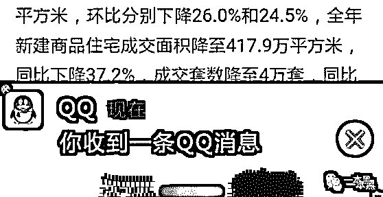

对于大部分人来说这种广告链接早已司空见惯，选择无视或者关掉就行。但振宇看着怎么跌都买不起的房价，瞬间觉得生无可恋。

于是他随意点击进去，想看看这到底是个什么样的广告。

在他点进去之前，脑海中闪过几种可能，这可能是房地产，又或者是电商网站的广告。

然而，事情远比他想象的还要刺激......

（截图太暴力就不放了）

这居然是一个看片网站，不堪入目的画面和热闹的评论区布满整个屏幕，这对振宇来说真是灾难啊，他还是个孩子。

怀着忐忑的心情点击进入，但看了 30 秒以后视频就暂停了，提示要想继续观看得升级为黄金会员......

秉着探索的精神，振宇花几十块充值了会员，可看了十几秒视频又暂停了，这次要求需要升级为黑金会员......

......

后面的事情就不多提了，最后老师傅把这个黄网给“黑”了，发现这个网站层层诱导用户付费观看，但却没有“真材实料”，明摆着欺骗善良可爱的老百姓。

另外，老师傅还在对方的“秘密基地”看到了对方每日的付费金额和下载量，发现光是安卓的充值额就高达两百五十多万。

一年算下来，怎么也得有个上亿了吧。

我知道你们看得很激动，但这不是今天的重点，深呼吸，喘口气......

后来在聊天中，我和老师又无意间说起这个话题，多了个疑问，**这些弹窗小广告是从哪里来的？**

**你看到的广告都是别人想让你看到的**

**作者/东东**

要说在上网的时候最烦遇到什么情况，那一定是弹窗小广告。

这种小广告可谓无处不在，它频繁的出现在你所浏览的任何页面中，当你在认真办公或者观看视频的时候，突然弹出的广告页必然会一扫你的兴致。

大多数人的第一反应肯定是点击 X 关闭，可没想到这个 X 却是伪装出来的，真正可以关闭的 X 则很小的隐藏在广告页的一角。

这就会导致失误而直接跳转到弹窗广告所链接的广告界面，要是在公共办公场地，一个不小心点开而且还是那种辣眼睛的色情广告，这就很尴尬了。

互联网上那么多非法弹窗小广告到底是谁在暗中操作，这背后是不是又有一条不为人知的产业链。

通过在搜索引擎搜索关键词，我发现排在前列的基本都是可以做弹窗广告的公司，于是我伪装成广告主和他们取得了联系。

对方表示，他们专做弹窗广告已经五年了，接触过大大小小的客户，包括现今几个比较大的网站和产品。

客户只需要提供落地页的链接即可，图片素材都由他们的美工自己制作。

曝光的价格是千次 5 元，点击是 0.12 元，一般由他们代运营，因为有技术部做支持，可以进行一些优化。

用对方的话来说就是：“广告投放我们是专业的。”

并且广告主可以在后台自助设置每日的限额和投放的时间段，也就是说**别人想让你什么时候看见他的广告，他说了算。**

另外，这种广告移动、联通、电信三网都支持，并且可以选择投放在移动端还是 PC 端，连 360 这种软件都屏蔽不了。

当我问及能否投放黄色网站时，对方直言不讳，当然可以，“我们主要接的是菠菜、棋牌、直播、网赚和金融类的客户，都会选择投放 X 站。”

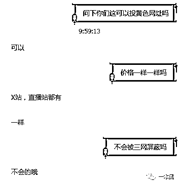

并且对方表示，他们和 X 站是有稳定合作的，不存在会被屏蔽的可能。

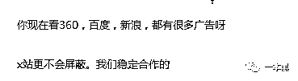

随后，我提出测试，对方说可以试挂，提供落地页就可以，我随意找了个小额贷的详情页给对方发过去，没过几分钟对方就说搞定了，并给我发来广告投放的网站。

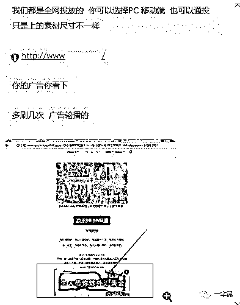

广告挂在一个黄色网站里，是一个弹出框的形式，并且每次刷新进入站内显示的广告都不一样，我也是刷新了几次才看到给对方提供的广告页。

从提供广告页到完成投放，整个过程不到十分钟。

但这只是试挂，给客户看效果的，一般的流程是对方把广告主的广告打包出去，由合作的站点自行领取任务进行投放。

另外，在套路对方如何做到三网运营商为何没有屏蔽这个问题时，对方避而不谈，而是很隐晦的说真正的广告公司不可能被屏蔽。

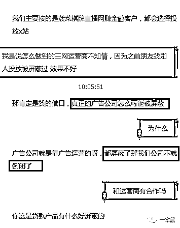

到这里我突然想到前段时间极验的朋友 Magiccc 也做了一个关于运营商遭劫持的一个调查。

（以下是截取的部分内容）

> > 当谈到与电信方面的合作方式，工作人员向我们透露，他们与电信旗下的号百公司有合作关系，电信弹窗推广都是通过这一公司进行投放。
> 
> > 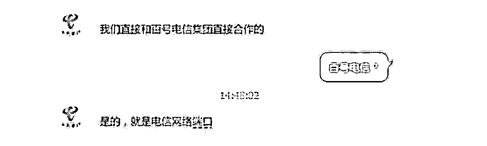
> > 
> > > > 通过公开资料显示，号百公司除了负责号码查询的日常运营外。还涉足信息定制、精准广告甚至团购业务。
> > > 
> > > > > 早在 14 年就有用户指出，电信旗下的号百公司涉嫌进行流量劫持。遭遇强制跳转的用户查询了跳转页面的域名信息，发现上述域名均由号百公司备案注册。
> > > > 
> > > > > 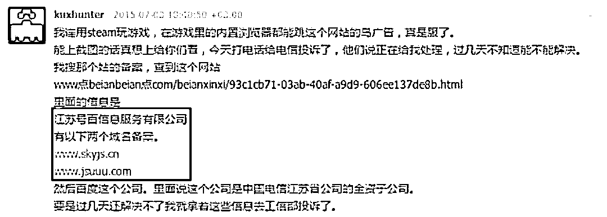
> > > > > 
> > > > > > > 图中网友提到的“江苏号百信息服务有限公司”，就是中国电信全资子公司。而我们调查的公司同样位于江苏，不知这一情况是否只是巧合。
> > > > > > 
> > > > > > > > 上述相关证据显示，作为电信集团旗下的全资子公司，号百公司存在着较大的流量劫持嫌疑，极有可能是流量劫持行为的罪魁祸首！
> > > > > > > 
> > > > > > > 至于电信子公司是否内外勾结进行劫持交易，这里暂且不谈。
> > > > > > > 
> > > > > > > 在和对方的聊天中得知，成功交易的客户会有一个后台，可以控制自己所投广告的投放时间、区域等。
> > > > > > > 
> > > > > > > 但是想要开户的话是需要预存广告费 5000 块的，所有的资费数据以及广告投放情况都可以在后台看到。
> > > > > > > 
> > > > > > > 我很想去他们所谓的后台看看，他们到底是如何只需要一个广告页就可以全网任意投放的，让无数网民深陷烦恼中的，但是花这么多钱看个后台是不可能的。
> > > > > > > 
> > > > > > > 所以，我给老师傅递了一根烟，芙蓉王，老师傅俗称社会烟......
> > > > > > > 
> > > > > > > **贷款、菠菜、色情、互联网上的牛皮癣**
> > > > > > > 
> > > > > > > 在老师傅以往的打黑经历中，这种网站根本不值得一提，还是熟悉的操作和流程，老师傅把收集到的有效信息挨个试了一遍，最终发现对方的某个后台账户居然存在弱密码。（很简单的密码）
> > > > > > > 
> > > > > > > 老师傅把烟往烟灰缸里抖了抖说：“看来他们这防护措施做得不到位啊。”
> > > > > > > 
> > > > > > > 登陆进入后，首先映入眼帘的是后台首页，里面显示了当日、昨日以及当月的支付情况，还有账户的余额。
> > > > > > > 
> > > > > > > 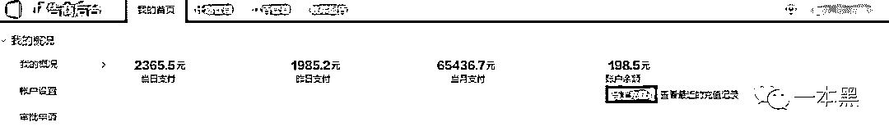
> > > > > > > 
> > > > > > > 我们都知道，不管是在手机端还是 PC 端，这种弹窗广告都屡见不鲜，来看看别人是如何实现的吧。
> > > > > > > 
> > > > > > > 在广告列表里，每一个新建的广告是可以选择所投放广告的类型的。
> > > > > > > 
> > > > > > > 是需要弹窗广告还是悬浮广告，是在安卓端还是苹果端人家都可以很简单的进行设置。以此达到精准投放的效果。
> > > > > > > 
> > > > > > > 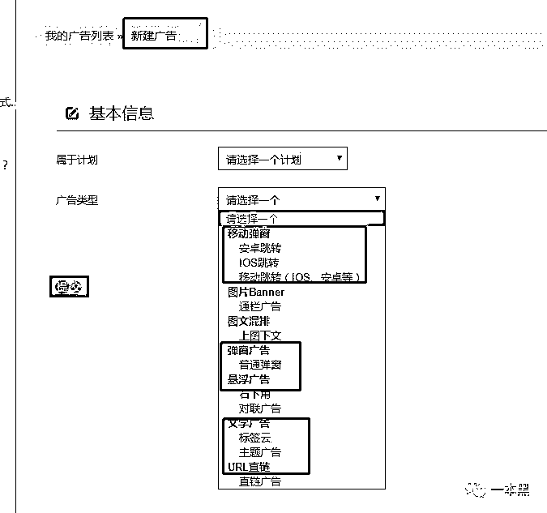
> > > > > > > 
> > > > > > > 另外，根据具体投放的产品，也为了能更加精准的投放，这里面还可以进行投放区域的选择、投放网站的类型、以及投放的时间周期。
> > > > > > > 
> > > > > > > 这就有效的保证了在什么时段、什么区域、什么网站上出现这个广告，拿之前那个黄色网站来说，他们一般会选择把这种广告投放在三四线地区、投放类型一般是安卓端，最主要的时间一定是晚上。
> > > > > > > 
> > > > > > > 至于为什么，大家都懂，我就不多提了。
> > > > > > > 
> > > > > > > 这也就是为什么你会频繁的在深更半夜看到这种黄网弹窗，而在白天的时候一般都是金融以及其他类的广告。
> > > > > > > 
> > > > > > > 
> > > > > > > 
> > > > > > > 在该后台中，可以看到广告主投放的大多是贷款、菠菜等广告，但每天的投放量不是很高。
> > > > > > > 
> > > > > > > 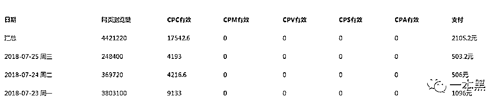
> > > > > > > 
> > > > > > > 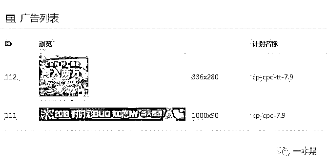
> > > > > > > 
> > > > > > > 到这里基本上已经很清楚，这些互联网的牛皮癣是如何出现的，首先广告主把具体的广告页添加到广告项目中，然后这些广告项目会被打包发给合作的站点，合作站点领取任务在相应的网站投放。
> > > > > > > 
> > > > > > > 至于三网运营商是否勾结其中参与合作，仅根据对方工作人员透露的信息和网上的零碎信息也不能有个肯定的回答，所以一本黑也不敢贸然断定。
> > > > > > > 
> > > > > > > 因为，我们面对的不仅仅是简单的黑产。
> > > > > > > 
> > > > > > > 现如今，弹窗广告基本已经成了每个网站的必备“标品”，不仅污染着整个网络环境，而且越来越影响网民的上网体验。
> > > > > > > 
> > > > > > > 色情广告就不用说了，甚至还有丧心病狂的广告含有诈骗链接或是病毒木马，一个不小心手机就有可能中毒。
> > > > > > > 
> > > > > > > 所以，对于这种烦人的弹窗广告，你除了可以针对运营商进行投诉反馈，也可以安装一些广告屏蔽软件，虽然不能全方位的屏蔽，但多少还是能起到一定的效果的。
> > > > > > > 
> > > > > > > 又是一个辗转反侧、难以入眠的夜晚，我一如既往的拿起手机刷新闻，还是一篇关于房价的文章，还没看完底部就又弹出一个广告来。
> > > > > > > 
> > > > > > > 这次我没有点开，而是扒拉完剩下的文章，就关掉了手机。
> > > > > > > 
> > > > > > > 心想，去他妈的吧！
> > > > > > > 
> > > > > > > 还原事实｜专扒黑产
> > > > > > > 
> > > > > > > 微信 ID：darkinsider
> > > > > > > 
> > > > > > > 
> > > > > > > 
> > > > > > > 知乎 一本黑
> > > > > > > 
> > > > > > > 头条 一本黑
> > > > > > > 
> > > > > > > 投稿、爆料、招聘、转载
> > > > > > > 
> > > > > > > 请点击菜单**【联系我们】**