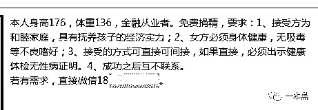
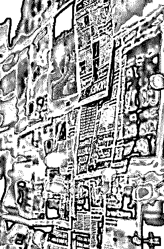
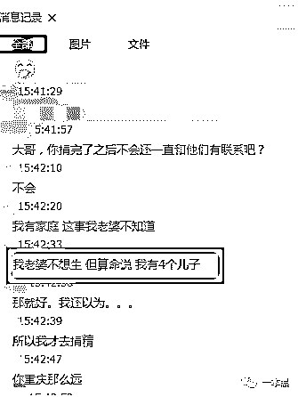
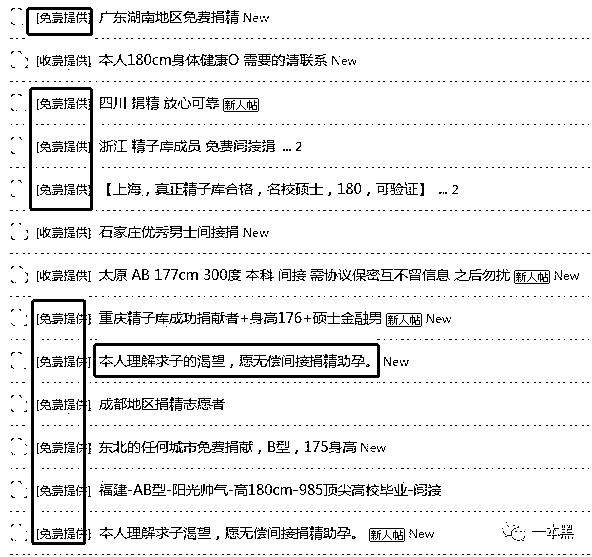
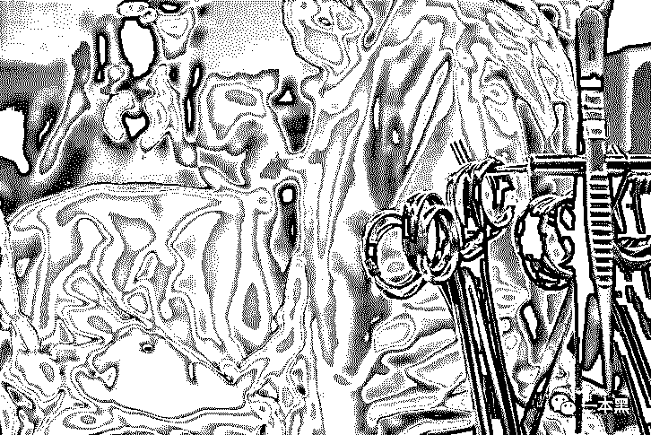

# 非法捐精、直接发生性关系，暗藏地下的人类繁殖计划

> 原文：[`mp.weixin.qq.com/s?__biz=MzU4ODAwNzUwMQ==&mid=2247484405&idx=1&sn=1c7e7dfb352f0b6753730d168aa481e9&chksm=fde212d7ca959bc1fff3e466ca75f19b56bd2285ed02a2f5b8e80f367a2bf7941ca6f5723e58&scene=27#wechat_redirect`](http://mp.weixin.qq.com/s?__biz=MzU4ODAwNzUwMQ==&mid=2247484405&idx=1&sn=1c7e7dfb352f0b6753730d168aa481e9&chksm=fde212d7ca959bc1fff3e466ca75f19b56bd2285ed02a2f5b8e80f367a2bf7941ca6f5723e58&scene=27#wechat_redirect)

> **这是一本黑【****故事****】系列的第****八****篇文章，内容全部取材于真实故事，鉴于某些题材的敏感性会做一定的修饰加工，真实度 90%以上，采访形式包括但不限于线上采访、线下沟通、亲身经历、“死缠烂打”......**

酒吧的觥筹交错不足以掩盖暗处的虚假交易，在关上门的那一刹那，这个酒吧隔间的小房间顿时就多了些暧昧不清的气息。

他走近坐在床上的女子说：“来吧，让我帮你完成生儿子的梦想。”

这句话理所当然被酒吧强劲的音浪所掩盖，随之而来的是两人欲火焚身般的交融合一。

等等，你是不是以为这是一场酒吧里再正常不过的色情交易，然而并不是......

女子结婚多年，至今无法怀孕，但他想要一个孩子，在和丈夫商量过后，他们在某“捐精论坛”联系上了这位愿意捐献自己精子的男子。

男子要做的就是取出自己的精子交给女子，然后女子用注射器将精子推送到自己的体内，以此达到怀孕的目的。

在整个地下捐精产业链里，直接受精怀孕的成功率要高于间接受精，所以不少女子会选择和捐精者直接发生性行为。

当然，在整个过程中捐精者会拿到一定的捐精费用，但也有免费提供精子，并要求采取**直接**捐精方式的人群。

显而易见，这样的方式在本就混沌不清的地下捐精市场恐怕是心猿意马，醉翁之意不在酒。

**求子心切，与陌生人发生性关系**

**作者/东东**

年近四十，我渴望拥有自己的孩子，但碍于种种原因，这一愿望至今无法实现。

我不怪自己的丈夫，这是命，但我不信命。

三年前，本该去医院正规精子库受精的我决定放弃了这一想法，一来害怕泄露自己的信息，二来不想让亲戚朋友知道，你也知道像我们这种思想封闭的小地方，面子是很重要的。

但凡是一件不光彩的事，有的能给你说没，没有的当然也会无中生有，坍塌的舆论必将导致一个人低人一等。

我是以一名捐精者的身份联系上顾丽（化名）的，当时正在找这方面的素材，也是想更深入的了解这一群体的边角人物，所以在某捐精论坛找到了曾经发过贴的顾丽。

表明身份后，我向顾丽提出采访的要求，她理应是拒接的，这一点不足为奇，谁也不想透露自己的身份信息以及这种不算什么光彩的经历。

但在我说明了**一本黑**这个群体以及正在做的事情后，她逐渐打开心扉，同意讲述自己接触地下捐精的经历......

第一次求精是在 QQ 群，那时候也是无意间知道的地下捐精，相比去医院做正规的，这种地下的没有那么麻烦，也不会在医院留下任何信息，这是我当时主要考虑的地方，就是害怕暴露自己。

QQ 群里捐精和求精的各一半，一进群就有人发出有偿捐精等信息，来者一般都会表明自己的身份，有无成功案例等。

当然我没有那么快下决定，我在群里观察了一段时间，从聊天中可以看出哪些人比较真诚，以及成功案例是否靠谱。

在聊过的大部分人中，我选择了一位感觉比较靠谱的捐精人，一来从聊天的感觉上他不会像其他人一样热情，可以看出他捐精只是为了报酬；二来我俩身处不同的省份，这样可以最大限度的避免以后产生纠纷的可能。

和老公商量过后，我们就买了飞去 X 省的机票，按照对方给的地址找过去，是一家快捷酒店，见面第一句话就是：“开房费用你们这边到时候记得给我报（报销）一下噢。”

那天下了点小雨，地上湿漉漉的。

虽然比较直白，但好歹能给我一种踏实的感觉。

对方刚好三十岁，高学历，在一家金融公司上班，这些在来之前当然都是事先沟通过的，各方面条件都比较符合要求。



对了，一开始就说好是采用间接的方式，所以他开了两间挨在一起的房间。环境和普通的酒店没什么区别，就是刚刷卡进门的时候发现地上还躺着两张小卡片，应该是那些招嫖人员的杰作。

生怕酒店提前有人布置摄像头之类的东西，所以我们进门后第一件事就是仔细地检查了一遍。什么都没发现，倒是手上抹了一层灰。

没多久对方就敲门过来了，手里拿着一个透明的小试管。当时我就在想怎么这么快，我们这才坐下没多久。

不知道当时带着的是什么样的一种心情，我记得我是双手去接的，害怕掉在地上摔了。另外能明显的感受到试管上的余温。

注射肯定是当场就得完成，用的是注射器推送。完事以后按照约定付给了对方 1500 元钱外加开房的费用。

本以为这样就能顺利怀上，可当来了（生理周期）的时候我就知道肯定是失败了。

最后才知道原来捐精那人在我们去 X 省之前才给另一对夫妇提供了精子，这后面的质量当然就不会高，他妈的就是为了赚那点小钱，太瞧不起他了。

那之后分别又找了两个人，可是都以失败告终，找不出是什么原因，可能是年龄大了吧。

老公告诉我说要不算了吧，可能咱就没有这个命，实在不行咱去领养一个也成。

他因为身体原因很自卑，加上几次的失败，更让他觉得无地自容。

所以后来我下定决心瞒着老公再找一个，这次就来直接的，他妈的都到这份上了，我就不相信了。

你别说这个圈子里乱得很，大部分人都是打着捐精的口号实际上却是想约炮占别人便宜。乐意捐精不为别的那种人少之又少。

最后找的那人聊了快半个月，我提出的采用直接的方式，他反而还觉得怕有危险，让我去体检给他拍体检报告什么的。

确定后我以出差的名义去了对方提供的位置，他是一家酒吧的老板，最后我们是在他酒吧隔间的小房间里完成的交易。



酒吧的氛围反而让我不安的心多了些沉稳，可能昏暗的灯光和嘈杂的音乐会掩盖掉我正在做的这件荒唐事，也可能会避免掉和一个陌生人产生性行为的尴尬。

总之，不会觉得太别扭，算是自己给自己的心理安慰吧。

完事后我向他付了 2000 元，他说“算了吧！”

“这只是交易，事先说好的。”说完我就走了。

至于后续如何，顾丽并没有再回复我，再经历了前三次间接受精失败后，他不惜下定决心和陌生人发生性行为可以看出，她是多么渴望能拥有自己的孩子，我想这和她所处的环境有莫大关系，年迈父母的渴望，无助老公的自尊......

当然，不会有任何人理解这种行为......

**暗箱操作，一门靠精液获利的生意**

我自我介绍一下，今年 28，身高 183，体重 75KG，成功让两对拉拉（女同性恋）受孕。

先给你说清楚，我并不会像论坛内那些免费提供精子实际上只想约炮的人，我这边也是收费的，红包根据实际情况给，一般都是看对方给多少，没有个定数。

张扬（化名）在一家培训中心工作，说自己对外捐精的目的很单纯，只是希望自己能多有几个孩子，找到他的途径当然还是在某论坛，顺着所发帖子留下的号码，我以一名需求者的身份加上了他。

我这里按照过往的经历来说一般都是采用间接方式，就是把精液放到注射器里，然后让对方推进去就行。

毕竟人间需要大爱嘛，自己有能力提供当然乐意帮助那些有需要的家庭。

但我也不是那种随随便便就给人提供的，大家都得坦诚相待不是，肯定事先得问清楚对方是否有遗传疾病、传染病什么的。

要是身体有问题我是绝对不会提供的，毕竟这样以后出来的孩子是会有问题的。

说起来你可能不信，我这人比较信风水，算命的给我说我会有 4 个儿子，但是老婆又不想生，所以我才会去捐精，算是完成自己的使命吧。



第一次捐精是两年前，在珠海给一对拉拉（女同性恋）提供的，具体是在 QQ 群还是论坛联系的我忘了。

那次挺成功的，除了应得的报酬之外对方最后还给我发了红包表示感谢，反正就觉得挺有成就感的。

成功案例肯定是会给自己加分的，但凡有人联系上我，只要说自己曾经怎么怎么，那么能达成交易的可能性就会高许多。

但也不是百分之百就能成功的，有对拉拉，我提供了一年才怀上，最快的有两个月就能怀上的，都是运气问题。

这里面分为直接方式和间接方式，相对来说直接方式，就是直接和需求者发生性行为的方式是会比间接方式的成功率高一些，但也不会高太多。

你看不管是 QQ 群还是论坛，愿意捐精的人大把，但是我敢保证这里面百分之九十以上的人目的都是不纯的。



他们伪造身份，包装自己是名牌大学毕业的高材生、在某知名企业当高管，曾经成功让某某受孕等等。

总之一有求助者进群他们就会把自己的介绍发出去，声称免费捐精，不为别的，只为传播爱。

还时不时的在群里发小黄图，这明眼人一看就知道是想约炮占别人便宜。

一群豺狼虎豹，猥琐得很。

以上说的都是个人通过 QQ 群或者论坛单线联系，这在整个地下捐精江湖里面只能算是小儿科。

但凡那些见不得光的行业里一般都会有黑话，捐精市场当然也不例外，这里面有个黑话叫“蛇头”，你可以把它理解为中介的意思。

“蛇头”连接医院和捐精者，有些能做授精手术的医院会在求精者确定手术后联系“蛇头”，“蛇头”下面有很多能捐精的资源，接到单子便会通知这些人来捐精。

中国求精的家庭一抓一大把，这是一块肥肉市场，医院当然会抓好，对消费者就说这些精源都是来自某某精子库，但在我们这个圈子里，是真是假大家都是有数的。

手术当天，捐精者会被安排到医院的某个房间现场提供精液，然后医务人员会在最短的时间把精液送到正在手术的医生手中以此完成授精手术。



相比单线联系求精者，在医院这里得到的报酬就会高许多，但是这其中会扣掉一部分分给“蛇头”。

这笔报酬相对医院的收益来说并不算什么，他们只是想赚这其中的手术费而已。

而这种手术也不是有十足把握成功的，对求精者来说，失败了就失败了，但手术一旦成功，他们必然是分外高兴的。

于是你就会看到有人拿着锦旗屁颠屁颠的跑到医院，上面写着：“医德高尚，妙手回春，医术高明，送子神医。”

真他妈扯淡。

捐精江湖不仅尔虞我诈，它更像一面“照妖镜”，镜子里面的大部分人们裸露着身体，眼前摇摇晃晃的武器等待着上钩的猎物，而猎物本身也知道此路凶险，却不得已偏向此行。

里面的伦理道德我无法用言语来形容，只是听了他们讲的这些故事后，我突然觉得这个世界挺他妈操蛋的。

不知道你们怎么看。

还原事实｜专扒黑产

微信 ID：darkinsider

知乎 一本黑

头条 一本黑

投稿、爆料、招聘、转载

请点击菜单**【联系我们】**