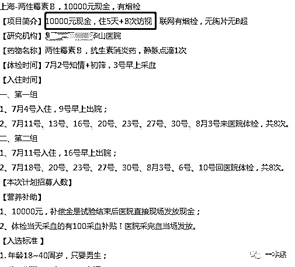
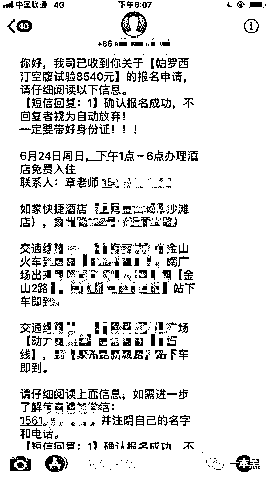
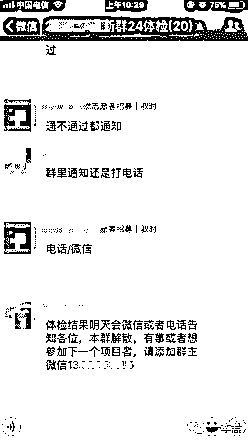
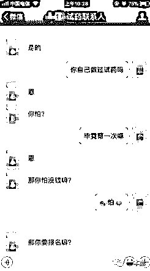
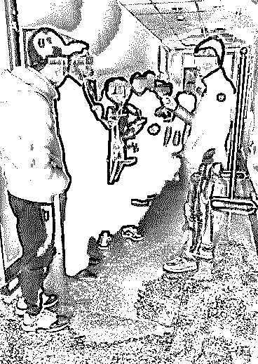
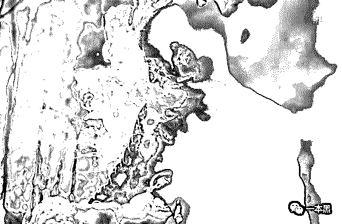

# 出卖身体，以身试药，他把吃药当成自己的职业

> 原文：[`mp.weixin.qq.com/s?__biz=MzU4ODAwNzUwMQ==&mid=2247484378&idx=1&sn=e70e56f89ea507982668e40679b275b0&chksm=fde212f8ca959bee35293a1532db408ed8d7ffefe6eabdaf1b3b6b7bec2cd06bbd62506bc71b&scene=27#wechat_redirect`](http://mp.weixin.qq.com/s?__biz=MzU4ODAwNzUwMQ==&mid=2247484378&idx=1&sn=e70e56f89ea507982668e40679b275b0&chksm=fde212f8ca959bee35293a1532db408ed8d7ffefe6eabdaf1b3b6b7bec2cd06bbd62506bc71b&scene=27#wechat_redirect)

在一本黑新开设的故事栏目中，我们写过给钱办事、怀孕打胎的色情从业者；写过铤而走险，吞下避孕套包裹的毒品，以此续命的小刀；还有因赌博走上非法制造假币道路的毛狗......

他们无不因金钱而选择别样苟且，表面上看似“得过且过”，可实际却又过得“惨绝人寰”。

今天要讲的是一个游离在城市、神秘且让人心为之一颤的群体。同样是出卖自己的身体，比起色情从业者，他们能获得更高额的报酬。

他们不愿公开自己的身份，每当药物公开上市前，他们化身“小白鼠”以身试药，用自己的健康作为赌注，消耗身体的同时，也把“试药”作为自己的职业。

他们叫——**职业试药人**。

据说这些职业试药人大部分以九零后为主，仅仅为了能短时间获得几千甚至上万的收入而选择成为药物上市前的测试者。

但在获得高额报酬的同时，他们的身体或多或少会出现一些奇怪的症状。

这次，我找到了曾经做过试药工作的王涛，用他的话来说，试药两年，赚钱轻松，但失去的远远不是金钱所能弥补的。

**吃药来钱快，一周赚 8000**

**作者/东东**

从最开始找工作的不顺利开始，王涛心中那种偏激、想要一蹴而就的想法就开始蠢蠢欲动。

看着身边朋友光鲜亮丽的生活，他早已耐不下心思等待每个月微薄的实习工资。

与其说他渴望过上别人那种小资般的日子，不如说他渴望金钱给他带来更多的满足感。

“那时候就是穷嘛，刚毕业就进了一家私企做实习生，工资少得可怜，交完房租水电基本不剩。看着朋友圈曾经的同学一个个过得那么好，自己的落差感很大。”

你也知道没有对比就没有伤害。

但我就是不信啊，凭什么他们就能过得那么好，我只能像个屌丝一样，吃个炒饭都只能吃八块的。

无聊顶多看看直播，意淫下心中爱慕的小姐姐。

多余的娱乐活动是不可能有的，除非蹭吃蹭喝，我这人也虚荣，有时候特别怕别人在背后说我，挺没面子的。

有一次无聊闲逛，经过路边的宣传板就随便扫了一眼，上面贴着很多 A4 大小的宣传单，有招租的，有健身宣传的。

其中一个数字引起了我的注意：**“营养补助：8000 元”**。我马上停下来仔细看了看这张传单，第一感觉是不可思议，怎么会有这么高报酬的工作，而且还是兼职。

第二感觉就是“遭了，这是心动的感觉”。对，你没有看错，就是心动加小激动，对于那时候一个月工资三千块的我来说，8000 元确实有足够大的吸引力，更别说一个交完房租水电基本所剩无几的“无产阶级”了。

而且当时我仔细看了，周期只要 8 天左右。就这样，“**临床试验自愿者**”第一次进入了我的视野。



“然后你就开始去做试药了？”王涛看起来有些瘦弱的坐在我面前，眼前的咖啡已经过半，杯口可以清晰的看见他的唇印，讲到这他应该很激动，所以急忙喝了几口。

看了看周围，然后又说。

没有，哪有这么快，当时仔细看了好多遍，突然又感觉这会不会是假的，甚至还联想到了割肾什么的，反正乱七八糟的。

对了，当时我还拍了照片，回到住的地方又翻出照片反复看，上面写着“XX 附属医院招募临床试验志愿者”，看标题又突然觉得挺靠谱的，那时候其实就有了想要试一试的想法。

我重点关注了宣传单中提到的药物，就是要求自愿者服用测试的药物，名字叫啥我忘了，后来查了一下其实就是一种抗血小板药物，主要用于预防血栓事件，比如脑血栓、冠心病等。

因为已经有过该药品的相关记录，并且加上 XXX 的名号也很响亮，我觉得应该没多大问题，但是为了保险起见，我又上网查找了关于“临床试验自愿者”的相关信息。

网上有关于这类工作的提问，回答都比较正向，虽然现在想想可能是水军，但对当时犹豫不决的我来说是比较有影响的。

有人说参加试验并不是当“小白鼠”，很多自愿者都是无名英雄。

立马就让我涌起一种“为人民献身”的英雄气概，恨不得马上就躺在医院里接受试验。既能做英雄又能赚钱还不是小白鼠，这种好事哪儿找去。



一切看起来都是那么的和谐：高薪资、高待遇、高保障......

然而，恐怖的事情才刚刚开始......

**吃药“上瘾”，甘当“小白鼠”**

在和王涛正式见面之前，我询问了一位在医院工作的朋友。

朋友告诉我，通常一种新药在上市前，都会经过几个试验环节，先在动物身上做试验；然后就是人体临床试验，也就是所谓的职业试药人；最后一关会交给有真实病情的病人，虽然比较复杂，但是参考价值是很高的，这些环节决定了药物是否能最终上市。

所以，围绕临床试验也就产生了一条巨大的、关于职业试药人的产业链。

就像王涛一样，很多受试者是无意间接触到这一产业链，但也有受试者是通过职业试药的中介了解并**陷入**到这一产业链中。

因为参与临床试验需要进行体检，有些常年吸烟、酗酒、甚至怀孕的人是不能通过体检的。

这些试药中介可以“帮助”受试者顺利通过体检，他们有些曾经自己试过药，深受其中的危害后转而成为中介人，赚取介绍费用。

第一次是中介提前五天在群里通知的，发了地址和时间，还特意提醒去之前别抽烟喝酒。

当时还挺兴奋的，但真的到那一天在医院排队的时候，感觉就不一样了。你也知道医院那种氛围挺压抑的。

排队的时候拿到一份《知情同意书》，我看了半天，旁边一哥们说：“不用看了，没啥用，走个流程而已。”

给我搭话这人叫飞哥，听他说他干试药快一年了，里面的很多东西都门清，试药这么久没出过什么大问题。

听他这么一说我就放心多了，一开始的心慌、紧张好了许多。

排队试药的人看起来年龄都挺大的，什么人都有，工地上的、送外卖的、还有环卫工人。

等到了体检，心电图仪器接触身体的那一刻，我突然感到一阵冰凉，就像冬天脱光衣服贴在石头上的感觉，甚至比这种感觉还要冰凉。

当中的有些人和我一样也是第一次参加试药，有些人太紧张导致心率过快或者有人尿检不合格而没有通过。

另外，听飞哥说有些人为了不让自己的身份暴露或者是年龄不符合的，他们会用假身份证，反正都是老手了，体检的时候基本都是面不改色的。

而飞哥并不在意这些，所以真假身份对他来说无所谓。



（每当体检结束，体检群也随之解散）

“第一次试完药有没有出现什么异常的状况？”这时候王涛看起来有些坐不住的样子，他说想出去抽根烟，一边说着一边起身摸口袋，但最终还是坐了下来。

他说：“你点这咖啡也太苦了。”

你要问我第一次试完药什么感觉，我只能说非常难受，就像这咖啡一样，说着，王涛端着桌上的咖啡示意我。

随后，王涛掀起衣服，他向我展示小腹上和手臂上那些细小的疤痕，他说这些都是两年来试药留下的印记。

那时候刚打完药，我就出现了很强烈的药物反应，感觉有人拿着针不停的扎我，心跳加速、头晕目眩、发热、口渴、喘不过气都有。

就像手脚被绳子绑起来动弹不得，有人给你乱棍打一顿，然后把你带到桑拿房又马上扔进零下五十度水里的感觉，总之很难受。

那时候在想，会不会第一次试药就把自己给试死了，现在想想其实挺恐怖的。

缓过来后，在医院住了两三天，我拿到了 8000 元的受试费用，突然感觉之前受的苦得到了回报，心里很激动，这钱来的也太快了。



其实到这里，王涛已经陷入试药这一“行业”，仅仅是因为短时间高额的报酬，在接下来的试药中，他变得越来越离不开试药。

**出现幻觉，莫名流鼻血，身体扛不住**

人的欲望是贪婪的，很快，王涛花光了第一次试药赚的 8000 块。

钱花光的时候，我第一时间就想到了试药，这 TM 简直就像吸毒一样，有瘾，报酬太高，吸引力太大。

因为我平常抽烟抽得厉害，第二次再去的时候没有通过尿检，那时候已经和飞哥混得很熟了，我就找到他，让他给我想办法。

飞哥说他也是过来人，这些都是慢慢才知道的。吸烟的人想通过尿检，他们一般会在尿检的时候滴几滴白醋，具体什么原理我也不知道，反正照做就行了。

还有有些医院会检查胳膊上有无针眼，以此判断是否试过药。飞哥说只要在针眼上涂一些粉底液就能蒙混过去。

最牛逼的还有人在医生面前吞下药物，等离开医生视线的时候转身再吐掉。

那些中介人除了介绍试药人，也会帮助他们蒙混过关，把合格人的尿液分配给不合格的人，从中再赚一比。

从王涛的描述中可以知道，很多试药人都会在进行药物临床试验时弄虚作假，特别是体检时蒙混过关，这在试药群体里早已是潜规则，见怪不怪。



（来源：新京报）

这里暂且不谈试药人这种魔幻的“职业”，这样试验出来的药物能确保药效正常吗？怪不得那么多吃药吃死人的新闻。

王涛疯狂的述说着他再次试药的经历，两年下来，他一共试药三十多次，期间也有过一些药效发作的现象，但为了得到高额报酬，他都挺了过来。

他说他很多次想过放弃，试药确实给他带来了金钱上的满足，但完全弥补不了身体所受的伤害。

对于职业试药人，网上有人评论说《肖申克的救赎》中的一句台词可以解释他们的这种无奈与纠结：‘’监狱的高墙充满罪恶，服刑的人员刚开始反抗他、痛恨他，希望他消失，但到后来，他们又如此需要他。”

而职业试药人也是一样，由一开始的抵触试药，到最后离不开试药，因为他们已经形成了一种短时间就能获得高额报酬的习惯，不会再愿意付出太多时间精力去做正事。

这就好比一个疯狂的赌徒不太可能找个月薪 3000 块的工作一样。

王涛告诉我，因为每次试药都需要在医院住几天，躺在病床上的时候他都会在想，万一有一天自己吃完药一睡不醒了怎么办。

两年下来，他觉得自己的身体正在潜移默化的改变，有时候大热天在家冲个凉水澡会莫名其妙的流鼻血、走在路上经常出现头晕目眩要晕倒的感觉、睡眠严重不足，整晚整晚的失眠。

会出现幻觉，感觉自己走进了医院的太平间，环境是封闭的，自己怎么逃也逃不出去。

王涛告诉我，在他们这个试药圈子里，报酬和危险系数是成正比的，但凡报酬越高，危险系数也就越高。

“有一次，圈子里有个男的在试药半个月后就死了，大家都慌得不得了，生怕自己也会吃药吃死，一个个都去打听那人吃的什么药。”

从那以后，王涛慢慢逼自己不要再接触试药，但即便这样，过去试药给他带来的隐形伤害早已根深蒂固。

和王涛接触以后，听他讲了很多试药圈子里的事，文中提到的只是冰山一角，一些敏感性的东西不便展示，如果各位感兴趣，后续考虑再出一篇。

短时间、高报酬。总之，试药带来的收益确实有很大的吸引力，但这笔交到试药人手中的费用和新药上市获得的利润比起来，简直是一粒尘埃。

看着宣传语上冠冕堂皇的“做英雄为医学”，我想，会不会依旧有人欣喜若狂地加入到“职业试药”这一群体中？

后来，试药人王涛给我发来一条信息说：“**我觉得自己挺丢脸的。**”

这句话在我看来不光是试药把他变成了一个“废人”，磨灭他青春本该有的黄金时代，更让他无法适应并面对自己接下来的生活。

但对于王涛，也许就像《我不是药神》里的那句台词一样：**“他只是想活着......”**

还原事实｜专扒黑产

微信 ID：darkinsider

知乎 一本黑

头条 一本黑

投稿、爆料、招聘、转载

请点击菜单**【联系我们】**