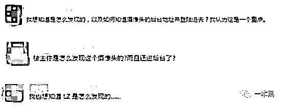
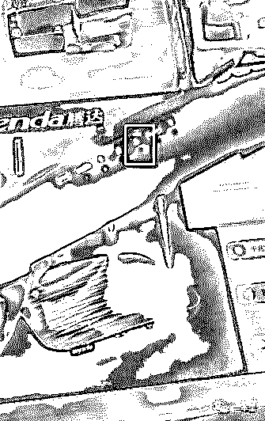
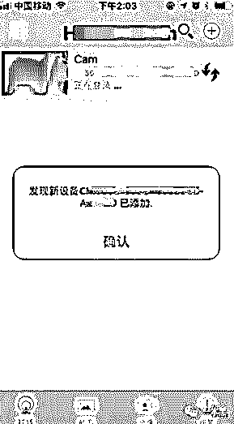
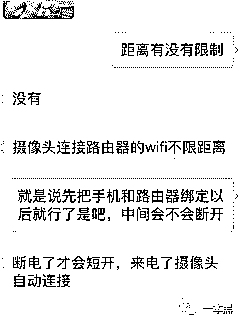
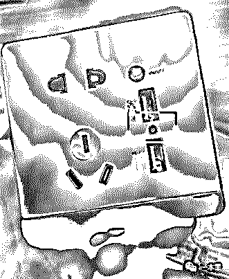
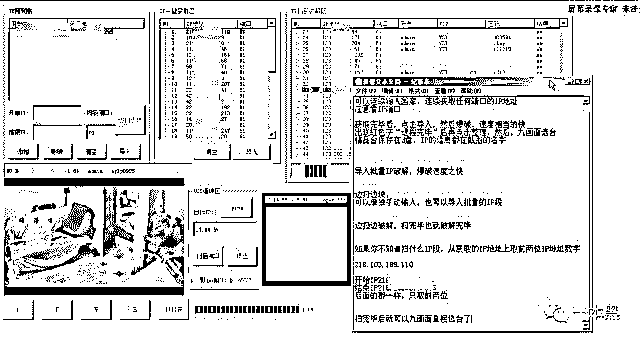

# 诡异偷拍！出租屋发现针孔摄像头，竟藏在路由器里面

> 原文：[`mp.weixin.qq.com/s?__biz=MzU4ODAwNzUwMQ==&mid=2247484368&idx=1&sn=b39ba853c4fadf3146460c3d9593394e&chksm=fde212f2ca959be475756530da31125e2ab53511748614c5faebe38c98cd57bddb9e64ed5c16&scene=27#wechat_redirect`](http://mp.weixin.qq.com/s?__biz=MzU4ODAwNzUwMQ==&mid=2247484368&idx=1&sn=b39ba853c4fadf3146460c3d9593394e&chksm=fde212f2ca959be475756530da31125e2ab53511748614c5faebe38c98cd57bddb9e64ed5c16&scene=27#wechat_redirect)

记得之前看过一个视频，有个**单身女孩**，有天在自己的家门口收到一个信封，打开后发现是自己的**照片**，从照片拍摄的角度来看应该是**窗外拍摄**，她以为是恶作剧就没在意。

几天后，她再次收到装有自己照片的信封，照片里定格着她正在**换衣服**的动作，她感到头皮一阵发麻，不仅是因为自己的**隐私泄露**，更可怕的是照片居然是从自己的**房间里拍摄**的。

她在这间出租屋已经居住半年之久，此前从未发生过这种诡异现象，她惊恐万分，马上**报警**，破案期间一直暂住在朋友家里。

......

**出租屋发现摄像头，竟然藏在路由器里面**

**作者/东东**

昨天在浏览某论坛的时候发现一个帖子，主人公说自己发现出租屋内的路由器竟然**藏着摄像头**，他随后报警做笔录，并提醒大家检查一下自己住处有没有隐藏的摄像头。

在帖子中，发帖者不仅贴出路由器的照片，还贴出了实时监控的画面，也正是这张实时监控的画面，引起了网友的怀疑。

（未能联系上发帖者，图片没法授权，这里就不展示图片了）

很多网友都质疑发帖者是如何知道摄像头的后台地址并登陆进去的。

对此，我也表示怀疑，难道是营销操作？



这里暂且不谈发帖者是如何发现的，就路由器暗藏摄像头一事来说，还有网友质疑难道是路由器厂家故意安装并窃取用户隐私的吗？

这种可能性在我看来几乎不可能存在，因为路由器不是 APP，它没必要收集用户信息做用户画像，或者拿到某些权限去干些偷鸡摸狗的事。

那么就只有一种可能，有人购买各品牌路由器，**改装**过后把摄像头镶嵌在路由器中。通过后台**远程控制**，**实时监控**路由器所拍到的一切画面。

市场有需求就一定会有供给，用来监视老人、小孩在家里的情况是一种，但更多的我想会被用来非法监控或者偷拍吧。

就像我们之前写过有人改装充电宝，当你把自己的手机插入这种改装过的充电宝后，你的手机就有可能被控制，严重一点还可能盗刷你的支付宝或微信。

对于路由器暗藏针孔摄像头这件事，我很感兴趣。经朋友介绍，联系上一位手里有货的卖家......

你们还别说，经过一番调查，这种情况还真的存在。

据卖家所说，他们有当前市面上几款主流的路由器，摄像头都是经过改装加进去的，和路由器串联在一起，只要路由器通电，摄像头就可以正常工作。



价钱谈妥后，我购买了其中一款由腾达改装后的监控路由器。



按照说明书，当带有摄像头的路由器通电之后，手机就可以搜索到摄像头的热点 wifi，然后打开控制端即可自动添加指定摄像头，点击进去就可以实时监控路由器所拍摄的一切画面。



据卖家所说，这种摄像头没有距离限制，只要第一次连接成功就可以一直监控，即使断电也不用再手动连接。



测试完毕，我发现这种改装过后带有针孔摄像头的路由器完全可以达到监控的效果，要是被不怀好意的人非法利用，那后果可想而知。

后来我和老师傅把路由器“大卸八块”，把里面的针孔摄像头拆卸下来发现是这样子的。这不就和普通的针孔摄像头一样吗？



针孔摄像头连接在路由器里面，所需电量由路由器提供，这也就是为什么只要路由器通电，摄像头就开始工作的原因。

回到最开始的出租屋单身女孩，报警后警方很快锁定嫌疑人，原来嫌疑人是一名宽带安装人员，他利用工作之便，在女孩家里安装宽带时，所装的就是经过改装并带有摄像头的路由器。

而路由器正好放置在客厅电视旁正对着沙发，所以女孩才会很诡异的收到自己换衣服的照片。

“**监控你我有一百种方法**”

后来，我问了问卖监控路由器这哥们，一般来他这购买的人都出于什么目的。

对方说：“还能出于什么目的，监控老婆呗，怕自己出差了老婆在家乱搞。也有专门买来**偷窥房客**的，有个哥们是个二房东，前不久就在我这买了好几个。”

“那哥们后来还给我传了几个他录下的视频，真他妈刺激。”



多么直白露骨的话语，扎扎实实地反应了人心的窥探欲望和猥琐下流。

随后翻看对方的朋友圈才发现，简直就是个百宝箱：打火机监控、充电宝监控、手表监控、剃须刀监控、插座监控、手机监控......

对比可以发现，这些监控装置都有一个共同特点，就是太会伪装，就像周星驰电影里说的：**“你看他是个吹风机，其实他是个剃须刀。”**



绝，真的绝！

其实像这种监控的专题文章一本黑写过很多次，有摄像头被破解流出大量不雅视频；酒店暗藏的针孔拍下情侣不可描述的动作；还有手机监控等等。

要说现在，很多家庭都会安装摄像头，一来随时观看家里孩子、老人的情况，二来出远门的时候可以观察是否有小偷出入。

但说实话，现在这些摄像头真的不安全，随随便便都有可能被黑客破解，然后变为谋利的工具。

之前**一本黑**就曝光过一款名叫【XX 眼】的软件，据卖家所说，这款软件可以破解千里之外的家庭摄像头，也就是说，只要你家里装了摄像头，你的一举一动，都有可能被这些软件的使用者偷窥和监视。



软件是偷窥的工具，而那些被破解的摄像头才是偷窥的眼睛，只要有了这些摄像头的 IP 和密码就可以随意观看。

后来老师傅解释道：这种原理很简单，无非就是扫描 ip 段，锁定这些摄像头后，接着对这些摄像头进行爆破（你可以理解为猜密码），只要摄像头的密码是弱密码（很简单的密码），那么这个摄像头就可以被破解。

**每一个摄像头都有一个 IP，它就像一把锁，密码就是一把钥匙，一旦钥匙和锁芯吻合，门就可以被打开。**

而黑客做的工作就是不停的用钥匙去和锁配对。（即爆破）

这样看来，密码的强度决定了你家的摄像头是否有被破解的可能。

总的来说，不管是被破解的摄像头，还是被改装过的路由器，这种人心不足蛇吞象的操作只有那些内心猥琐的人才能干得出。

针对有针孔摄像头的路由器，一般人是根本察觉不出来的，那么只有一种方法，尽可能的把路由器放在小角落里，或者用不透明的箱子把他装起来，不要让他的视角正对着房间的任何一个地方。

关于被破解的摄像头大家可以翻看过往的历史文章，里面有教大家如何尽可能的防范，还有如何检测酒店是否暗藏针孔摄像头也有文章详细说过。

最后说一句，任何事情，不要被舆论所引导，就像路由器暗藏针孔摄像头这一话题，虽然已经论证过它的存在是石锤，但不代表所有的路由器都存在监控摄像头。

大家理性看待、理性看待......

还原事实｜专扒黑产

微信 ID：darkinsider

知乎 一本黑

头条 一本黑

投稿、爆料、招聘、转载

请点击菜单**【联系我们】**