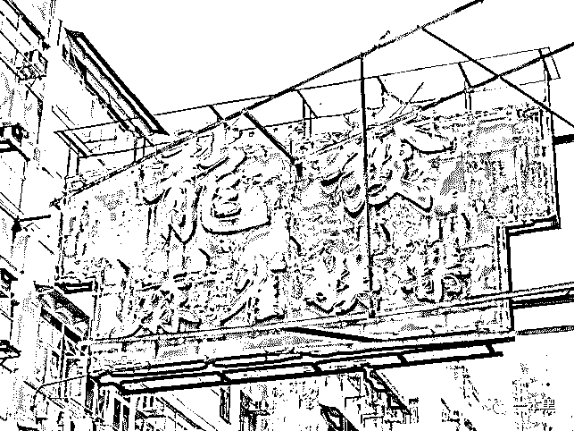
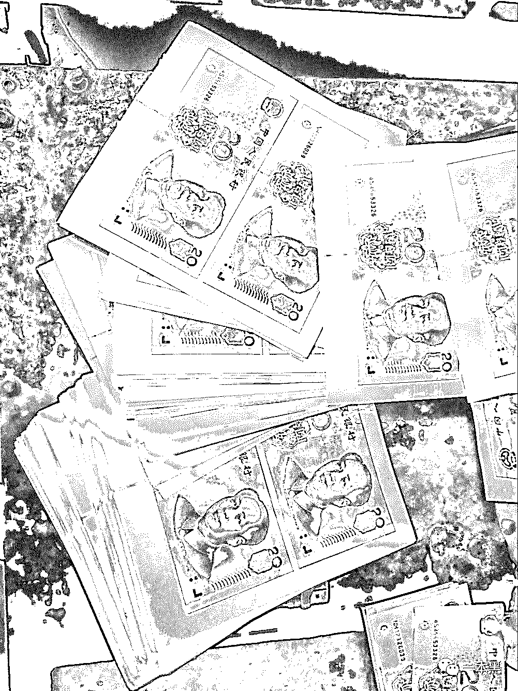
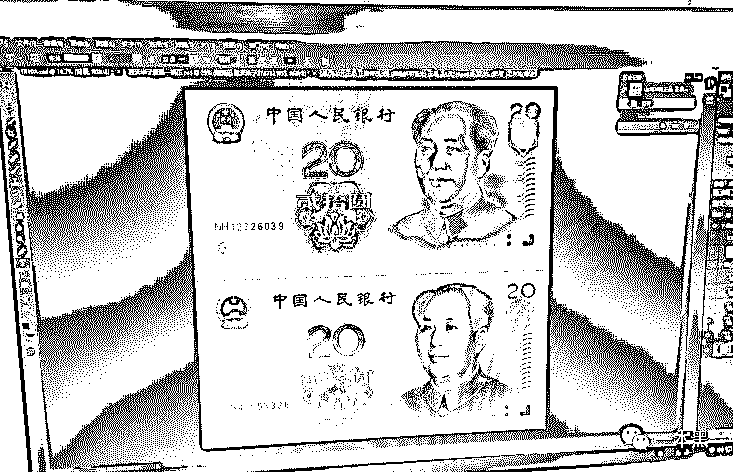
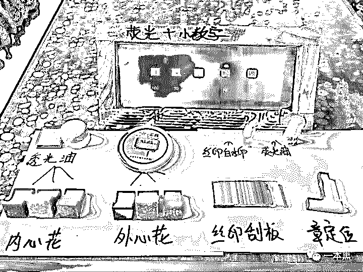
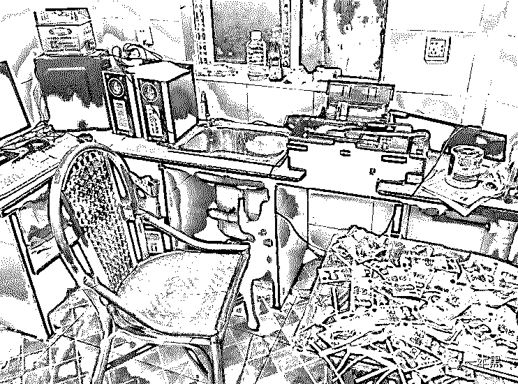
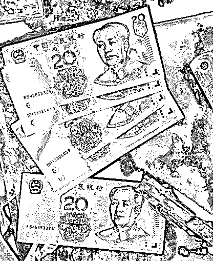

# 打印机变“印钞机”，我的财富自由“春梦”

> 原文：[`mp.weixin.qq.com/s?__biz=MzU4ODAwNzUwMQ==&mid=2247484342&idx=1&sn=a414b2a9f734d61f01c88d9696820130&chksm=fde21294ca959b821e752ba6c63f7b486a3b7075bdc129ae46e95e3b52b14527a765dd2b85a0&scene=27#wechat_redirect`](http://mp.weixin.qq.com/s?__biz=MzU4ODAwNzUwMQ==&mid=2247484342&idx=1&sn=a414b2a9f734d61f01c88d9696820130&chksm=fde21294ca959b821e752ba6c63f7b486a3b7075bdc129ae46e95e3b52b14527a765dd2b85a0&scene=27#wechat_redirect)

从制作假币到被捕入狱，仅用一台电脑和一部打印机，毛狗和其团队在短短半年时间就印制了上百万的假币。

电脑排版设计，打印、烫金、裁剪、防伪、接着做旧，整套流程走完，一张张假币也就生产了出来。

可能是不想像大多数人一样每天过着循规蹈矩的生活，也可能是生活给毛狗带来了太多的见解。让他在庸常的时日里慢慢养成了一种想要一蹴而就的观点，并随着机械般的贫穷生活慢慢放大......

2018 年 5 月初，为了五年前的“803 特大假币案”，我在深圳龙华区某城中村找到了“毛狗”。

当年的毛狗因参与非法印制假币，被判处有期徒刑五年，见面时他刚出狱不久。

一个 30 多岁，寸头、面部还清晰可见几处疤痕、下巴胡渣光看就觉得扎手，像电影《线人》中刚从监狱大门走出来的细鬼。

当天正好是周末，和深圳往日的天气不一样，那天下午的太阳多了几分温和，毛狗把我带到一个废球场旁坐下，点完烟他的眼神就一直没离开过前面这栋破楼。

他说这就是当年做货的地方，一晃五年过去了，好像老了许多。

他问我，你想知道些什么？

“当时为什么干这事儿，还有过程。”我回答。

其实我更想知道毛狗这个人，所以在接下来几天的接触里，我试图以一个朋友的身份去了解他。

**开赌场搞钱被坑，走上非法造币路**

****作者|东东****

“我这人没什么本事，大专还没上完就进了工厂。”说到这毛狗从兜里掏出一根烟，是那种软盒，也就十块钱不到。

“抽我的？”我顺手给他递了一根，他刚放进嘴里的烟停了下来，接过我手中的烟又把自己的塞了回去。

“在里面有机会抽烟吗？”

他没有回答我，场面一度有些尴尬，点燃烟后我能听得见他烟头燃烧的声音，正如他在监狱的五年，青春慢慢消耗殆尽。

烟燃过半，他的话匣子也逐渐打开......

“在工厂待了三四年，实在是觉得没意思，赚钱也少，后来又换了几家，但基本都是流水线，机械化得很。”

做货（印假钞）之前一直都觉得自己是在混日子，不知道哪天是个头，也想学门手艺，但就是找不到路子。

每天在工厂的生活都很单调，准点起床、准点下班吃饭，基本没什么娱乐活动，顶多就是在宿舍打打牌，聊聊女人。

那帮人（工厂里的工人）一聊到女人可起劲了，特别是厂里的那几个女人，在他们脑子里不知道来回过了多少遍。

其实我是瞧不起他们的，一个个年纪又大，猥琐得要死，整天聊来聊去就那几个话题。

所以那时候就在想能不能找些门道赚点快钱，早点摆脱这种垃圾生活。

那时候经常去上网，所以和网吧里的人都很熟，有个狗日的叫扣子，搞赌博的，听他说曾经和老大偷渡去澳门赌钱，老大懂千（出千），他那时候算个狗腿，就整天跟着老大跑，赢钱了老大就丢给他个几百上千的。



好像是有次出千被逮到，老大的手都被打断了，还好赌注不是很高，不然可能命都没了。

听说在澳门那边赌钱，十个里面有九个都会出千，不然谁敢来赌，其实比的只是千术的高低和破绽而已。

回来以后他就没跟那老大了，用他的话来说就是，手都废了还怎么赌。他自己也学了点千术，赌了些小钱，平时没事就是上上网玩游戏、嫖娼什么的。

他喜欢玩刷图刷怪的游戏，好像叫 D...什么 F，也算是老玩家了，每次和别人 PK 赢了都会到网吧门口坐着点一根烟，反正就是一种很满足的样子。

但时间久了其实我看得出这只是网络世界给他带来的成就感而已。

我问他能不能带带我搞赌博，让我也尝尝赚快钱的滋味。

我经常约他上网，请他抽烟喝饮料，他那时候估计也是没钱花了，打算重操旧业再干一波，所以就把我也拉上了。

后来我和他搞了地下赌场，钱是找高利贷借的，租场地加买了一堆设备，前后折腾了小半个月，反正那时候想着回本应该很快，也就没在意什么。

他人脉广，场子搭起来后人慢慢就多了起来，搞了没多久确实也赚到了一些钱，那时候日子过得是真的潇洒，早上可以睡到自然醒，再也不用像在工厂一样准点上下班了。

但这种好日子并没有持续太久，在一次牌桌上，这狗日的出千被逮到了，结果被一顿揍差点被打死。前面赢的钱基本也都被吐了出来。

没过几天就找不到这小子了，没办法高利贷还得还啊，我又不懂千，不玩黑的根本还不起，所以干脆先把赌场给关了。

那时候高利贷天天上门催债，还把我的身份证给拿走了，这帮狗日的真的不给人活路。说完毛狗骂了一句脏话：“操他 X 的”。

其实那时候的毛狗已经走投无路，一边被控制一边要偿还债务，用他的话来说，摆在他面前的就一条路，那就是赶紧搞钱。

“后来呢？怎么接触的做假钱？”

“还不是那帮放贷的孙子，当时没办法，就答应了给他们做货。你知道，人一旦走投无路，什么事都干得出。”从毛狗的话语中看得出他的后悔，但是事情已经发生，五年过去了，现在的他也只能无奈当初的走投无路。

**一台电脑一部打印机，半年打印上百万假币**

因为开赌场欠下的高利贷，让毛狗不得不走上这条造假币的道路，也正是由此开始，他的人生轨迹发生了天翻地覆的改变。

“做货是跟着他们学的，一开始的时候都是拿别人的货来洗，也就是洗钱，手里拿一堆假钱去消费，用假钱换成真钱。”

那时候市场上的假币还是以黄货为主，对了，在行业里有专门的黑话，黄货就是 20 元的假币，蓝货就是 10 元假币，像 1 元和 5 元分别叫小绿和小紫。

还有 50 元假币叫做青蛙或者蛤蟆，100 元就叫做红牛，后面不是出了土豪金版本的新款吗，新版就叫做金牛。

最开始做的时候是在别人手里拿了 100 张黄货成品，好像是 4 块还是 3 块钱一张，时间久了记不清了。

然后拿着这些钱去街上洗，这个过程叫做“洗货”，一般都会去菜市场或者小卖部，这些地方的人警惕性都不高，成功率会比较高。

但是也有失败的时候，我们叫做“爆了”，被人发觉就马上给人换一张真的，都是事先准备好的，以防后患。

慢慢的就开始拿别人打印出来的，没有做过任何工序的白板，拿回来自己裁剪，做旧、凹凸、荧光、水印什么的都有专门的工具。

（刚打印出来的“白板”）

后来做了有一段时间，对这行开始慢慢了解，就开始尝试自己做货，因为当时大专的时候学过美工，对 PS、AI 这些图像处理软件都比较熟悉，所以就开始自己制作打印的 PSD 文件，一直到最后，自己做水印的丝印、印章、印油。

（PS 制作的纸币模板）

“制作的工具都从哪来的？这些东西不好弄吧！”

“技术含量不高，没你想的那么复杂，设备和纸张都是网上买的，整个环节就水印、凹凸和做旧比较讲究。”



由于比较敏感，毛狗述说的水印和凹凸在这里就不多解释。随着毛狗的回忆，由电脑 PS 制作出来的假币以及他们的销赃过程逐渐露出水面。

“裁剪完的假币是不能用的，虽然一眼望去分不清真假，但是上手可就不一样了，所以会采用做旧的手法把假币变得更真。”

“最开始是用的清水加酱油混在一起，然后把假币扔进去泡 3 到 5 分钟，捞出来吹干或者自然风干就行；还有可乐加茶叶水什么的。”

后面出了做旧水，业内有专人出售，做旧水就比较方便，往假币上瞎喷，等风干就行。

做旧以后的假币拿在手上就真实了许多，一般拿到市面上去洗的成功率也会更高。

我不相信就没人能识别出这些假币，所以就问：“难道验钞机都识别不出来吗？”

“普通的这种叫做高仿假币，除此之外还有一种‘拼接货’，就是把真钱和假钱拼接在一起，一面是真币，一面是假币，‘拼接货’不但真假难辨，有时候连验钞机都能蒙混过关。”

听到这里我惊讶了，居然连验钞机都检测不出来，怪不得当年的 803 特大假币案搞得那么轰动。

“也不是所有的验钞机都能混过去，验钞机分为 A B C 三种，C 类验钞机是市面上最普通的，很水，这类验钞机一般是检查不出来拼接货的。”

根据当年的“803 特大假币案”显示，当时是有一位 70 多岁的老人在不借助任何电脑设备的情况下，纯手工制作而成了一套假币胶板，这套胶板在当时的行业里可以卖到几万到十几万。

这套假币胶板的制作者最终被判处无期徒刑，而毛狗一行人被捕时收缴的假币数额不是很大，但足以定罪五年有期徒刑。

**疯狂洗钱，逼真假币销往全国各地**

从卖货牟利到被捕入狱，毛狗其实一开始就想到了结局，只是没想到这结局来得这么快。

看着曾经制作假币的楼房，毛狗再一次点燃烟。

那是当时放贷人的住所，当时的他们作息时间不固定，睡醒了就干。从他的话语里，我能想象那间作坊脏乱的环境。

“我们一般不会选择在晚上干活，因为时间久了怕打印机的声音吵到隔壁引起怀疑。”



“你们做出来的货难道都是自己洗吗？”对于当时他们庞大的产量来说，我知道绝不可能自己洗钱。

“怎么可能自己洗，行业里有专门出货的群，算是做货的一个圈子，我们一般管自己叫纸界，对比群内的其他人我们算垃圾的了。”

“我们生产出来的货只不过是最入门、最垃圾的货色，真正的大厂家，都是使用的 XX 印刷，仿制 XX 的印刷过程去印刷，那时候我们都还接触不到，只能自己印制自己做旧。”

群里会有代理拿货，基本上每个人找我们拿货都是 100 张起步，正常是 500 到 2000 张不等，量大的还会支持面交，一般拿货 5000 张以上才会面交，因为得考虑到风险的问题，担心条子卧底。

“如果是线上就走快递吗？会不会被查出来。”

“线上当然走快递，那时候快递都不严，我们包装也很随意，旧书、面膜袋子、玩具娃娃什么的都可以一起包装。”

“成本大概是多少，利润高吗？”

“每张货的成本其实大体是相同的，不到 0.5 元一张，看什么货，一般几块到十几块不等。”

“你知道群里那些拿货的代理买这些假币的用途吗？”我继续追问。

“分两种，一种是批量转卖给下级，一种是自己洗货。在这个群体里流传着这样一句话：‘做钱做出艺术品，花钱花到手抽筋，洗钱洗遍全中国，拿着假币换黄金’。”



有些事我也是听说的，有一些洗钱大军，带着假币走遍全中国，从南到北的洗，疯狂的很。

哎，在里面待久了，很多事都忘了，想不起来了。

听到这里我反问：“被抓那天还记得吗？”

毛狗先是抬头停顿了几秒，然后慢慢地说：“记得，当然记得，这辈子都不会忘记。”

毛狗团伙一共三个人，顶上是当时做高利贷的头，只管收钱，制作销售什么的都不参与，三个人中，毛狗负责打印模板调色，另外两个哥们，一个负责打印一个负责裁剪做旧。

被捕的时候他们正好裁剪出一批新货，正躺在摇椅上抽烟，突然门被踹开，一群警察冲进来。毛狗说当时脑袋一片空白，抱头蹲在地上的时候啥都没想，就觉得完了。

**监狱中的“黄金时代”**

毛狗因印制假币最终被判处有期徒刑五年，出狱后他向我讲述了整个过程。

我觉得这个故事值得被记录的原因太多，它小众，但它反映的不仅仅是毛狗和当初走投无路的自己的一种无奈选择，更充满了欺骗和背叛，以及贫穷带给他的刺激。

只能说一步走错，这辈子就会毁于一旦，三十多岁的毛狗如今已没有当年的年轻模样，更多的是沧桑和数不尽的忏悔。

最后一天采访，我跟随毛狗走在城中村的一条小巷。

他突然停在路边的一颗大树下，蹲坐在路阶上抽起烟来。

“里面什么人都有，杀人的、贩毒的，总之很乱。里面经常打架，也有帮派老大。我刚进去的时候特别不适应，有想过自杀，但试了好几次都下不去手。

听到这我想起了电影《监狱风云》的某些场景，大致可以猜想到在监狱里曾经发生过的事。

到现在毛狗都没提到过自己的家人，所以我问了一句：“你家人呢？出狱后没联系吗？”

毛狗没有马上回答，只是一直注视着行走的路人和过往的车辆。

“没什么家人。我出生在农村，特别穷的那种，大专还没毕业就跑出来进了工厂。爸妈很小的时候就离婚了，跟着爷爷长大的。”

“......哎，不说了。”

沉默一会，毛狗又说他在监狱经常做梦，梦到自己赚了好多好多钱，村里人都捧着他；也经常梦到那天被抓的场景，总之这五年来一直循环着这样的生活。

对于这一切，我问他你后悔吗？他说：“后悔、当然后悔，但又能怎么样呢！”

更多的问题比如你未来的打算是什么，毛狗并没有正面回答我，我想他也无法回答，从一个年轻小伙到如今三十好几，他一生的黄金时代已经过去，剩下的生活，只有他自己才能掌控。

可能是不想像大多数人一样每天过着循规蹈矩的生活，也可能是生活给毛狗带来了太多的见解。

让他在庸常的时日里慢慢养成了一种想要一蹴而就的观点，并随着机械般的贫穷生活慢慢放大......

（文中人物系化名）

**往期非虚构**

▼

还原事实｜专扒黑产

微信 ID：darkinsider

知乎 一本黑

头条 一本黑

投稿、爆料、招聘、转载

请点击菜单**【联系我们】**