# 是欣欣向荣的抖音，还是包容黑产的温床？

> 原文：[`mp.weixin.qq.com/s?__biz=MzU4ODAwNzUwMQ==&mid=2247484321&idx=1&sn=fb4c06a8f3147193cd4c9b899a7143bf&chksm=fde21283ca959b95bfc28468432e95ae1d3c23943f668589c71437ada1905357b35066236af1&scene=27#wechat_redirect`](http://mp.weixin.qq.com/s?__biz=MzU4ODAwNzUwMQ==&mid=2247484321&idx=1&sn=fb4c06a8f3147193cd4c9b899a7143bf&chksm=fde21283ca959b95bfc28468432e95ae1d3c23943f668589c71437ada1905357b35066236af1&scene=27#wechat_redirect)

周末下雨宅在家也太无聊了，就顺手打开了号称时间杀手的抖音。

刷着刷着还真被我刷出一条有营养的视频，居然跟平常简单的“模仿秀”不一样。

没想到一直被我认为没内涵的抖音小视频能在看完后，激励的我瞬间就像打了鸡血一样，即将到来的周一不想上班综合征都自动痊愈。

15 秒的内容虽然很励志但显然不够看。本着内容不够评论凑的原则，我翻开下面评论，看来老哥们基本上都跟我一样，被视频里的年轻人努力的样子打动，所以才贡献了接近 800w 人次的点赞。

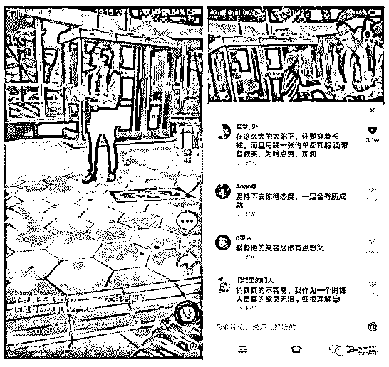

但当我怀着激动的想加十天班的心情打开票圈准备找点新话题时，却看到了一个意料之外的东西，瞬间就像是被泼了一盆凉水，这个朋友的动态仿佛在嘲笑我的无知跟不值钱的感动。

现在流行骗我这种穷的只剩下一点点流量的热血青年仅了吗？

**作者|绾真**

**编辑|东东**

**责编|振宇**

**接码平台还能有这种操作？**

大家都知道抖音的重复玩梗预示着它很难出一个精品视频段子，但抖音上除了大部分普通人自己的账号之外，还有另一种人是有意识的利用抖音，目的是将“素人”号打造成大 V。他们甚至从“墙外”搬运有趣的视频去掉水印，改变帧数，再上传抖音充作自己的作品，吸粉养号。

这些人还懂得摸清楚现代人的心理，搬运的视频往往一类是给男生的是关于赚钱的方式，二类则是给女生的变漂亮技巧。

开始的时候会时常发一些高质量的视频，吸引关注。等到时机成熟粉丝稳定以后，将账号内容全部删除，改头换面，高价卖出为自己牟利。

你关注这个账号的原因可能是因为它发的视频引起了共鸣，也可能是觉得是紧张生活之下偶然才有的放松，却没想到这只是人家打造大型 IP 的一种方式。

就像那个让我感动的打鸡血的视频，万万没想到是营销账号的一个基本操作。回想起评论里动了真情实感尝试感同身受的老哥们，有些不是滋味。

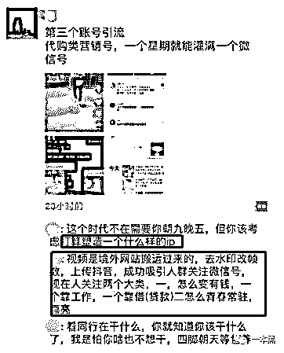

这样的手段，就是跟我们之前讲的微信代运营有异曲同工之妙，没有内容就搬运内容，没有作品就抄袭作品。

而得到足够的流量和用户信任之后，推出售卖的东西卖完一波就散，或者利用流量做一些色情、赌博的传播，即使被发现蹊跷完全不在怕，因为他们注册的账号背后的信息根本就是假的。

对于普通人来讲，手机号码实名注册是基本操作。

但对于他们这样的的人来说，实名？不存在的！接码平台了解一下？

在接码平台用虚拟手机号注册的账号根本不会怕平台追查注册人的真实信息，也查不到他们自己的头上。

不常接触网络黑产的大部分普通人根本不知道接码平台是什么又怎么使用，但这顿操作对于一些善于利于接码平台来褥羊毛的人来说就是家常便饭。

简单举例来说就是，你在注册任何接码平台支持的账号的时候，可以不使用自己的手机，而是用接码平台提供的虚拟号码，注册、验证、登录，整个操作过程可能只会花费你的 1 毛钱。

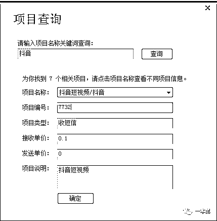

为了搞清楚这些人的骚操作，我也下载了某接码平台，并按照平台要求充值之后，打开了低成本造假的新世界。

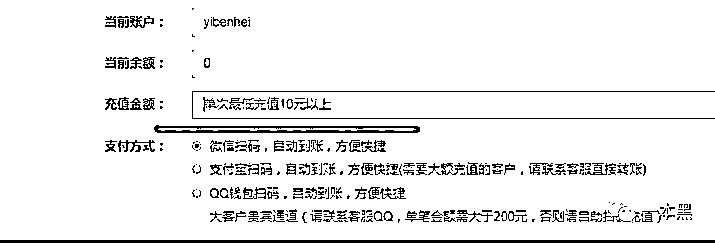 

在项目里选择抖音短视频，然后获取号码，就能得到一个虚拟的手机账号。我尝试用这个账号注册了抖音，获取了注册的验证码，就顺利的登录了抖音。

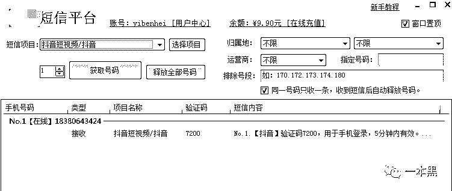

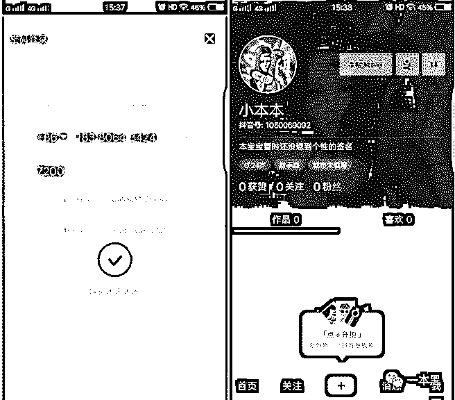

不需要注册人的真实信息，仅凭一个手机号码就能注册成功一个账号，接着只要将制作好的小视频和自己的用“猫池”养出来的手机卡注册的微信放到个人简介上，等待相信天上可以掉馅饼的人来买就可以高枕无忧了。

我尝试利用新注册的抖音账号拍摄了一段视频，没有任何审核机制，秒速发出并出现在自己的首页可以被别人查看。

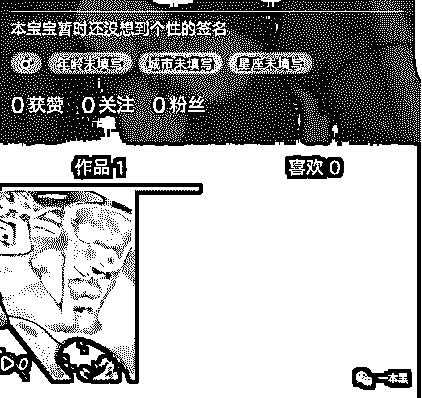

接码平台的作用当然不仅仅是帮这些人注册账号，还有在平台上售卖的廉价外卖首单优惠券也同样是使用接码平台进行操作的。

但可能我用的这个平台比较害怕事儿，在充值页面就加红提醒了用户

有些朋友可能会想到利用接码平台注册社交账号以防止自己的隐私泄露，真实的手机账号被出卖给其他不法分子，自己天天收到各种骚扰信息。

但在利用接码平台注册微博账号的时候发现，这些虚拟的号码不仅只会被使用一次，还会在用户释放之后，平台回收再利用。

比如下面这两个号码，在将平台反馈给我的号码输入注册，显示的却是该手机号码已经被注册可以直接登录。

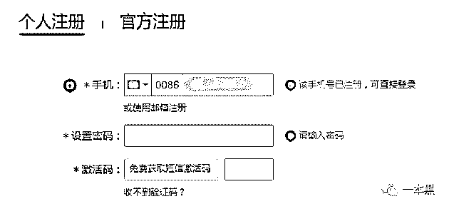

出于好奇心，我决定试试用接码平台接收了找回密码的手机验证码，居然真的被我重置密码成功，登录上了账号。

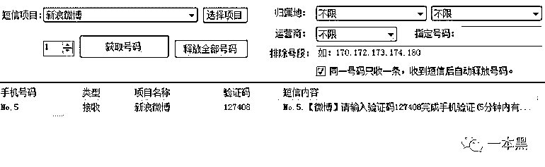

但看首页的内容，这个账号就是我们平时所说的“僵尸粉”没有错了。

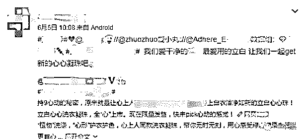

用同样的方式登录了好几个账号，发现这些在微博注册虚拟账号往往会被用于刷热搜、刷转发评论、刷话题等。

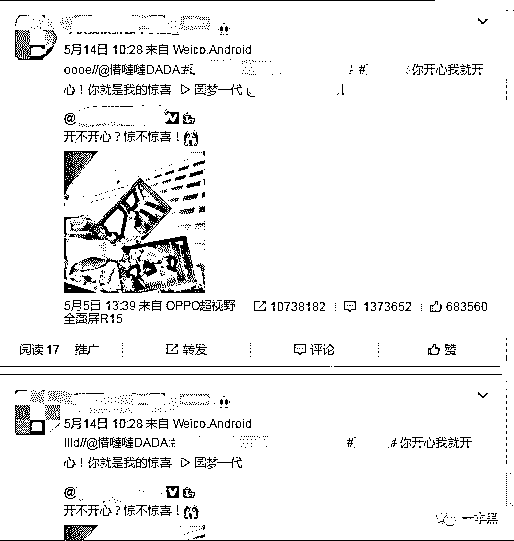 

这些热搜的微博或者话题，数据高的吓人，如今看来，有多少水分也只有这些买僵尸号并利用它们的买家知道了。

这些平台上的号码其实就是卡商卖给平台的一些未实名没有投入市场的手机卡，我在这个平台的菜单栏找到了卡商加盟的入口，手段就类似于之前公众号讲过的[群控](http://mp.weixin.qq.com/s?__biz=MzU4ODAwNzUwMQ==&mid=2247484264&idx=1&sn=831439d7f21cfaae96bf8ebb3db3ff99&chksm=fde2124aca959b5c44724e0163fba2f1ddf47c489020f99089bc5d55d2a5f231ad2b2e007a02&scene=21#wechat_redirect)。

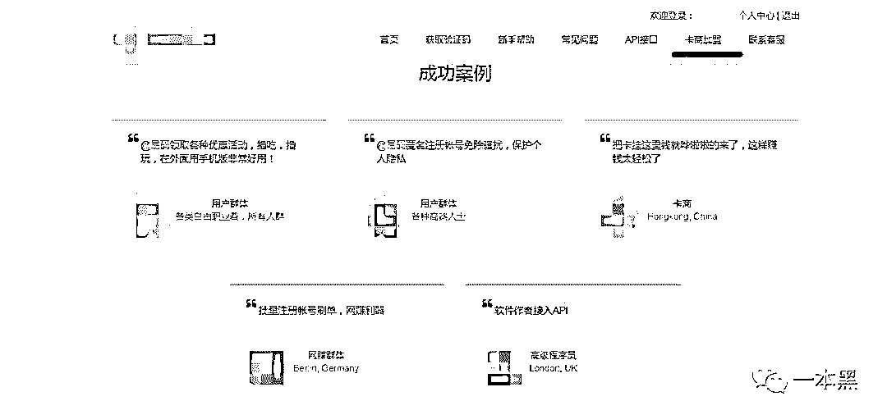

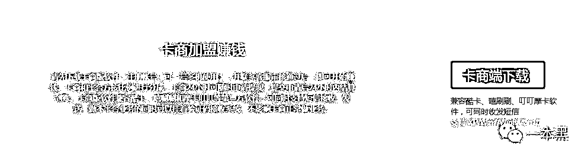

有了账号自然就可以开始薅流量，将一个普通账号包装成一个大号，无论是留着给自己用，还是高价卖出去都非常划算，所付出的代价也仅仅是交给接码平台的 1 毛钱和一个可以翻墙的 VPN 而已。

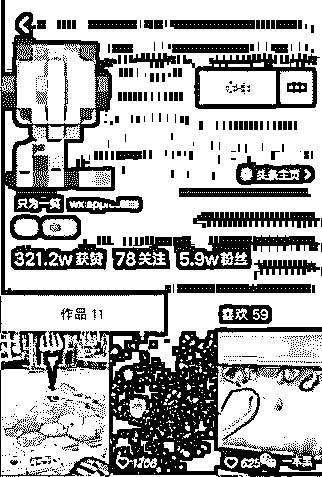

接码平台的加入让抖音实名责任变得艰难，也使抖音的假货黑产几乎没有顾忌，监管起来难度加倍。

**“你看我这里的迪奥杨树林，只卖几十块还不限量！”**

但常言道，有人卖，有人买，就有利可图。

可能是 20-24 岁的用户群体占据了全部用户的一半，也有可能是因为大部分的女性用户导致——不是有俗话说，女人的钱最好赚嘛。

所以说起抖音假货链，化妆品首当其冲。

前一段时间在全网传播的一个抖音小视频中，一位账号上传了一条视频，揭露了造假的全过程。她只花费几分钟就制造成功一个杨树林的口红，从膏体到包装，没有火眼金睛甚至很难看出与专柜购买的正版有什么区别。

而且不仅仅是口红，各种知名品牌的化妆品、粉底都没有逃过这一劫，被轻松制造出来。

[`v.qq.com/iframe/preview.html?vid=g13414kxbws&width=500&height=375&auto=0`](https://v.qq.com/iframe/preview.html?vid=g13414kxbws&width=500&height=375&auto=0)

只要有人会买，假货就一定会有市场。

抖音官方也是这些勾当之所以会出现的帮凶。

从每划几下会出现的广告内容来看，只要花了钱，让官方能够流量变现，抖音才不会管这些广告的质量到底过不过关。

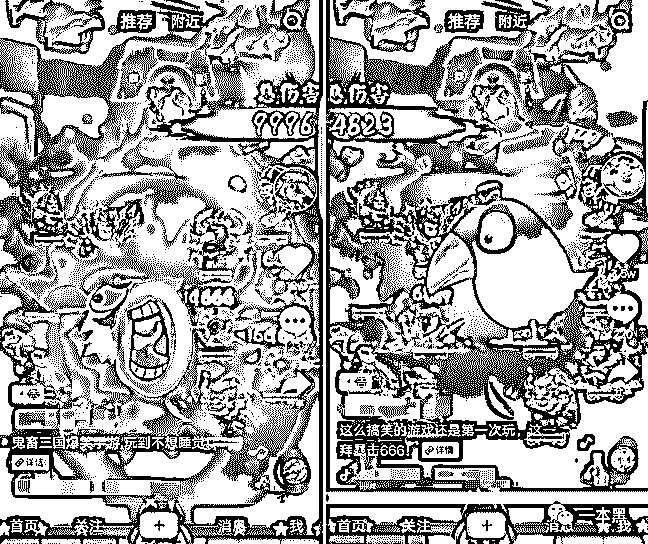

虽然抖音官方宣称要整顿假货，明目张胆出售假货的账号也基本上看不见了，但我只是搜了一下“自制口红”，依旧出现了大量造假口红的视频。

但这些造假的账号大都有一个共同的特点，会制作一些“自制彩妆”的短视频和再自己的个人介绍里写上微信号，以便在微信平台销售假货，而这种私下个人之间的交易不管是微信还是抖音都无法处理。

这就是周瑜打黄盖，一个愿打一个愿挨。

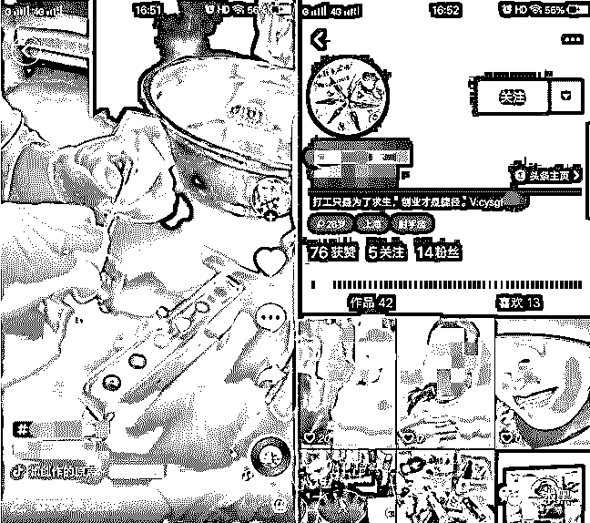

为了得到这些造假者的信息，我决定暂且就做一次吃饵的鱼，主动添加了这个微信账号，得到了这些所谓“自制口红”的定价。

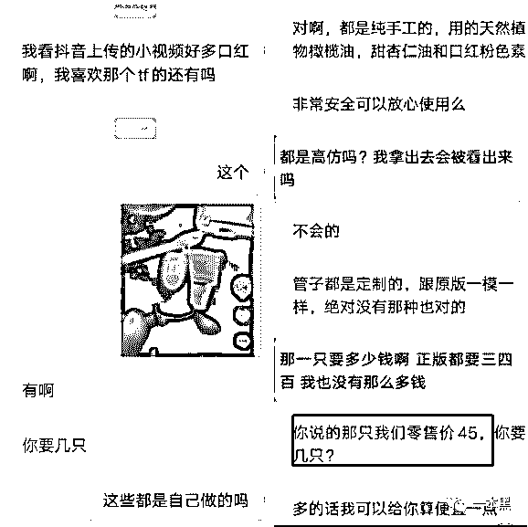

相比正品的定价来说，高仿品的价格只有十分之一左右，很容易就会使想要拥有一支大牌口红但囊中羞涩的年轻人动心。

虽然对方表示口红是安全对人体没有危害的，但事实上正品大牌口红都会出现铅汞超标的问题，何况小作坊生产出来的没有任何安全标志的高仿品呢？

且不说制作过程是否在无菌的条件下，从视频中根本无法看出卖家究竟在制造过程中加了什么东西进去，也完全没法保证购买的每一个仿制品都是同样的添加物和制作流程。

这样制造出来的要直接与皮肤接触的化妆品，反正我是不敢用。

作为一个普通用户，我当然不愿意看到官方“虽然抖音抄袭、虽然它假货黑产多，但我知道它还是好抖音！”这样的回应。

年轻的抖音，不应该成为黑产的温床。

还原事实｜专扒黑产

微信 ID：darkinsider

知乎 一本黑

头条 一本黑

投稿、爆料、招聘、转载

请点击菜单**【联系我们】**