# 微信号每天有钱自动入账，抖音刷量、投票中的暗黑江湖！官媒也有参与！

> 原文：[`mp.weixin.qq.com/s?__biz=MzU4ODAwNzUwMQ==&mid=2247484264&idx=1&sn=831439d7f21cfaae96bf8ebb3db3ff99&chksm=fde2124aca959b5c44724e0163fba2f1ddf47c489020f99089bc5d55d2a5f231ad2b2e007a02&scene=27#wechat_redirect`](http://mp.weixin.qq.com/s?__biz=MzU4ODAwNzUwMQ==&mid=2247484264&idx=1&sn=831439d7f21cfaae96bf8ebb3db3ff99&chksm=fde2124aca959b5c44724e0163fba2f1ddf47c489020f99089bc5d55d2a5f231ad2b2e007a02&scene=27#wechat_redirect)

每个繁华热闹的产业背后，都有可能藏着一些不为人知的运作手法，每个看似不起眼的行业，其实背地里都风潮涌动。

这段时间我发现，身边的有些同事每次吃完午饭都会躺在椅子上刷抖音，视频中的小姐姐打个响指嗯哼一声就从上海跑到了北京；忘不了你的爱已经唱遍了大江南北；十八线小乐队的纸短情长也火得一塌糊涂。

大家都在开玩笑是不是也该给老师傅拍个视频，没准也能火上一把......

**作者|绾真**

**编辑|东东**

**责编|振宇**

**微信****号自动赚钱，一天入账几十块？**

这不，这边大家正在讨论老师傅能不能火，那边一个许久没联系的老同学发来这么一条信息。

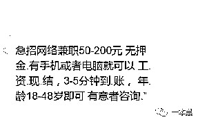

（大家是不是似曾相识）

这简直是标准的“我被盗号了”，但出于看多了网上调戏骗子的例子想亲自下场试试的心理，也是想看看这些网络兼职背后到底有没有什么新的模式，我主动戳了回去表示想做这个兼职。

对方回复：“你微信号多吗？”

因为工作需要，我当然有很多微信小号，自信的对他说，“多啊，四五个呢。”

接着他发过来一个网址，我检测了半天，没发现有什么陷阱，这才怀着好奇点了进去。

注册登陆后，面对这个其丑无比的后台，我用自己的小号注册登陆了上去。

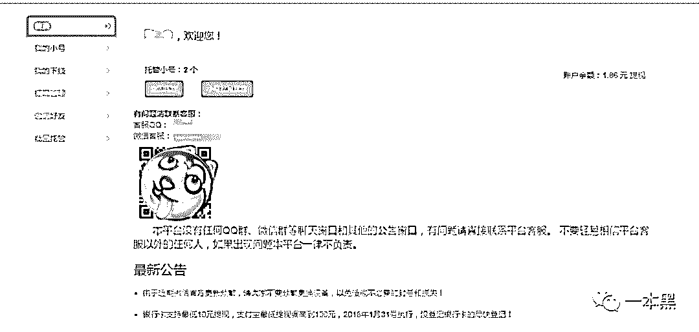

我估计他是怕我不明白或者误会他做什么违规的工作，特意跟我解释说这是现在互联网上的一种新的赚钱方法，他也只是一个推广而已。

他告诉我说，这叫**微信托管**。

总结一下就是将自己闲置的微信号托管给平台在线挂机，然后他们拿着账号去做一些其他事情再分钱给你。（少得可怜）

按照老同学的说法，一天一个号最少收入 4 块钱，要是有十个八个的号，挂上去一天什么心都不用操也能净收入 40 块。等到了网站规定的累积金额，就可以提现了。

这个简陋的后台，基本上就只有这几个功能，我把小号挂上去一天的时间也确实收入了一块多，却远比不上老同学说的 4 块钱。

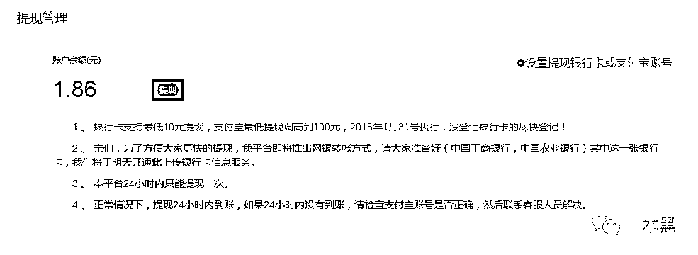

另外，在后台可以直观的看到，每一个小号的上线时间和在线时长。

但是这些收益到底能不能提现？我想才是这次试验最需要被验证的东西。

根据平台提示，提现金额要在 10 元以上才能够成功提现，像我这样只有两个小号的，托管了之后想要真正拿到利益，至少要等到一周以后。

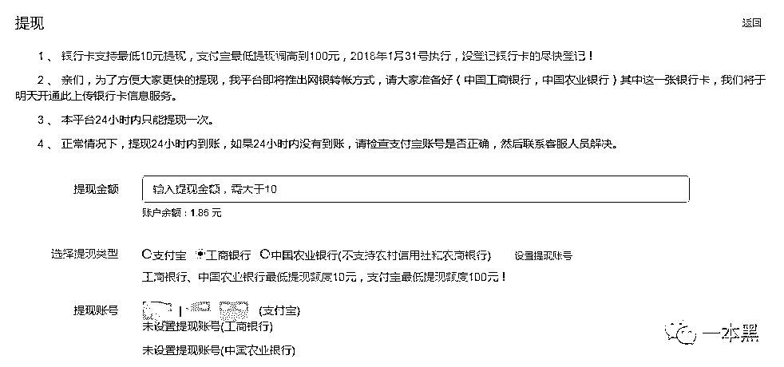

虽然账户只有 1.86 元不能提现，但老师傅却用浑身解数摸进了有转账记录的后台。你别说，这份兼职竟然真的可以提现，看来老同学做的还是良心买卖。

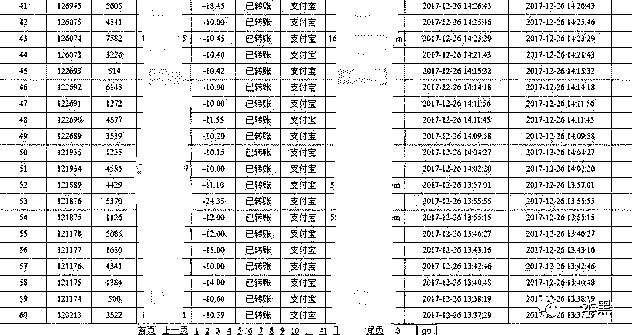

没想到吧，虽然确实能赚到一丁点的零花钱，但其实这个平台暗藏着巨大的安全隐患。

因为每一次托管账号（用微信号挂机赚钱），都需要在手机端点击【确认登录】弹窗。

这其实就相当于把你的微信号授权给了别人登录，即手机电脑同时登陆。对方是可以获取到你的基本信息的。

有些想做兼职的朋友，毫无防备的将自己的私人账号也放到此类平台，但却忘了当你授权给平台登陆的时候，你的个人信息就已经暴露。

比如手机号、实名信息、常用位置信息等。而更可怕的是你微信钱包里的余额有可能被人转走你却不得而知。二维码收付款大家都知道，这里就不在多说。

平台以小博大，你想贪小便宜，只怕是闲钱有点多。

**想成为抖音网红？刷量啊！**

其实以上只是整个产业链中的一环罢了。随着探索的深入，一场刷量的大门正悄然打开......

我向朋友表示了对这个行业的极大兴趣，并旁敲侧击出他们对这些微信账号的使用。

原来这些平台会利用你的微信号，在后台软件的操作下，关注公众号、为文章刷阅读数据、参加各种大大小小的投票。

而这一切也在我托管了两个微信号后得到验证。

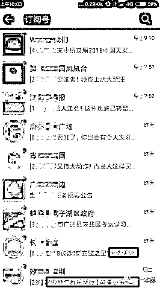

（小号正默默做着关注投票的工作，其中不乏一些官媒）

我故作惊讶的问他，刷赞我知道，还能刷投票吗？投票不是要一个人一个号才能投的吗？

“没见过世面，现在这技术搞什么不能搞？”接着他直接现场录了视频发给我看。

视频中操作人员只需要用电脑控制这些手机并同时打开目标文章停留几秒，就可以得到阅读数据，同理，刷投票用这些也完全可以解决。

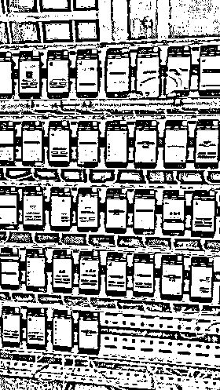

但需要的账号要比实际拥有的多很多，于是他们才打起了别人不用的微信小号的主意。

这里就衍生出了另一条产业链，一些人通过各种渠道（卡商）拿到一些没有实名过的黑卡，通过批量注册软件去注册账号。

这种软件在注册微信账号的时候可以跳过实名制，或者平台会大量[购买身份证正反面照片](http://mp.weixin.qq.com/s?__biz=MzU4ODAwNzUwMQ==&mid=2247484175&idx=1&sn=29af192e9ed52c1bb22ff8de721ea89a&chksm=fde2122dca959b3b831a19a9c243be69040bfb7cd0cb9636878b77b3a95d51347a4a72fb0689&scene=21#wechat_redirect)，最便宜的甚至 1 元一张，而一套 “处女证照”也才标价 20 元 。

这些账号一般都会养上半个月到一个月，在注册账号的时候就发一条朋友圈来证明这个账号的注册时间。

此后保持 10-30 天活跃，加几个好友或者几个微信活跃群等方式，让官方承认这是一个活跃账号，再对外出售。

经销商为了拿运营商的返利——只要能让卖出去的电话卡呈开机状态，运营商就会提成给经销商，而平台正好能满足经销商的这一要求。

平台为了养号，用经销商提供的大量不用实名制的“企业卡”来注册微信。

于是达成双赢，狼狈为奸。

为了验证到底能不能成功刷阅读量，我给他丢了一个自己个人号的文章链接，让他给我刷上几百个涨涨门面。

他先是笑了一下我现在还在做写文章这件事，接着让我推文章给他然后等着就行。

“搞定了！”十来分钟之后，他回复我，并把前后对比的数据截图发给我。还不忘说一句：“牛 X 吗！”

看来他的性格在走上社会的这几年并没有改变，只是改变了最初的想法。

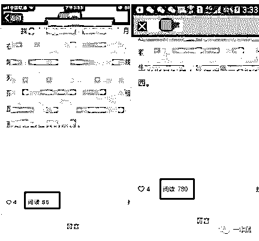

随后我收集了一些线索丢给老师傅，老师傅深信“你在互联网上留下的数据比你妈更了解你”，利用“计算机基础知识”，成功溜进对方网站的后台。

事后还不忘点上一根烟，俗称：“事后......”。

我没想到除了微信之外，这位朋友所在的刷量平台，几乎涵盖了现下所有的流量口。

抖音、快手这些短视频的大流量也赫然在列，甚至连微信官方的投票都能够操纵。

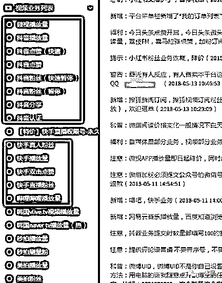

目前市场决定了有流量就有粉丝经济，抖音上的红人或者想要变成红人的普通人和团队，基本上都会选择通过刷量来维持一下播放量和点赞数，以期能够上首页推荐，争取到更多的粉丝和广告主。

而不明就里的吃瓜群众看到推荐的视频顺手点开，则更加安抚了这些“大刷子”的心。能一劳永逸的事情，谁愿意吃力不讨好呢？

这样的结果或许会使视频质量下降，真正的粉丝群体流式，最后变成刷量之间的比拼，变成讨好广告主的形式主义。

长此以往，用户难免会因为得不到更优质的内容而离开。

平台损失了用户，用户损失了娱乐方式，而广告主们，则花了钱却没达到预期效果。

说句题外话，抖音这类软件都是通过算法不断给你推荐你喜欢看的东西，于是也就有了“抖音五分钟，人间已一天”的说法。

时间的杀手，抖音也。

**投票产业中的暗黑江湖**

在后台中我们还发现了另外一项内容，微信的官方 MP 投票。

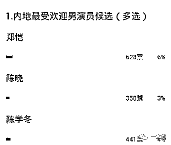

（微信官方 MP 投票：样式图而已，内容不必纠结）

在大多数人眼里，这种官方投票弄虚作假的可能性很低，真实性强。在拿到这张截图之前我也这么认为，但真的像老同学说的那样，“现在这技术搞什么不能搞？”

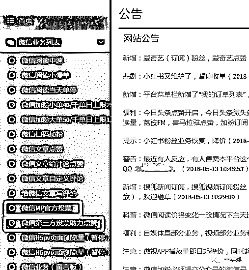

老师傅解释道：现在微信刷票主要有两种方式，软件技术刷票和人工水军刷票。

软件技术刷票是利用抓包工具分析提交投票产生的数据之后，利用脚本程序批量重复提交，就能够达到刷票的目的。（想象一下流水线上生产的商品）

由于微信对投票地址 IP 的限制，他们还会利用 VPN 修改 IP 地址，防止被微信官方封号。

这种类型的投票活动同样可以进行刷票，但相比技术刷票，人工刷屏更不容易被发现。

听同学说他们的投手遍布大江南北，他们往往叫自己为兼职投票手、投票员，但外界更喜欢称他们为投票水军。

就是组建一个微信投票任务群，把投票任务发到群里面就可以了，就是这么简单。

“一个群不够用，就多组建几个群。”

这种人工投票相对非 MP 的软件投票要贵许多，我问他到底贵多少，但老同学坚持要看到链接才能定价。

于是我只好再次去请老师傅出马，并为此付出一顿饭钱。

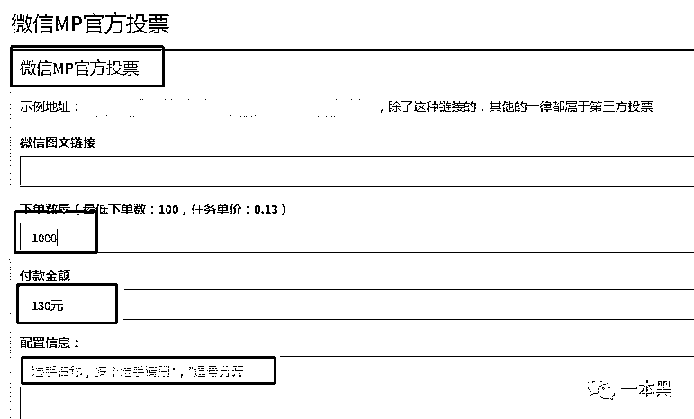

（下单后，群控机器或者人工水军便开始工作！）

不仅是微信官方的投票点赞活动，这些平台极有可能与你朋友圈里拉票的那些“给我的宝宝投一票”的幼儿园、教育机构联合。

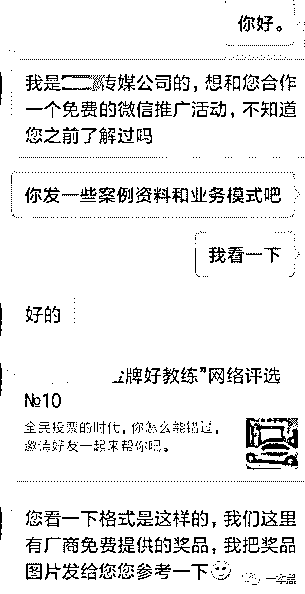

看似表面的信息背后可能隐藏着许多见不得光的灰色利益链。甚至有的投票还正大光明给家长们开了个“外挂”，只要花钱，什么“人气之星”的光环绝对跑不掉！

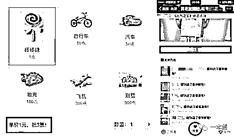

这种小礼物需要购买，如上图，棒棒糖售价 1 元，可以抵消 3 票，以此类推，最贵的别墅售价 500 元，可以抵用 1500 票。

我不清楚这样的活动有没有违规，但利用一件原本有意义的鼓励小孩儿的活动去掏家长们的钱包，等着家长心甘情愿的上钩，这件事听起来不觉得很荒谬吗？

其实说白了都是虚荣心在作怪。

另外，这种拉票比赛极还有可能为电信诈骗提供数据源。

第一，针对参赛儿童，声称只有填写照片和地址才能方便后续兑换奖品。

其次，有些投票必须关注特定公众号并填写个人信息才能完成投票，既增加了公众号粉丝，又获取了投票人信息，一举两得。

最后，即使豁出去为了争夺冠军拼命刷礼物，但还是拼不过投票方“扶持”的某一位参赛选手，始终拿不到第一名，引发恶性循环，致使家长投入更多的金钱和时间，实际却“钱货两空。”

 一场拉票商家就能套取几万甚至十几万人的个人信息，而这些个人信息可能会以很低的价格出售给不法分子。

并制造出“孩子重病”、“孩子遭绑架”为名的电信诈骗都是极有可能的。

再者说，这种脱离了本意的投票活动本身就是一个消耗人情和浪费金钱的骗局，在这场投票中，受益的自然不会是你和你的孩子，为了一个虚名，丢了西瓜捡芝麻，值得吗？

至此，这条刷量的产业链已逐渐清晰，利用群控操作大量微信号实现刷量，平台联合机构推出投票活动，实则暗箱操作，总得来说，这一切都是虚荣心衍生出来的附属品。

不管是刷阅读量、刷视频播放量还是刷投票，总结一句话：“何必呢！”

每个繁华热闹的产业背后，都有可能藏着一些不为人知的运作手法，每个看似不起眼的行业，其实背地里都风潮涌动。

此时，我挂在平台上的小号正不停的被群控操作，默默做着关注、投票的工作......

还原事实｜专扒黑产

微信 ID：darkinsider

知乎 一本黑

头条 一本黑

投稿、爆料请点击菜单【爆料入口】

招聘、转载请点击菜单【联系我们】

绾真是新加入的小伙伴，后续会和我们一起寻找真相。

另外，今天的二条是广告，广告素材均由广告主提供，大家自行判断

# 

> 原文：[`mp.weixin.qq.com/s?__biz=MzU4ODAwNzUwMQ==&mid=2247484252&idx=1&sn=acfa3930a24e02be08a4fb4ccebfd7c7&chksm=fde2127eca959b68f0ae90f0b5ab116f73f06e24bc0af3876c18997beec846504c040f166be3&scene=27#wechat_redirect`](http://mp.weixin.qq.com/s?__biz=MzU4ODAwNzUwMQ==&mid=2247484252&idx=1&sn=acfa3930a24e02be08a4fb4ccebfd7c7&chksm=fde2127eca959b68f0ae90f0b5ab116f73f06e24bc0af3876c18997beec846504c040f166be3&scene=27#wechat_redirect)

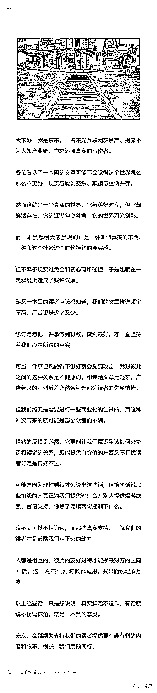