# 赌博网站的骚，闪瞎了我的腰。。。 。。。

> 原文：[`mp.weixin.qq.com/s?__biz=MzU4ODAwNzUwMQ==&mid=2247484236&idx=1&sn=6a90a026d67342622889ab8af81a1662&chksm=fde2126eca959b787403204bd8398222bdc9d053c3b85e44c4ccdb90727118307b8bbc572ba6&scene=27#wechat_redirect`](http://mp.weixin.qq.com/s?__biz=MzU4ODAwNzUwMQ==&mid=2247484236&idx=1&sn=6a90a026d67342622889ab8af81a1662&chksm=fde2126eca959b787403204bd8398222bdc9d053c3b85e44c4ccdb90727118307b8bbc572ba6&scene=27#wechat_redirect)

大家好，我是浅黑科技的谢幺，一枚网络安全科普作者。

至今我已写了两年多的黑客故事和科普，也揭露过不少灰黑产，自认见过不少套路。

**然而，前两天发生的一件事依然刷新了我的认知。**

事情是这样的：

一天早上，我在朋友圈看到这样一条新闻：**《保研大学生利用专业知识破解彩票获刑》**。我的好奇心一下子就起来了。

我点了进去，发现是一则网易新闻。

评论区已经炸开了锅，很多人都在质疑，“凭本事中的奖，凭什么抓人？”

**新闻发出不到 12 个小时，跟帖都已经有将近三万条**，保守估计阅读量至少有十几万。

带着疑惑和好奇，我开始往下看，文章讲了这么一个事：

> 某知名大学的学生张某，因涉嫌利用数学知识破解彩票非法获利 380 万，由于涉及金额特别巨大，相关执法机关已正式向法院起诉。**一旦罪名成立，张某或将面临 3 年以下有期徒刑，并没收非法巨额赃款。**
> 
> 
> 
> （张某）
> 
> 据张某的班主任说，**张某在学校是阳光开朗、成绩顶尖的好学生**，尤其是理科成绩，曾连续三年获得**全校第一**。
> 
> 但是他的家庭情况特殊，张某的父亲在其 5 岁时因事故离世，留下他和母亲相依为命。**虽然家庭环境清贫，但张某很争气**，连续三年获得奖学金共计 35467 元，成为学校重点保研名额的学生之一。
> 
> “这样的好学生原本有机会出国深造，前程一片大好，可他却不经意触碰了刑法，走上违法犯罪的道路，断送了自己的大好前程。”  
> 
> 谈到张某的事，班主任一脸悲痛不愿多说。
> 
> 
> 
> （张某的导师）
> 
> 而据张某交代：
> 
> 自己在网上查资料时，无意中看到一篇**《高中生利用数学概率计算攻破彩票漏洞获取巨额奖金》**的新闻。一开始他以为是假的，但里面的计算公式还是吸引了他。由于本身对数学有很深的研究，他就开始自己计算里面的公式。
> 
> 经过计算推导，他发现大部分博彩游戏都会通过概率让参与者稳输，但是有一种情况，确实存在可以战胜庄家的可能，他发现“冠亚大小”和“冠亚单双”两个游戏之间的赔率有微小的不对等，利用这个赔率不对等就有可能从中套利。
> 
> 发现这个漏洞后他异常兴奋，联系上了新闻中的博彩人员，注册账号开始验证自己的想法。
> 
> 
> 
> （张某和博彩人员聊天记录）
> 
> 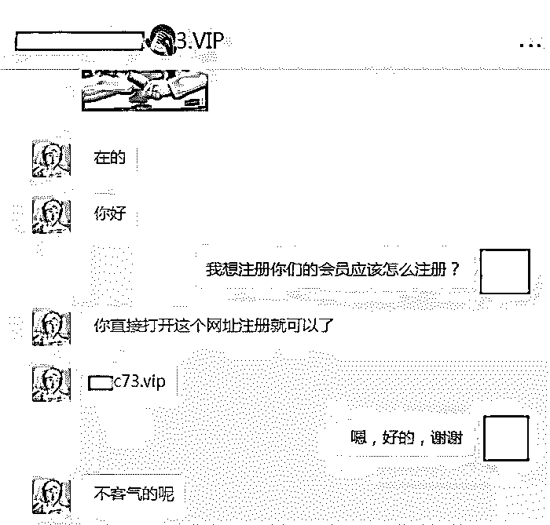
> 
> 那时候张某并不知道已经站在触犯法律的边缘，只是一心想要证明自己的理论是正确的，他根据网站“冠亚大小”和“冠亚单双”的不同赔率，**套进了凯利公式，也就是 f*=（bp-q)/b。**
> 
> 张某发现，如果使用凯利公式来计算博彩网站的任何投注方式都是负 0.01，根据凯利公式，凡是等于 0 或是小于 0 都不宜投注，只有在大于 0 的时候投注才能实现盈利，张某在计算“冠亚大小”的时候显示正数，而且这个数值是+0.0257043994068216。
> 
> **也就是说，如果连续压“冠亚大”或是“冠亚双”的话，根据这 2.57%的胜率将会实现盈利，而且每次投注本金的 2.57%，理论上来说不存在亏完的情况。**
> 
> 结果事实证明张某的计算是正确的，他在短短的时间内赢取了 380 万的巨额奖金，在沉浸巨额的奖金的同时，张某并没有意识到已经触犯了中国刑法，现在站在法院庭审的时候张某才意识到事情的重要性，自己对自己的好奇痛心不已，并且很有可能因为这件事而取消自己的保研名额，说到此处，张某留下了悔恨的泪水。
> 
> 
> 
> （张某母亲）
> 
> 此事对张某的母亲来说打击非常大，在听到自己的儿子触犯刑法的时候半天没回过神，接受采访时不停抹眼泪。
> 
> 在此我们也奉劝各位网友，不要利用自己的聪明才智走向犯罪的道路，也不要迷途金钱的迷惑之中。

看完这篇报道，我忽然联想起自己前不久在网上看到的一个关于赌场的说法。

话说在拉斯维加斯、澳门的赌场，如果出现会算概率、记牌的赌博高手，比较客气的赌场会恭恭敬敬地把他们请过去，不客气的就直接让打手把他们揪到小黑屋一顿乱揍然后扔出去。 

**我心想这彩票比赌场还黑啊，居然直接把人给抓了，当时心情有点小激动，没有多想就把这条新闻转发到了朋友圈。**

很快，不少多朋友在底下评论，有的为新闻里的张某抱不平，也有人好奇他是怎么被发现作弊的，还有一个做技术的朋友还一本正经地告诉我：“这个套利手法其实很多圈内人都知道，不少小的赌博网站反向赔率有漏洞的，可以用来薅羊毛。”

又过了一会儿，我发现其他人也吧这条新闻转发到了自己的朋友圈。

**然后转折就开始出现了。**

一个朋友突然私信我说：**你刚才转发的这篇文章很可能是博彩网站的广告！**

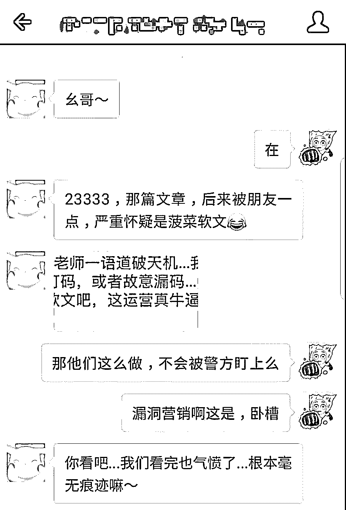

我当时就惊呆了，？？？？？？这是什么操作？

**博彩网站光明正大地在网易新闻上发软文广告，而且阅读量 10 万+？**

当我回过头来再看一遍那篇新闻，果然发现了端倪。

虽然文章标题看起来像一则正经新闻，但发布人是一个叫“咕嘟美食”的账号，看起来是个私人号。

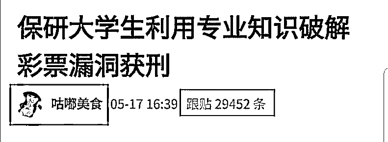

其次，这篇文章全篇没出现真实的人名、地名，全是用“某地、张某、班主任”这样的说法在讲故事。

虽然网易新闻最后注明了“本文仅代表作者观点”，但丝毫不妨碍这篇文章成为十万加，成为众多网友热议的焦点。

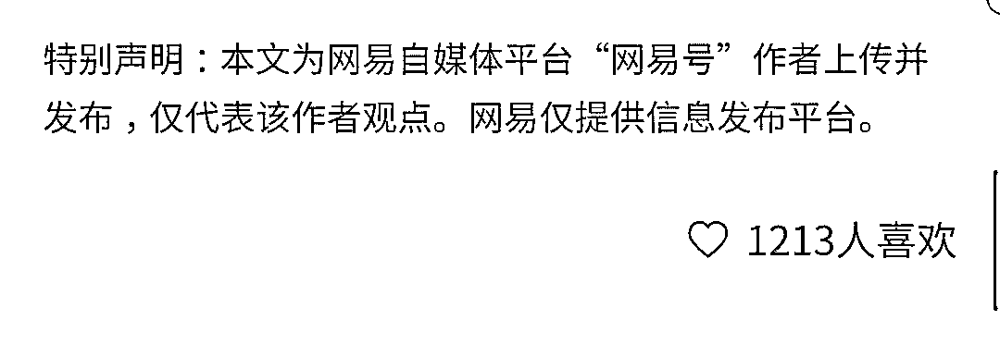

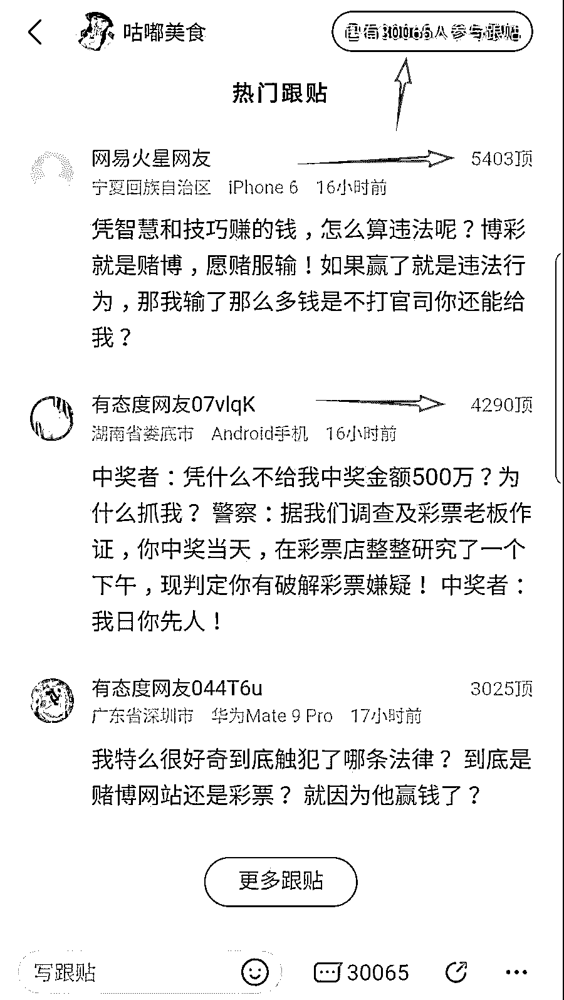

（不少网友都信以为真）

**为什么我能断定这篇文章是假的，并且一定是赌博故意放出来的软文？**

因为我将文章里的图片放在搜索引擎里检索，发现全是从别的地方粘贴过来的。

所谓的“保研大学生张某”，其实是个专门敲诈勒索的街霸：

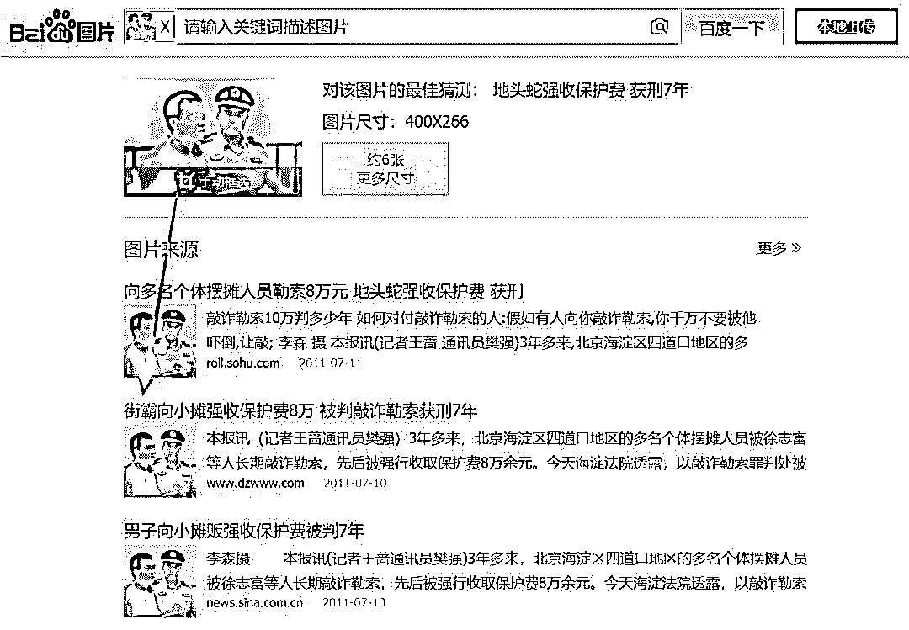

所谓”张某的导师”，其实是有着“中国应用语言学之母”之称的已故著名学者李佩。

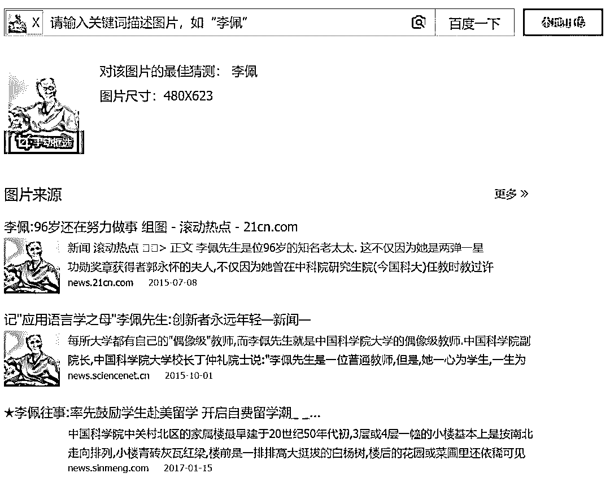

所谓“张某母亲”的照片也无一例外是从别的新闻里偷来的：

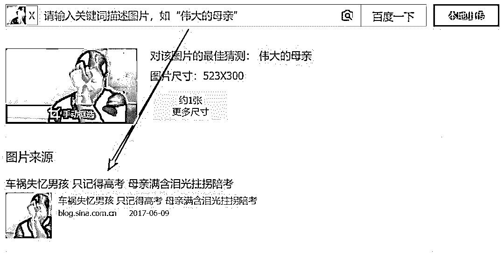

到这一步，我已经可以断定这篇文章完完全全是一篇假新闻。

但是，更骚的操作才刚刚开始……

首先，这篇新闻里把张某所谓的**“彩票套利方法”**原原本本地写了出来。

然后文章里有两张图片 “博彩工作人员与张某的聊天记录”，**马赛克打得很有艺术感，第一张故意只打后一半，第二张故意只打前一半。****两张图片组合起来一看，立刻得到了赌博网站的地址。**

（注：红色的是文章原文的马赛克，捂脸图标是我后加上去的）

（注：红色的是文章里的马赛克，“小黑胖捂脸”图标是浅黑科技加上去的）

我把两个打码不全的网址拼在一起输入地址栏，立刻跳转到了某个博彩网站的注册网站：

显然，这是在钓鱼。

他们的目的就是让一些自以为是的人，认为自己发现了赌场套利的奥秘，然后登录注册这个赌博网站开始“发家致富之路”。

我联想到前阵子很流行的**“漏洞营销”**推广策略。

**所谓漏洞营销，是指商业活动故意放出一个漏洞里，利用人们自以为很聪明的心理来完成活动的病毒营销。**

比如之前肯德基 APP 就故意放出“漏洞”，只要用户将账号生日设置成 2017-8-28 就能获得全家桶半价优惠券的 BUG，一时间大量用户纷纷下载注册，没多久肯德基 APP 就窜到 iOS 热门 APP 排行前 50。

试想，如果某个网购商城公开全场 5 折，大家一定觉得商场是先涨价然后再打折。可如果是新闻里说网购商场出现 Bug，在某个支付页面进行特殊操作就能减免一半价格，大家就会疯了似的涌入购买，并且主动传播。最后同样是五折销售，产生的效果完全不一样。

**万万没想到，赌博网站居然也用上了这种营销方式，并且骗了这么多人。**

**这篇文章传播有多广？**

顺着线索，我在**百度旗下的百家号**、**今日头条**等新闻客户端都找到了这篇虚假报道。

这是百家号上的：

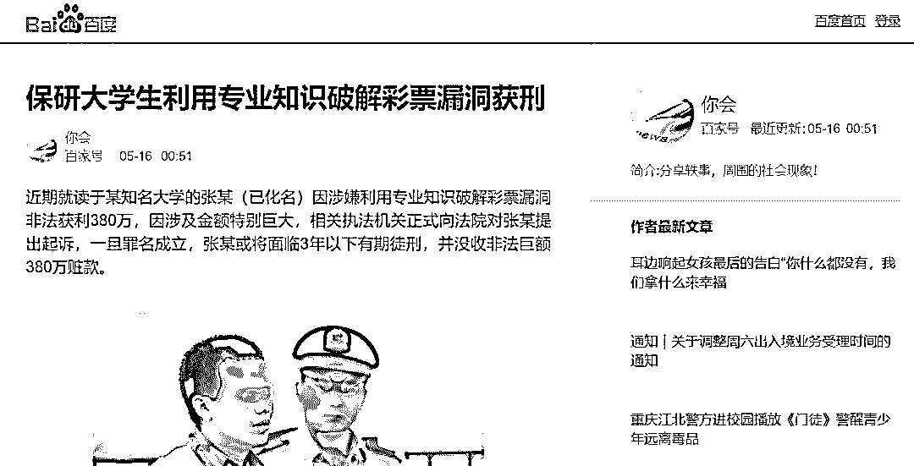

今日头条客户端更厉害，发布这篇虚假报道的居然是**重庆青年报官方账号**，文章发布仅 4 个小时就已经有将近 6 千条评论。

而且，居然今日头条平台还给这篇文章标注了原创！！！

？？？

今日头条的内容算法不是很厉害吗？这是闹着玩儿呢？

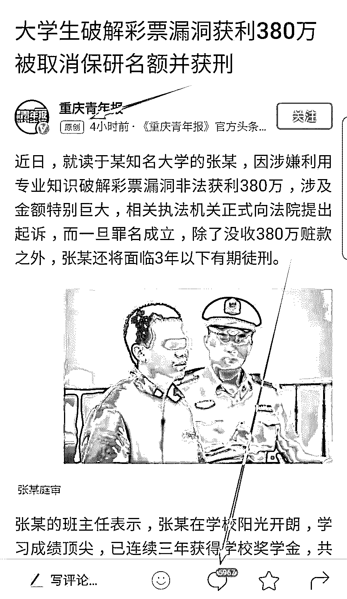

在**腾讯旗下的天天快报**上，虽然我没找到保研大学生张某这篇，但我找到文中提及的另一篇文章：《高中生利用数学概率攻破彩票漏洞》。

在这篇文章里，开头居然还冒了**中新网**标识，也不知是真是假。

文章同样讲述了一个穷苦劳动人民 “利用知识改变命运”然后被抓的悲惨故事，只不过主角从“保研大学生张某”变成了“普通工人家庭的高中生小罗”。

这篇文章里也有不少截图。

比如下面这张截图展示了高中生小罗利用平台漏洞发家致富的辉煌战绩。

短短几天，高中生小罗账户余额就达到了四十多万：

文章里的还有图片展示了小罗同学密密麻麻的数学推演公式草稿本，试图增加说服力：

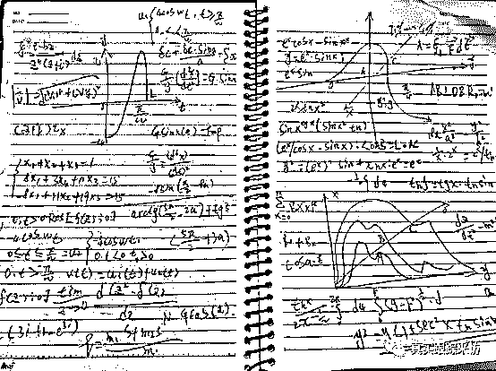

当然，他们最后不忘用聊天截图的方式来露出一下赌博网站的网址 ：

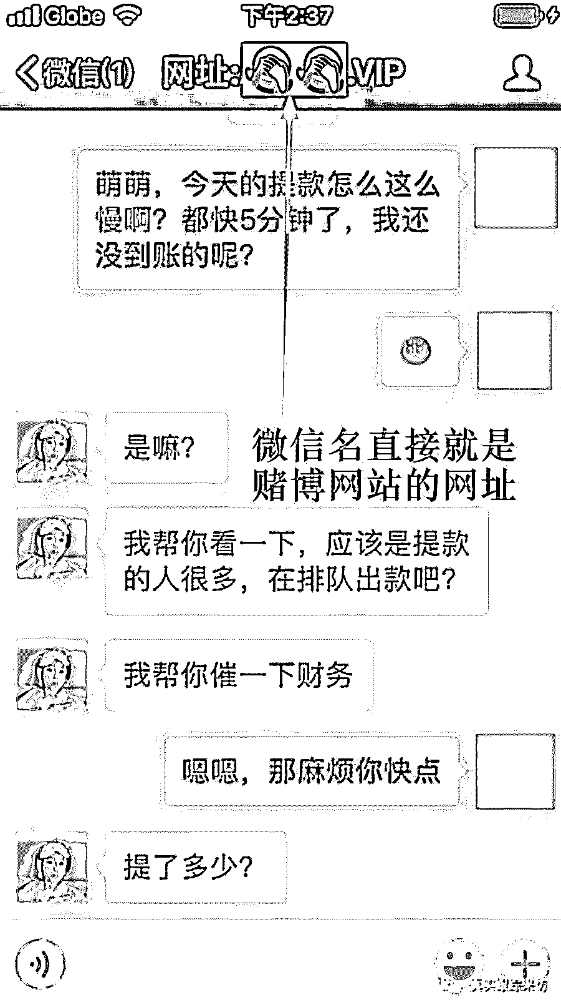

我照着网址登进去，发现跟“保研大学生”那篇是同一个博彩网站。

显然，这是同一波人做的。

在文章里，他们一会儿说赌博必胜法则已经被知名教授证实，一会儿又搬出来历史故事佐证。目的就是让读者相信世上真的存在某种赌博必胜法则。

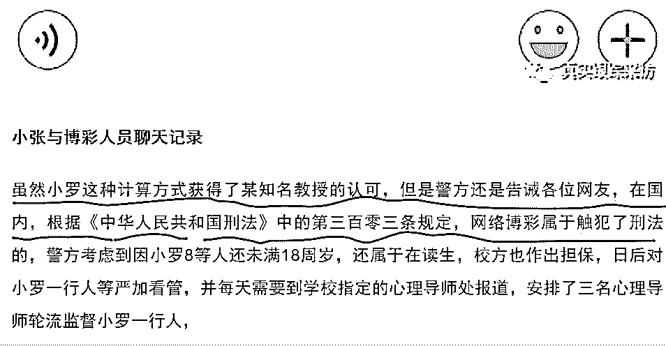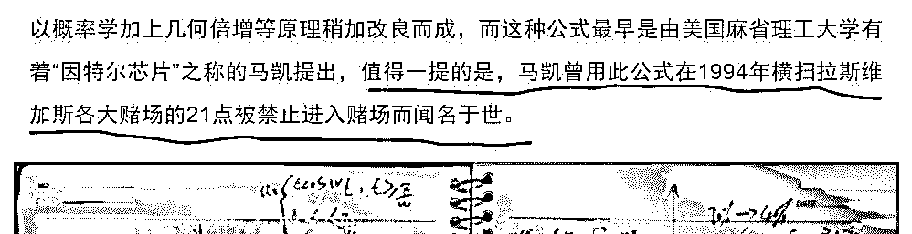

这些文章不光发在各大新闻客户端，还发在一些论坛、贴吧里。

在百度贴吧“狗吧”，我发现网友“补天胖虎”用自问自答的方式向吧友推荐赌博网站。

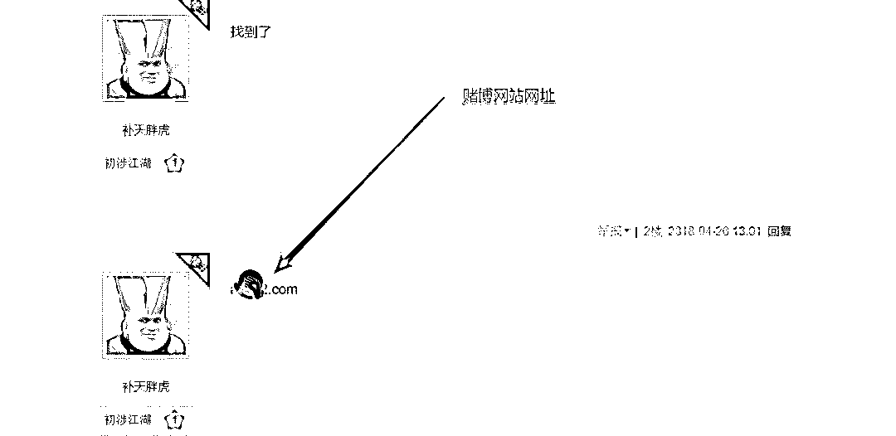

我往下翻了翻，“补天胖虎”还附上了一个今日头条的网址 ：

点进去一看，补天胖虎利用今日头条的“微头条”功能发布内容，吸引人们参与网络赌博：

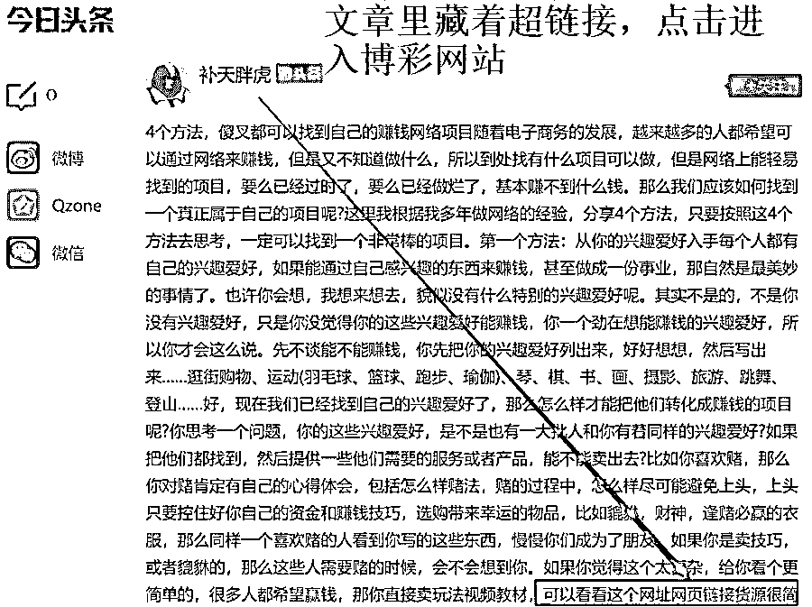

（胖虎同学似乎换了个发型）

至此，我已经深深被这个赌博网站的推广能力所折服。

一个赌博网站，能在新闻客户端、贴吧、论坛等多个内容渠道推广，还会利用冲突的情节制造爆款假新闻吸引人们传播，甚至权威大号转载，再利用漏洞营销的方式进行最后的转化。

我服，我真服！

网易新闻、百家号、天天快报、今日头条、重庆青年报……以及其他转载、转发了这篇文章的朋友们，你们服了吗？

*最后再介绍一下我自己吧，我是**谢幺**，科技科普作者一枚，**日常是把各种高大上的技术、黑科技讲得通俗有趣。**如果有什么有意思的科技类问题，可以在知乎**@谢幺**，或者搜索**微信：dexter0**。**不想走丢的话，请关注【浅黑科技】！*

* * *

**浅黑科技，让技术被读懂**

