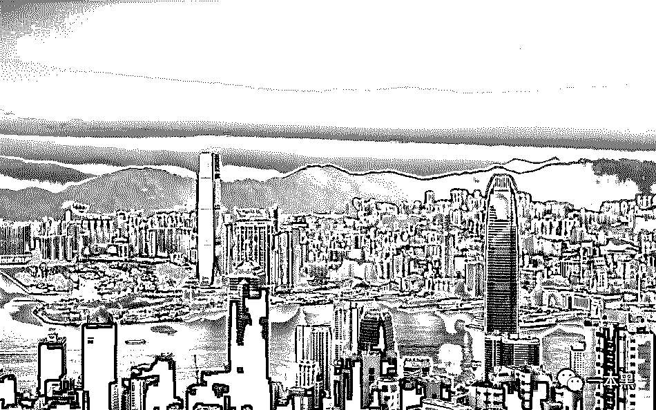

# 你讲故事我给钱，好故事不该被遗忘（非虚构故事征集）

> 原文：[`mp.weixin.qq.com/s?__biz=MzU4ODAwNzUwMQ==&mid=2247484232&idx=1&sn=8101930099c3c3367dddedb98cb9ea18&chksm=fde2126aca959b7cfee816418f93d0cbf208b65429e7421b31bbb70ddff8d3d2eea372d71e50&scene=27#wechat_redirect`](http://mp.weixin.qq.com/s?__biz=MzU4ODAwNzUwMQ==&mid=2247484232&idx=1&sn=8101930099c3c3367dddedb98cb9ea18&chksm=fde2126aca959b7cfee816418f93d0cbf208b65429e7421b31bbb70ddff8d3d2eea372d71e50&scene=27#wechat_redirect)

看多了地下产业的明争暗斗与尔虞我诈，逐渐明白一个道理，生而为人，活着、不仅仅是为了活着。

它还掺杂着对这个社会的审视和它体现出来的矛盾，在我看来，不管是互联网中的地下黑产，还是行业里鲜为人知的故事，这一切都是以现实元素为背景的，它是真实而鲜活的，我认为，它是值得被记录的。

我们写过中国乡村的兴起与衰败，非法集资在落后地区疯狂大肆敛财，尽管只是凤毛麟角，但可以肯定的是这就是现状，这就是中国农村体内的一块毒瘤。

我们还写过色情从业者的经历，不管是无奈、辛酸还是走投无路，它无不与社会这个大背景有关，它是阶层下的附属品还是欲望的始作俑者。

社会的矛盾与不公平全然不能解读这一切，以前我们用技术去还原事实，但真实的故事也同样值得被挖掘与记录。

一个充满烟火气、真实而鲜活的故事必然与这个时代存在着某种联系，**一本黑（darkinsider）**将会开设一个新栏目，人生百态也好，风云往事也罢，我们希望去记录一些发生在你身上或身边的非虚构故事。

**我们的要求：**

1、你的故事应该是能够揭示某一事物的本质、能够体现出人性的变化与时代的影响，并且拥有矛盾与对抗。（可以从灰黑产出发）

2、与社会平等有关、与金钱有关、与黑暗、底层有关。

3、必须是真实发生过的非虚构故事。（**重点**）

**我们能提供什么：**

1、好故事值得被付费，对于作者投稿，视质量而定**500-2000**元/篇

2、对于故事提供者，视题材而定不低于**200**元/篇

投稿邮箱：3317074899@qq.com

投稿微信：yibenheiTG

（一周不回即可视为淘汰）

我们鼓励与这个时代针锋相对、能剖析生活纹理与质感的作者加入我们，也鼓励有丰富故事经历的读者讲述自己的故事。

让不能发声者发声，让这个社会被忽视和遗忘的故事被看到和听到。

其实生活本身就是这样，就像电影《芳华》里的一句话：“ 我不禁想到，一代人的芳华已逝，面目全非，虽然他们谈笑如故，可还是不难看出岁月给每个人带来的改变。”

**而这一切，值得被记录。**

# 

> 原文：[`mp.weixin.qq.com/s?__biz=MzU4ODAwNzUwMQ==&mid=2247484226&idx=1&sn=6dde8b782a1ffdb57d836dd7ea57a6ef&chksm=fde21260ca959b76c6442039d36704fd2d4f872c0a6fb40f8f1248fd3463fc901f2aab687ef0&scene=27#wechat_redirect`](http://mp.weixin.qq.com/s?__biz=MzU4ODAwNzUwMQ==&mid=2247484226&idx=1&sn=6dde8b782a1ffdb57d836dd7ea57a6ef&chksm=fde21260ca959b76c6442039d36704fd2d4f872c0a6fb40f8f1248fd3463fc901f2aab687ef0&scene=27#wechat_redirect)