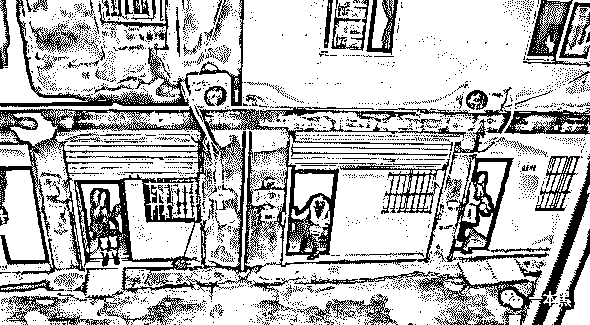

# 天天“性生活”，偶尔打个胎，一个色情服务人员的自诉

> 原文：[`mp.weixin.qq.com/s?__biz=MzU4ODAwNzUwMQ==&mid=2247484195&idx=1&sn=c9ae6852bf1220bcbf2345d8ead29f1f&chksm=fde21201ca959b179bfb0055e05d453c7997393566a451d9340ff41fc4b624f45d419aae0615&scene=27#wechat_redirect`](http://mp.weixin.qq.com/s?__biz=MzU4ODAwNzUwMQ==&mid=2247484195&idx=1&sn=c9ae6852bf1220bcbf2345d8ead29f1f&chksm=fde21201ca959b179bfb0055e05d453c7997393566a451d9340ff41fc4b624f45d419aae0615&scene=27#wechat_redirect)

导读

“我也知道从事色情行业违法，但是没办法，都是小人物，做不了什么大事，活着有口饭吃就行。”

**作者|东东**

**责编|振宇**

我们当中的大部分人都过着循规蹈矩的生活，以为别人即使不像自己一样对世界安之若素，也不会离经叛道到哪里去。

每个行业都有每个行业的阴暗，而这些阴暗往往反映了一个社会的不公与无奈。

古往今来，从有男人和女人存在开始，色情服务就一直存在。

作为男人寻欢作乐、女人拿钱办事的媒介，色情行业算是一个见不得光的社会底层。

眼前这位看似饱经风霜的女人正向我走来，招呼服务员点单后，她向我正式介绍自己，在随后的言谈中，我仿佛看到了她所经历的一切。

从事色情服务三年，花姐向我讲述了自己在这个行业里见过的各种女人和形形色色的男人。

**素场子唱歌，荤场子皮肉交易**

“底下的人一般都叫我经理，我也挺喜欢他们这样叫我。”在开始正式谈话前，花姐从包里拿出一根烟点上，是那种比较细的阿诗玛，烟盒上的女人让我想起一部叫做《金陵十三钗》的电影。

“入行快三年了，在公司我的对外身份是客户经理，其实说白了就是个皮条客，行业俗称鸡妈妈。

但我更喜欢他们叫我花姐，因为这样显得亲切，你也知道，像我们这样的人一般都没什么朋友。”

“我现在工作的地方算是当地比较好的 KTV，一般都是 500 的场子，手底下管七八个人。

咱们这个行业也分市场高低，像我们这种只能算中上等的水平，当然一两百块的也有，那些都是小场子，赚不到什么钱。”

“几十块的也有，路边站街的大把，但相比较来说，体验会差一些。毕竟一分钱一分货。”



“500 的场子是什么意思？”我随手拿出一根烟点上，此时服务员正端着咖啡走过来。

“这里一般会有坐台和出台两种说法，500 的场子意思就是说小姐的坐台费用是 500 块，也就是陪客人唱唱歌，聊聊天那种。

“出台就是说客人玩高兴了，看对眼了就可以把小姐带走，这就得另算。”

我们一般都会有暗语，就是当客人要求小姐出台的时候，我们都会给小姐说可以 OK？要是小姐觉得可以，接下来就会安排给客人订房。

不过也有些喝大心急的客户直接就和小姐在 KTV 或者厕所就把事情办了，这种情况并不在少数。



KTV 一般分为荤场和素场，素场就是单纯的唱歌娱乐，荤场就不用多解释了，基本都是 500 的消费，但也有例外，主要看脸，长得漂亮是优势，价格上固然会高一些。

凡是来这里的客人都是有一定消费能力的，要么是当官来腐败的、要么是谈业务拉拢人的，说白了都是些权钱交易。

但我们并不会在乎客人是什么身份，只要给得起钱，服务肯定到位，毕竟干咱们这行的还得以服务为主，不然留不住回头客。

小姐们坐台前都会上交 100 到 200 元的台费给公司，实际上这些钱都交到了鸡妈妈们的手中，出台的费用也得先让客人先付，一方面防止小姐拿钱走人，另一方面也防止客人吃“霸王餐”。

一般来说，小姐刨出缴纳的台费其余都是自己的，只要查得不严，小姐基本每天都可以做到台。

KTV 都会有四五个“客户经理”，手底下管七八个人，这些小姐的坐台、出台都由“客户经理”来安排。

当“客户经理”的一般都是行里的老油条，对里面的套路规则都门清，人脉也广，和老客户都经常保持联系。一旦有生意他们就会招呼底下小姐接单干活。

“小姐只需要给公司交纳 100 块台费就行了？那你们 KTV 怎么赚钱？”

“当然是靠酒水赚钱，KTV 不会靠小姐接客赚钱，不然没人跟着你干。”



小姐每次出台都会有任务，一个场子下来如果客人的酒水消费没有达标小姐是要被罚钱的，所以很多小姐都会拼了命的和客人喝酒，白的啤的红的洋的一顿喝，一般都是吐了再喝喝了再吐的状态。

其实有时候挺同情他们的，但又可能是做这一行的时间长了吧，对于这些都见怪不怪了。

说到这里，花姐使劲摁灭了烟头，又掏出一根点上，吞云吐雾间仿佛还有很多话要讲。

**“小姐”到“小姐姐”，色情服务人员的转型**

上面说了有些喝大心急的客户直接就和小姐在 KTV 或者厕所就把事情给办了，这种情况其实 KTV 是坚决不允许的，这也就是为什么干我们这行不好管理的原因之一。

还有就是 KTV 绝对不允许客人和小姐在里面玩药，因为哪怕被抓住一次，事情闹得大一点，KTV 是要被关门的。

不过还是有客人小姐不听劝玩得很嗨的，曾经我就亲眼见证过手底下的一个小姐在包房里玩药，其实也就是听了客人的蛊惑，从此就走上了玩药的不归路。

KTV 为了提升小姐的业绩，会让小姐主动去发展新客户，无非就是探探、陌陌这类社交平台，或者是婚恋平台。

他们注册账号在平台上约男客户线下见面，然后把客人带到 KTV 消费，以此来提升自己的业绩，要是遇到精明的客户可能不会点太贵的酒，小姐们就会色诱客户去开房，反正对从事色情服务的她们来说，根本不算事儿。

小姐为了钱出卖自己的青春和身体，说到底这一切都是为了钱，因为她们都处于社会的底层，而社会又需要色情这种刚性服务，说白都是交换，你为了爽，我为了钱。

色情服务就像一条没有光亮的山洞，你越走就会越黑，特别是当只有你一个人的时候，很容易就会陷进去。

他们大多数学历都比较低，没什么文化，其实一开始是很厌恶这个职业的，从开始的厌恶，到过程中的挣扎，再到从中发现乐趣，最后开始享受，为了钱他们什么都能接受，也什么都能改变。

当然也有学历比较高的，例如大学生、研究生都有，说得狗血一点，他们有被男朋友甩了自甘堕落的，也有和父母闹掰的。其实这种人真的很幼稚，不把自己的青春和身体当回事，对自己太不负责任。

在 KTV 客人不多而他们又缺钱的时候，他们曾经有用裸贷的方式去骗钱，反正都是干这行的，还怕自己的照片被人看到吗？但他们也会顾忌自己的家人朋友看到自己的照片，所以会选择用假身份去骗贷。

前几年疯传的裸贷事件中，我底下的很多小姐也都有参与过。



小姐这一行是吃青春饭的，到了一定的年龄就得转型，但基本上都是不能走回正轨的，因为即使不做小姐了，也会轻易动用自己的性资本，这种方式来钱快，一旦遇到经济困难的时候，马上就会走回头路。

“我就是从小姐走过来的，现在转型做了鸡妈。”花姐一副无奈的表情，此时烟灰缸里已经散乱着好几根烟头。

不过有些艺术院校毕业的小姐有才艺，唱歌跳舞样样在行，加上现在直播和短视频又这么火，随便上个平台就能火，这算是在色情行业里转型比较成功的。

（这个时候他们就经历了从“小姐”到“小姐姐”的转换，你看，一字之差，但千差万别）

当然也有啥都不会找个色情直播平台漏胸漏点的，刷跑车进群卖自己的裸体视频，相对来说，这只能算是她们的兼职而已。



**天天“性生活”，偶尔打个胎**

当问及小姐的生活状态时，花姐说：“和大多数人比起来，他们也只能算得上是社会的底层人员。”

很多小姐都不是本地的，职业的特殊性也注定了他们不可能是本地人，他们大多来自偏远地区，在偌大的城市过着仿佛隐姓埋名的生活。

一些小姐为了省钱，会选择住在便宜的城中村或离市区比较远的地方，也有常年住在小旅馆的，他们当中有些是被人从家乡骗过来的，和同样是做小姐的姐妹们住在一起。

久而久之也就习惯了这样的生活，对于生活，他们已无力反抗。

城中村治安差、环境脏乱，居住着社会上各种各样的人，路边卫生条件差的小饭馆是他们一日三餐的必选之地，闪着红灯的发廊也有可能是他们最常出入的地方，有时候下了班还会去这种发廊，毕竟为了钱能接几单是几单。

家庭环境的原因给了他们不少压力，弟妹多，父母又年迈，只能不停地接客才能维持生活甚至给家里打钱，他们认识不到事情的严重性，所以一直在色情服务这条路上循环往复，但实际上自己却赚不了什么钱。

**他们是社会的底层人员，是小姐中的底层小姐。**

不过也有些混得好的小姐，长得好看又会套路客人，这种人一般都比较吃香，短时间傍上个有钱的主就能潇洒一阵子，不过最终还是逃不过小姐这一称呼。

因为这个职业是见不得光的，这就导致小姐们基本没什么朋友，他们的圈子很单一，身边的人不是做色情服务的就是做行业相关的。

不像正当行业有五险一金、有社会福利，小姐们最缺乏的就是安全感，因为有时候一个不小心导致怀孕了那这个就得自己承担，打胎对于他们来说那都是常有的事。

总的来说，他们的生活就是不停的跑场子接客，没有固定点，他们永远不知道自己的下一站在哪里，在他们的意识里已经没有未来二字，走一步看一步一直是他们活着的状态。

即使那些在色情行业的小姐做得风生水起，但和普通人比起来，他们要走的路恐怕还是世事难料。

花姐说他从事色情行业近三年，其实早就想放弃转行做其他的，但就像上面说到的，这条路一黑走到底，陷进去了就无法再走出来。

“我也知道从事色情行业违法，但是没办法，都是小人物，做不了什么大事，活着有口饭吃就行。”

“等这个行业真的到了被彻底清缴的那一天，也许正是我解脱的时候。”

交谈中，花姐不避讳的说了关于色情行业的种种现象以及黑暗，篇幅有限，很多故事留着下次在讲。

也许我们会感叹这个世界为何如此魔幻，上演的尽是一些关于人心与金钱的复杂故事，社会的底层到底该如何去定义，我想还得有个参照物，最起码做到有理有据。

对于花姐所讲述的行业故事，一本黑不会以一个审判者的角度去评价任何事物，只想让大家了解行业的种种，能从中得到一些启发或思考。

有可能有一天，这个世界一下就变好了，也有可能会一直烂下去。

我们当中的大部分人都过着循规蹈矩的生活，以为别人即使不像自己一样对世界安之若素，也不会离经叛道到哪里去。

但对于他们这种职业或人生常态来说，也许并非如此。

还原事实｜专扒黑产

微信 ID：darkinsider

知乎 一本黑

头条 一本黑

投稿、爆料请点击菜单【爆料入口】

招聘、转载请点击菜单【联系我们】