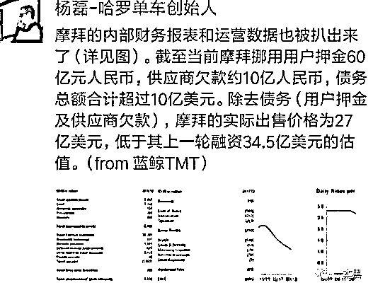

# 摩拜套现 15 亿你就焦虑了？甩开我们的不是财务差距，更多的是名声差距

> 原文：[`mp.weixin.qq.com/s?__biz=MzU4ODAwNzUwMQ==&mid=2247484151&idx=1&sn=eb3c30c1378cbe13ffae4bebe9a7180f&chksm=fde213d5ca959ac35bd07b5806f3bfedd8eebbf039455d89b2a8a70daf26e3b87c106abfde64&scene=27#wechat_redirect`](http://mp.weixin.qq.com/s?__biz=MzU4ODAwNzUwMQ==&mid=2247484151&idx=1&sn=eb3c30c1378cbe13ffae4bebe9a7180f&chksm=fde213d5ca959ac35bd07b5806f3bfedd8eebbf039455d89b2a8a70daf26e3b87c106abfde64&scene=27#wechat_redirect)

导读

想法千万不要被引导，恶心的世界里，保持独立思考，切勿随波逐流。

**文|东东**

**责编|振宇**

上周，美团收购摩拜的新闻想必大家都早有耳闻，很多人觉得摩拜创始人胡玮炜套现 15 亿，由此实现财务自由，让很多人羡慕不已。

据传本来可以选择一笔 10 亿美元的新投资继续战斗，但经过创始团队的投票后最终选择了卖身“求荣”。

事件一出，最具吸引力和最具话题性的当属创始人胡玮炜，一篇名为《摩拜创始人胡玮炜套现 15 亿：你的同龄人，正在抛弃你》的文章随即而出，瞬间刷屏朋友圈，焦虑一词再次被贩卖。

与此同时，也有不少媒体甚至大 V 发出质疑的声音，声称资本市场存在优先清算权，创业者根本分不到钱，苦逼的同时也只能靠“卖身”惨淡收场。

**摩拜这块蛋糕到底能套现多少钱？**

暂且不说贩卖焦虑，制造恐慌，原文作者对资本市场的认知可以说是寥若晨星，胡说八道。没看清事物的本质，仅凭表面就大肆猜想，而韩寒也经历过投融资是个明白人，所以才会发声谴责。

公开数据显示，美团以 27 亿美元收购摩拜，创始人胡玮炜持股 9%，这样算下来大概就是 15 亿。

原来胡玮炜套现 15 亿抛弃同龄人是这样来的，请原谅我的无知。

但各位有所不知，在残酷的资本游戏规则里，有一个叫做**优先清算权的东西。**

通俗来说，按照投资者进入的顺序以及估值高低，公司的股份会分为不同的类别，投资人持有优先股，越是后期进入的投资人，优先级就越高。当然这个是不考虑里面存在特殊条款的情况。

除投资人之外，创始团队成员持有的就是普通股。

当公司被清算或收购的时候，投资人将会有优先拿走投资本金和利息的权利，按照业内常规一般是年化 6%（复利）或是年华 10%（单利）。

（至于什么是单利、复利这里不做阐述，各位自行搜索）

拿摩拜被收购来说，首先摩拜前期经过了很多轮融资，所有的投资人就得按照优先级来分配收益。

假如公司融到了 D 轮，那么就是先清算 D 轮，再清算 C 轮......最后到种子轮，然后才是到创始人。

就好比一开始我有想做一个蛋糕的想法，但是我没有资金去购买做蛋糕的材料，于是很多认同我想法的投资人就给我投资做蛋糕的食材、设备等。

等蛋糕做好了放在桌子上，所有投资人都会按照事先约定好的顺序来分蛋糕，这个可以叫做“退出”。

清算一般从最近的一个投资人开始，按照顺序，先让他们分蛋糕；等这些优先股分完自己该分的蛋糕后，桌上如果还剩有蛋糕，再由全体股东按照股份比例来分。

接着得先把做蛋糕产生的各种费用结算清楚，这里指还企业外债和员工工资，最后才能轮到创始人去分。

首先，我们来看一下摩拜这块蛋糕到底花了多少钱，又剩下了多少钱。

公开数据显示，摩拜单车从 2015 年天使轮投资至今，一共完成 12 轮融资共计金额在 160 亿元人民币左右。

27 亿美元折合人民币 169.86 亿元，按照上面所说的优先清算权，就算 27 亿全部用于投资人清算，本息加一起必定是赔本的买卖，更不要说投资人之后的普通股东了。**（这里暂不考虑固定资产的因素，即单车资产、用户数量等）**

注意文章开头提到的美团以 27 亿美元收购摩拜，创始人胡玮炜持股 9%，美团收购还不全是现金收购，还得扣除创始人 9%的股份，也就是说剩下的钱即使全部用在投资人清算，也会有一部分投资人拿不到自己的本息。

有相关媒体爆料出摩拜的业务数据，债务合计超过 10 亿美元，挪用用户押金约 60 亿人民币，拖欠供应商欠款约 10 亿。（你摩拜的押金退了吗？）



对摩拜来说，能以 27 亿被美团收购已经是烧高香了，债务 10 亿的窟窿算是让美团王兴给填上了。

现在再看那篇《摩拜创始人胡玮炜套现 15 亿：你的同龄人，正在抛弃你》的文章还会觉得焦虑吗？

另一方面，**很多公开的投资金额都是有水分的**，翻个五倍十倍的都太正常不过。

在优先清算权的规定下，前期投资人肯定有优先权拿走桌上的蛋糕，但也不至于连蛋糕渣都不剩。

因为前面我说到了，收购价 27 亿如果全部用于投资人清算，本息加一起必定是赔本，那是在不考虑固定资产的情况下。

不可能只按收购价来权衡到底是赔是赚，这样的算法并不严谨。

所以理性来说摩拜创始人胡玮炜既不可能套现 15 亿，也不存在什么创业苦逼，多多少少还是会分到一些钱的，没准人家现在正一身轻松，过得美滋滋呢。

**贩卖焦虑成为产业链，实则却是流量收割机**

近年来这种贩卖焦虑，制造恐慌的文章层出不穷，大众为此纷纷产生共鸣，于是就这样养活了一个又一个的公众号或平台。

也不知道是谁把焦虑一词推上风口浪尖，制造贩卖、甚至消费焦虑已经成为了一条产业链。

就好像是一个成文的剧本一样，只要按照这个剧本走，大众就一定会买账，就一定会纷纷转发。

我想问转发过后呢，焦虑过后呢，还不是照样上班玩手机下班打游戏，下一篇类似的文章出来的时候，再焦虑一次？

别人才不管你焦虑不焦虑，只要写出引发共鸣的焦虑感，就能进行流量收割，说白了这些都是某些媒体人故意制造焦虑、一个谋生的手段而已，何必较真，世界本来就真真假假。

别人贩卖焦虑只是为吸引眼球或者是获客的一种手段，焦虑贩卖完给你自己带来了什么，我觉得这是一个值得思考的事情。

对于真相，**一本黑（darkinsider）**知道的也只是一星半点，偌大的世界，复杂的人心都是各位所不能企及的，鸡汤也好，焦虑也罢，背后一定有它存在的道理，要么“造福”你，要么套路你。几乎没有什么东西是纯粹的。

想想这背后的逻辑，别人给你带来焦虑的同时，你除了焦虑还得到了什么？

想法千万不要被引导，恶心的世界里，保持独立思考，切勿随波逐流。

不然你就会沦为跟风的傻逼。

还原事实｜专扒黑产

微信 ID：darkinsider

知乎 一本黑

头条 一本黑

投稿、爆料请点击菜单【爆料入口】

招聘、转载请点击菜单【联系我们】