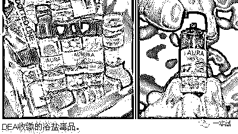
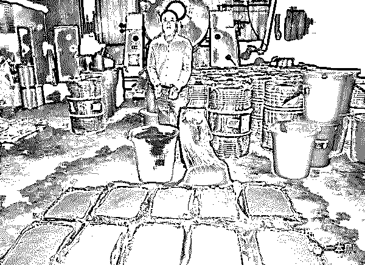
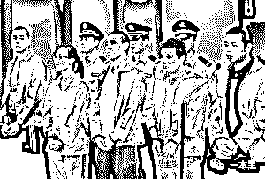

# 街头惊现丧尸啃脸？这些毒品居然合法！

> 原文：[`mp.weixin.qq.com/s?__biz=MzU4ODAwNzUwMQ==&mid=2247484135&idx=1&sn=ee4e0074600b5edb619e35d6d6b0bdd3&chksm=fde213c5ca959ad3583928e9d72cc765d8cce67112b062ae7ca7077df12655c7b9dd3235e599&scene=27#wechat_redirect`](http://mp.weixin.qq.com/s?__biz=MzU4ODAwNzUwMQ==&mid=2247484135&idx=1&sn=ee4e0074600b5edb619e35d6d6b0bdd3&chksm=fde213c5ca959ad3583928e9d72cc765d8cce67112b062ae7ca7077df12655c7b9dd3235e599&scene=27#wechat_redirect)

**文|小白**

**责编|振宇**

****街头“丧尸”啃脸？****

2012 年美国迈阿密街头惊现啃脸事件，袭击者被形容为“丧尸”，在网上甚至有人开玩笑猜想这是不是真的“丧尸吃人”事件。

网友们开玩笑的时候不会想到，这是第一起真正意义上广泛传播并引起人们注意的某项黑产事件，也是一个黑暗产业链浮上水面的开始。

迈阿密啃脸事件后，世界各地开始出现越来越多的“丧尸”报道，暴力袭击、啃脸、行为姿态诡异......甚至连中国香港、济南等等城市也都出现了这样的事件。

这些看似诡异的“啃脸”暴力，实际上都源于一种新型毒品——浴盐。而跟往常其它毒品事件不同，浴盐和它的同类型毒品，最开始都是以合法的姿态出现在市面上的。当其它的毒贩在狡辩自己没有贩卖毒品的时候，这类新型毒品产业链的相关人员会直接告诉你他们卖的不是毒品，完全合法。

****“合法毒品”的背后，是一群“绝命毒师”****

当浴盐被列为毒品禁止后，聪明的制造者们立刻推出了许多替代品，取名喵喵、土冰等，这一类药品的原料都是甲卡西酮。

让警方头大的“合法毒品”只是钻了一些漏洞，制造者在制造时会使用一些不违法的原料，改变它们的化学结构，制作成新的毒品。而这些毒品更新的速度，往往超过法律禁止的速度。

而售卖者以“合法”为挡箭牌，宣传引诱普通人吸食，让购买者误以为药品无害。只是购买者们大多忘了，海洛因等毒品最初出现的时候，也是以合法的姿态站立。

事实上，从事这些新型毒品研制的，大多是一些高学历的化学天才。学生、博士、教授......这些听起来跟毒品沾不上边的名词，却成为了这些毒品的研发者。

15 年，双目失明的化学教授陆某被抓，理由是制毒。陆教授制毒用的原料来源合法，由他所在的药物进货，制造则由他口头表述，“遥控保姆”协助制毒。制造出的毒品贴上原材料的标签，再通过药物公司转卖给上海的化工品公司，之后由化工品公司分销。

制毒售毒的每一步都难以被察觉，由于药物公司和化工厂的特殊性，购买原料便捷，运送货物的伪装也简单，不易被查出，这也造就了更多陆教授这样的人。

大多数这个类型的毒贩利用的招数都大同小异，他们的销售地最开始是国外，后来慢慢向国内发展，拥有自己的实验室偷偷制造，或者干脆以化工厂来掩人耳目。

除了出售成品外，一些毒贩们还会选在在网络出售原料，再告知制毒方式，这样的售卖方式一般会出现在国外。

****化工专家变身之路，从天之骄子变身犯罪分子****

陆教授这样的案件绝不是个例。在《绝命毒师》中，高中化学老师轻易地开始制毒，并以此揽钱，而在现实生活中，陆教授们可能由于生活所迫，可能由于禁不住高额收入的诱惑，选择制毒的人数也并不低。

制毒对他们而言并不是难事，提纯技巧也只需要专心即可成功，加上专业就业面窄，比较困难，时长有人误入歧途。

曾经的天之骄子们可能默默地在进行这样肮脏的交易，轻车熟路地研制新毒，破坏更多的人性和家庭，与此同时自己也冒着巨大的风险，一旦被抓，这一生就到这里戛然而止。

从偏远小山村考出来的化学生黄某，考研后经受不住金钱的诱惑，协助某化工厂老板制毒，最终被抓获，而被捕之前，他正准备出国留学。

武汉某高校化学副教授，也因为制毒被抓。在制毒前，他们曾想研制替代产品（即没来得及被列入违禁品的毒品）来规避风险，由于研制失败，继续制造该合成毒品，最终被抓。

本该前途无量的学生，本来有科研贡献的教授，因为受不了利益的诱惑，都踩进了泥潭。

* * *

每一个细微的决定，最终都可能造成完全不一样的结果。在某个领域有天分，是利也是弊，在运用的过程中一次思考决定的错误，造成的后果可能是你完全不能承受的。

小时候总以为世界非黑即白，总以为自己意志坚定，总在想自己的未来会是什么样子。可长大才发现原来黑白的分界线并不那么分明。

面对的诱惑实在太多，想要的实在太多，能够得到的又似乎很少。当“机会”来临，心跳加速，大脑混乱，一不小心就踏错一步，接着掉进深渊，小时候想想的明亮美好的未来，也因此变得愈加遥远。

生而为人，难在选择，最累的在思考。

还原事实｜专扒黑产

微信 ID：darkinsider

知乎 一本黑

头条 一本黑

投稿、爆料请点击菜单【爆料入口】

招聘、转载请点击菜单【联系我们】