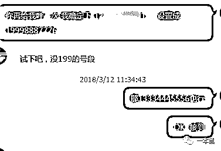
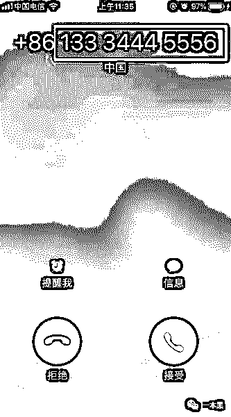
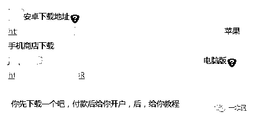
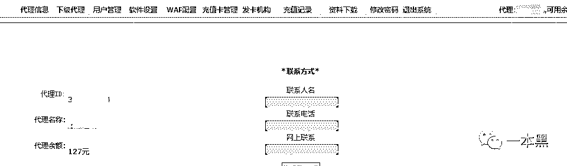
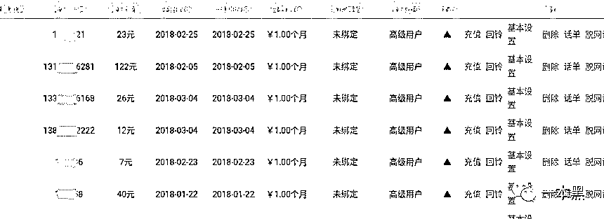
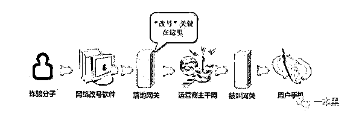

# “我被这个号码骗了 200 万，假李逵上位防不胜防！”

> 原文：[`mp.weixin.qq.com/s?__biz=MzU4ODAwNzUwMQ==&mid=2247484120&idx=1&sn=869c475eafd7ce0a3b4da13b02ed51ac&chksm=fde213faca959aecbbc81e9b39b27cc63e763e68b433afaefebccf60f11862c91b2a3d59accc&scene=27#wechat_redirect`](http://mp.weixin.qq.com/s?__biz=MzU4ODAwNzUwMQ==&mid=2247484120&idx=1&sn=869c475eafd7ce0a3b4da13b02ed51ac&chksm=fde213faca959aecbbc81e9b39b27cc63e763e68b433afaefebccf60f11862c91b2a3d59accc&scene=27#wechat_redirect)

文/东东（微信公众号：一本黑）

责编/振宇

【一本黑】媒体或商业转载必须获得授权，个人转发朋友圈无需授权。

读完需要

8 分钟

速读仅需 3 分钟

* * *

“喂，您好，我这里是社保局，您在 XX 城区办理的社保卡涉及多家医院骗保，社保局现将冻结您的医保卡账号......” 

“喂，您好，我是 XX 公安分局刑侦支队民警，由于您的身份信息泄露，其名下银行卡涉及洗钱等犯罪活动......”

随后，一自称法院公证室的男子与事主取得联系，先后以对事主财产公证保全、缴纳无犯罪保证金、办理加急结案手续费等理由为名，向事主索要钱财，实施诈骗。导致事主先后被骗 200 余万元。

以上是读者给我们发来的爆料，声称自己遭遇电信诈骗，一开始还很警觉，但反复揣摩对方打过来的话语和电话后，逐渐放松警惕，最后慢慢落入骗子精心编造的谎言中。

**巨额来电**

读者的爆料让我想起了一部叫《巨额来电》的电影，派出所民警丁小田抓捕电信诈骗罪犯，与警方电信诈骗专案组不谋而合。

专案组派出女警员混入骗子团队搜集证据，对外与丁小田密切配合，对内与诈骗集团斗智斗勇，逐步掌握了犯罪团伙在诈骗各个环节的机密和证据。

同时诈骗团队与人立下**30 天骗下 1 亿人民币**的惊天赌约，多位商业巨贾及大量普通百姓卷入其中......

《巨额来电》就题材来说很好的科普了大众所不知道的电信诈骗流程，原来在一通诈骗电话打出来的背后，居然有着一套高度流程化的分工。

电影中引入了一系列专有名词，**菜商、卡头、话务员、车手、水房，**而这些看似普通的名词都代表着诈骗环节中的一个重要流程。

**菜商出售公民信息；卡头办理用于转账的银行卡；话务员一般分为一线话务员和二线话务员，在这条拨打诈骗电话的流水线上，前者负责开场，后者紧跟收网；车手负责集中提取账款；水房负责洗钱，他们分工明确，各司其职。**

而今天我想讲的是诈骗团伙在诈骗环节中经常需要使用到的一种工具——**改号软件****。**

通过改号软件，能让拨打出去的电话号码在对方手机或座机上显示的号码为任意号码，这种软件是犯罪分子常用的一种诈骗工具。

影片中诈骗头目的妹妹因为憎恨哥哥从事诈骗行为，拒绝其给予的生活费，生活拮据的她因此申请学校助学金，却接到骗子伪装成教育局工作人员的电话，告知只有先把学费转到骗子的账户上，才能激活验证领取奖学金。

这条故事线实际上改编自 2016 年骇人听闻的**山东徐玉玉案**，刚踏进校园的她被骗子以发放助学金为由骗走 9900 元学费，报案后因情绪异常心脏骤停离世。

而骗子正是通过流程化的运作与事先准备好的话术，让社会经验本就不多的大学生逐渐失去理智，最终导致悲剧的发生。

不管是影片还是现实生活，诈骗者屡屡得逞的原因不外乎利益二字，他们利用人性的贪念与欲望，把受骗者玩弄于股掌之间。

**来电号码可任意设置？**

对于其中提到的改号软件，是否能在网上轻易买到呢？

通过关键词搜索，我们果然发现大量贩卖这种改号软件的商家，对方声称自己是一家网络技术公司，只要客户把软件安装到手机上，并填写账号密码即可使用。

想让对方来电显示的是什么号码就可以设置为什么号码，说到这一点，对方无比的自信自己的产品。

当提出是否可以试用时，对方很爽快的就答应了，只要把手机号码和想要改变的号码发给对方，等对方打过来即可验证真假。

一分钟不到的时间，对方就按照设置的指定号码拨通了我的电话。

随后，我和老师傅以购买改号软件为由，拿到了这款可以修改号码的软件，软件分为安卓版、苹果版、还有电脑版。

这款软件售价 120 元，开户后里面有 30 元话费可以使用，并提供用户名、密码、以及服务器域名。拨打电话每分钟 0.95 元，可以将手机号修改成任意的 11 位号码。

信息收集完毕后，好久没有使用【计算机基础】的老师傅默默地点上了一根烟......

结果自然是毋庸置疑，老师傅顺利打入敌方阵营，在 HT 里，可以看到对方给客户的开卡记录以及充值记录等。

别看这些账户的余额都很少，开户费加上充值费那可不是一笔小数目，要是对方和诈骗团伙有合作，那这个量必定是持续不断的。

对于制作改号软件的团队，一定程度上可以说他们是诈骗团伙的后盾，可以源源不断地为其提供改号诈骗服务。

虽然在近几年国家对电信诈骗的打击力度不断加大，工信部发文要求清理网上短信改号软件，并要求互联网企业下架并屏幕相关关键词。一定程度上使得这类使用改号软件进行诈骗的案例大幅降低。

这些政策表面上看似切断了改号软件的传播和销售渠道，但通过**一本黑（darkinsider）**的调查发现，这类软件并没有销声匿迹，还是有不少人铤而走险，暗中销售。

对此，老师说道，这类软件如果不从根源上铲除，必定会春风吹又生。只有找到此类漏洞并修补，才能从根本上进行治理。

由于信息量比较少，老师傅并没有顺藤摸瓜出这背后的操纵者，但对于为什么拨打出去的电话可以修改为任意的号码，老师傅向我讲述了其中的原理。

“改号软件其实就是一种网络电话，在通讯的过程中，有人人为地把其中的数据进行了修改，而来电显示就相当于一个数据包，这些数据都是可以被修改的。但是有一个前提就是需要一定的权限。”

（图片来源于网络）

这就好比 A 给 B 讲一个很长的故事，B 听完以后又把这个故事讲给 C 听，但是由于故事太长，B 忘记了一些情节，导致 C 听到的故事并不是很完整甚至被 B 篡改过，而这里面的故事就相当于是拨打出去的电话，可以看做是一个数据包。 

这些数据是可以通过 B 人为编造和修改的，等传到 C 的时候，整个故事自然变了味。

**如何辨别改过号码的来电**

实际上，这种改号软件主要是通过一个中间 IP 平台或者转换器来实现的，也就是说这个电话在打出去的时候并不是点对点式直拨电话来实现的。中间存在一个“传话人”，而这个传话人就拥有修改号码的权限。

这种非法的改号技术运营商根本无法识别，所以也就不能对这种被改过的号码进行拦截或屏蔽，但不少别有用心的人就通过这种技术冒充政府部门或者公安、医院等机构进行诈骗。

那么针对这种经过改号软件修改号码的来电如何辨别呢？**最简单的方式就是回拨。**

假如对方的来电是通过改号软件修改过的，只要按照显示的号码回拨过去，对方是无法接听的。

所以，如果有一天你接到一个熟悉的号码，但对方却是陌生人，只要对方和你谈到利益相关的问题，这时候一定要小心谨慎，可以用回拨的方式先确认真假，在通过其他方式加以辨别。

电信诈骗由来已久，人们总是自作聪明地认为自己一定不会被骗，殊不知骗子掌握了天时地利乃至人和，只要你的关键信息运用到一定的场景，那你就有可能大意失荆州，所以还是小心驶得万年船，谨慎为妙。

**就算你见识过更厉害的骗局，你也可能有被骗的一天。**

大多数电信诈骗犯更倾向于把矛头指向中老年人，在掌握了目标的精准信息后，加之改号软件的配合，可谓是天衣无缝。

而这部分群体大多缺乏辨别与思考能力，很容易就会听信骗子的一面之词，一辈子辛苦攒下的积蓄，有可能就在一瞬间转入骗子囊中。

对他们来说，子女不常在身边，没人给他们“出谋划策”，明眼人就能看破的骗局他们却深信不疑，这和庞氏骗局多少有些雷同之处。

骗子总会有，上当的人总是络绎不绝，受骗者何时能看清骗局。

悲剧何时又能不再上演？

还原事实｜专扒黑产

微信 ID：darkinsider