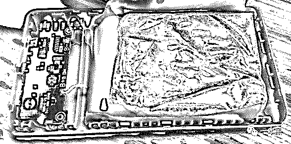

# 火车站充电宝骗术，瞬间盗刷微信支付宝？到底是真是假？

> 原文：[`mp.weixin.qq.com/s?__biz=MzU4ODAwNzUwMQ==&mid=2247484074&idx=1&sn=6f5e5478caba3f8a1cb3fdbd09fe7dc2&chksm=fde21388ca959a9e2bba491c88e45efce041ef5b70681726daea174fd5a10f65df776e880c28&scene=27#wechat_redirect`](http://mp.weixin.qq.com/s?__biz=MzU4ODAwNzUwMQ==&mid=2247484074&idx=1&sn=6f5e5478caba3f8a1cb3fdbd09fe7dc2&chksm=fde21388ca959a9e2bba491c88e45efce041ef5b70681726daea174fd5a10f65df776e880c28&scene=27#wechat_redirect)

文/东东（微信公众号：一本黑）

责编/振宇

【一本黑】媒体或商业转载必须获得授权，个人转发朋友圈无需授权。

读完需要

8 分钟

速读仅需 3 分钟

* * *

前几天无意间看到一个名为《揭秘火车站卖充电宝骗术！盗刷手机微信及支付宝》的视频，说是充电宝里被安装了一些装置，只要使用这种充电宝充电，里面的电话卡就会读取手机信息。 

然后通过电话卡把手机信息传输到坏人的设备里去，从而实现微信、支付宝的盗刷。

[`v.qq.com/iframe/preview.html?vid=x1333039sjz&width=500&height=375&auto=0`](https://v.qq.com/iframe/preview.html?vid=x1333039sjz&width=500&height=375&auto=0)

（没错，就是他）

不少人看到这个视频后纷纷转发，但也有一部分人对视频的真假提出了质疑。

难道真的有这么厉害吗？只要手机一插入充电宝，微信、支付宝就会被盗刷？是却有此事还是危言耸听。

我们现在就对该视频的真假做一个全面的讲解。

**漏洞百出，故弄玄虚**

首先，视频的主角在火车站发现有人赠送充电宝，随后上前索要了一个，过程中用偷拍的角度进行拍摄。

镜头一转，主角戴着面罩坐在电脑面前故弄玄虚的一顿乱敲，一副很神秘的样子。

随着镜头的下拉，一张白纸贴在电脑上，上面清晰的写着“破解中”三个大字。

镜头又一转，主角把面罩摘下来，并用拳头锤在桌子上说了一句表示叹息的话：“哎呀，小编用了 15 年的性......”，哦不，是计算机能力，也没能破解这个木马。

（老师傅都没你 6）

看到这里我就想笑了，一开始戴着面罩为什么后来又要摘下来呢？难道戴着个面罩就是黑客了？

特别是小编用了 15 年的性......计算机能力这句话，怎么听都觉得别扭。

接着主角开始对充电宝进行拆卸，看样子他对这款充电宝的构造很熟悉，三下五除二就拆开了，然后还正儿八经的分析整个充电宝的组成，从哪里接收从哪里发送，讲得头头是道，害我差点都相信了。

视频中的 U 盘应该是一个无线网卡，是可以插在电脑上上网用的，结果他就用一根电线连接到充电板的充电电路上，我想问视频制作者，你一根单股的电线到底是如何完成供电+数据传输的。

暂且不说电源的问题，最起码信号线也得有两根吧。

（陈独秀都没你秀）

总之，这个视频漏洞百出，基本可以确定是为了博人眼球而“精心”制作。

**视频虽假，现象却是真的**

对于这个视频，老师傅看完后说了一句话：**“这个视频虽然很假，但是控制手机进行盗刷这种技术是有可能实现的。”**

手机充电宝一旦经过一系列的技术改装，很有可能就会成为别人盗取手机隐私或钱财的工具。改装成本大概在两三百元不等。

“要不咱复原一下？”我忙不迭地向老师傅递了一根钓鱼台。

“复原需要一些硬件设备，你先准备一下，咱只能试一试，成不成功另说。”老师傅说完拿起桌上的打火机点燃了手中的烟。

其实想要复原这一过程还挺麻烦的，首先需要准备树莓派（可以理解为只有信用卡大小的微型电脑）、锂电池、led 小灯等。

物料准备完毕后，老师傅就开始了改装工作，老师傅先在树莓派上安装了所需要的操作系统，然后进行了相关配置。

经过老师傅一段时间的改装，不负众望的老师傅终于......还是没能成功。

询问老师傅才知道，原来问题出在了给树莓派供电的地方，因为树莓派只能在 5V 的电压下工作，而我们使用了两节 18650（指电池的直径为 18mm，长度为 65mm）的电池，而两节电池的电压加在一起超过了 7V，要想对电压进行调整，只能使用稳压设备慢慢调试。

（稳压元器件）

其实也不能怪老师傅，你要说使用计算机基础知识分析分析网站，那自然不在话下，但是这种纯硬件的东西确实有点难为老师傅了。

复原不了怎么办？复原不了今天就不会有这篇文章了。

通过多条渠道，一本黑（ID：insideone）拿到一个经过改装的、可以控制手机的充电宝。

当充电宝插上手机后，手机显示正常充电状态，但其实这台手机已经被电脑控制了。在电脑的控制端，老师傅可以任意的查看被控制手机的各种信息。

包括通话记录、相册、QQ 微信等，甚至还可以打开支付宝，接收短信验证码等信息。

（视频审核不过，将就看截图）

实验结束后，我们拆开了这款经过改装的充电宝。

用“麻雀虽小五脏俱全”这句话来形容是再好不过了，这款充电宝里面除了供电的电芯以外，还有一块树莓派（可以理解为只有信用卡大小的微型电脑），而这块树莓派就是整个充电宝的核心所在。

它可以在手机插入充电宝的时候把内置木马程序发送到手机的后台，但在这之前它会请求手机用户打开开发者模式，开发者模式一旦打开，手机就可以被监控。

**权限开启，即可盗刷**

再回到前面提到的视频，视频中说只要手机插入充电宝，自己的微信和支付宝就会被盗刷，有这么牛逼吗？。

首先，技术牛逼的人一般不会干微信支付宝盗刷这种智障的事情，因为你转账或是提取到银行卡这些都很容易被查到。

就算你有瞒天过海之术，那咱暂且忽略转账记录这一说。

当手机插上充电宝的时候，正常人都知道使用充电宝充电是不会提示任何请求的，而这类经过改装的充电宝就会有权限允许的请求，不排除粗心的人会点击同意。

打开了开发者模式后还得信任母设备，走到这一步如果你想实现盗刷，你先得监听锁屏的密码，但是如果有人的锁屏密码是指纹的，那就只能卡在这一步了。

就算你有通天的本事可以监听到别人的锁屏密码，你微信支付宝盗刷不需要密码的吗？

（想要实现转账，还得输入密码）

我们进行了实验，要想实现盗刷，没有支付密码是不太可能的。

除非，**除非你的支付宝开启了免密功能**，别人就可以通过扫描支付宝的二维码，把钱转走。（划重点了，请默写并背诵）

（商家可扫描上方二维码把钱转走）

再者说，一根普通的 18650（指电池的直径为 18mm，长度为 65mm）电池是不能够给树莓派供电的。那么又该如何解释视频中充电宝供电和数据传输的问题呢？

就算可以监听微信支付宝密码，但这种充电宝的技术和物料成本都太高，转化率也是很低的。

比方说改装一个充电宝的成本是 300 元，免费送五十个人，那也得花 15000，可笑的是在别人使用的时候发现需要对权限进行允许别人就不用了，结果最后只拿到了一两个人的手机权限，气人的是这人微信里只有五块钱，你说尴尬不尴尬。

准备了一万五的诱饵，结果就捞到五块钱，这根本就是赔本的买卖。

总的来说，这个视频漏洞百出，在技术上并不严谨，声称的只要手机插入这种充电宝，微信支付宝就会被盗刷，其实得满足一定的条件才行。

只有用户允许了充电宝的权限请求，并且手机设置了免密支付，才有可能被盗刷。（这种被盗刷的新闻很多，严谨性值得商榷）

**关闭权限，防患未然**

针对这种情况该如何防范呢？其实很简单，当你的手机使用充电宝充电的时候，如果屏幕出现要求你点击“同意”、“接受”等弹窗时，就说明这个充电宝是有问题的。你只要点击拒绝即可。

另外，时刻检查自己手机的开发者模式是否打开。这一点在上一篇文章中也有提到过。直通车——[你的手机正在被人悄悄的监控，别人能看到屏幕显示的所有内容](http://mp.weixin.qq.com/s?__biz=MzU4ODAwNzUwMQ==&mid=2247484043&idx=1&sn=de85f540eb63ed8c51ffb811fccb69e8&chksm=fde213a9ca959abf251c16653edd8b867bdd78288278285d4563aa45edbaca74bd48d37be1bd&scene=21#wechat_redirect)

春节临近，火车站又要多一堆人开始肆意贩卖虚假充电宝了，不管是装满石头水泥的一次性充电宝，还是这种可以控制手机的充电宝。大家最好小心为妙。

（装满沙子的充电宝）

对于那些装满沙石的充电宝，我在上大学的时候也遇到过，不过现在想来也没什么，对比那些恶意改装、非法控制手机的人，这些一次性充电宝已经算是好的了。

都是小人物，都有潜规则，别人也是为了生活，几十块钱没必要怨天尤人。

视频的制作者似乎有种吃力不讨好的感觉，虽然让很多不明真理的人盲目相信，但也确实达到了警醒的效果。

但对于严谨性，我想还得拿捏有度，知识就是力量这句话一点也没错，你不懂的话就只能听别人危言耸听了。

还原事实｜专扒黑产

微信 ID：darkinsider