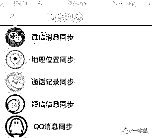
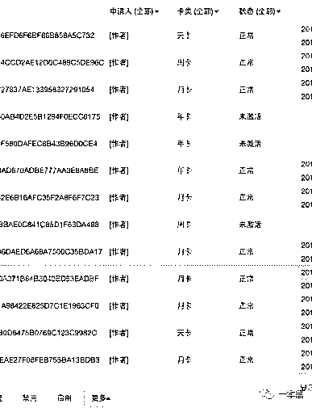
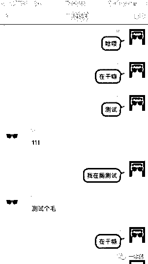
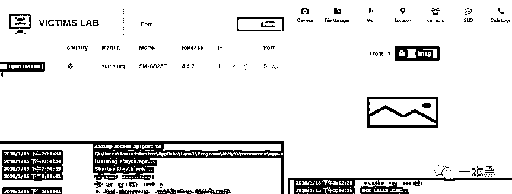
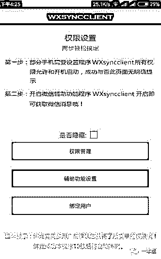
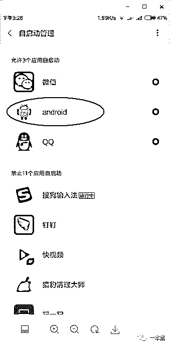

# 你的手机正在被人悄悄的监控，别人能看到屏幕显示的所有内容

> 原文：[`mp.weixin.qq.com/s?__biz=MzU4ODAwNzUwMQ==&mid=2247484043&idx=1&sn=de85f540eb63ed8c51ffb811fccb69e8&chksm=fde213a9ca959abf251c16653edd8b867bdd78288278285d4563aa45edbaca74bd48d37be1bd&scene=27#wechat_redirect`](http://mp.weixin.qq.com/s?__biz=MzU4ODAwNzUwMQ==&mid=2247484043&idx=1&sn=de85f540eb63ed8c51ffb811fccb69e8&chksm=fde213a9ca959abf251c16653edd8b867bdd78288278285d4563aa45edbaca74bd48d37be1bd&scene=27#wechat_redirect)

文/东东（微信公众号：一本黑）

责编/振宇

【一本黑】媒体或商业转载必须获得授权，个人转发朋友圈无需授权。

读完需要

9 分钟

速读仅需 4 分钟

* * *

不知道大家有没有看过一部电影叫做《窃听风云》，片中不仅展示了针孔摄像头、窃听器等专业设备。

也有简单如一部手机的窃听器，只要在监听器中输入对方的手机号码，就可以对对方进行监听。 

除此之外，甚至还有了不起眼的装有窃听器的打火机、遥控器、插座插排等。

对于这些场景，大家可能只在影视作品中看过，那现实生活中到底存不存在这种类似的监听设备呢？

说起个人隐私安全，在月初的时候，吉利董事李书福就说过：**“****现在人的隐私和信息安全很透明，好比微信，马化腾肯定天天在看我们的微信。****”**

此语一出立刻引起一场轩然大波，对此，微信官方也做出回应称：“尊重用户隐私一直是微信最重要的原则之一，我们没有权限、也没有理由去看你的微信”。

对于李书福的前半句话，一本黑敢百分之百的肯定，**你的微信聊天记录，有可能正在被另一个人悄悄的监控着。**

不止是微信聊天记录，就连所处**地理位置、通话记录、QQ 消息，甚至短信内容**都可以被别人实时监控。

**手机成为间谍，监控你的“一举一动”**

对于很多家庭或伴侣来说，自己的另一半经常夜不归宿，或是经常出差应酬，难免会引起对方的怀疑，从而会产生想要对另一半进行监控的想法。

人本身就是一个充满好奇心的动物，更何况是在这个“饱暖思淫欲”的时代。

一个不小心，整天躺在自己身边的女人不知哪天就杠上了隔壁的老王，借出差之名行苟且之事的例子也不在少数。

人与人之间的不信任和刻意隐瞒，多多少少会让彼此产生隔阂，继而会加深另一方的窥探欲望甚至会演化成暗中监控。

对于自己的另一半或是身边很容易接触到的人，想要监控对方的手机可以说是易如反掌。

只要在对方的手机上安装某些应用，再进行一系列的设置，一定程度上就可以达到监控对方手机的目的。

这种灰色应用安装到手机上后，**还可以隐藏在后台继续运行**，一般的杀毒软件根本检测不出来，没有一些特殊的技巧机主很难发现自己已经被监控。

使用这类手机监控应用，监控者可以在特定 APP 上轻松并且实时地查看被监控手机的 QQ、微信、通话记录、短信记录、当前位置等。

有些监控软件甚至还有远程监听、录音、拍照等功能。可以说是触目惊心，个人信息在被监控后完全没有隐私可言。

这种软件分为主控端和被控端，主控端用于显示监控到的内容，被控端用于上传手机信息，但要进行一些权限或管理上的设置。

都说科技是一把双刃剑，它在带领人们探索新世界的同时，也有可能被恶意利用，就好比我们这次提到的手机监控软件，是该用在正确的地方对人产生有益的价值还是用于窥探隐私，说到底还是一个关于人心的问题。

****监控老人小孩的 APP，实则就是木马！****

市面上存在一些防止老人或者小孩走失的 APP，这些应用程序可以在老人或者小孩丢失的时候帮上一定的忙，但是其功能似乎强大得让人心惊胆战。

这种应用在安装的时候需要进行权限设置，把所有权限都设置成允许状态，设置后绑定手机号，即可实现监控。

（图片来源于网络）

在这些监控功能中，实时定位这个功能可以在老人或小孩走失的情况下起到一定的帮助，但其更多的涉及到了用户隐私可操控的问题，要是用在不正当途径上，就显得有些醉翁之意不在酒了。

在这些功能中，最恐怖想必就是接通视频这个功能了，监控者可以查看被控者前后摄像头所拍到的内容。

也就是说，只要你的手机被安装了这类应用，你的一举一动，嘿嘿......

就拿前不久网络上一个电信诈骗犯偶遇黑客的例子来说，电信诈骗犯聪明反被聪明误，安装了黑客发送过去的一款伪装工行的客户端，随后自己的电脑就被控制了，你说气不气。

对于有摄像头一类的手机或是电脑，此前的专题中也有提过，我们应该学习扎克伯格，最简单粗暴的防止方法就是把摄像头用胶带贴上。

**因为即便是再牛逼的技术手段，是不可能穿透你贴上去的“封印”的。**（还不赶紧用小本本记下来）

****监控木马 298 元，想看什么就看什么！****

都说了科技是把双刃剑，有人就正在用这把双刃剑的另一面干着苟且牟利的事。

而老师傅一贯的作风是针锋相对，你在这面干着坏事，我就用刀刃的另一面和你博弈，谁输谁赢，无关技术，全在人心。

通过渠道，一本黑（darkinsider）拿到一款可以监控手机的试用版软件，和上面提到的一样，该软件也分为主控端和被控端，试用版本只有一个微信监控的功能。

如果想要全部的功能，需要花 298 元购买激活码，即可开通全部功能。开通后，QQ、微信、短信、通话记录等内容都可以实时进行监控。

这几天天气比较冷，老师傅的保温杯里装满了枸杞，接过我递过去的烟后，老师傅就开始对对方的软件进行分析，相关信息收集完毕后，最后通过大家熟悉的【计算机基础知识】，老师傅成功进入对方后台，拿到生成的激活码，成功开通软件的所有功能。

在后台中，我们也看到了软件制作者每天提取的卡密，有天卡、周卡甚至年卡，统计近一个月的流水后，发现该软件制作者每天通过贩卖卡密可赚取上千元，而其利润在软件制作完成后几乎是零成本的。

按照控制端提供的操作指南，我们在一台测试机上安装了一个应用，说白了就是木马程序。

经过一些权限上的设置，安装在测试机上的木马在设置完成十秒钟后就开启了隐藏模式，手机桌面根本无法察觉它的存在。

通过使用被控手机进行微信聊天，主控端很快就收到了被控端的聊天记录，就连和谁进行聊天都可以在主控端看得一清二楚。

除此之外，我们分别使用被控手机进行了手机拨打、短信发送等操作，无不例外，这些行为都实时的在主控手机上显示了出来。

（监控到的短信和通话记录）

也就是说，我们可以像操控自己手机一样操控被安装了木马的手机，不管你身处何方，千里之外都可以获取你手机中的这些信息。

针对这类监控软件，老师傅说：“其实这种监控软件现在已经有开源项目了。”

老师傅说完把烟头往烟灰缸里一摁，在某开源网站上找了一个开源例子。安装后，通过 IP 与端口绑定了一个模拟器。

从下图中可以看出，对于模拟器的定位、短信信息、通话记录等都可以进行监控。

（某开源项目）

说到这类软件为什么功能如此强大，居然能实时监控到别人的手机信息，其实还得回到被控端安装木马的时候。

安装的时候需要对该木马应用的权限管理进行设置，即把所有的权限都设置为允许状态。

第二个就是辅助功能设置，这里的辅助功能设置其实是 Android 系统提供的一种服务，旨在帮助残障人士或者可能暂时无法与设备交互的人们。

这种功能一旦打开就可以进行一系列的监听。

二者结合在一起就可以对手机进行监控，微信聊天记录、短信、通讯录什么的自然不在话下。

当监听到这些信息后，需要实时地反馈出来，这里就采用了数据上传的形式，通过后台“偷偷地”把这些信息发送到主控端。

**如何检查自己的手机是否被监控**

对于隐私安全，在这个几乎透明的时代，我们总是防不胜防，我们无法改变这个社会，我们无法改变人心，但我们能改变我们自己。

如果你看完这篇文章觉得心有余悸，那就有必要检查一下自己的手机是否被安装了类似的监控木马程序。

像这种木马程序一般在**手机桌面上是不可见**的，加上其自身可绕过安全应用的检测，所以非专业人士只能通过一些蛛丝马迹来进行判断。

这种监控木马会伪装成和系统程序类似的名称，所以查看应用管理不太好分辨，就比如我们这次拿到的这款木马程序名就伪装成 android 的名字，根本无法察觉。

（伪装名为 android 的木马程序）

因为木马程序设置了开机自启动，并且是一直挂在后台的，所以耗电量是比较大的，可以通过耗电排行**查看耗电比较高的应用**。

除了查耗电量之外，还可以**查看自启动以及后台运行权限**的程序列表中是否有可疑的程序。

（伪装名为 android 的木马程序）

最重要的一点可以**关闭手机中的开发者模式**，通过一本黑（darkinsider）的实验，当关闭开发者模式的时候，主控端是没办法接收到被控端的信息的。

但开发者模式一旦打开，你的手机就犹如一台傀儡机，各种信息必将被监控端一览无遗。**（重点！重点！重点！）**

好在目前这种木马程序只能控制安卓系统的手机，在范围上还有一定的限制，但也不排除随着技术的升级，苹果端也有被监控的可能。

**写在最后**

这个复杂的世界造就了一个巨大的关于人性的舞台，东西的好坏变得模糊不清。就像菜刀一样，有人用来切菜，而有人却用来杀人，到底怎么用，说到底还是一个关乎人心的问题。

窥探欲望的不断上升，必定是这类木马程序诞生的催化剂。而对于身边人来说，通过监控的方式掌控对方的一举一动，本就是凌驾于彼此的信任之上的一种不可取的方式。

对于这个人心复杂的世界，送给大家一句话：“你在凝视深渊时，深渊也在凝视你。”

**本文与酷玩实验室联合发布！**

**一个说人话的科技频道！**

还原事实｜专扒黑产

微信 ID：darkinsider