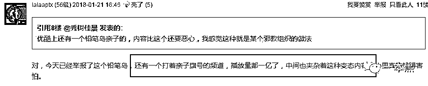
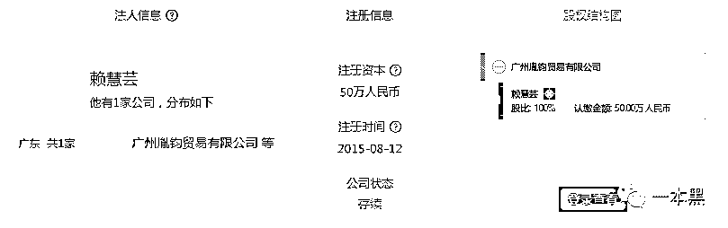
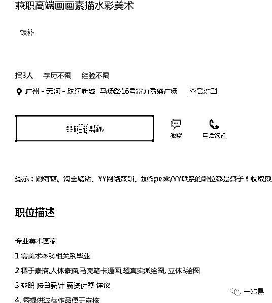
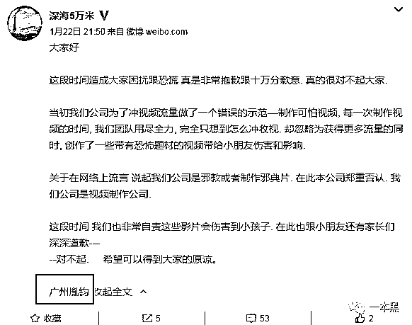
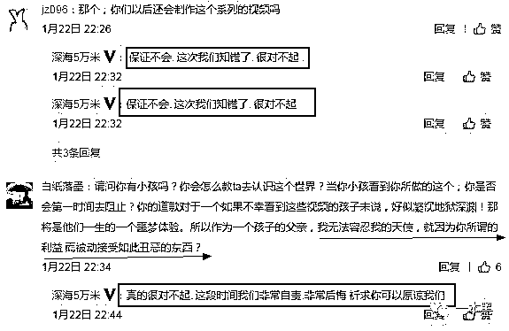

# 比起性侵，这家公司制作的变态儿童视频更加暴力血腥

> 原文：[`mp.weixin.qq.com/s?__biz=MzU4ODAwNzUwMQ==&mid=2247484032&idx=1&sn=b23aac219dc1b370b1d947af06f99d9a&chksm=fde213a2ca959ab44b1637be589bf2e59f68ec040e90bbf8ec1ea6b28ea7351f4b59562a2403&scene=27#wechat_redirect`](http://mp.weixin.qq.com/s?__biz=MzU4ODAwNzUwMQ==&mid=2247484032&idx=1&sn=b23aac219dc1b370b1d947af06f99d9a&chksm=fde213a2ca959ab44b1637be589bf2e59f68ec040e90bbf8ec1ea6b28ea7351f4b59562a2403&scene=27#wechat_redirect)

文/东东（微信公众号：一本黑）

责编/振宇

【一本黑】媒体或商业转载必须获得授权，个人转发朋友圈无需授权。

读完需要

9 分钟

速读仅需 4 分钟

* * *

最近，微博上一篇名为《一群变态锁定观看 YouTube 的孩童，我以前为他们工作》的文章引起了网友的热议，文章阐述的现象也被千夫所指。

文章中提到，作者曾经所在的一家动画制作公司对儿童熟悉的卡通人物进行二次包装，**制作出大量含有软色情、虐待、捆绑的动画，甚至还拍摄了一系列血腥暴力，含有流血内容的真人动漫。**

《冰雪奇缘》里的艾莎公主接受开颅手术、米老鼠在人行道被车撞得血溅四溢、蜘蛛侠偷看安娜公主和艾莎公主洗澡......

（图片来源于网络）

这类出现在 Youtube 上的视频角色取材于深受孩子们喜欢的动画片，却通过制作者的“二次创作”，“摇身一变”加入了各种包含怀孕、凶杀、绑架、注射等不适合儿童观看的内容。

里面出现大量比如喝尿吃大便、怀孕接生、颜料涂抹、自残等镜头，别说是小孩子了，就连成人观看都会感到不适。因此，这类视频被称为“儿童邪典片”。

这一事件被称为艾莎门事件，去年 7 月，经《纽约时报》报道后，引起了全美的关注。

然而，事件并未随着媒体的报道得到制止，经过国内视频“搬运”者的“搬运”，居然在国内出现了“汉化版”的“儿童邪典片”。

国内搬运者不仅着眼于视频的搬运工作，还仿造进行了相应主题的视频拍摄与制作。

视频多以“亲子游戏”为标签，拍摄人群大部分都是儿童，画面感简直可以用惊悚、刺激眼球来形容。

【一本黑】看过其中几个视频，视频以“过家家”的名义，让小男孩掀起女孩的裙子为其打针，镜头一转，女孩趴在桌子上对着镜头笑......小男孩作为“医生”给女孩接生，然后从小女孩的内裤中拿出一只小猪佩奇的玩偶......

（图片来源于网络）

甚至还有人在底下评论说希望每一条视频都有打屁股针等话语，不难看出，这类视频多多少少在满足着一群有特殊癖好的成年人。

**没有钱赚怎么可能会有这种视频的出现**

还记得孩童时代的我们是怎么度过的吗？然而随着这个时代的快速发展，当今小孩的玩物已然变成了手机或者电脑。

你会发现身边的一些父母会用手机或电脑给孩子搜索出一部动画片，让孩子安心的观看，随后自己就去忙自己的事了。

但是，一旦一部动画短片播放结束后，视频平台会根据算法给你推荐更多的同类视频，于是这类打着“亲子游戏”标签的视频就有了乘虚而出的可能。

（图片来源于网络）

虽然视频内容暴力血腥，但背景音乐与视频却大相径庭，也正是由于轻松愉快的背景音乐，忙于自己手中事的家长们如果不仔细观看视频内容，根本就无法发现这种视频的端倪。

还未形成认知的小孩一遍又一遍的观看这类有害视频，大脑不断的吸引视频中的荒谬行为，久而久之，他们就会认为视频中的行为是一种很正常的现象。

而小孩子的模仿能力是有目共睹的，他们看多了这些视频后，很有可能就会去模仿视频中的行为，因为在他们看来，这些暴力、色情的行为都是有趣的。

可想而知，这些视频真的是隐藏在孩子们成长环境中的一颗定时炸弹。

至于为什么会出现大量这样的视频，道理不言而喻，**唯有利益的趋势才会不断衍生出各种各样血腥色情的内容，也助长了该灰色产业的不断发展。**

这类视频最早出现在国外，随后被“汉化”成国语版本。虽然 Youtube 上的视频已经被下架，但在这之前，根据 BuzzFeed 的调查报道显示，这些视频在被下架之前，**上传的频道每个月可以进账 50 万美元的广告收入。**

国内上传这类视频的人也正是从中看到了商机，不仅对视频进行“汉化”，还进行原有动画的二次创作甚至真人拍摄。

**一方面他们是看准了父母无暇照看孩子，平台根据算法自动推荐的功能，让视频得以恶性循环播放，另一方面，这类视频也确实满足了一群人的特殊癖好**，一定程度上来说，这类视频的受众群体还是有一定规模的。

他们的主要盈利方式除了官方认证的 PGC（PGC：指专业生产的内容）广告分成，还会在视频中植入各种低劣的网购或电商广告。

可以说他们为了博取点击量和广告分成，干着误导儿童，甚至是对儿童的心灵造成严重伤害的事，这种黑心钱难道会赚得心安理得吗？

虽说近两年视频自媒体很火，但我觉得制作这类视频的团队简直就是视频自媒体界的老鼠屎。

除了各大视频网站曾经存在这类视频，就连很多游戏网站平台都含有内容相似，题材暴力血腥的小游戏。

对于成人来说可能不会过多涉足这类小游戏网站，但很多家人会打开这类网站挑选一些小游戏给自己的孩子玩。

和视频播放的算法推荐一样，一旦玩过此类游戏，游戏网站就会给你推荐类似的游戏，于是这些关于“剖腹产”、“接生”类别的视频就很有可能“流窜”到孩子们的眼前。

对于这种视频和游戏的制造者，【一本黑】表示很无奈，大家都是互联网从业者，可有人却做着伤天害理的事情。他们殊不知这类视频或游戏完全就像毒品一样，慢慢侵蚀着一个还未形成正确认知的孩子。

好在国内各大主流视频平台已经发布了紧急声明，对这类视频的上传账号进行了封停处理。这类小游戏网站在舆论的风口浪尖也逐步下架了此类游戏，但邪恶势力是否会卷土重来，还需任重道远。

**制作变态视频的就是广州这家公司**

文章开头的这篇文章由微博上的一名数码博主发出，通过翻阅对方的微博记录，我们发现了该博主转发的一条疑似视频制作者道歉的微博。

通过调查和确认，这位微博名为“深海 5 万米”的博主正是这些视频的制造者，通过其主页的信息显示，该微博隶属于广州胤钧贸易有限公司，也就是说，这些视频全部出自该公司。

利用天眼查，我们也确实发现了该公司的踪迹。

资料显示，该公司注册于 2015 年，法人为赖慧芸。

通过搜索引擎查询广州胤钧贸易有限公司，发现该公司曾经在招聘网站上进行过相关岗位的招聘，而从招聘岗位上来看，确实也符合了制作这些视频所需要的相关人员。

从招聘岗位中，【一本黑】发现一个全职英文翻译的岗位，再联想到这些视频最早出自国外，都需要进行翻译和汉化，这个岗位正好补其所需。

再结合微博“深海 5 万米”的道歉内容，已经基本确定了该公司就是制作这类汉化视频的源头。

道歉内容中，该博主也承认是为了冲视频流量才做了一个错误的示范——制作这种可怕视频，但他们却忽视了在获得更多流量的同时，制作出的这些带有恐怖题材的视频给小朋友带来的伤害和影响。

微博评论下方有不少网友发出谴责的声音，称这些噩梦般的视频对于一个还未形成认知的孩子来说犹如深渊地域，这些都是他们一生中的噩梦体验。

在天眼查资料中，我们发现一个小细节，该公司类型显示为：“有限责任公司（台港澳自然人独资）”。台港澳独资公司是外资公司的一种，也就是说该公司的法人为台港澳同胞，并非大陆籍人员。

而通过相关媒体的调查得知，对于视频的生产流程，该公司的员工表示，他们的老板一般是在 QQ 上和他们联系，事先会把剧本发过去，员工按照剧本拍摄制作。老板要求拍什么就得拍什么。

由此可见，这是一起有策划的，利用软色情、暴力血腥等噱头博取点击量的灰色视频产业。

**科技本没有好坏之分，人性才有**

人性与利益二者的关系，一直以来就是一个难以权衡的话题。

这个世界的黑暗之处是你无法想象的，不管是我们此前报道的以招募童星为名，实则进行诱导性侵并贩卖，还是前不久闹得沸沸扬扬的红黄蓝事件，无不在告诉我们一个值得深思的道理：“这个世界并不美好，最大的原因还是在于人性二字”。

可能很多人会把这个责任的锅甩给平台的算法推荐，指责平台审核方面的不严谨，但其实仔细想一想，要是没有人为操作去制作这些视频和游戏，又怎么会出现这样的视频呢！说到底这还是一个关于人心的问题。

虽然科技在高速的发展，但对于孩子认知的引导，做父母的还是得先把把关。毕竟这个世界深不见底，不知道哪一天，循环在噩梦里的孩子们就无法走出噩梦了。

如果这样，那我们就失去生而为人的意义了。

突然庆幸自己已经长大了，那时候的我们过得可真幸福啊，没有智能手机和电脑，我们唯一的玩物就是弹珠和玩具赛车，还有放学以后金龟子主持的《大风车》动画节目......

还原事实｜专扒黑产

微信 ID：darkinsider

小提示：还不快检查一下给孩子播放视频的记录和玩过的小游戏！