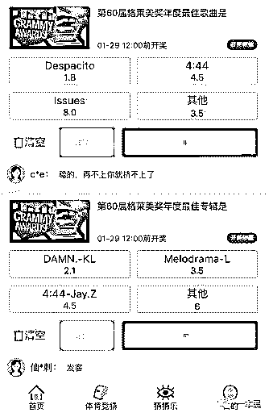
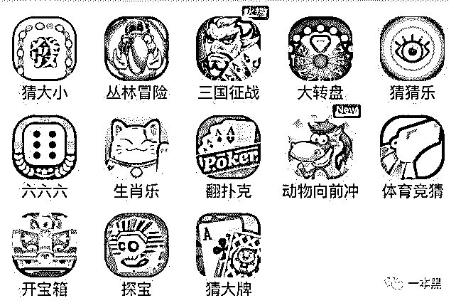
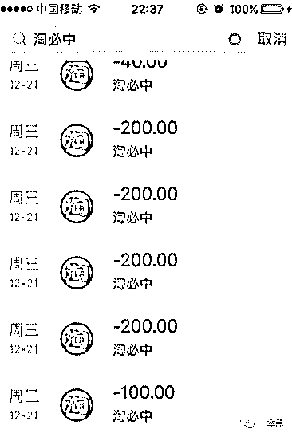
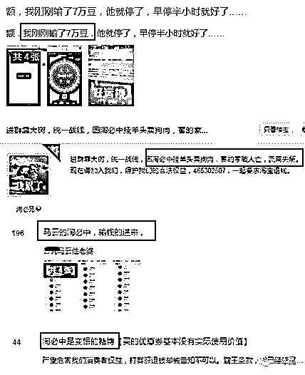
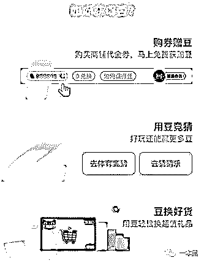
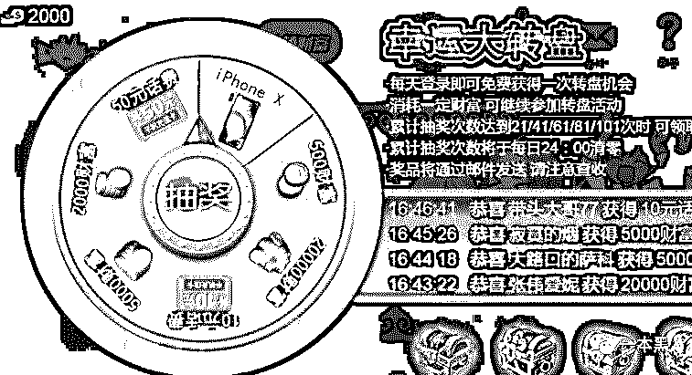
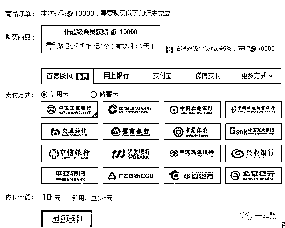

# 淘宝居然开了一个线上“赌场”，两个月输掉二十万？马云也开始涉足博彩了？

> 原文：[`mp.weixin.qq.com/s?__biz=MzU4ODAwNzUwMQ==&mid=2247483994&idx=1&sn=e4182903f869bf740ee870a7137d68fc&chksm=fde21378ca959a6e6d0e337eab3dbfbeafea4fa884298faa1b937b250162a195f145cd431ffd&scene=27#wechat_redirect`](http://mp.weixin.qq.com/s?__biz=MzU4ODAwNzUwMQ==&mid=2247483994&idx=1&sn=e4182903f869bf740ee870a7137d68fc&chksm=fde21378ca959a6e6d0e337eab3dbfbeafea4fa884298faa1b937b250162a195f145cd431ffd&scene=27#wechat_redirect)

文/东东（微信公众号：一本黑）

责编/振宇

【一本黑】媒体或商业转载必须获得授权，个人转发朋友圈无需授权。

读完需要

9 分钟

速读仅需 3 分钟

* * *

以前专题中写过一句话：“下棋想要赢，得动脑子，别发脾气。”

棋盘犹如人生，马走日，象飞田，卒也只能过了河才能横着走。只有看清本质，揭开棋局，人生才有自主的可能性。

**贷款也要赌，两月输掉二十万！**

前几天，有个大学生小张在后台给我们留言，**说自己在淘宝上赌博输了将近二十万！**

淘宝上还能赌博？这我还是第一次听说。

小张告诉我，淘宝上有个内嵌 APP 叫**淘必中，**一边做着电商一边做着变相赌博的生意。很多人都输了几十甚至上百万，自己也是其中之一。

他询问我们淘必中这种行为是否属于赌博，是否可以起诉淘必中，自己投进去的钱是否可以要回来？

随后我询问了他整件事情的经过：

小张从 2017 年十一月份开始接触淘必中，从此便一发不可收拾，两个月的时间就输掉了将近二十万！

在淘必中里，你可以花钱买到各种商家店铺的优惠劵，然后系统会赠送一定的金豆。比如用十块钱买某个店铺的满 100 减 20 的优惠劵，系统就会赠送 1000 个金豆。

在这个购买优惠劵的过程中，优惠劵是购买到的商品，而**金豆是赠品**。

系统赠送的金豆可以当做筹码来玩游戏，**游戏种类多种多样，但都是具有赌博性质的**。

一共分为三大类，分别是**体育竞猜、游乐园、猜猜乐。**

通过试玩发现，体育竞猜和猜猜乐都是属于娱乐型的竞猜游戏，比如可以猜体育比赛结果，可以猜某奖项得主等。

但是在**游乐园**板块中的游戏那就不得了了，大转盘、猜大小、六六六等游戏简直就是一个淘宝版的澳门赌场。另外，这些游戏都异常火爆，平均每场都有几十万人同时在线（真有几十万个真人吗？）。

参与这些游戏赢到的金豆可以用来折扣购物，充流量、充话费等。

据小张所说，他无意间接触到淘必中的时候，只是想用现有的金豆玩一玩游戏赚点小豆子而已，结果没想到一下就输了，不甘心的他又通过充值的方式获取金豆继续玩，结果越陷越深。

小张本身就是在校大学生，输掉的二十万元都是通过网贷平台借来的，至今不敢告诉身边的朋友和父母，几经奔溃，所以向我们发来了求助。

**合法但不合理的线上“赌场”**

通过浏览淘必中贴吧，发现有像小张这种情况的人并不在少数。大多数人都为此付出了高额的赌资。

（图片来自贴吧）

也有输了很多钱的玩家抱怨淘必中实则是挂羊头卖狗肉，害得自己家破人亡，流离失所，吵着要起诉马云。

（图片来自贴吧）

对于这款 APP 里的游戏，是否真的像各位玩家一样说的那样呢，淘必中是否真的涉嫌赌博，是不是真的违法呢？

首先，以淘必中里面的大转盘为例，玩家以为中奖的概率是随机的，只要自己运气好就一定能赢。

但我想借用一部电影里面的话就是：“你们对真相一无所知。”

【一本黑】曾经写过很多关于线上赌博的专题，难道你们对于这种暗箱操作的游戏内幕还不够清楚吗？（对于线上博彩游戏，请复习我们以前的专题，有必要可以进行背诵）

淘必中游戏并不是概率问题，而是庄家必赢！电脑程序的机制是返最少的豆子，让其自身利益最大化。

淘必中的官网对其的解释为：淘必中是一款具有娱乐营销购物功能的 APP，致力于为广大的亲们提供购物优惠和精选商品，让您在享受卖家优惠折扣的同时，还能体验多种娱乐活动玩法。

这句话翻译一下可以这样理解，淘宝给大家提供一个购物优惠的地方，主要目的在于营销，随便提供一个休闲娱乐的地方给大家玩，可没曾想各位居然在这里玩起了赌博，那可就不关我的事了。

比如说，你用 100 块买了某个店铺的代金券，系统赠送给你一定的金豆，这张代金券是等值于你所花的钱的。

而金豆在这里是赠送的，就像一些卖毒品的人，一开始给你免费的毒品，等你上瘾了，自然会来找我卖，这是一个道理。

你花了钱，别人也给了你等值的东西和赠品，你用赠品去博彩，赌输了，但是你购买的东西还在，这在理论上来说你还是保本的，只是因为赌输的赠品唤醒了你的赌瘾，让你一步一步的上钩。

其实淘宝在这件事上玩的是花样，它只是起了一个诱导的作用，谁知不争气的你却被牵着鼻子走。

说难听点，那些骂淘宝的人先骂骂自己，是自己不争气才会一步步深陷泥潭。

对于自己投进去的钱还能不能要回来这个问题，我询问了从事法律的朋友，他告诉我，即使平台被认定涉嫌赌博，消费者投入的钱可算作赌资，这在法律上是违法的，是要被收缴的。

因为淘必中里的金豆只能用来当做购物的折扣和玩游戏，并不能换成钱，所以淘必中在法律上并不完全具有赌博性质的嫌疑，只能说它打了一个插边球而已，戏耍了一波又一波的玩家。

所以说，在一定程度上，淘必中是合法的，但他并不合理。

是否具有赌博性质和是否犯罪，不仅要考虑平台内运行的游戏本身，还要参考整个平台的运行规则，这一点淘宝一开始就想得很清楚。

再说难听点，是你自己把持不住诱惑和吸引，别人凭本事“忽悠”的钱，凭什么还给你。普通玩家想要维权，只能说你玩不过。

**自控力是人性的弱点**

类似淘必中这样的平台不在少数，贴吧里有时就会有这样的小广告，等你点进去一看发现别有洞天。

（麻将吧广告截图）

这是麻将吧里面的一款游戏，和淘必中一样，也可以进行充值，除了能打麻将，里面还有一个大转盘可以抽奖，奖励有不同额度的 T 豆、话费充值卡，甚至还有 iPhoneX。

这里的 T 豆也可以充值，十块钱可以获得 10000 个 T 豆，T 豆可以当做打麻将的筹码，也可以在大转盘抽奖，和淘必中打插边球一样，T 豆不能换成钱，所以也就不能完全构成赌博。

可别小看这个大转盘，一旦上瘾那将会覆水难收，很多人就会不停地往里面充值。

国家之所以打击赌博行为，就是因为赌博会让人失去自控力，为了获得更多的赌资，从而引发一系列的违法犯罪事件。

像淘必中和这种麻将小游戏平台，只是从消费和娱乐的角度实现平台的盈利目的，自身并没有多大的危害性，可能是因为平台本身具有的诱导性，和玩家自身情绪的不可控，导致玩家想要以小博大走捷径来获取利益，但最终只会越陷越深。

人性这个东西，不但失去控制，就犹如失灵的刹车，拉是拉不住的。

**揭开棋局，人生才有自主的可能性**

从【淘必中】这类平台的产品属性来说，它牢牢地把握住了人性，即所谓的情感控制术。

先是给你一点免费的东西，你可以用这些免费的赠品在它的平台上消费，而你消费的载体就是游戏。

游戏向来有一种天生的吸引力，也正是由于其自身存在的诱惑性，它可以牢牢地牵住人的情感，控制你的欲望，让你的欲望越来越大，从而达到它所需要的效果。

人本身就是一个容易被控制的动物，特别是情感，要是加以环境的配合和诱导，那这种效果肯定事半功倍。

在这类平台上，平台自身就是情感控制术的操纵者，给你的赠品和消费载体就是一个充满诱惑的环境，唯一要等的就是你上钩的那一天，即万事俱备只欠东风，就是这个道理。

不管平台的产品属性如何牵扯人性，他毕竟还是人为所致 。这也可以说是人与人之间的一场博弈，一头操控着情感，另一头执迷其中，越陷越深，这就是人与人之间的差别。

要想避免被“控制”，就得看清其本质。

一定要记住，**赌博赢的只是过程，输，才是结果。**

还原事实｜专扒黑产

微信 ID：darkinsider

你的城市下雪了吗？天气很冷，注意保暖！