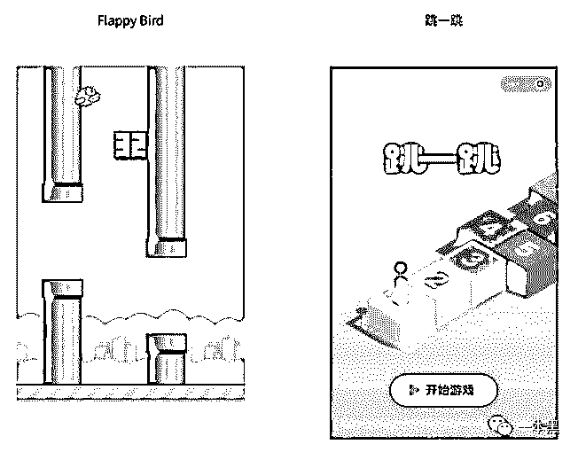
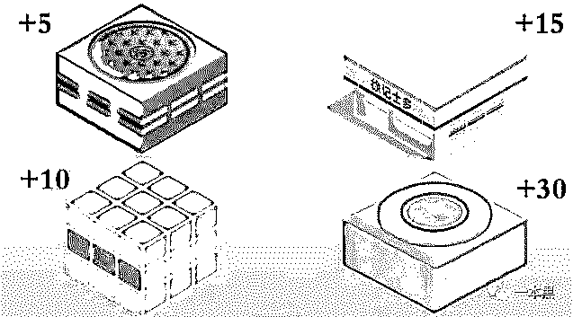
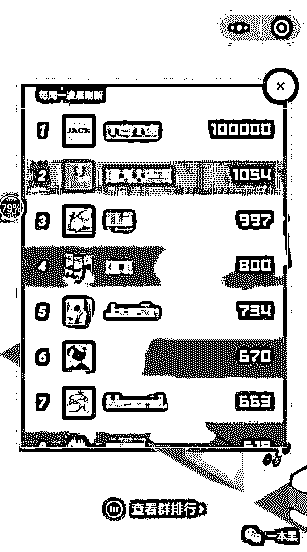
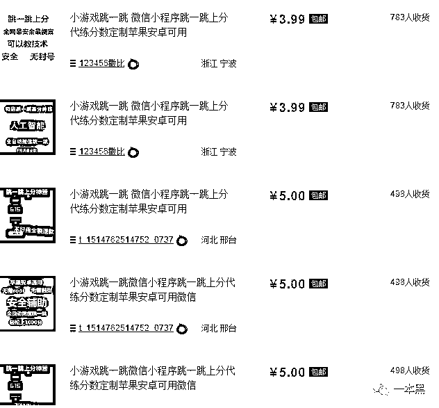
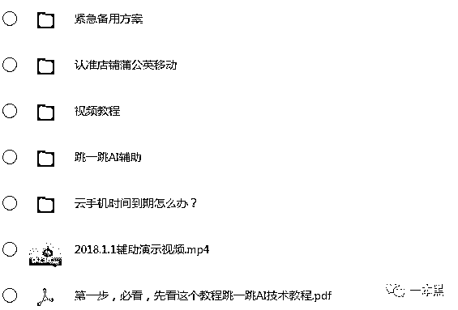
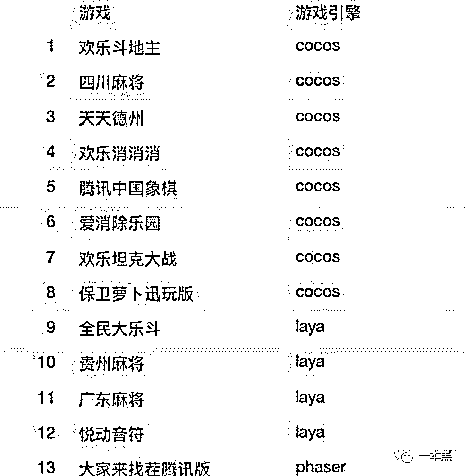
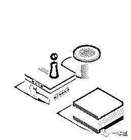

# 微信“跳一跳”小游戏如何做到让上亿人上瘾？

> 原文：[`mp.weixin.qq.com/s?__biz=MzU4ODAwNzUwMQ==&mid=2247483990&idx=1&sn=b550c1b0994e762df562c8af6f81a144&chksm=fde21374ca959a62c47269f11b4eb071f5a254b62d733d86ff4423ed8e844802638f5e43b885&scene=27#wechat_redirect`](http://mp.weixin.qq.com/s?__biz=MzU4ODAwNzUwMQ==&mid=2247483990&idx=1&sn=b550c1b0994e762df562c8af6f81a144&chksm=fde21374ca959a62c47269f11b4eb071f5a254b62d733d86ff4423ed8e844802638f5e43b885&scene=27#wechat_redirect)

文/东东（微信公众号：一本黑）

责编/振宇

【一本黑】媒体或商业转载必须获得授权，个人转发朋友圈无需授权。

读完需要

9 分钟

速读仅需 3 分钟

* * *

游戏行业发展到现如今，可以说是源远流长。

从最早期的红白机、Game Boy 到 PSP，各种在当下看来画质粗糙，技能单一的游戏我都有涉猎。

后来随着电脑的普及和互联网的发展，渐渐出现了一批以剧情为线索的单机游戏，比较火热的有《鬼泣》系列；《刺客信条》系列；《上古卷轴》等。

那时候只需要花上十块钱就可以买到一盘鬼泣的免安装版光碟，几个外国哥们呕心沥血的游戏作品，足以比拟当下任何一部烂片电影。那些精湛的剧情和画面，包围了我整个年少的暑假。

然而游戏行业的发展也逃不过迭代更新和产品升级。

2017 年上半年火热的《王者荣耀》在下半年《绝地求生》的强烈冲击下，似乎也有种甘拜下风的感觉。

但比起早年那些剧情丰富，内涵深远的游戏，当下游戏的主旋律慢慢变成了社交攀比。

段位的高低会形成一条鄙视链，吃鸡游戏也开始讲究意识形态的东西。就连前几天微信刚刚发布的小程序《跳一跳》，也多多少少藏着些排名上的攀比心理。

【跳一跳】的出现让我想起了 2014 年的益智游戏《flappy bird》，同样是通过按压屏幕来控制游戏的前进，风格上可以说是如出一辙。

【跳一跳】的玩法很简单，但需要很强的平衡性，每跳一格就会有相应的加分机制。

里面也暗藏一些加分的小技巧，比如跳到格子中间，会得两分，连续下去，会以+2 的形式得分。

当跳到四种特殊的盒子上时，只要停留几秒钟，就会得到 5-30 的加分，比如跳到黑胶唱片上，停留几秒，等音乐响起时就会获得 30 分的奖励，以此类推，还有徐记士多便利店；魔方；井盖。

依托微信本身的社交属性和庞大用户，这款游戏一经发布即刻就成为了爆款，产品自身存在的挑战属性和排名机制，无疑让这款游戏附上了攀比的属性。

知乎上有人开玩笑说，跳一跳这个小程序应该是微信专门针对企业用户开发出来的组织管理工具，是 HR 对员工进行评估和考核的好帮手。

根据游戏排行榜，排名靠前的基本都是公司里最闲的人，排名靠后的基本都是公司里最手残的人，排名剧中的则是公司又闲手又残的人。不玩游戏或没有排名的人，也不能拘泥常规放过他们，不玩游戏就是不合群，是团队精神欠缺的体现，建议劝退处理。

 **如何让自己的【跳一跳】保持排行第一？**

和所有的游戏一样，一个爆款游戏的出现必定会衍生出相应的外挂产业链。【跳一跳】也是如此。

有程序员就通过 Python 来计算像素距离和按压时间，从而达到获取高分的目的。

淘宝上几块到几十块一套的外挂教程和代练服务也接连出现。

通过购买其中一款名为红手指的外挂进行测试，果真像对方视频教程里演示的那样可以实现跳一跳的自动刷分。

针对不同的手机，玩家还可以设置相应的参数，控制游戏跳跃的精准度，还可以自定义分数，强大到想要多少分就可以得到多少分。

而有些代玩服务则需要买家提供微信账号和密码，虽然对方说一定会保障买家的信息安全，并建议买家在代玩结束后立即修改密码。但不得不说的是，这在一定程度上确实存在着微信账号信息泄露的安全问题。

另外，使用外挂程序刷分还有可能面临微信号被封的可能性，微信团队对此也开展了相应的打击，在此也奉劝各位，外挂有风险，切勿轻易尝试。

**突如其来的【跳一跳】，显然醉翁之意不在酒**

微信小程序自 2017 年一月份出现到现在，也快走过第一个年头。

其一直秉承的【用完即走】的理念也在【跳一跳】中体现得淋漓尽致。

【说玩就玩，玩完就走】，这或许是对小游戏最准确的定位。从游戏的追求来看，小程序的核心思路和当前市面上大多数的主流游戏是背道而驰的，这一点算是小程序对传统的打破和创新。

犹如《王者荣耀》等游戏用成长机制、段位排名给用户带来的成就感，以及用户对游戏花费时间所带来的收获不同，小游戏秉承的【用完即走】却显得潇洒许多。

当今时代讲究碎片化，不管是碎片化阅读还是碎片化游戏，小程序都牢牢把握住了这些时代的鲜明特点，也由此出现了以跳一跳为开胃菜的休闲游戏。

（微信发布的其他小游戏）

对于小程序来说，这次更新的【跳一跳】，不仅是微信的一次全面革新，更是微信在 2017 年的压轴大戏，对于这次的年底更新，微信似乎显露出了他的雄心战略和磅礴野心。

当第一次接触【跳一跳】，看到各种拟物化的格子时，我就知道事情并不会那么简单。

显然，未来在小程序中植入广告必将是大势所趋。

更新后的聊天界面只要下拉，就可以看到小程序的身影，各种用过的小程序也会按照历史记录排列在位。

基于庞大的微信用户和流量，这次微信以小游戏【跳一跳】为依托，对小程序的推广和普及，可以说是达到了炉火纯青的地步。

可以把更新小游戏看作是一条明线，而推广小程序、发展业务，拓展变现渠道，实则就是暗线，也是最终目的。

对于未来小程序的发展，会拓展到何种地步，我们拭目以待。

如果说此前有微信红利期，有共享经济的风口，那么小程序会不会是下一个风口呢？2018 年会不会是小程序爆发的一年呢？微信想要连接一切的野心，是不是最终会通过小程序来完成，我们同样拭目以待。

**游戏是时间的杀手**

【跳一跳】这款游戏操作简单，基本人人都可以玩，但就是这样一款老少通吃的游戏，却让越来越多的人沉迷到不惜花费金钱去代练和刷分。

所以最后我想结合赌博来谈一谈这款游戏的成瘾机制。

和大多数游戏一样，要想挽留用户，就得利用人性，小游戏【跳一跳】也不例外。游戏都有一个共同点，就是时间的杀手。

玩一把失败了，不甘心，再来一把，如此循环，再循环。

**即时奖励**

每跳一格就会得到相应的分数，跳到中心点分数就会加倍，隐藏的加分盒子会给你带来随机的惊喜，每一秒钟都会体会到分数上涨的快感。

罗振宇跨年演讲中也提到了游戏对于人的吸引，那就是让你不间断的感到刺激和快感。

本质来说，就是利用了人趋利避害的本能，获得的刺激快感越大，时间越长，人就会越趋近于‘利’。

**社交攀比**

【跳一跳】的挑战机制和排行榜机制可以说是产品上的优化和升级。人本身就是社会性的动物，如果把人放在一定的环境中来分析，必定会有意想不到的效果。

排行榜会让玩家想要不断的超越自己，甚至超越好友，为了能达到更高的排名不择手段。在朋友圈这个小江湖里，也是拼得“腥风血雨”，大有势必要杀出一条血路的态势。对于产品来说，这是奖励机制，对于用户来说，则是诱导机制。

**不被干扰的用户体验**

在玩游戏的时候，用户不会收到任何的消息提醒，这保证了用户的思维不会被打扰。

游戏的背景音乐像是整个环境的烘托，按压屏幕跳跃和跳到格子中心加分发出的声音也会给人一种惊喜的感觉。

除此之外，小卖部开门的声音、以及魔方和唱片发出的声音，会让人觉得很舒服，游戏过程中逐渐消除了人的疲惫感。

声音会让人迷失，环境会让人变得追摸不透，这在澳门赌场中可以说运用得相当到位。

华丽的装饰烘托出来的纸醉金迷会让赌徒失去时间观念，继而越赌越输。

（纸醉金迷的赌场）

线上博彩同样如出一辙，前期的奖励会让赌徒形成必赢的假象，从而思维混乱，殊不知这是操纵者的钓鱼之术。

似乎这样的比喻有些夸大其词，但道理不就是这样吗？输一把还想再来一把的心态不就是人性最好的体现吗？

为什么会有人从事博彩，又为什么会有那么多人沉迷博彩。一个是养鱼垂钓者，另一个是偷食的鱼，道理就在这里。

向来觉得攀比跟风不是一件好事，独立思考，懂得克制，看清事物的本质，才是与这个世界交锋的姿态。

克制也并不是说要约束欲望，而是要懂得如何正确的引导自己的欲望。

不管是微信的醉翁之意不在酒，还是游戏本身带来的攀比心态，保持独立思考，看清其本质，才是面对这个飞速发展的时代该有的态度。

还原事实｜专扒黑产

微信 ID：darkinsider

**彩蛋：**网上看到一个关于这款游戏的另类解读，挺有意思，分享给大家。

哲学游戏，人生的写照

前路是无法预知的彼岸，每个人都得一步一个脚印；人生的每一步如果都稳扎稳打，踩到点上，效果肯定会成倍加分，但如果没有踩到点上，七扭八歪的活着也没关系，只要还有一口气在。

把握住关键时刻可以毫不费力的加很多分，前提是要准确判断并且耐心等待。有些看起来好像可以加分，但其实并不能。有些看起来不太像可以加分，但却真的可以。

有些人的“关键时刻”来得早，有些来得晚。不过没关系，只要继续前行总会等到。

下一次再玩，就会记住可以加很多分的关键时刻。但人生只有一次，所以别人的各种经验很重要。

力道很重要，无论用力过猛还是用力不足都无法前进。只有掌握那“刚刚好”的力道才能成长。

不要过度在意分数，会走的更远。

这一步跑偏没关系，也许下一步你就站在世界的中心！然而最难的是保持这样的状态。

超越别人很容易，超越自己很难。