# 860 万家庭入局，被骗金额超 10 亿，霸屏天下的韭菜收割神话

> 原文：[`mp.weixin.qq.com/s?__biz=MzU4ODAwNzUwMQ==&mid=2247484931&idx=1&sn=cd780ef649f536ed343a55e8f9a87499&chksm=fde21721ca959e3761a3a09140ce433ce87ce04d2e8d47b77e272c71d4f3e936d8e7c2012d30&scene=27#wechat_redirect`](http://mp.weixin.qq.com/s?__biz=MzU4ODAwNzUwMQ==&mid=2247484931&idx=1&sn=cd780ef649f536ed343a55e8f9a87499&chksm=fde21721ca959e3761a3a09140ce433ce87ce04d2e8d47b77e272c71d4f3e936d8e7c2012d30&scene=27#wechat_redirect)

霸屏天下，一款打着“发圈赚佣，开启躺赚人生”宣传口号的 App，宣导发朋友圈就能赚钱，一夜之间，引起了不小的轰动。

上线 3 个月，注册用户量达 860+万，付费会员人数接近一半，资金盘规模超过 10 亿。

没有官网，也没有任何实体项目，霸屏天下只凭借一个几乎看不到 UI 设计痕迹的 App，快速进行着市场渗透，强劲的扩张势头，直追当初的瑞幸小蓝杯咖啡。

**层层疑云笼罩中的霸屏天下，****究竟是“致富新模式”，还是“韭菜收割机”？**

文 | 木子梨

**01**  **吸引近千万人入局的新式躺赚**

霸屏天下，颇有气势的名字，规则也是简单易懂，讲究循序渐进。

上手的第一步，是自己玩，这部分属于**静态收益。**

霸屏天下设置了两种会员等级，99 元的普通会员和 999 元的高级会员。

两种会员的玩法都一样，在任务大厅领取任务，每天可领取的任务数量是两个。只需复制任务中的文案和图片，发在自己的微信朋友圈中，保留两小时，就可以截图，向客服领取佣金。

区别在于，普通会员发两条朋友圈，能赚 8 元，高级会员发两条朋友圈，能赚 40 元。

熟练了发圈领佣，就可以解锁新玩法-开发下级，**动态收益**登场。

这个阶段的收益模式，其实还是那些老生常谈的分级套路，不值得多讲，一张图足以。

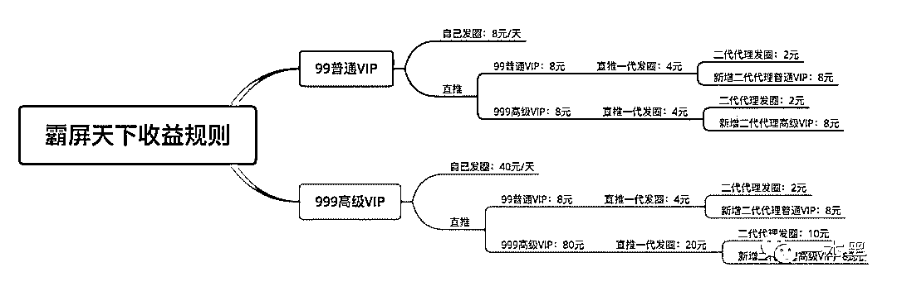

制作这张图的时候，我莫名想起了愚公移山：“虽我之死，有子存焉；子又生孙，孙又生子；子又有子，子又有孙；子子孙孙无穷匮也，而山不加增，何苦而不平？”

**收益动静结合后，还有附加收益在向你招手**，附加收益主要有两大模块，推荐广告主投放和升级城主。

推荐广告投放商在霸屏投放广告，推荐者可以获得高达 30%的佣金。

升级城主，有两种方式，直接认购和竞选，成功晋级为城主后，可享更多人头收益。

直接认购城主的价格，是 10 万；竞选城主的初始价格是 1 万，每次加价幅度为 25%。

*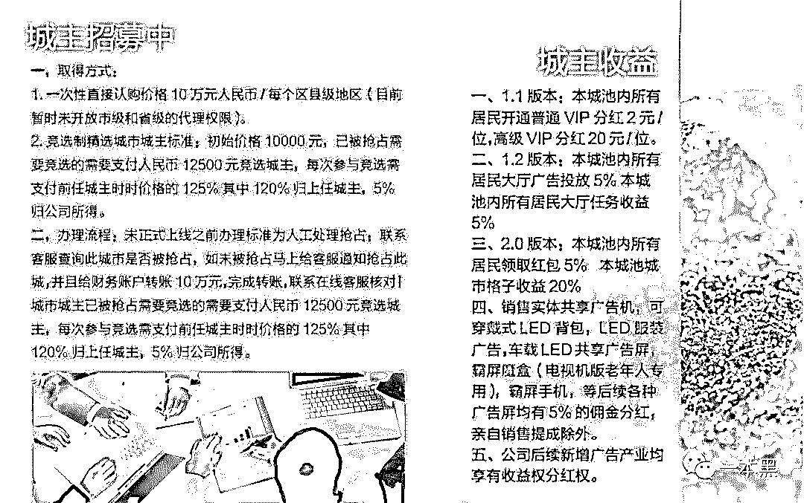*

*（图片来源于网络）*

按照两种会员全开，并荣升城主的情况下，以霸屏天下的收益规则，我们来算一道数学题：仅靠霸屏天下，买下李晨在北京二环那套估值 3.2 亿的四合院，最快需要多久？

**02 霸屏的布局远不止于此**

除了朋友圈广告业务外，霸屏还有更大的布局和野心。

**霸屏宣称要打造全生态链**，业务板块几乎囊括了时下所有热门的领域，涉及到广告传媒、数字货币、即时聊天、视频直播、电子商务、手机游戏、金融理财、信贷、区块链等等，当然，霸屏也没有忘记企业应该承担的社会责任，甚至纳入了社会公益。

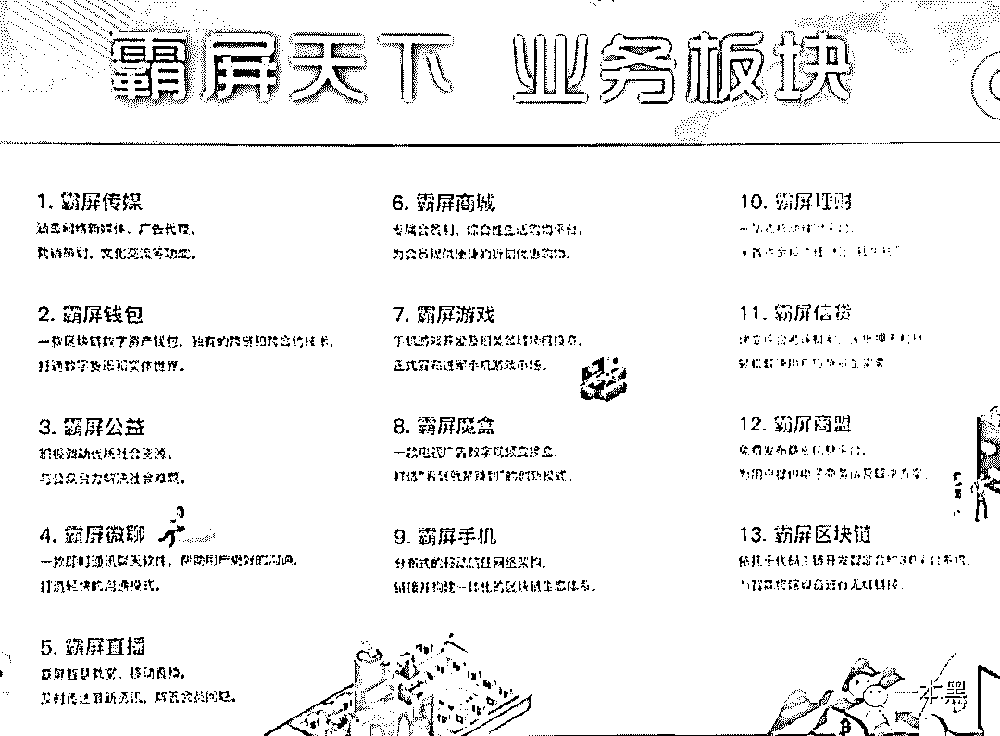

*（图片来源于网络）*

照着这个劲头，如果有充足的时间，怕是连航空、医药和人工智能等领域，都要涉足。

此外，霸屏还对外宣称将进军文娱产业，已经收购了电影《人间喜剧》的部分收益权。

*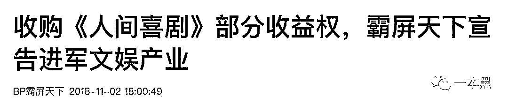*

*（图片来源于网络）*

遗憾的是，对于霸屏天下收购《人间喜剧》收益权的说法，《人间喜剧》官方微博表示不服，通过微博实名盖戳反驳。

*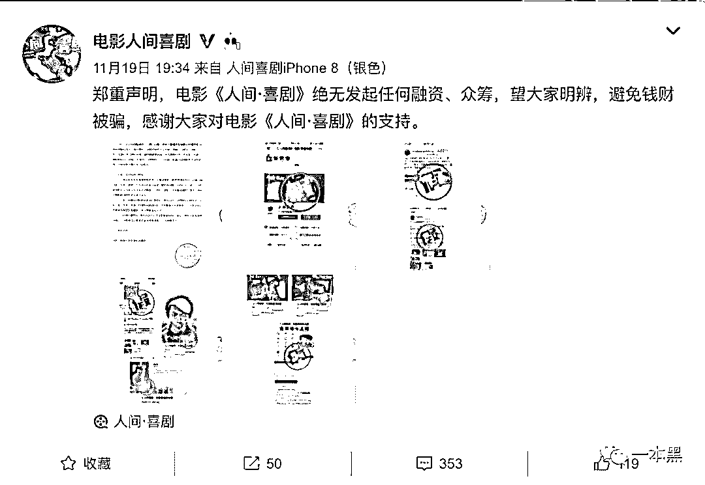*

*（图片来源于网络）*

*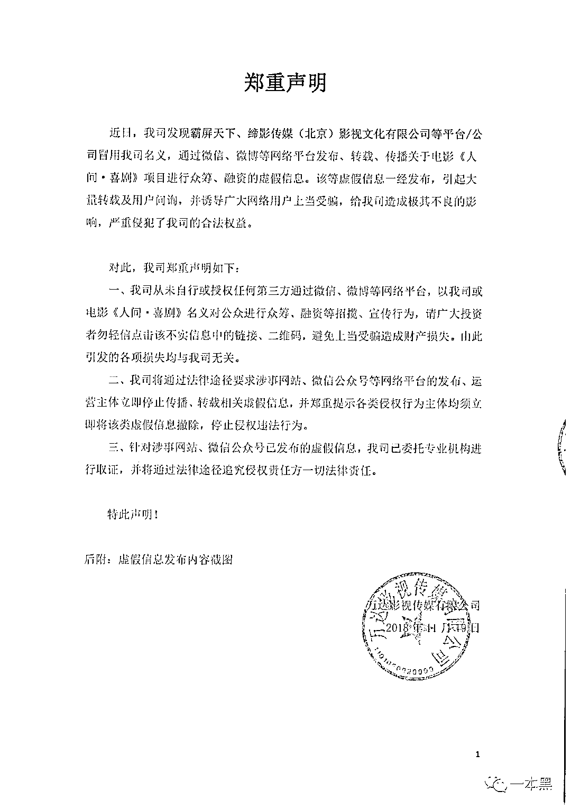*

*（图片来源于网络）*

虽然啪啪打脸，但霸屏估计不会疼，因为外界对霸屏天下的质疑，远不止于此。

**03 ****究竟是生意还是骗局？**

从上线至今，霸屏一直处在风口浪尖上，外界对它的质疑从未停止。

**1、它有几处逻辑上的疑点：**

**下载。**霸屏天下的 App，并未在任何应用商店上架，是以私下发送安装包的形式，在手机上进行安装；

**注册。**进行注册时，必须填写邀请码，否则无法注册，这就限定了每个新注册的用户，都拥有一个上线，尽量让所有已经注册的人，都有糖吃；

**架构。**会员的组成体系，设计的很有味道。霸屏天下虽然给予会员分享佣金，但只设两级会员，刻意避开了法律对于传销的划分，即拥有三级以上的层级。

**2、霸屏天下背后的企业，为新注册企业，却因“通过登记的住所或经营场所无法与企业取得联系”，而被列入经营异常名录。**

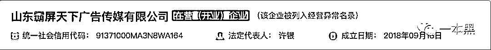

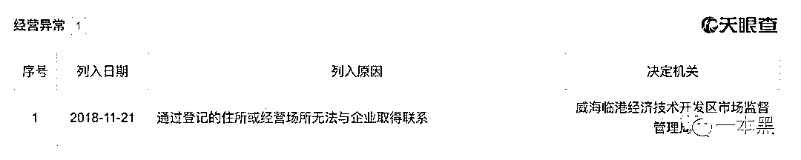

**3、会员的有效期，从永久有效变成了月费制度。**

霸屏天下发布公告称，普通 VIP 的有效期为 30 天，高级 VIP 的有效期为 60 天，到期必须续费，否则身份将失效。

这可以被看做是一种侧面强制会员退场的方式，没回本？不愿退？那请继续充值。

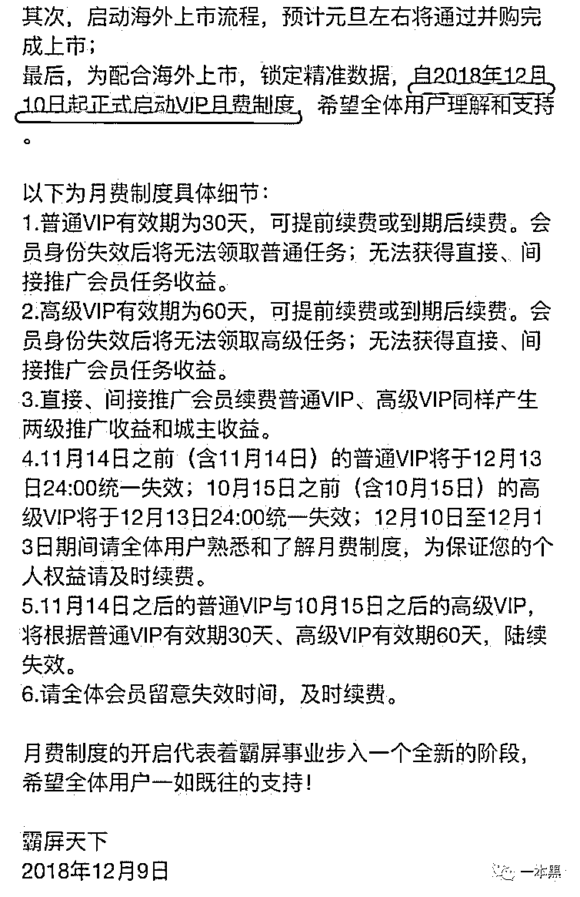

**4、霸屏天下的收益提现规则多次变动，近期多次遭遇提现失败。**

最初，可提现佣金只要满 100 元，即可提现，手续费为 5%；不久后，新增 5%的慈善基金，使得提现手续费涨到了 10%；再后来，提现最低额度提高到了 200 元，手续费维持 10%；现如今，霸屏天下已经全面停止了提现申请，理由是霸屏天下上市在即，将启动内部 VIP 会员升级认购流通股票功能，佣金可用于置换流通股票。

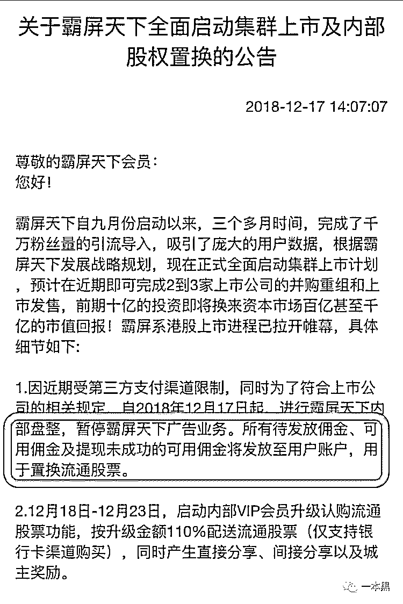

**5、霸屏天下宣称即将上市，并将更名为霸屏国际，公司总部将搬迁至马来西亚，但承诺公开的股票代码，却一直跳票。**

**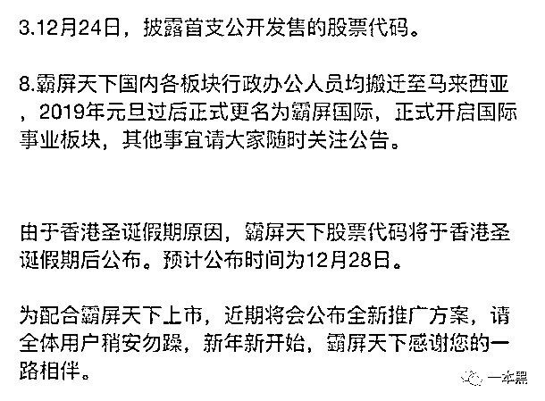**

霸屏天下已经运营三个月，近日频繁在 App 中发布公告，更名、上市、股票，每个字眼都让会员颤抖。

熟悉的公关手段，让人忍不住对幕后团队，和接下来的走向，产生担忧。

三个月就能把公司做到上市，霸屏到底有多优秀？怀着对真相的渴求，我决定去寻老师傅出山。

递上一根芙蓉王，老师傅饶有兴趣的听我描述了霸屏天下，烟燃尽，吐出一句话：“怕又是老套路。”

临近下班，我收到老师傅言简意赅的消息：“有了，来”。

怀着揭秘真相前的忐忑心情，我急速冲到了老师傅电脑前，老师傅示意我坐下，清了清嗓子后，开讲了。

经过多角度查证，老师傅发现这个团队的成员，多在山东和深圳，这伙人并不是新手，霸屏天下也不是他们的第一个项目。

这个团队的上一个项目，叫做 YOU 优生活圈，同样的拉人头模式，涉嫌传销被多次曝光。

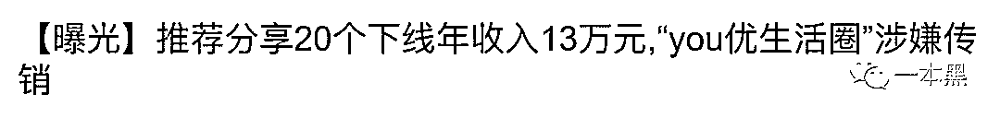

YOU 优生活圈后，这伙人又创建了霸屏天下，经过对后台数据分析，发现霸屏天下的系统上线时间为 8 月 29 日，项目启动时间约为 8 月 31 日下午 6：30，此时注册人员较少，应为内部人员试水，而外部用户正式进入并出现爆发式增长的时间，为 9 月 1 日。

经过对后台数据分析发现，**霸屏天下的注册用户大约为 860 万，与官网宣称的 1000 万**，有较大差距。

按照老师傅拿到数据的时间为节点，付费会员人数大约为 325 万，其中，999 高级会员级别的人数，仅为 250 人。

霸屏天下累计提现总额约为 12.5 亿，而可提现佣金，仍有 13.6 亿。

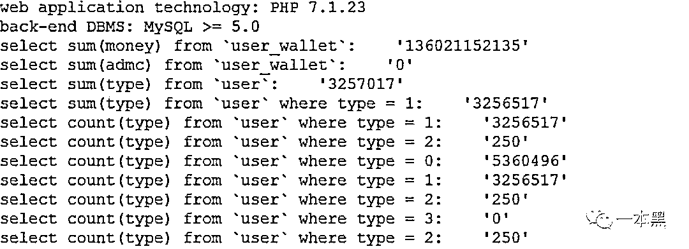

**霸屏天下，是生意还是骗局？答案已经昭然若揭。**

**04** **一场自欺欺人的狂欢**

如此漏洞百出的拉人头骗局，却还能吸引数量如此庞大的群体，有一个很重要的原因，那就是霸屏天下的造势能力。

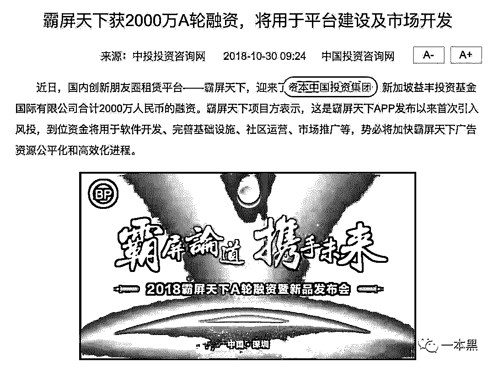

在这篇新闻通稿中，出现了一个有着独特命名的公司，看名称，大气磅礴，去企查查搜一下，却让人风中凌乱。

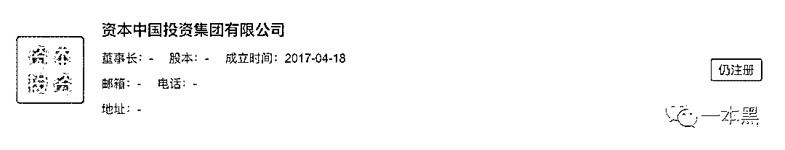

还有更重量级的，霸屏天下在美国纳斯达克大屏上打出广告，对外营造出自身具有瞩目商业价值的形象。

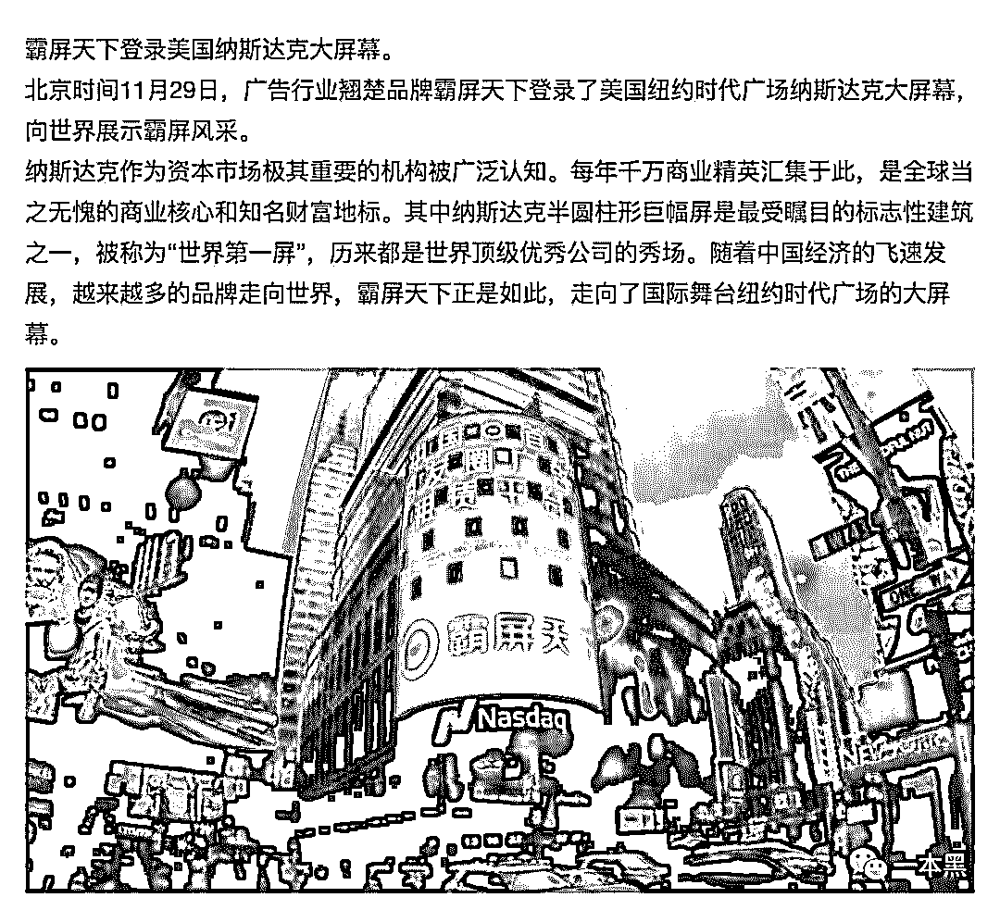

*（图片来源于网络）*

但是，对于霸屏天下努力向外界营造的“德智体全面发展好学生”形象，稍加思考和求证，便知真假。

霸屏天下在美国纳斯达克大屏上的广告展示，无疑是一针强心剂，给已经入局的人，和相当一部分旁观者，注入了高浓度的信任和自豪。

**但其实，这只是一场局内人的自欺欺人。**

纽约时代广场，被誉为“世界的十字路口”，早期时候，这里确实是美国本土品牌及国际巨头的重要宣传途径，后来，随着中国企业的崛起，也将广告投放在了时代广场，开始给国人一种印象：能在时代广场做广告的企业，都具备实力。

但如果你去时代广场看一看，你就会发现，这里有着不计其数的大屏，都在播放着不同的广告，但其实，只要 1 万起步，你就能把广告投在这里，成为国内大众眼里的王者。

看看这几年登录纳斯达克大屏的广告，你就能发现，这并不代表某种荣耀，仅仅是一条简单的产业链而已。

**

*（图片来源于网络）*

*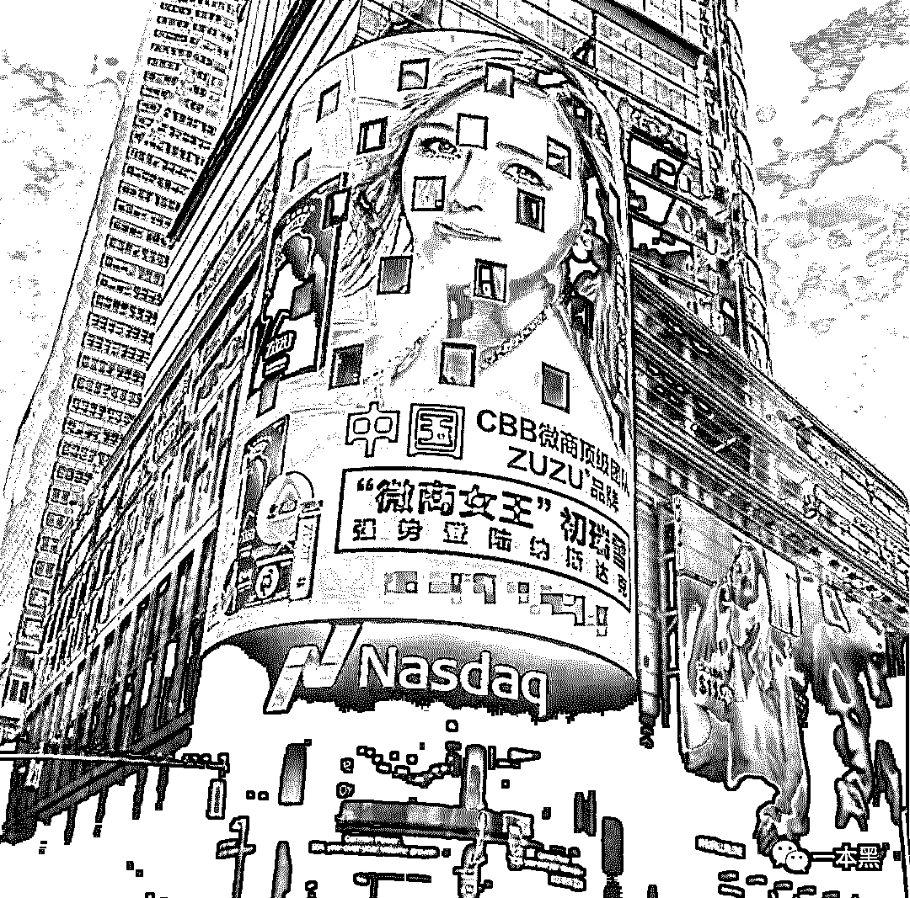*

*（图片来源于网络）*

**05** **疯狂的资金盘**

到底什么是资金盘？

**两个关键语：无造血能力，拆东补西。**开盘后，不断把后入局的人所贡献的资金，作为先入局者的收益回报，以此方式，让资金流动起来。

每一个资金盘都只有两种结局：资金盘的老板卷款而逃，或被公安等机构查处。

但每一次崩盘，却有无数种伤害，很多家庭轻则损失财物，重则家破人亡。

近几年，资金盘的由头越来越多，有的人躲开了一种，却陷入另一种，防不胜防，一起来看看近些年来的资金盘骗局。

互联网金融式。

还记得“e 租宝”吗？一个曾风靡全国的网络理财平台，以“１元起投，随时赎回，高收益低风险”为宣传口号，很多完全不了解，也从未接触过互联网金融的人，仅仅被这句简单的宣传口号所吸引，加入其中。

而“e 租宝”却靠着假项目、假三方、假担保的手段，一年多的时间里，非法集资 500 多亿，90 余万受害投资人，遍布全国 31 个省市区，轰动一时。

张威（化名）是 e 租宝的受害者，在接触 e 租宝之前，他是一家小型互联网公司的中层领导，在一位朋友的多次劝说下，他产生了试试的想法，在小额试水尝到甜头后，通过向亲戚朋友借钱、平台借贷的方式，投入 50 万，而后血本无归，为了躲债，辞职后流离在外，多次遭遇暴力催债，甚至想过轻生。

与此类似的骗局，还有南京钱宝网理财、昆明泛亚稀有金属交易所等。

非法传销式。

“云在指尖”，被称为移动网络传销第一案。购买产品满 128 元，即可成为会员发展下线，下线消费就会返利给上线，号称“只要一部手机，一个微信账号，消费 128 元就能代理整个商城的产品，在家里发发链接，就能轻轻松松月入上万，甚至十几万”。

被依法查处时，“云在指尖”的关注人数 2400 万余人，缴费人数 260 万余人，涉案金额 6.2 亿余元。

小欣（化名）大学毕业后，在一家公司做设计，偶然的机会接触到云在指尖，短短两个月，就选择辞职在家，专心自己的“事业”，走火入魔式的向身边所有能接触到的人推广、拉人头，所有生活起居和“事业”上的花销，全靠已退休年迈的父母，后来在男友提出分手、朋友避之不及、母亲病逝的情况下，依然不愿回头，父亲常常念叨着：家散了。

此类骗局，还有 WV 梦幻之旅、中绿资本运作、湖南安化黑茶传销、河南“诚信买卖宝”等。

技术跟风式。

这种类型的骗局，主打新概念，永远跟着最新的前沿风尚，各种币、各种区块链式混搭，让人产生一种“再不上船，就要错过风口”的急迫感。

胡曦（化名）发现，自己的母亲不知何时，接触到了一种叫做“MBI 代币理财”的东西，问起时，母亲兴致勃勃的说这是最新的理财方式，能赚大钱。此后，母亲每天手机不离身，在微信和 QQ 上，以各种方式加好友，共商赚钱大计。

自己的所有积蓄投进去之后，开始向子女打借条借钱，不给就以性命做威胁，劝解无效，家中每天都会为此发生激烈的争吵，引起母亲血压变动，多次住院，无奈之下，只得顺从，原本和睦的家庭，笼罩了一层阴云，家人间隔阂日渐加深。

这种类型的骗局数不胜数，什么万维币、五行币、亚欧币、暗黑币、万福币、雷达币等等，全部举例的话，能赶上报菜名。

公益慈善式：善心汇，振兴中华慈善基金会，一点公益等，和坑害老人式：老妈乐，养老公寓等，以及其他未列出的类型。

**所有的骗局，尽管穿着不同的外衣，但本质都是：看中了大众手里的本金。**

那些涉及到拉人头，许诺高昂回报，收益动静结合，与新概念名词紧密相连，新闻稿集中在小众网站、主流媒体却没有报道的资金盘，一定要慎之又慎。

资金盘本身是不赚钱的，你赚到的，都是别人赔进去的，但纵观全局，大头还是归了做局的人，其余都是陪衬。

螳螂捕蝉，黄雀在后。

**人性，有时是丑陋的。**

在网上输入“霸屏天下”进行搜索，在每一个询问“真假”的帖子下，你会发现，所有的回答，基本都分为两类，一类坚信这是板上钉钉的传销骗局，另一类则各种摆事实讲道理，力证项目绝对靠谱。

这两种截然不同的态度，原本没什么奇怪，但多探究一层，你会发现，个中深意值得品味。

那些发表力挺霸屏天下言论的人，当然不乏水军的存在，但也有相当数量的人，是在打心理战。

这些人明知道霸屏天下根本不稳妥，心中也很清楚，崩盘只是时间问题，却依然忍不住在心中盘算着自己的小九九，侥幸认为自己绝不会是接盘的那一个，同时，为了最大限度地保障自己的利益，不惜在各个渠道发表违背内心的言论，只是希望入局的人多一些，再多一些，这样霸屏就能够再多撑一段时间，撑到自己全身而退。

**THE END**

一边是明知骗局的“智者”，一边是不知真假的“愚人”。

如果最后的较量，是持续观望尚未入局的“愚人”，和贪得无厌不愿离手的“智者”。

你猜，谁赢了？

还原事实｜专扒黑产

微信 ID：darkinsider

知乎 一本黑

微博 一本黑 007

投稿、爆料、招聘、转载

请联系微信：chenchen_19940612

拒绝白嫖，请点好看