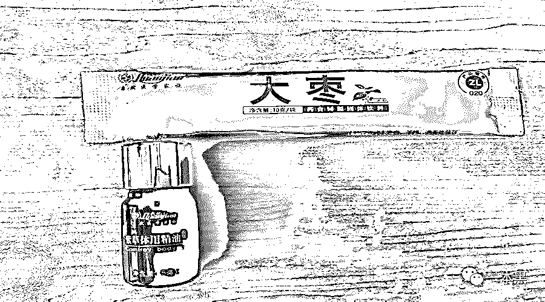
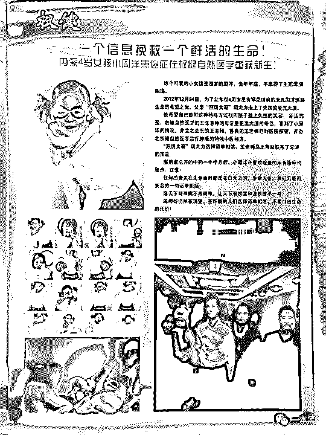
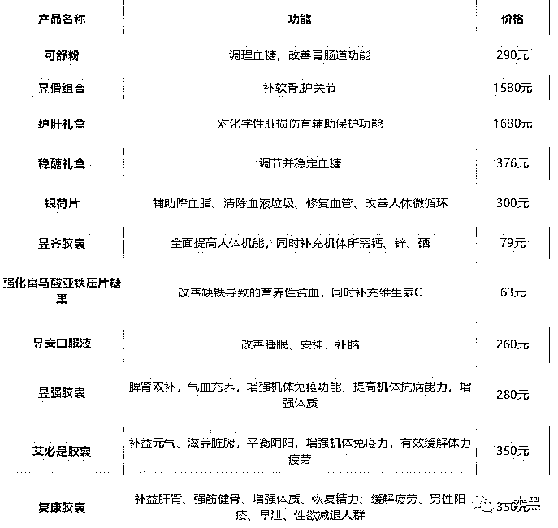
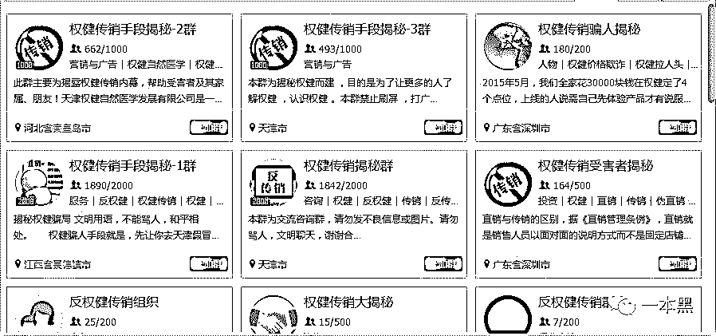
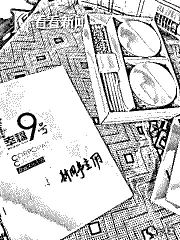
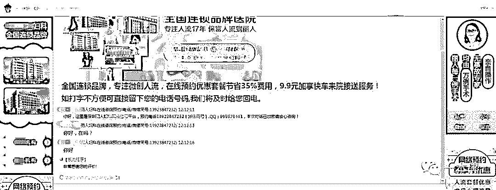
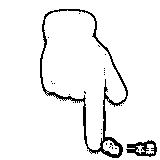

# 保健品当药吃、医疗虚假宣传、那些被耽误和被骗的中国家庭

> 原文：[`mp.weixin.qq.com/s?__biz=MzU4ODAwNzUwMQ==&mid=2247484920&idx=1&sn=f51fd1201d84921a43069d2af19d42f6&chksm=fde214daca959dccb4c498db6f1025a723050a7b18ce2b3e3375e56d7a36a2f0b1820b510e30&scene=27#wechat_redirect`](http://mp.weixin.qq.com/s?__biz=MzU4ODAwNzUwMQ==&mid=2247484920&idx=1&sn=f51fd1201d84921a43069d2af19d42f6&chksm=fde214daca959dccb4c498db6f1025a723050a7b18ce2b3e3375e56d7a36a2f0b1820b510e30&scene=27#wechat_redirect)

“

有钱有权的人用良心换钞票，大赚特赚。

圣诞节当天，一篇名为【百亿保健帝国权健，和它阴影下的中国家庭】在朋友圈掀起滔天巨浪。

周洋的惨剧撕开中国保健品行业华丽的外衣，无数人因为保健品耽误治疗，无数个家庭因保健品家破人亡。

保健品骗人、保健品传销这样的新闻在网上一搜一大把，为什么还是不断有人跌进这个陷阱？

文| 喵叔

2012 年 3 月，出生于内蒙古赤峰的周洋竟确诊罹患确诊为骶尾部恶性生殖细胞瘤，随后在北京儿童医院接受治疗。

期间因听信权健公司的宣传，服用所谓抗癌神药停止治疗。最终导致病情恶化，于 2015 年 12 月去世。

这期间，权健因虚假宣传与周洋父亲周二力对簿公堂，铁证如山的情况下以周二力败诉结案。

**01 ****一份价值 8000 万的抗癌秘方**

命运对周家开了个巨大的玩笑，权健用周家的凄惨开玩笑。

周二力曾在权健工作人员的联系下，带着女儿的资料和病历到权健公司实地考察在权健给女儿购买了 5000 元的抗癌神药：精油、饮料冲剂和一袋不知名的中药制剂。

**

*所谓的抗癌药（部分），图片来自丁香医生*

周二力以为抓住了救命稻草，于是在药品的生产厂商、不良反应都不清楚的情况下就擅自给女儿服药，并给女儿办理了出院，停止了其他用药和化疗。尽管主治医生曾经极力劝阻。

可女儿在服用第三个月时，病情突然恶化并出现癌细胞转移症状，于是只能重新回医院化疗。

也正是在这段时间，**权健利用该事件进行虚假，全国各大经销商纷纷拿出照片宣传疗效。**

**

*图片来自丁香医生*

得知真相后的周二力对自己的行为后悔不已，赶忙联系权健让他们停止宣传，删除文章公开道歉。躺在病床的女儿奄奄一息正是因为吃了他们的所谓神药，气愤不已的周二力一怒之下将权健告上了法庭。

周二力认为权健存在虚假宣传、侵犯他人隐私及肖像权等行为。**然而在铁证如山的情况下周二力依然败诉了。**

心力交瘁的周二力不再参与这些事件，因为女儿的病情越来越严重，治愈似乎几乎不可能。

女儿去世后，周二力夫妻俩回到了乡下给人放羊，每月赚 3000 块，用来偿还当初女儿看病欠下的债。

**02** **正骨鞋垫和治前列腺的卫生巾**

从权健官网了解到，权健集团创办于 2004 年，十余年里，收集**民间中药秘方多达 600 余副**，所有产品在此基础上进行研究生产。

作为一家保健品公司，最初以骨正基鞋垫和负离子卫生巾两款产品闻名。

**骨正基鞋垫售价高达 1068 一双**，在工作人员的宣传下，该款鞋垫上可正骨下可治鸡眼，要是不幸心脏病犯了，只要把鞋垫放到腋窝下捂热，就可痊愈。

鞋垫采用高科技手段，**可以在短时间内打通你的任督二脉****。**

负离子磁卫生巾就更神奇了，可以治疗男性前列腺疾病，据说里面还能有一种神奇的芯片，只要把卫生巾塞进裤裆里睡一觉，第二天醒来，病就不翼而飞了。

 *[`v.qq.com/iframe/preview.html?width=500&height=375&auto=0&vid=h0142r8kj3z`](https://v.qq.com/iframe/preview.html?width=500&height=375&auto=0&vid=h0142r8kj3z)* 

*（央视对这两款产品的报道）*

权健的产品可远不止此。

石墨烯制成被芯能有效治疗你的失眠，帮助你安睡整晚；
*   灵芝人参做成的精华，保管你容颜不老，青春永驻；

*   秘药高调进军药店，药食同源，造福百姓；

*   典藏台历，亲民价格，高贵体面，彰显你的身份价值；

*   精制韭菜饮品，滋阴补阳，让你重振男性雄风；

*   ......

“权健的产品覆盖面极广，效果更是立竿见影。在权健，不管你付出的是 10 块还是 1000 块，一定能心想事成，药到病除。”

**

*权健部分产品价目表，来自微信*

2013 年起，权健陆续在各地建立肿瘤医疗机构，可以给患者提供从体检、治疗、康复到临终关怀于一体的一条龙服务。

**2012 年，权健因传销被央视曝光，2013 年权健却获得直销牌照至今。**

不断有媒体曝光权健的模式存在问题，贴吧、QQ 里的维权也一直在持续。但不知为何，权健依然活得风生水起，还获得\「亚太直销大健康推广功勋企业」的称号。

**03 ****保健品当药吃的老人**

我国保健品销售市场高达千亿，仅仅一个权健便导致如此多的家破人亡。

那些不曾被曝光，正在阴暗里滋长的保健品公司正在进入千家万户。

2016 年，一家名叫幸福 9 号的保健品公司在上海松江召开健康讲堂，现场座无虚席。老头老太太们纷纷奔赴现场聆听专家的讲课，希望能获得一些健康知识。

会议之前，幸福 9 号的员工曾在小区进行过大面积的宣传，各种小礼物源源不断地送进居民的手中，鸡蛋、大米、血压仪，老人喜欢什么就送什么。

年轻的销售人员，穿着亮丽，嘴又甜。看到老年人就叫爸妈。拎菜浇花打扫卫生是常事，按摩捶腿捏肩是必需。

**一来二往，缺乏关怀的老人们便对这些年轻后生充满信任**，亲切地邀请他们回家。

取的信任之后，幸福 9 号便在社区展开免费体检活动，销售人员会邀请那些具有经济实力又好忽悠的老人家前去。

心、胃、脾、肺、肾各个器官都检查一遍，总能查出一些不该有的病。

销售人员会体贴地和老人说，这些毛病自己解决就好，不要给子女添麻烦。于是便顺利成章地邀请老人参加接下来的宣讲会。

会上当然会有各种保健知识，但是需要配合药物和器械使用。信以为真的老人们便舍下大价钱去购买各种保健品。如**价值万元的“天价保健药”骨源液**。

卖药之后，幸福 9 号还会给每位消费的老人配备以为幸福助理，以便及时了解老人的需求。

**

*来自看看新闻*

幸福 9 号声称自己是一家互联网养老公司，旨在为老年人提供精神关怀和健康管理服务。实际上幸福 9 号就是开设了一家网上商城，但是老人大半不会使用网购。因此**会销依然是他们最常使用的方式。**

除了会销，还有老人最爱的免费旅游。老人在异国他乡游玩时，行程快要结束的时候，同行的工作人员便会和老人介绍当地长寿村的秘诀。

享受了免费旅游的老人自然不会怀疑这是公司的套路，心甘情愿购买所谓的长寿秘药。

靠着各种套路和忽悠，保健品一点点榨干老人最后的积蓄，不仅如此他们还让老人签订保证书，宣称交易纯属自愿，不涉及强买强卖。

广西老人花万人购买三无保健品投诉无门；

宜宾七旬老人因听信保健品宣传，擅自停药导致不幸去世。

浙江 60 岁老人因买保健品被骗留遗书自杀；

......

保健品入行门槛低，利润空间大，无数人挤破头都要参一脚。

监管部门对伪劣和虚假宣传的保健品一直是被动式监管，查证属实便会没收违规企业所得，并对企业处以 5-20 万不等的罚款。

**这点小利和保健品公司高达 60%的利润相比，又算得了什么**。

而那些卖力宣传的年轻人，或许是被骗入行，或许是被亲戚朋友拖下水。被洗脑的他们坚信自己不是骗人，而是为了让老年人获得幸福。

为了看起来更值得信任，他们花大价钱装扮自己，买名牌租豪车。但是走下传销会的舞台，他们却连几百块的房租都负担不起。

**04 ****医学虚假宣传几时休**

医疗行业需以德为先，治病救人要在明确事实的基础上进行。

制药公司为了牟利，肆意夸大药品疗效。某国药准字号的祖传药物在宣传时称可同时治疗各种内伤和外伤，甚至对高血压有奇效。一款药竟然可以治疗几十种病症，还是在未经诊断的情况下。

权健肿瘤医院在医院介绍违规发布医疗广告。根据相关规定，医疗广告的表现形式不得含有涉及医疗技术、诊疗方法、疾病名称、药物等情形，而权健的介绍中明确出现了医院的各种医疗设备和技术。

**魏则西事件后，医疗竞价广告死灰复燃。**在某度上搜索“医院”，每一页的前几家均为人流或者中西医院，而这些医院或多或少存在各种医疗纠纷或者经营问题。

这些医院的网址通常极其简陋，有的甚至没有主页，点开医院的网址会自动进入咨询窗口，结束对话后页面依然停留在对话窗口。医院没有简介、没有执照、没有医护人员信息。

正是因为这类虚假医疗广告的存在，才引发了后来的魏则西和周洋事件。

**THE END**

无用的保健品和被骗的病人，也不知何时才能重获新生。

另：一本黑微博 **@一本黑 007** 现已开通，欢迎来杠。

还原事实｜专扒黑产

微信 ID：darkinsider

知乎 一本黑

微博 一本黑 007

投稿、爆料、招聘、转载

请联系微信：chenchen_19940612

拒绝白嫖，请点好看