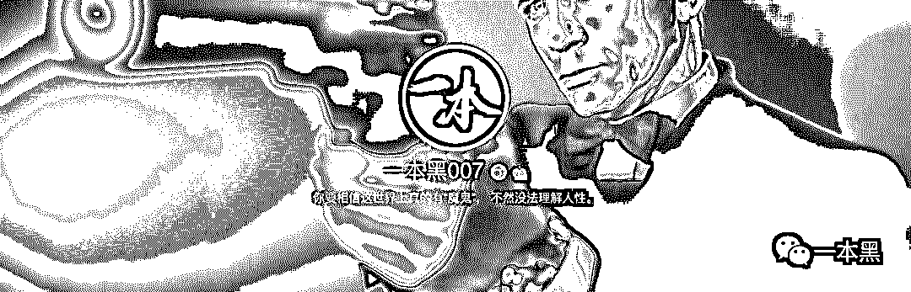

# 一则逼话连天的通知

> 原文：[`mp.weixin.qq.com/s?__biz=MzU4ODAwNzUwMQ==&mid=2247484892&idx=1&sn=f386afb777ee13748f6138839e5b9a17&chksm=fde214feca959de815209f49505d2dc0a366b6b6fd2e79d4fc39d8e5ff6e299141cd7d595f9c&scene=27#wechat_redirect`](http://mp.weixin.qq.com/s?__biz=MzU4ODAwNzUwMQ==&mid=2247484892&idx=1&sn=f386afb777ee13748f6138839e5b9a17&chksm=fde214feca959de815209f49505d2dc0a366b6b6fd2e79d4fc39d8e5ff6e299141cd7d595f9c&scene=27#wechat_redirect)

**  通  知**

（可直接翻到文末）

碎片化阅读天生就是娱乐的附庸，从不欢迎深刻。

不止一个人对我说，一本黑的文风太过硬核，在这个短视频抢占流量的时代，不用思考成了大众消遣时光的最好方式。

自媒体仿佛正在慢慢从文字阅读过渡到视频阅读，唯一不变的都是获取信息，只是对用户来说获取成本变得越来越轻松。

较之长篇大论的文字信息，稍微娱乐化且充满趣味性的短信息就能博得读者的注意力，反过来说，这算是当今互联网人的通病。

对于读者来说，一本黑的文章算不上严格意义上的深度阅读，但抽丝剥茧、与时代争锋相对，我想还是绰绰有余。

个人认为深度阅读是个好习惯，虽然它让你的阅读变得吃力，但却可以让你的大脑处于一种安静的、思维高度集中的活跃状态。

**说到碎片化、娱乐化，微博是个再好不过的平台。**

一本黑曾经开通过微博账号，但后来莫名被封，原因未知。好在当时并没有公布给大家，只有少部分读者发现了我们。

有人说一本黑怎么一周就更新两三篇文章，完全不够看。

我要说的是，一本黑文风虽然是刚了一些，但在内容的创作上，我们追求视角深度、数据有理有据、文字真实且有质感。

所以每篇内容的生产周期会相对较长，理解就好。

但碍于每天在后台的爆料和留言太多，我们的更新频率有限，很多精彩爆料内容无法成文。

**综上，我们决定开设新微博账号。**

微博平台能够更快、更多地散播“黑色”信息，在公众号上看不够的可以在微博上接着看。

那些公众号后台抬杠的人，你们的留言谁都能看到了，**不服也不用憋着，欢迎来逼逼。**

那些在后台爆出的猛料，现在也可以到微博评论，让更多人知道。

虽然在此之前，我们曾开通过小密圈（现名为知识星球），但并不是每个人都需要专业的计算机基础知识。

不同于小密圈以专业互联网安全内容为主的会员性质；微博内容将更倾向于娱乐性和及时性，当然还有更多黑产内容，**老师傅也会不定期分享一些好玩事儿。**

当然，也是为了如果有一天一本黑不见了，你可以到微博找我们。（**你也可以在一本黑公众号菜单栏点击防走失，里面有秘密通道**）

行了，说这么多逼话就是想让你们去关注——新浪微博搜索【一本黑 007】，即可关注。

