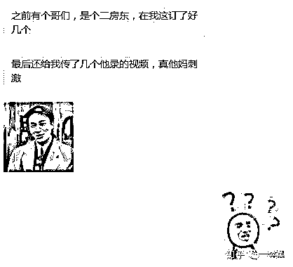
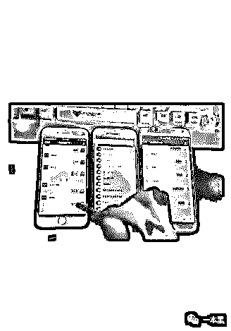

# 玩手机被监控、出租屋被偷拍，大数据被“杀熟”，还能再骚一点吗？

> 原文：[`mp.weixin.qq.com/s?__biz=MzU4ODAwNzUwMQ==&mid=2247484776&idx=1&sn=d3bbd35bb2b21046640a8924d580b783&chksm=fde2144aca959d5c6216d5ce34eb8e2adaafde78162e7f899f6ff57157fbfa8a93fdb7039d2f&scene=27#wechat_redirect`](http://mp.weixin.qq.com/s?__biz=MzU4ODAwNzUwMQ==&mid=2247484776&idx=1&sn=d3bbd35bb2b21046640a8924d580b783&chksm=fde2144aca959d5c6216d5ce34eb8e2adaafde78162e7f899f6ff57157fbfa8a93fdb7039d2f&scene=27#wechat_redirect)

一本黑的公众号后台总能收到这样的问题：

“住酒店怎么检查有无偷拍摄像头？”、“我怀疑我的手机被监控了”、“我在二手交易平台被骗了”、“我的银行卡账号被盗刷了两万元怎么办”。

针对第一个问题，今天我老黑就想告诉大家，我和老师傅凑了点钱，会送出一套价值**1200 元**的针孔摄像头检测设备。

它能检测出当前市面上大多数的偷拍设备，以及准确地找到它暗藏的位置。

具体怎么送，先不急，仔细看完今天的文章。

**基于你的隐私，“它”想对你进行精准骚扰**

讲一个基本上所有人都遇到过的诡异场景。

有一天，你在电商平台上搜索了一件商品，由于价格原因，思前想后还是没有决定购买。

当你退出电商平台，却发现其他网页上的广告已经换成了你刚才搜索的商品。不断滚动的轮播广告图疯狂暗示你，这商品已经很便宜了，过了这个村可就没有这个店了。

这难道就是传说中的大数据？

你在惊叹卧槽的同时不得不佩服这大数据的牛逼之处，确实，人家这效率，得把各位互联网姥爷服务到位不是。

也许大多数人觉得这没什么，即便你给我推送再多的广告，我不买就是不买，你能拿我怎么着。

当然，这种现象的骚扰程度确实可以忽略不计，但另一个现象你们一定也经历过。

打个比方，早上你和同事讨论了一上午关于某款运动鞋的问题，以为偷得浮生半日闲，混到中午下楼吃个饭然后午休，完事儿。

却不料在晚上打开电商平台的时候，发现首页的轮播广告正是你早上和同事讨论的那双鞋。

这时候你慌了，我他么都没搜索，它是怎么知道我想买这双鞋的。

难道软件还能对用户进行窃听？根据语音分析出用户的喜好，进而在平台做出对应的商品推荐？

想到这是不是有点细思极恐，好似千里之外有一只顺风耳在偷听你说话一样。

假如有一天，你和你的女朋友正在讨论一些生活里该有的正确姿势，你说：“诶，我知道有个东西不错，要不咱买来玩玩？”

还没等你打开软件，人家首页商品的广告就已经准备好了，也避免了你手动去搜索，嗯，挺好。

可有个疑问，搜索记录多平台共通、用户喜好可提前预知，这些骚得不能再骚的大数据操作到底是如何实现的呢？

难道是平台内鬼兜售？或者平台之间互相进行数据盗取？软件真能窃听用户并进行喜好推荐？

其实，这种利用大数据营销的场景太多了，一本黑后台就收到过很多，比如有人去参加了一场婚博会，晚上就在微博上发现大量婚纱拍摄之类的广告。

搜索某个景点，很快，你就会在页面边栏处，看到相关的动车、机票信息；新闻软件推送给你的新闻，大多是你常点开的那一类。

这些平台根据一开始我们表现出的喜好，把我们框在一个圈子里，不但剥夺了我们自由选择的权利，居然还对我们残忍“杀熟”。

一间 300 元的酒店，因为你是熟客，需求又比较大，所以给你推送的价格是 380 元，没毛病吧！

细细品味“杀熟”得以成功的原因，其实不就是来源于软件权限吗！。

是他们暗藏在隐私协议里的不平等条款，使得用户处于默认同意交出隐私的状态，这才使得普通用户，成为待宰羔羊。

大数据衍生出来的一系列场景就好比，你去一家面馆吃面，由于你是北方人，每次吃面都喜欢配上几瓣大蒜，这时候老板看到了，他心里就会想，这小子喜欢吃大蒜，我记住了。

等下次你再来的时候，老板除了给你端上面，还会顺手把大蒜递到你手里，这当然是个挺好的服务，大数据不就是这样吗！

可当有一天这个老板把你喜欢吃大蒜的消息卖给了方圆 20 里的人，他不仅赚到了你一碗面的钱，还顺带赚了卖信息的钱。

喜好吃大蒜只是一个简单例子，它要是换成其他比较敏感且隐私的东西呢！

这时候你还会觉得大数据便捷吗？

**“它”不骚扰你，只是暗中偷窥**

酒店偷拍、监听定位、有些人觉得这些看起来就很刺激的字眼绝对不会发生在自己身上，这些带有私家侦探属性的场景，只会发生在影视剧里。

但现实并非如此。

前段时间就发生过类似的事，一对居住在北京某公寓的夫妻，有天突然发现床边的插座上有一个奇怪的小孔，用手机闪光灯一照，竟然发现有类似玻璃的反光物，敏感的夫妻俩马上报警。

民警赶到后将插座拆开，果然发现一个暗藏的针孔摄像头。

设备正连着 WiFi，上面还有一个储存卡正在不间断地录制视频，操作者可以远端登录并下载储存卡内录制的视频。

可怕的是，当夫妻俩发现暗藏的针孔摄像头时，他们已经入住了五个月之久......

现在你知道这些藏在暗处的偷拍设备的可怕了吧！他们可以伪装成任何你熟知的物件，比如充电器、插座、打火机、路由器，甚至是擦肩而过的陌生人的眼镜。

只要有心，对方可以有一百种方式来监控你，而你，也许躲得开前三十，却不一定防得住后七十。

因为市面上几乎所有的监控设备，都有一个共同的特点：伪装。

就如同周星驰电影里说的：“你看它是个剃须刀，其实它是个吹风筒。”

而说到监控的原因，有的是单纯出于强烈的窥探欲望，比如租客碰上无良房东；比如企图借此来增强情感中“变态”的安全感，比如情侣、夫妻；而有的，则是为了赚钱，比如酒店中暗藏的偷拍监听设备。

这些人可能一边“欣赏”你在酒店或出租屋的刺激视频，另一边转手就把这些视频卖给色情网站的站主，小赚一笔。

对他们来说，简直美滋滋。

**除了偷拍设备，还有手机监控设备**

除了与大数据相关的一系列骚操作、酒店暗藏偷拍设备外，你能想象自己的手机可能会被人监控吗？

对于自己的另一半或是身边很容易接触到的人，想要监控对方的手机可以说是易如反掌。只要在对方的手机上安装某些应用，再进行一系列设置，一定程度上就可以达到监控对方手机的目的。

这种灰色应用安装到手机上后，**还可以隐藏在后台继续运行**，一般的杀毒软件根本检测不出来，没有一些特殊的技巧机主很难发现自己已经被监控。

使用这类手机监控应用，监控者可以在特定 APP 上轻松并且实时地查看被监控手机的 QQ、微信、通话记录、短信记录、当前位置等。

有些监控软件甚至还有远程监听、录音、拍照等功能。可以说是触目惊心，个人信息在被监控后完全没有隐私可言。

不得不说，互联网发展到今天，已经成精了。

每个人都知道隐私重要，但在日常生活中，出于种种原因，却选择了妥协，慢慢的，“温水煮青蛙”般，放松了对风险的警惕。

但没有了隐私，你、还是你吗？

面对铺天盖地的隐私泄露风险，是坐以待毙？还是积极应战？

等等，可能有些人会说，你他么说了这么多废话，又不给解决方案，这不干打雷不下雨吗！

这些大数据杀熟、木马病毒监控手机、酒店/出租屋暗藏针孔摄像头，这些场景到底该如何解决呢？

都看到这了，急个鸡毛。

继续往下看。

其实，这些问题我们在后台收到过很多，起初，我们会针对读者提出的问题做出相应解答，但奈何问题太多太杂，并不能一一回复。

所以这一次，我们想通过一套视频课程，把网络时代的个人隐私保护，从笼统的建议，落地到最终的解决方案，并且我们希望这些解决方案能够成为你上网习惯的一部分。

我们请到老师傅的朋友冷焰来做这次的课程分享，一位很个性的黑客，和老师傅做过很多有趣好玩的事，有机会我讲给大家听。

课程中的内容大部分都是老师傅的多年来的上网习惯和保护个人隐私的办法，里面甚至还提到了老师傅的【计算机基础知识】。

行了，来听听老师傅...的这位，明明能靠颜值、却非要靠实力吃饭的朋友，怎么说。

[`v.qq.com/iframe/preview.html?width=500&height=375&auto=0&vid=a0803ylfw8r`](https://v.qq.com/iframe/preview.html?width=500&height=375&auto=0&vid=a0803ylfw8r)

作为一个垂直的黑客媒体，这一次，我们想通过黑客的视角，迎合互联网的传播模式，将各位读者在过去一年中，提问次数最多、最担心的个人隐私泄露问题，通过一套视频课程，呈现给你们。

在这套课程中，你会学到很多内容，比如前面提到的出租屋暗藏的偷拍设备，我们会用实物进行还原，教大家如何正确的检测藏在暗处的针孔摄像头。

还有其他的内容比如：

每节课我们都会进行场景还原，尽可能的让大家明白其中的利害，用最简单的方法做出相应的防范。

**不玩套路，有的只是干货；**

**不搞假大空**

**场景真实还原，危机逐一破解；**

**担心复杂？**

**NO！傻瓜式演示，一切为你省心。**

只要掌握实用的隐私保护小技巧，就能从源头提升安全指数，面对隐私泄露，你完全可以四两拨千斤，对风险说“不”。

在这个网络时代，我们可以做的很多，唯一不能做的，就是成为一条砧板上的鱼肉。

很多新老读者总是会问这样的问题，我们整天揭露互联网的黑暗面，公众号又不接广告，到底怎么盈利。

是的，我们不接广告，只是单纯地不想打扰各位的阅读体验。

现在，针对大部分读者提出的疑问，我们精心准备了三个月，用视频的形式浓缩了六节课，只希望能帮助各位在互联网隐私安全上多一份保护自己的技巧。

在帮助各位的同时，顺便创造一份收入。

所以，为了避免大家再次问出我们怎么盈利的问题，请大方购买我们的课程，当然，你也可以推荐给你的亲朋好友。

各位白嫖一本黑的文章这么久了，接下来就看你们的了。

**报名方式**

**扫描海报二维码，进入购买详情页**

预售价格 99 元，仅限前 1000 名，超过 1000 名课程恢复原价。（前 1000 名有福利）

课程正式开售时间：2018 年 11 月 30 日

**课程福利**

**福利 1：与老师傅交流的机会**

成功购买课程可在课程下方扫码进入学员交流群，一本黑老师傅也会在群内出没互动。

**福利 2**：

课程结束后我们会随机抽取 3 名学员赠送价值**1200 元**的监控检测设备 1 套。

价值**199 元****一本黑小密圈**名额 1 个。

拒绝白嫖，请大方购买！