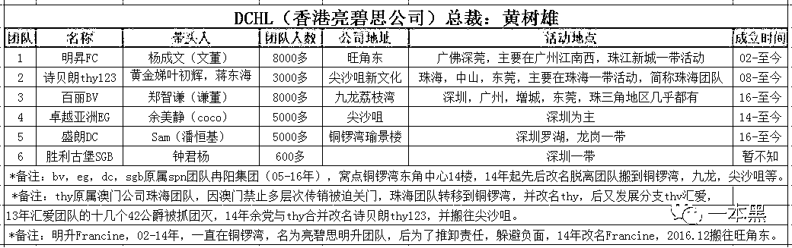
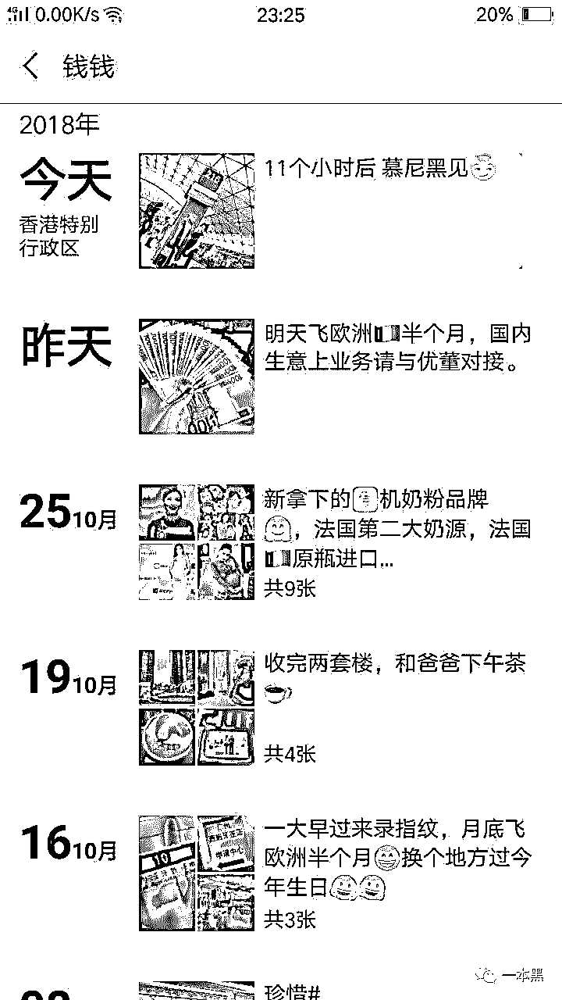
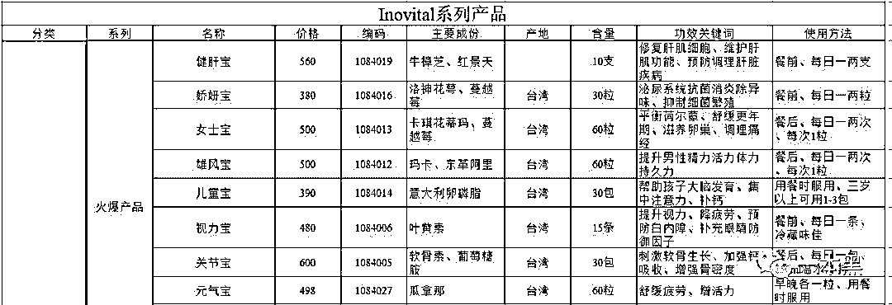
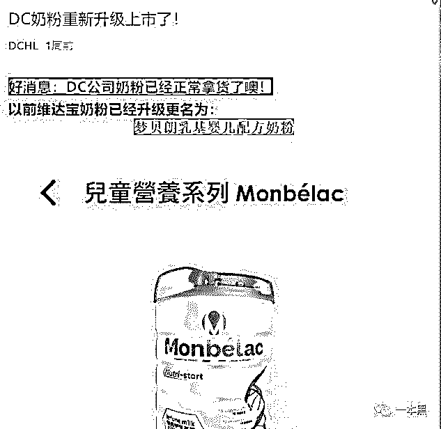
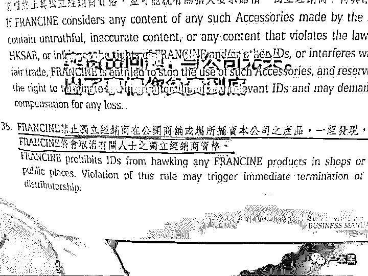
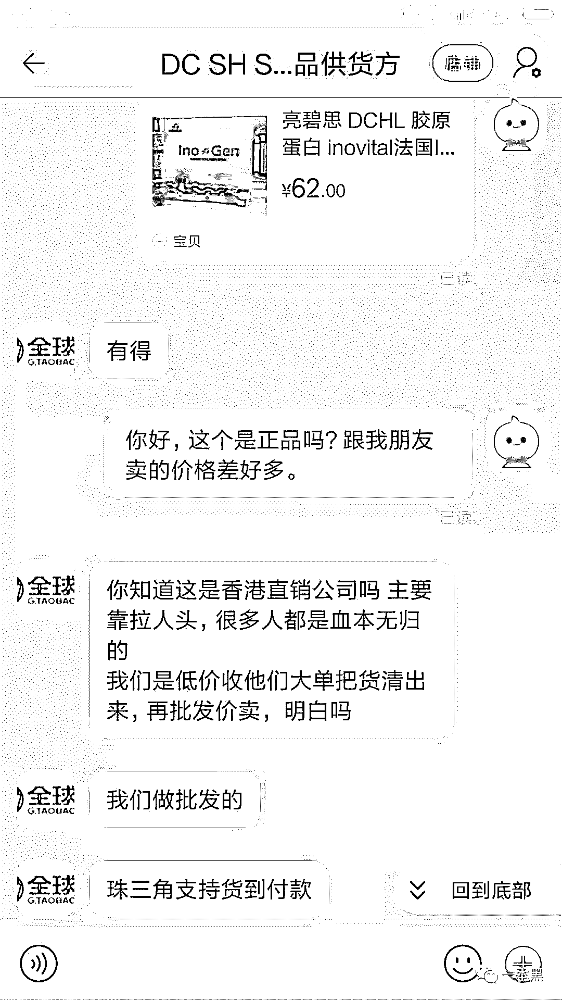
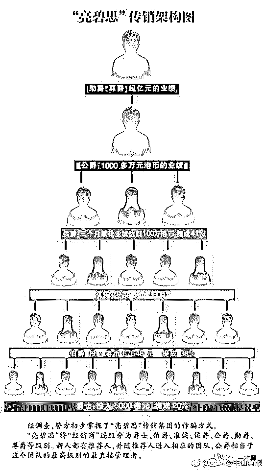
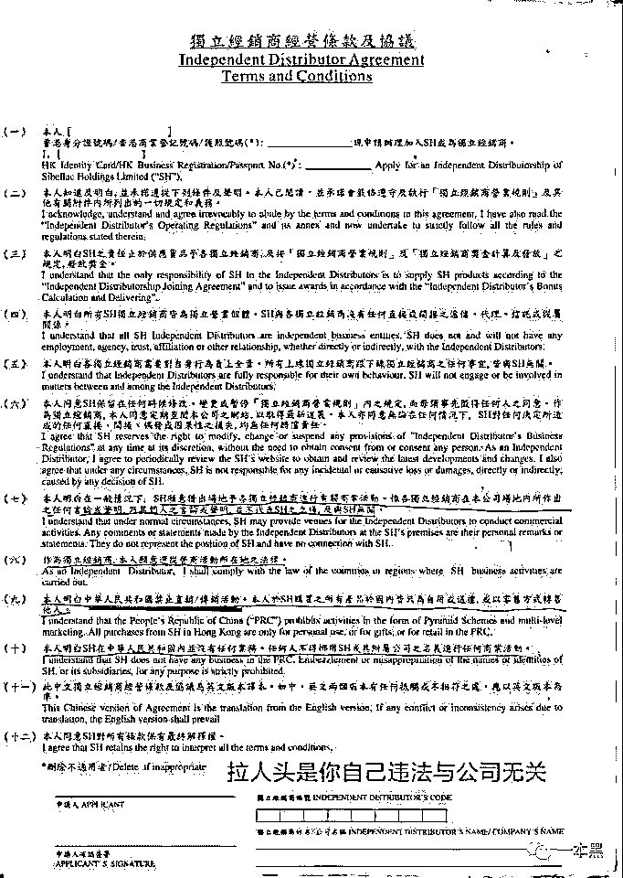

# 暴力炫富、月入十万，喜提跑车，还包游艇？TMD 传销不吹牛逼是不是会死。

> 原文：[`mp.weixin.qq.com/s?__biz=MzU4ODAwNzUwMQ==&mid=2247484728&idx=1&sn=166d33c1b8a95bc2ea25af19acde7f7a&chksm=fde2141aca959d0c822ff8a99cf360652ff66037b411c8818cb86210cfa69b133be5e533e468&scene=27#wechat_redirect`](http://mp.weixin.qq.com/s?__biz=MzU4ODAwNzUwMQ==&mid=2247484728&idx=1&sn=166d33c1b8a95bc2ea25af19acde7f7a&chksm=fde2141aca959d0c822ff8a99cf360652ff66037b411c8818cb86210cfa69b133be5e533e468&scene=27#wechat_redirect)

# 

**引言：**

一个在朋友圈喜提保时捷、随手包下游轮的人，现实中却可能都凑不够一包烟钱；一个号称月入十万的人，最常接到的电话是讨债电话。而这，也正是有些“新型传销从业者”的日常。

不限制人身自由，也不会没收你的手机通讯，来去自由，画大饼、洗脑、每一步都是为了榨干你口袋里的钱。

亮碧思，简称 DCHL，也叫 DC。旗下共有有四大品牌、六大系列的产品，用户涵盖从老人到孩子的全年龄段。

他们声称，这些产品都是国外的小众品牌，国内市场正在开拓之中。他们的产品也不乏明星站台，更令人难辨真假。

        

# 

**一**

爆料人 Actual ，年仅十九岁，已有两年金融行业从业经验，而其鬼人（即其上线）则是他的同事。

Actual 被骗 6500 元，言谈间，他并不沮丧。

“去香港，吃住全包三天，6500 也不亏。我去的第一天就觉得不对劲，我又上网看了，知道他们是骗子，后来他们让我买产品的时候，我直接就拒绝了。”

那当初又为什么会来香港呢？

“看他们的朋友圈，天天都是晒吃喝玩乐，不是买了新车就是包了游艇。”

              

他们不仅在朋友圈塑造成功人士的人设，还会带你去参加各类聚会，聚会上大都是他们的人，不断宣讲他们的成功经验。

“我们就去了大夫山的一个烧烤场地，这些人包装得很成功的样子，宝马奔驰名车名表大老板，我同事介绍他们给我认识，他们说都在做进口生意，很赚钱”。

看到这些，当同事说香港有一个不错的机会，正失业的 Actual 没想太多就答应了。即便需要 6500 元的费用，Actual 也没有太在意。

# 

**二**

他被骗去香港听了亮碧思四天的培训，他们称之为“打雾”，也就是集中一段时间专门洗脑。

“第一天，放好行李，（住在维景酒店）就去外面走了一圈，说让我们了解下香港。然后就一起到新文化中心听课。他们一直强调自己不是传销，因为传销是没有产品的，说这个叫做会议营销。”

“我这种第一次来的，都会跟一个投资过的人住一个房间，我是跟那个轮滑冠军住一起”。这样方便他们观察反应，监视行动，能够在港伤（受害者自称）们提出怀疑的时候及时应对。

培训第一天，内容是产品介绍。主要产品包括：EB 香薰精油、香水、化妆品、保健品、葡萄酒、维达宝奶粉（现已更名为梦贝朗）、眼镜、珠宝、手表等，且仍在不断推出新品。

“吹他们的红酒供应商 FC，花了三亿，收购了法国一个几百年历史的酒庄。还给我们看了很多的视频，图片，下课之后就去吃饭，吃饭前还要复习一遍。

他们有一个精油号称可以分解二手烟，有什么多少专利。还在现场做了一个实验给我们看，把烟喷进去小瓶子之后，盖在那个精油灯上面，就能看到那些烟雾在里面转了几圈就消失了，变成一圈浅色黄油粘在瓶壁上”

但是如果依靠产品销售可以赚钱，那么亮碧思也就不能称为传销了。

（亮碧思部分产品价格）

产品质量是亮碧思的一大问题。爆料者反应，亮碧思旗下的奶粉曾名为维达宝，曾有用户反映吃过拉肚子，亮碧思方面给出的解释是：这是排毒。现在奶粉已更名为梦贝朗乳基婴儿配方奶粉，代言人为支付宝在香港的代言人李佳芯。

产品怎样卖出去？在亮碧思与港伤们签订的合同中，我们也可以看到“禁止以公开形式出售”的条款。既然亮碧思的产品不能公开在市面上流通，那就只能卖给下线。

             

在淘宝搜索“亮碧思”卖家，价格仅有亮碧思提货单上定价的三分之一不到。问到产品来源时，店家也直接说是低价回收，并非经销商运营。

       

# 

**三**

在亮碧思，产品销售只是一个噱头，重要的是拉人头，切大盘。

先来看亮碧思的等级制度：亮碧思总共分为 20、29、38、41、42、43 六级，分别对应爵士、伯爵、侯爵、公爵、勋爵、尊爵。通过拉人头，传销术语就是发展下线，或者购买一定钱款的产品实现升级，来获得对应的收入。

       

上交 5210 元（包括 5000 元产品费用和 210 元年费），即可获得初级独立经销商资格，也就是 20 级，这是第一步。

接下来以此类推，随着认购更多价值的产品，或者发展更多下线，你就可以获得更多收益。包括从你发展的下线当中收取提成。

这也正是亮碧思所画的大饼，也叫切大盘。他们的利润是三七拆账，三成给供应商，剩下的七成如何分配给投资者，这就是切大盘。

亮碧思切大盘的计算过程极端复杂。简单说来，大盘，也就是投资者可得收益，由三部分组成：

1.差额利润（不同级别在购买产品时可享的折扣优惠，可享折扣即级别对应数字，如 20 级，可享 20%折扣。）

2.同阶培育奖金（你发展的下线上升至你所处的级别，你可以获得的奖金）

3.亚洲分红（41 级以上享有）

（如果觉得复杂，这里就不用看了）

**总之，****只要你能拉到人，你就能够享有更高的收入和福利**。别说月入十万，月入百万也不是不行。

然而，现实却是：

1.如果你不能在这么短的时间内拉到那么多人，你需要花钱自己补业绩升级，也就是套架。

2.你在规定时间内没拉到这么多人，而且你的下线自愿套架升级，并挑战上一层级，他的业绩就不再归你所有，你要另行发展下线，这叫超越制度。

也就是说，你永远无法像他们说的那样能够坐享其成，坐等收钱。

“我当时说不想套价的时候，我贵人说不套架是很难上 41 的，如果要快就要套架，这个行业是复制的行业，以后你的拍档也会跟着你套架。”

你花钱买的产品，还存放再亮碧思的仓库里，需要上交 3%的仓管费。

你还需要不断培训、学习，参加他们举办的活动，这都需要你不断投入资金，这部分大约每个月需要 5-8 千元左右。

所以，这里的人远没有表面上风光。一个侯爵（41 级），说是月入 5-6 位数，全身名牌，好像很风光，其实外面负债这么多，光利息一个月都几万，而且也不敢被人知道自己穷，只能举债度日。

“说得自己做大生意，但是平时看他都不舍得花钱，吃饭都吃不饱。有次打雾（就是去香港培训）我约我还有大鬼（上线的上线）出来吃饭，选了个高级餐厅，点一大桌子菜，吃完他躲厕所，那顿饭上千元，还是我买的单”。

# 

**四**

网络上搜索“亮碧思”，出现的几乎全都是相关骗局的内容。已经成立 20 年，先后被南周等权威媒体曝光，即便这样，仍然有许多人上钩。针对网上的负面内容，亮碧思在其培训中有专门的一个环节，叫做“拆负”

所谓“拆负”，也就是洗白。

“他们把网络上写他们负面新闻的分成四类人，第一种就是投资亮碧思之后没有坚持下去的失败者，第二种是小白无脑跟风，第三种是同行竞争也就是其他的传销直销行业，第四种人，投机取巧的人。”

第一种，其实就是做了这一行之后没赚到钱的人。

没赚到钱，在亮碧思其实是个常态。有的已经做了一年，只发展两个下线，穷得家里连 WiFi 都装不起。还有的，即便已经做到 41 级，仍然穷得消费不起一份十几块钱的盒饭。

第二种、第三种就是字面上的意思。

第四种，就是趁机低价收购亮碧思产品的人。这些人在网上散播亮碧思的不良信息，让手上已经有亮碧思产品的人轻信并低价出售。他们投资了 67779 有 8 万多的货。而这投机取巧的人就是要这些人的货，以 1 到 3 成的价格回收，五成左右的价格在淘宝卖。

有理有力有节，很快打消人们一开始的顾虑。

另外，以成功学为基础的洗脑大全也是必用利器。

在港的这段时间，Actual 的身边一直都有两三个人。他们不间断灌输这门生意有多赚钱，机会多么难得。这跟传统传销的洗脑套路如出一辙，让目标放弃思考，以达到洗脑的目的。

当然，如果洗脑失败，提出退出，他们也会顺其自然。

“当时跟我一起去香港的水鱼（到香港考察未投资）有 7 个，其中有两个女生知道是传销，跟鬼人吵架，当晚鬼人就买了大巴票送她们回大陆。除了我，剩下 4 个人中有两个是平面设计师，一个是平安保险经理，管理着一个 4 人小团队，还有一个是应届毕业生，这四个人都被洗脑，第三天晚上就交钱了”。

“他们这还算运气好的，有的人一提退出，大半夜就被赶出去，只能露宿街头”

但是，一旦你交了钱，想再把钱拿回去就没那么容易了。

亮碧思规定：14 天退 9 折，不用预约；90 天一次性退 7 折，需提前电话预约。看上去似乎很简单，然而想要退货，还有以下规定。

spa 理疗券不能退；珠宝和手表不能退；货不对号不能退；上线转给你的单，都是过期单，公司是不给退的，这里你要想拿回来钱只能去找上线，跟公司无关系。

想要退单，这个时候，上线知道了，他们会说要买你的单或者帮你转单。但这只是又一个陷阱。因为转单没有过期是不会同意转的， 只会拖延你，直至过期。

# 

**五**

传销，人人皆知，但不断改头换面出现在人们面前，让人防不胜防。

在社会新闻中，我们经常看到的传销是这样的：限制人身自由，没收手机，集中上课洗脑，甚至会以暴力的方式要求服从，对人进行控制。

李文星事件中涉及的“蝶蓓蕾”就是其中的典型代表，也就是传说中的北派传销。在今年初发生在云南楚雄的传销反杀案，将天津天狮这一传销组织推上风头浪尖。

据澎湃新闻报道，2009 年以来，以“天津天狮”名义进行的传销活动引发各类刑事案件 2781 例，除了以“组织、领导传销活动罪”定罪的案件，其他案件主要表现为非法拘禁、故意伤害、抢劫、过失致人死亡、故意杀人等，共导致 155 人死亡。

不同于该类组织，在亮碧思的案例中，我们可以看到，亮碧思以考察项目为借口，通过“洗脑”的方式，发展下线，拉人头，以“画大饼”的方式不断吸引受害者投入钱财，直至倾家荡产。

但二者同属于传销行为。是否存在暴力行为，是否限制人身自由，有没有产品，这些都不能判断是不是传销。

区分传销与否十分简单，即是否以拉人头为主要活动形式。在亮碧思的宣传资料中，经常出现的一个名词是：MLM 营销，即多层次直销，这也成为亮碧思为自己洗白的借口。

在中国大陆，MLM 营销属违法行为。为了应对内地对非法传销的严厉打击，亮碧思以“新人注册新公司”的方式发展内地经销商。

加入亮碧思的人员，会签一份自愿成为集团｛独立经销商｝的合同，即集团和所有经销商在法律上属于独立个体，公司无需为所有经销商在外面的行为负上任何法律责任。

当经销商在内地开发网络时，是经销商在触犯法律，而非亮碧思。因此内地法律很难追究到亮碧思的责任。

        

利用这种方式，亮碧思得以逃避法律责任，可以说，一切风险都由投资人自行承担。

即便如此，仍有无数人一步步走进传销陷阱，不能自拔。

正如《中国，少了一味药》一书中所说：

为什么一个愚蠢的把戏竟能欺骗如此多的人？为什么传销者竟敢明目张胆地行骗？为什么传销一打不绝、再打不绝、总打不绝，甚至连打击本身都成为了行骗的借口？

最后我不得不承认，这就是一片适合传销的土地。所有传销者都有相同的特点：缺乏常识，没有起码的辨别能力；急功近利，除了钱什么都不在乎；他们无知、轻信、狂热、固执，只盯着不切实际的目标，却看不见近在眉睫的事实。

这是传销者的肖像，也是我们大多数人的肖像。传销是社会之病，其病灶却深埋于我们的文化之中，在空气之中，在土壤之中，只要有合适的条件，它就会悄悄滋长。

我们所能做的，不过是相信：所有梦想一夜暴富的人，最终都将一贫如洗。

那些月入十万、百万之类的话术，别 TM 信。

【**最近微信改版，为了能够第一时间看到我们的最新内容，大家可以把一本黑****设为星标**】

**可按以下步骤操作：**

还原事实｜专扒黑产

微信 ID：darkinsider

知乎 一本黑

头条 一本黑

投稿、爆料、招聘、转载

请联系微信:yibenheiTG