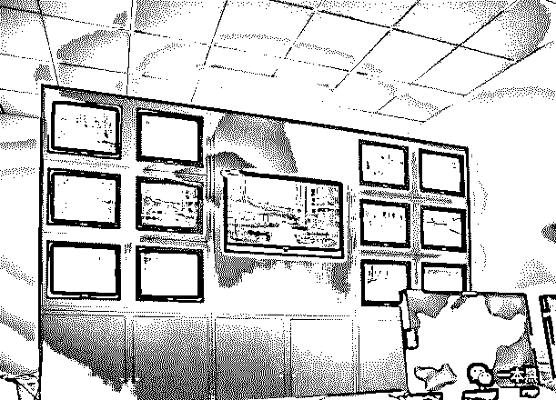
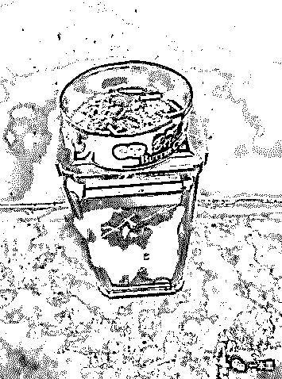
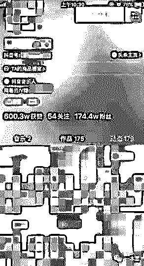
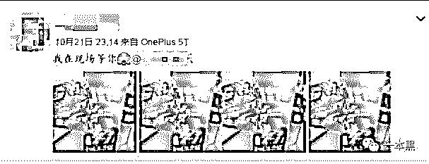
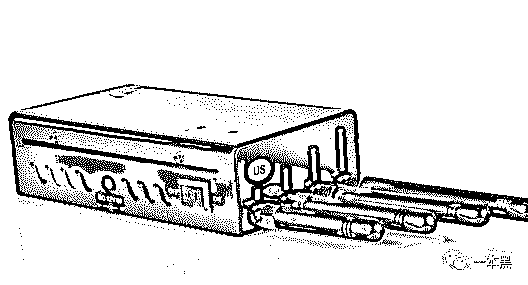
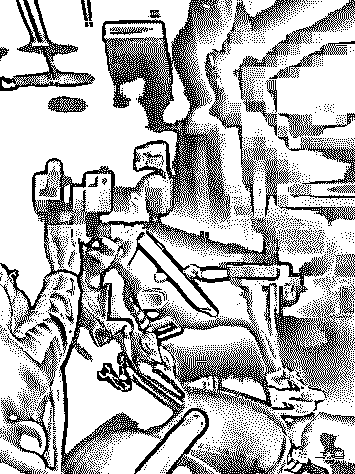
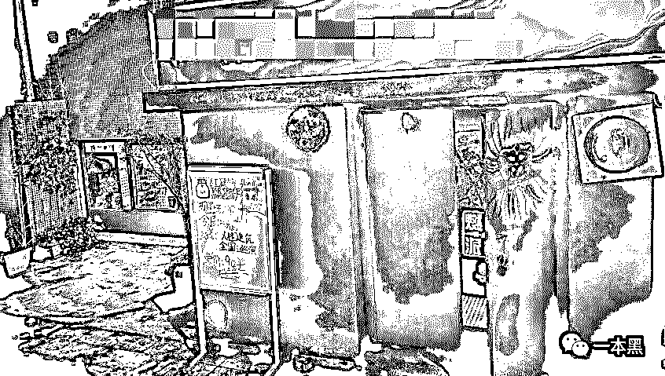
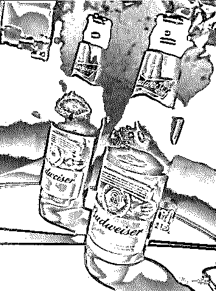
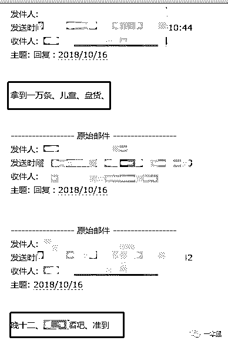
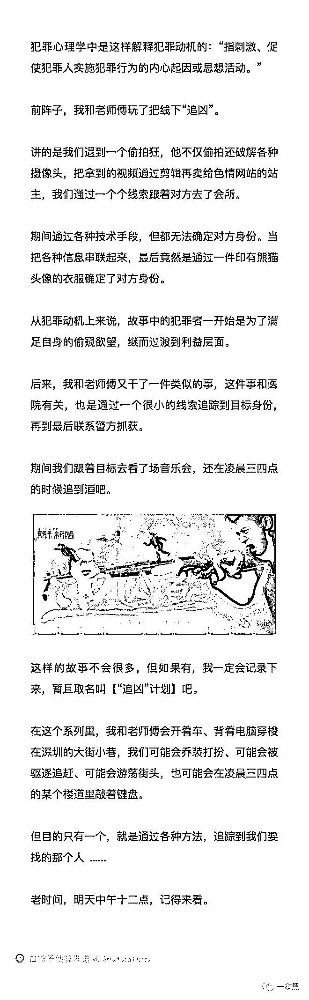

# 本以为是一桩情绪犯罪、虐童的案子，可当我凌晨三点追到酒吧，才发现事情并不简单|“追凶”计划 001

> 原文：[`mp.weixin.qq.com/s?__biz=MzU4ODAwNzUwMQ==&mid=2247484713&idx=1&sn=2ae581c19f095e6150104a5d9ca037c8&chksm=fde2140bca959d1d1b689cdcdf99a399e610b95f1b12381c335e8824c82d177f57f297cca903&scene=27#wechat_redirect`](http://mp.weixin.qq.com/s?__biz=MzU4ODAwNzUwMQ==&mid=2247484713&idx=1&sn=2ae581c19f095e6150104a5d9ca037c8&chksm=fde2140bca959d1d1b689cdcdf99a399e610b95f1b12381c335e8824c82d177f57f297cca903&scene=27#wechat_redirect)

大家好，我是东东。

前段时间我采访了一位在菲律宾从事博彩行业的朋友，听他说起自己的从业经历，以及圈子里那些好玩有趣的事儿，突然就有了一种想要去体验一番的想法。（体验当然是为了挖掘素材）

还有一位在缅甸果敢搞赌场生意的朋友，他说果敢这地方以前比较乱，现在稍微好一些，还给我说了以前发生在果敢首府老街的一些故事，有机会我整理写出来给大家看。

越是听到这种特殊环境下发生的故事我就越好奇，平时也经常和老师傅讨论果敢、金三角、菲律宾之类的地方。

光是听地名就让人浮想联翩，男人嘛，心中总有仗剑走天涯的情怀，干些冒险的事儿自然也在情理之中。

这不，在我的怂恿下，老师傅渐渐被我带下水，说咱得找个机会去感受感受，没准能遇到些好玩的事情。

前阵子，我和老师傅不是玩了把线下“追凶”吗！讲的是我们遇到一个偷拍狂，他不仅偷拍还破解各种摄像头，把拿到的视频通过剪辑再卖给色情网站的站主，我们通过一个个线索跟着对方去了会所，顺便蒸了个桑拿。

期间通过各种技术手段，但都无法确定对方身份，有趣的是，我们把查到的各种信息串联起来，最后竟然是通过一件印有熊猫头像的衣服确定了对方。（直通车——[会所、追凶、实拍、一晚消费 7200，原来你不止偷窥还喜欢穿熊猫图案的衣服](http://mp.weixin.qq.com/s?__biz=MzU4ODAwNzUwMQ==&mid=2247484665&idx=1&sn=e154c646e8d77ac90fb106adefc17fc6&chksm=fde215dbca959ccd4addac40acd7bd563c7976d479de13f4ff51abdb41b9d4861acd302624fe&scene=21#wechat_redirect)）

那篇文章发出去以后，有很多读者朋友觉得我们干的事情越来越酷了，本地的很多朋友纷纷留言说想要加入我们，还建议我们把这种经历写成一个系列。

我想说的是，这种经历大多只是偶尔发生，有好玩的事我和老师傅一定会去，没有那么刻意，所以能不能写成系列也是无法确定的事情。

但既然已经有了第一次，现在第二次也来了、那万一有第三次呢！所以，我和老师傅商量后决定给这个系列取一个名字，暂时就叫**【“追凶”计划】**吧。

**在这个系列里，我和老师傅会开着车、背着电脑穿梭在深圳的大街小巷，我们可能会乔装打扮、可能会被驱逐追赶、可能会游荡街头，也可能会在凌晨三四点的某个楼道里敲着键盘。**

**但目的只有一个，就是通过各种方法，追踪到我们要找的那个人......**

**1**

不管是童年阴影还是游戏里刻意阴森恐怖的场景，提到医院想必大多数人都会心有余悸，这次发生的故事和医院有关，不是什么恐怖的事但也并非平凡。

事情是这样，我有一个在医院工作的女性朋友，当年一起上大学，关系比较铁，挺漂亮的一人，按照父母的要求，结婚生子比较早，哪像我，现在还混不出个人样。

我这朋友叫小敏，家里孩子还在学走路的阶段，最近总遇到一些匪夷所思的事情，比如小孩总是哭闹不停，坐在儿童车里一个不注意儿童车会自己跑去撞向小区的花坛。

更让人疑惑的是他会还时不时收到一些莫名其妙的销售电话，电话里销售人员询问是否需要购买儿童相关产品，还说出了他家位于哪个小区，小孩几岁等。

事情持续了快一个月，有天小孩发烧哭闹不止，小敏又接到一位销售打来的电话，回想近期发生的事，小孩频繁出现意外，从儿童车里摔出导致脑袋擦破皮；孩子信息被销售儿童产品的人掌握......

越想越不对劲，难道得罪了什么人被盯上了？

小敏之所以给我说这事是想让我帮她出出主意，家里的老人都快急疯了。

我把这事给老师傅说之后，老师傅说：“这忙咱得帮，我也想看看这到底是个什么情况。”

就这样，我们约好周六早上去和朋友小敏碰面，简单攀谈几句后，老师傅也大概了解了情况，围着小区饶了几圈，我和老师傅盯着墙上的摄像头看了看，然后又相互对视了一眼。

你们是不是以为老师傅又要开始破解摄像头了，想什么呢！这又不是什么癖好，见到摄像头就想那啥......

我们来到小区物业，以寻找宠物的名义要求查看近一个月的监控录像，刚开始还没发现什么，一切都很正常，遛狗的遛狗，散步的散步。

      

视频看久了眼睛自然受不了，况且这还是加速播放的效果。可当监控翻到半月之前时，眼前的场景让我们打起了精神。

我们发现一名很可疑的男子，视频显示，只要小敏推着孩子出门，画面中就一定会出现一名鬼鬼祟祟的男子在附近逗留。

让我们目瞪口呆的一幕出现了，当时小敏正推着儿童车，绑在儿童车上的气球被风吹走，她下意识跟着气球的方向跑去，就在这时，视频中的男子小跑过来，手握儿童车一把推向旁边的花坛，等小敏反应过来时，小孩已经撞向花坛，索性并无大碍，只是擦破了点皮。

看到这里小敏才恍然大悟，原来小孩当时撞向花坛是有原因的。

看来这段时间小敏经历的一切都和视频中的这名男子有关系，但奇怪的是小敏并不认识视频中的男子。

难道是打击报复？老师傅当场就做出了假想。

并说：“从前面的视频中可以看出，这人出现过很多次，应该在找机会下手，可能是熟人作案。”

紧接着向小敏问道：“之前或者最近有得罪过什么人吗？”

小敏却对此表示了否认。

这时候我插了一嘴说：“既然是熟人作案，对方一定对小敏很熟悉，并且应该就住在附近不远的地方，因为从心理学上来说，每个人心中都有一个**心理安全区。**比如说自己熟悉的区域，或者是经常活动的地方。”

在这片区域里他会过得很舒适和轻松，就比如你每天走在回家的路上，就会比你走在陌生的街道上有安全感，对于罪犯来说，他也同样拥有自己的心理安全区，而作案也基本会选在自己的心理安全区内。

由此推测，视频中的男子应该很熟悉这片小区，要么他就住在该小区，要么就在附近。

老师傅点了一根烟说：“你这一套一套的在哪学的？”

        

（我们当时抽烟的地方）

我说：“平时爱看点犯罪心理学方面的书，看得多了也就大概知道一些。”

物业门口的楼道格外安静，老师傅拿起烟吸了一口：“照你这么说，百分之八十一的杀手会在杀人后重返犯罪现场，享受自己作品带来的快感。如果是这样的话，视频中这哥们是不是还会在小区里出现。”

当时我一听说了一句：“卧槽，老师傅果然是老师傅啊，不仅能渗透，还懂犯罪心理学！”

小敏站在一旁急得不行，连忙说：“那现在该怎么办，要不要报警。”

我和老师傅的意见是先不急着报警，再观察观察，没准过几天视频中这哥们又出现了呢！

我们打算让小敏下午带着孩子在小区遛弯，还是像之前一样，小敏假装大意离开小孩的儿童车一段距离，我和老师傅坐在不远的位置观察。

商量好后我们从物业门口往外走，准备先到小区门口吃点东西，下午看情况再说。

**2**

南方的天气总是一成不变，都快十一月份了深圳这天气还是热得不行，即便已经下午五六点，也还是不能在太阳底下多呆一会。

我和老师傅找了个凉快的地方坐下，一边抽烟一边聊着些有的没的，朋友小敏则带着小孩在一旁溜达。

大概过了半小时，老师傅突然说：“咱这么等下去不是个办法啊，万一这哥们一直不来怎么办。”

的确，这个办法确实是有点“守株待兔”了，我们必须找到新的线索，不然这样等下去很能找到突破口，我们也会变得很被动。

我们现在已知的线索只有监控录像，虽然能大致看清对方的身高和穿着，说排查的话也能排查，只要把视频中男子的样貌抠出来，最大化的做到画面清晰，然后拿着照片去小区里挨个询问。

但是这样一来范围就没法预测了，而且效率会很低下，所以总的来说这种方法的难度是比较大的。

我和老师傅商量着先打道回府，回去想想对策，第二天再说。

转过天，我一觉就睡到了自然醒，正准备起床突然接到朋友小敏的电话，电话里她说她找到了视频中的男子。

本来还想着再躺一会的，接到这个电话后我顿时变得特别清醒，一方面在好奇她到底是如何找到的，另一方面更想知道这人到底是谁。

我赶紧给老师傅打了个电话说明情况，并约好半小时后碰面。

碰面的地方是在小敏家小区门口，原来，小敏昨天听我们说可以把视频中男子的样貌以最大化的清晰度抠下来，然后拿着去小区各楼栋询问。

没想到我们当时随口一说的方法，小敏居然照做了，好在她运气不错，在询问了各楼栋的门卫、保安、小卖部老板后，终于在快递员小哥口中得到了答案。

据快递员小哥回忆，此人经常收发快递，基本都是小件物品，之所以会印象深刻，是因为这哥们有次寄快递把东西掉在快递收货点了，加上一来二去的收发快递，印象自然也就比较深刻。

给快递小哥说明情况后，我们拿到了视频中这哥们的手机号码和具体的寄件地址，从寄件地址可以看出，这地址应该就是他的家庭住址。当时就在吐槽，现在的人收发快递把自己的地址写得这么详细其实挺危险的。

到这里我们基本已经确定了对方的身份，只要对比视频，移交公安局，这哥们故意伤害的罪名算是坐实了。

但老师傅却说：“先不急，再等等。”

“计算机基础”是老师傅的拿手好戏，只要有一个手机号码，那能干的事情可就太多了。

老师傅先是验证了这个手机号码是否是对方的实名手机号，紧接着又查出一些绑定了该手机号码的账号，比如对方的抖音账号、微博账号等。

通过抖音账号的点赞记录，我们发现这哥们基本都是给同一个人点赞，这人还是个唱歌的小网红，在抖音算有一点名气。

        

另外，在对方微博的最新一条动态里，我们发现一张他晒的演出门票，门票正是抖音里他经常点赞的那个小网红。

地址显示就在深圳南山某地，时间是两天后。

        

后来我们去查了一下这个网红，最开始是在抖音上火起来，没过多久在线下开了一场音乐会，基本都是翻唱别人的歌。

上次“追凶”追到会所，那咱这次就追到音乐会呗，二话没说，我就买了两张门票，一来看看这网红线下变现的效果如何，二来也会会视频中这神秘的哥们......

**3**

两天后，我和老师傅再次碰面。

一双回力鞋、一个背包、背包里装有电脑和信号屏蔽器之类的东西，这就是老师傅的装备。

我们把车开到演出附近的地下停车场，离演出还有半小时，我和老师傅坐在车内抽烟，一边抽一遍我一边问老师傅：“一会有什么计划吗？”

老师傅笑了笑说：“没有计划，看看再说。”

“那我们是凭视频中的样貌找到这哥们吗？”我疑惑的补了一句。

老师傅说：“我们不是有这哥们的手机号吗！一会我在现场给他拨个网络电话，你仔细观察一下有谁在接电话就行了。”

实在不行，我中途打开信号屏蔽器，他电话接到一半以为没信号肯定会走出去接，这不就能找到了吗？

              （老师傅的信号屏蔽器）

老师傅果然心思缜密、在技术这方面，真的是人狠话不多。

一看时间差不多到点了，老师傅合上电脑，掐灭烟头，在关上门的一刹那，声音沉稳却果断，仿佛响透了整个地下停车场。

到场后我粗略算了一下，全场两百人不到，我和老师傅找了个第一排的位置坐下，按理说八点演出正式开始，可是一直等到八点半演出人员才陆续登场。

不得不说，现在这些网红虽然靠翻唱火起来，除了版权意识不到位之外，演出还没什么时间观念。

现在是按计划行事的最好时机，老师傅按照号码给对方拨了过去，我假装起身往后面走，想观察观察有没有人接电话。

不出所料，在第三排中间的位置，我看到了这哥们，对比视频中的样貌和穿着，我很快确定了此人就是监控视频中那位下狠手的人。

回到座位后我问老师傅，接下来该怎么办。

老师傅小声地说：“既然都来了，先听听歌吧！”

可能到场的各位听众都是第一次看网红线下演出，再对比视频中的演唱表现，那种神秘感骤然消失，多少会有些反差。

应该是为了活跃气氛，工作人员给到场的每个人发放了荧光棒之类的东西。

        

（老师傅在现场）

实在是觉得没啥意思，到中场休息的时候，我和老师傅就准备撤了。

这一撤可不是真的就走了，而是等候在门口，等散场的时候看这哥们最后会去哪。等待之余，我和老师傅靠在过道尽头的吸烟处抽烟，老师傅边抽烟边扒拉着手机，我凑过去一看竟看到老师傅在看车，而且还是看的特斯拉，难道老师傅最近是接了什么大活吗？都看起特斯拉来了。

膨胀了，膨胀了。

一个小时后演出结束，我和老师傅灭掉手里的烟假装在聊天，并不时的注意这哥们的走向，最后这哥们上了辆出租车，我紧随其后，老师傅则赶往地下停车场去开车，期间我一直给老师傅发线路，以保证他能及时赶上。

最后对方的车停在一家小酒吧门口，我在车上亲眼看见他走了进去，这时候我掏出手机给老师傅打电话说明情况，老师傅让我下车在路边等他，他随后就到。

等待期间我去马路对面的小卖部买了包烟，转头时正好看见老师傅的车，找好位置停车后我和老师傅就走进了这家小酒吧。

              

在我的印象里，深圳的夜晚总是很漫长，没有爱的人基本都睡不着。这群人在深夜十二点陶醉在酒杯的碰撞之下，借助灯光和酒精，肆意放纵。

我和老师傅叫了两瓶百威，找了个离这哥们比较近的地方坐下。

        

有喝醉的，也有聊得正嗨的，但我们的注意力只集中在一个人身上，就是那位我们一路追过来的哥们。

隔壁桌的低声交谈显然没有这哥们的嗓门有气势，即便是在觥筹交错的小酒吧也能清楚地听到他的声音，不过也断断续续，时大时小。

说实在话，偷听这活真的挺累，你不仅要听对方在酒桌上各种吹牛装逼，还要尽可能的筛选有价值的信息，逻辑思维你得清晰，要不一个不注意就会走神。

期间，我们隐约听到这哥们在和别人谈一些例如一条多少钱、某某医院、电话推销之类的关键词，我们初步怀疑这哥们应该和医院有关，但具体是什么现在还不得而知。

就在这时，我们看到这哥们从上衣口袋里掏出一个小 U 盘，放在桌上推向对面的人，然后举起手比了个数字 5 的手型。

当时我就问老师傅这是啥意思，老师傅回答：“估计这是在交易，5 应该是 5 万的意思。”

结束后这哥们醉醺醺的从酒吧离开，我们也就没再继续跟，都喝成这样了估计他也只能打车回家了。

我和老师傅结了账走出酒吧门口，一看时间已经凌晨三点，看着空荡荡的大街，突然有些饿，心想反正都喝了点酒，这车是不能再开了，不然酒驾被抓那可就得不偿失了。

“要不找个地方吃点东西？”

我和老师傅不谋而合，在酒吧附近找了个夜市摊，别看都已经凌晨三点了，可这夜市摊还热闹得很，足以看出孤独的灵魂是多么需要群体的慰藉。

我和老师傅边吃边聊，把这一路追踪下来的线索汇了个总，已知这哥们的手机号，以及各种社交账号，喜欢一小有名气的网红，虽然这些信息看起来无足轻重，但却引导我们追到了酒吧，更重要的是在酒吧的所见所闻。

我们猜这哥们应该和医院存在某种联系，同时又出现了一个疑问，这哥们一开始为什么要对朋友小敏的孩子下手呢。

**4**

凌晨三四点的深圳足以让你窥探这座城市的面貌，它仿佛给了这座城市些许短暂的安宁，似乎在告诉人们，慢下来，做什么都得慢下来。

可现实却又背道而驰。

我和老师傅离开后，已然是酩酊大醉，这样的情况不多，我们只好叫了个代驾，之后的事就全然不记得了，只知道醒来已经是第二天下午两点。

醒来后我问老师傅，根据咱们现在掌握的线索，还能挖出别的东西吗？

老师傅说：“只能再试试了。”

可能是昨晚的酒劲还没退，老师傅把收集到的信息发给了几位朋友，这几位朋友可是老师傅的至交，“计算机基础知识”一个比一个牛逼。（有机会我慢慢给大家介绍老师傅的朋友们）

老师傅把需求发过去后，没过多久就收到了反馈，其中一个朋友查到了这哥们曾经工作的地方，是在深圳某医院，职位是该医院的一名男护士，不过在上个月已经离职。

我当时一听这哥们也在医院工作，心想该不会和小敏在同一个医院吧，所以马上就给小敏打去电话。

与此同时，老师傅黑掉了对方的邮箱，在邮箱里发现了一些莫名其妙的内容。

为什么说奇怪呢，因为邮箱的内容基本都是自问自答，也就说里面只有为数不多的几封邮件，而每封邮件没有与任何邮箱往来，只是自己发给自己。

看到这里我和老师傅都懵圈了，这到底是什么意思。

想了半天老师傅猛地拍桌子说：“我知道了，这哥们不是自问自答，而是通过仅有的一个邮箱和某人进行沟通，打个比方说，我要和你沟通一些隐蔽的信息，我先登录邮箱发出一条信息，然后另一个人再登陆回复，以此反复。”

        

据老师傅所说，这种常人想不到的沟通方法以前见到过，发生在某股票大神身上，当时股票大神搞婚外情，就是用的这种一个邮箱账号沟通的方式进行暧昧信息传递。

文艺有逼格，果真常人想不到。

通过仔细观察邮箱内“自问自答”的聊天记录，再对比昨天在酒吧看到的场景，我们更加肯定这哥们和医院的关系了，之前给小敏打过去的电话也证实了这哥们曾经工作的地方正是小敏现在工作的医院。

现在看来，每条线索都在慢慢地汇集到一起，为了尽早搞清楚事情的原委，我和老师傅找到了刑侦朋友小刘，小刘在上一集“追凶”中出现过，原名刘超，是一名经验丰富的刑警。

把现阶段拿到的线索同步给刑警刘超后，他们准备以故意伤害罪上门逮捕，与此同时老师傅也配合他们进行了对方位置的确认，以确保抓捕行动万无一失。

行动过程我和老师傅当然是不能参与的，不过后来刑侦刘超告诉我，这不单单是一起故意伤害罪，还涉及到了非法获取、贩卖公民个人信息的罪名。

在对方住所，他们在对方电脑里找到了大量的医院数据和七八个用于交易的 U 盘。

被抓捕的人名叫张先超，男，26 岁，曾是深圳某医院的一名男护士。

据对方交代，在职期间，有一次亲自目睹了一位无法支付医院住院费用的妻儿被赶出医院，因为医院的床位本身就很有限，所以只能留给能支付得起住院费用的人。

当时这对妻儿被赶出医院后，留下的床位马上就腾出来给了新的儿童患者，而这位儿童患者的母亲正是在医院工作的朋友小敏。

当时看到这一幕的他觉得这世界很不公平，被赶走的妻儿低声下气、跪地乞求却得不到医院的同情，而最终被一个医院的工作人员占了床位。

他气氛、想要帮助这对妻儿进行报复，所以想尽了各种方法查我的朋友小敏，最后通过联合医院信息管理处的人进入了医院信息平台窃取了全院住院儿童的信息，从而拿到了小敏的各种信息。

所以也就出现了最开始我们在物业查到的监控视频中的画面。

另外，小敏之所以会接到各种推销儿童产品的电话是因为那次报复后，罪犯张先超意识到自己在医院非法拿到的信息可以贩卖，所以找到渠道把医院患者的信息都卖给了相关产品的商家。

他之所以只通过一个邮箱和别人进行沟通，是因为这是别人的要求，以为会安全一点（不知道在哪学的怪招），并且沟通不说废话，专挑关键词说。

每次交易基本都是线下，数据拷贝在 U 盘里，当场直转账。如果实在不方便线下见面交易，他会通过快递邮寄的方式把 U 盘寄出，所以这正是最开始我们在快递收货员口中得知的此人经常寄一些小件物品。

他在医院拿到的数据一般以 0.3 元每条的价格卖给一些销售儿童产品的机构，要么就是打包卖给一些月子中心。

这些月子中心可能还会存在中介，再以 5 元每条的高价转卖给其他儿童摄影或者相关的儿童店铺。

到此，整个“追凶”过程基本结束，我们靠着仅有的线索一步步追踪，原本以为这只是个有虐童倾向的罪犯，可没想到他竟然还和信息贩卖有关。

一个由同情产生的报复心理，演变为从中牟利，这期间的人格变化我们无法深究。

索性他的报复心理没有肆意蔓延，而是被利益捆绑制止。

结束后的那天晚上，我约老师傅去了我们常去的一家店，准备再喝两瓶，期间问及这次“追凶”有什么感想时。

老师傅说**：“没什么感想，就是有点费烟。”**

**本故事纯属虚构，如有雷同**

**你们懂的......**

还原事实｜专扒黑产

微信 ID：darkinsider

知乎 一本黑

头条 一本黑

投稿、爆料、招聘、转载

请联系微信:yibenheiTG

# 

> 原文：[`mp.weixin.qq.com/s?__biz=MzU4ODAwNzUwMQ==&mid=2247484708&idx=1&sn=909ad7fc55bfd0ac2fe64a324b2833bc&chksm=fde21406ca959d109defd75e4daac81d04a4b4151f14e2f9306a0c4597f91756903682c1ed1e&scene=27#wechat_redirect`](http://mp.weixin.qq.com/s?__biz=MzU4ODAwNzUwMQ==&mid=2247484708&idx=1&sn=909ad7fc55bfd0ac2fe64a324b2833bc&chksm=fde21406ca959d109defd75e4daac81d04a4b4151f14e2f9306a0c4597f91756903682c1ed1e&scene=27#wechat_redirect)

