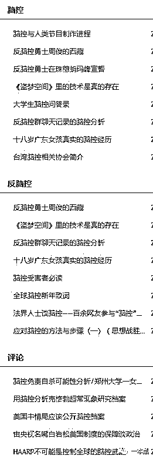

# “黑科技”远程控制人脑？意识入侵、精神受控？不，你需要控制你自己

> 原文：[`mp.weixin.qq.com/s?__biz=MzU4ODAwNzUwMQ==&mid=2247484701&idx=1&sn=7e531f6d31382b6470120cac561da18c&chksm=fde2143fca959d298595dc9600d41455eaa84941763c9a61fce1080fe6612ffbae27fd26cd53&scene=27#wechat_redirect`](http://mp.weixin.qq.com/s?__biz=MzU4ODAwNzUwMQ==&mid=2247484701&idx=1&sn=7e531f6d31382b6470120cac561da18c&chksm=fde2143fca959d298595dc9600d41455eaa84941763c9a61fce1080fe6612ffbae27fd26cd53&scene=27#wechat_redirect)

前几天，逛微博的时候无意发现这么一条消息。“有人救救我吗，我是一名北大的学生，我被控制了。有人在我脑袋里不停的说话，我一直按照他说的在做，他现在要我去死，我该怎么办，我好害怕。”

短短一段话，没人评论，但是却有十几个人转发。而这些转发人士中，全以**「脑控受害者」**自居，控诉着脑控的危害。

何谓脑控？脑控是指自己大脑不受自我控制，受到一定的刺激和伤害，从而认定自己被操控。

从 12 年开始，网上陆续开始出现「脑控受害者」。打开百度搜索「脑控」，便能看到无数脑控受害者铺天盖地的哭嚎。除了这些，还有不少的科学媒体报道和分析「脑控」的真伪。有意思的是，在这样的科学佐证下，总是会出现大量的脑控受害者站出来反驳，无一例外。

隔着数千公里监控一个人的思想？利用“黑科技”控制人类大脑？

人类对大脑的研究恐怕还没有达到那一步。

**神奇的脑控论**

很早之前，天涯上出现一位叫做“神仙姐姐”的，声称自己在英国被植入脑控芯片，经常出现幻听，时不时还有声波干扰她的大脑，一旦被声波控制，她就没有办法在做任何事。长期以往，她的精神与肉体备受折磨，神志几近失常。她认为，自己已被脑控份子给控制。

她的一番言辞，像是让所有的脑控受害者找到了组织，他们纷纷在底下留言，声称自己也是脑控受害者。

其中，有一位脑控受害者表示，“每当在夜深人静的时候，她的大脑总是会发出各种奇怪的声响，让她失去安宁，内心巨大的恐惧使她神经崩溃。在神仙姐姐这篇文章前，她并不知道什么是脑控。”

她称自己之所以敢将事实曝光在人们的眼球，是因为她找到与她有着相同经历的朋友。所以，她才有勇气站出来揭露不为大众所知的“远程定位脑控”。

脑控患者认为，“执掌脑控技术的人，能随意的控制和支配他们，他们的行为不受自我约束，而是像一群蝼蚁，被人操控。”

受不了操控的人，往往会选择自杀来脱离痛苦。

在越来越多人了解「脑控」后，他们便开始进行交流。早期他们在脑控吧里进行探讨，后面因为网络改革被关停后，他们便开始在 QQ 群和一些关键词相似的吧里进行讨论。

                            

除此之外，他们还成立了「全球脑控论坛」。在这个论坛，已经有 7 万多名成员，发布了 6000 多条帖子。无一例外，他们都在反复的诉说着对被脑控的痛苦和对脑控者的仇恨。

                           

在脑控受害者的控诉中，我发现一个很有趣的事，他们都有一个相似的特征——受害者脑海里出现过的声音，只有他们自己能听见。

在一位脑控受害者的自白中，有这么一段话。“我能听见那头控制我的人说话，是一个男人，他总会做一些让我很难受的事。比如说，用一把非常钝的刀割我，我能感受得到他从大腿外侧延伸至内侧，一刀又一刀往里切。有一次，我实在受不了，我就质问他，你还要迫害我到什么时候。我就听见那边传过来，那种很小的但又很清晰的一句：哎呀，她知道了。”

“我无法知道下一刻他还要干些什么。”

像是电锯杀人情节一般，尽管事情没有真实发生，但脑控受害者称自己却遭受到真实的痛苦。

如果有人质疑脑控的真实性，就会有脑控成员站出来反驳。

                            

一位脑控患者说，没有经历过被脑控，就没有资格说这个世上不存在脑控。他们不理解网上攻击脑控受害者是精神病患者的文章。他们称，自己没有必要将人生到处设满障碍。他们成立“脑控受害者联盟”，组织受害者录视频宣传脑控的危害，也只是为了让大众知道真相。

                            

不明真相的人将他们称为精神分裂症，而他们认为自己是证明脑控存在的最有力证据。2016 年至 2017 年，“脑控受害者联盟”在全国 22 个省进行了“反脑控集体报案”，为的就是让更多脑控受害者加入。

                             

有趣的是，一位脑控患者表示，她在被脑控的这十年，考取了人力资源管理师职业资格证书，还拿到了全国计算机等级考试的高级证书。而这些，并非她个人所意愿，她坚称，这是脑控份子操控她的行为。（说真的，我也挺想....）

**脑控=精神分裂症=阴谋论**

三人成虎，众口铄金。

对于网上“成群结队”的脑控患者，心理学博士李松蔚认为，网络与脑控群体的形成分不开关系。最大的原因，可能是因为现实中缺少关爱或受人歧视。

举个例子，小 A 是个会计，有一天在办公室的时候他听见领导说他做假账，他担心自己被抓进监狱，立马就找领导解释。领导很疑惑，表示自己并没有说过这番话。在某一次对话中，小 A 冲撞了领导，被送进了医院，确诊为精神分裂症。

在医院治疗中，小 A 仍然能听见领导说他做假账，他明白自己没有做假账，所以他认定是有人故意陷害他。他把这些告诉身边的人，当大家都不信的时候，他就会跑到网上寻找帮助。

将“脑海”、声音”、“指令”这些关键词放进引擎搜索，出现了脑控。这无疑是让小 A 找到了组织，他也就认为有过这样经历的人不止他一个。根据网友的帮助，他就确定了自己是被人用声波控制大脑，向他发送干扰信号。就这样，他加入了脑控受害者联盟。

根据脑控受害者的案例来说，他们一般都会出现幻听的现象，再认知脑控后，便就认为这一切都是脑控组织干的坏事，脑控组织对他们进行声波控制，随意支配他们，折磨他们，甚至伤害他们，增加他们与其他人的矛盾。

站在科学的角度上，脑控这一说法，显然是不成立的。不少的证据指出，脑控受害者就是患有精神分裂症。

拥有精神分裂症的人处于躁狂发作时，就会出现谵妄性狂躁，这时，他们就会出现幻听，从而他们就会产生被脑控的错觉。

除此之外，吸毒也有成为脑控患者的可能性。毒品含有大量的麻醉神经药物，吸食后自然而然产生幻觉。事实上，脑控受害者中就存在吸食毒品者。

像脑控受害者所说，脑控组织利用仪器将他们控制，偷取他们脑中想法，并时刻折磨他们。在医学上，这是精神病学中的一种“思维鸣响”症状。

患有思维鸣响的患者会有一种，想到什么就立马听见自己的想法被说出来的体验。实际上，患者听见的只是当时自己所想的事。就好比，患者想到吃饭，耳边就听见 “ 吃饭，吃饭”的声音。

像脑控受害者所说的遭监视、窃听、跟踪，身边的人会对他们有敌意……这些行为，其实属于精神分裂症中的被害妄想。

被害妄想是精神疾病的一个重要症状。它往往是指患者处于恐惧状态而胡乱推理和判断，思维发生障碍，坚信自己受到迫害或伤害，病人往往会变得极度谨慎和处处防备，还时常将相关的人纳入自己妄想的世界中。

有意思的是，你告知脑控受害者，以现在的技术水品无法达到脑控技术，他们就会摆出一副阴谋论架势，“高端科技怎么可能让普通人轻易接触到。”

面对这些解释，脑控受害者只会认为这是一群被收买不敢说出真相的人。

意识是对现实的能动反应。就算脑控受害者怎么控诉“黑科技”操控他们大脑，他们还是不能凭空捏造一些莫须有的东西。

**脑控带来的“变现”**

我认为这世上有一条真理永远是对的，因为某件事或相近价值观聚集在一起的人，一定会分支出一群“乌合之众”，而“乌合之众”，往往会成为被利益收割的那部分群体。

谁也未曾想过，这么严肃的一件事，它真还给一些“防脑控专家”创造出利益。

有市场就有需求这句话果然不假。随着脑控受害者不断的增加，各种脑控检测仪、脑控防护头盔、脑控信号屏蔽器也随之衍生。

                     （屏蔽器价格 4000 到 1 万不等）  

“防脑控专家”混入各大脑控贴吧、qq 群。目的就是为了向脑控受害者们推广，打着防脑控的伪科技产品。

这些三无产品，随意 P 张图，就打着经公安部严格检测的招牌，到处招摇撞骗。

                           

而那些所谓的用户反馈，也不过是防脑控专家使用的一些小伎俩。

                            

他们甚至可能对脑控患者嗤之以鼻，但这丝毫不影响他们从受害者身上榨取剩余的价值。

尽管评价中，有许多用户表示没什么用，但这丝毫不影响其他人的购买。

                            

“脑控”其实没那么可怕，它可能都不存在，真正可怕的是隐匿在其中的"正常人"。他们装作已经成功摆脱脑控，他们表达着对受害者的同情理解，他们嘘寒问暖，传达着自己的知识和经验，背后的目的却令人不寒而栗。

不论是医学证实为精神病也好，还是脑控受害者坚信它真实存在。我只能说，科技的发展，往往从不切实际的想法产生。

大多数人在遇见不明确的问题下，就会持有“宁可信其有，不可信其无”的观念。事实上，这句话存在着漏洞，它属于混淆可能性和概率的问题。

打个简单的比方，买一张彩票，有人告诉你，就是中奖和不中奖两个结果，所以你有 50%机会中奖。可事实是，这个概率微乎及微。

如果真的存在脑控这一说法，也就是说无线电波可以直接对准人体的任何部位进行信息传递并控制大脑。

现阶段来说，我想只能是天线宝宝了。

             

资料参考：

1.《在精神科，我们找到了脑控的真相 | 深度》

2.《解密“脑控信徒”》

3.《一位脑控受害者的自白》

还原事实｜专扒黑产

微信 ID：darkinsider

知乎 一本黑

头条 一本黑

投稿、爆料、招聘、转载

请联系微信:yibenheiTG