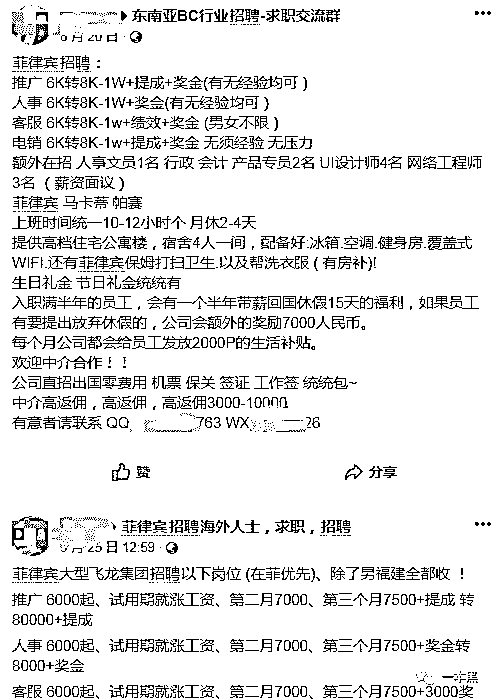
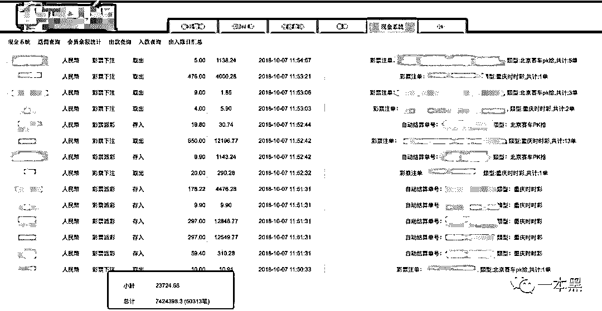
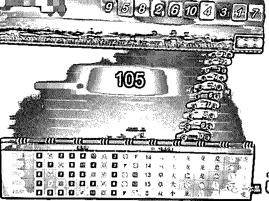
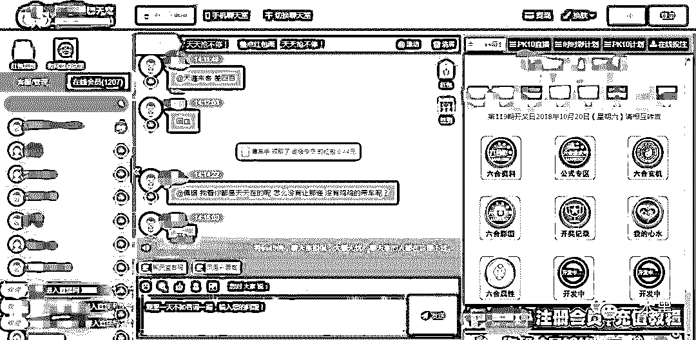

# 还原里争外斗的博彩江湖：从情感色诱到系统暗中操盘

> 原文：[`mp.weixin.qq.com/s?__biz=MzU4ODAwNzUwMQ==&mid=2247484682&idx=1&sn=d6c4dc0a8bd210b190dbcaaa29a08b1e&chksm=fde21428ca959d3e74dbf6a21c1e586220cce1297f6f7a997c41b99e9bc3cbf5b232f8090e03&scene=27#wechat_redirect`](http://mp.weixin.qq.com/s?__biz=MzU4ODAwNzUwMQ==&mid=2247484682&idx=1&sn=d6c4dc0a8bd210b190dbcaaa29a08b1e&chksm=fde21428ca959d3e74dbf6a21c1e586220cce1297f6f7a997c41b99e9bc3cbf5b232f8090e03&scene=27#wechat_redirect)

网络博彩是个老生常谈的话题，这条产业链也是国内黑色产业中最疯狂的盛宴之一。

提起赌，大多数人可能想到的是赌城澳门。

的确，澳门拥有赌城的称号，也是博彩行业的发源地，但真正让博彩行业闻名于世的是菲律宾。

一个支撑中国大半个博彩行业的地方，在这里，每天都有大量的中国人起早贪黑，他们在异国他乡冒着生命危险赚钱，这一些或许你早就有所耳闻。

在赌博的世界里，生死富贵，一夜颠翻。

每个人都觉得自己会成为赢家，但最后却统统变成了一败涂地的输家。

1

若不是至亲得了重病急需要大量的资金，小清（化名）也不会留在菲律宾。两年前，他还是拿着三千块一个月的服务生。 

如今，他已成为一名优秀的菠菜（博彩的谐音，行业用语）推广员，一个月收入好几万。

小清说，干他们这一行，骗来的，很多都是刚毕业的大学生。有些介绍工作的只是说做前端开发，到了才知道是做博彩的 App 和网站。

也是，无学历经验要求，7000 块加高提成，出国工作，包机票、签证。对于那些刚毕业不知所措的大学生而言，这是个非常大的诱惑，可他们不知，高薪的背后是利益的捆绑和道德的丧失。

             

**一方面背负阴阳合同，一方面坑蒙拐骗。**

小清告诉我，福建上飞机到菲律宾的，100 个有 99 个都是去搞菠菜的。

在没有进入这个行业前，小清都不怎么使用微信，但现在，微信已成为他日常工作的必备。

是的，小清上班的地方就是国内大部分朋友称为“外围”的公司。外围在广东话里指的是由个人或组织发行的非法彩票。林峯在港剧《使徒行者》中扮演的爆 seed 哥，就是马会外围的头目。

在菲律宾，这样的菠菜公司不计其数。有运营在线博彩牌照的公司，很多被抓的都是没有牌照的。

小清每天的工作就是在各大聊天平台扮演“美女”，撒娇、卖萌、讲段子，引诱对方来玩博彩，说白了就是拉客户下注。

而这些“美女”头像和照片都是从淘宝和微商上购买的。

如果遇到有人提出想和“美女”语音，小清就会找办公室里为数不多的女生“帮忙”，应付过去。

遇到有人要求视频，他会找尽各种理由拒绝。在上班的过程中，他的电脑和手机摄像头都会用贴纸封住，以免误接对方视频暴露身份。

推广员每个月都有保底任务，他们需要开发 15 个有效会员，一般注册就可以成为会员，有效会员还必须得充值 500 块。如果没有达到目标，就没有提成。想要挣钱不能靠保底任务，还是得要拉到大客户。

小清说，他们公司之前有个女的从柬埔寨过来，干了一个月，纯盈利 300 万，老板给了她 15%的提成。但那个女的嫌少，四个月之后就走了，还是老板亲自送机。

干得好拿的多，干不好的自然压力就很大。作为推广岗位，公司规定的上班时间是中午十二点到晚上十点，月休两天。但唯有客服岗位不同，是两班倒，因为半夜里缠着客服想要充值的客户，数量也非常可观。

在高强度的工作下，人员流失比较大。所以博彩公司跟中介有所合作，他们不管对方是神是鬼，只要有人肯来就行。

当然，天下没有免费的午餐。如果说，员工在公司没有干满半年就走的，必须赔付一定的金钱才能离开，这便是所谓的阴阳合同。

在这个赔付过程中，有些公司特别坑，一般情况下是赔五六千，但他们直接上万起，不够就继续干或者联系家人要钱，给了钱才能走。

毕竟，护照都在他们的手里，没有护照，你哪里也去不了。

所以，那些交不起离职费和罚款的员工，**只能以工抵债，继续设局骗人。**

2

在菲律宾博彩公司聚集的区域，每栋大楼里都活跃着很多家博彩公司，每个办公室都是一个盘口，大小盘口加起来能有上千个之多，而说到盘口的开盘结果，充满着浓厚的不确定因素。

              

像“北京赛车 PK 拾”（简称 PK10）这种，所有盘口都是同一个开奖结果；而系统彩，都是由菠菜公司来操控的，但所谓的操控，并不意味着直接就指定开哪个，而是遵循“杀大赔小”的原理：你下注大 10 块，我下注小 1 块，就开小。

**聪明的公司，都会选择放长线钓大鱼，博彩这个东西，玩久了肯定会输。**

但是赌徒们不懂，他们总是抱着「赌一赌，摩托变路虎，搏一搏，单车变摩托」的心态，但凡进了赌局，庄家就不可能允许你从他手中赚钱。

遗憾的是，常年泡在菠菜上的小中产，没有一个不明白这道理，但就算他们知道这是坑，也很难跳出来。

事实上，网络博彩这条产业链尤为特殊，它所衍生出来的灰黑产也非常多，涉及的人物角色也很多，比如说，收账户和洗钱。

很多博彩公司会想法儿去收一些 U 盾，银行卡，支付宝等资金账户，用来收纳赌徒们的充值，而相类似的，公司的法人代表，也都是通过一些渠道购买来的他人信息。

而洗钱，方式千千万。很多在菲开公司的老板，都会在国内开厂，例如修理厂之类的。或者买卖域名，几十万一个纯数字的垃圾域名等等。

3

每一家博彩行业所获得的利润多到令人无法想象，他们每个月盈利大约在三十到四十万左右，单单小清一个人的线，一个月纯盈利都有七八万，但他们只是公司的一个小盘口，像这样的小盘口还有好几条线，大的有几十条。 

在这么大的一块蛋糕下，有些员工难免会产生一些小心思。赌徒可以为了赢钱输的家破人亡，他们也可以为了钱坐个牢。

据小清表示，有些员工会联系外面那些刷水的，拿提成。

打个比方，一个游戏的大和小，都是 1:1 的赔率，他们两边都买，一次各买 50，就是百分百不亏。

像 pk10 这种，在 10 辆编号的赛车中，以先后到达终点的顺序为开奖结果。如果下注者投注号码与对应位置的赛车编号相同，即为中奖。

10 个号码 9.9 的赔率，系统限制下注 7 个，他们就在两个平台玩 9 码，这个平台买 4 个，那个平台买 5 个。

             

会玩的话，中奖率百分百，这样刷一天下来也不是小数目。

之前有一个客服给自己朋友上分，赢了后面补上，刚开始赚了 50 多万，后面倒输 80 多万，最后钱没补上，被公司打的半死，以非法境外赌博将他们送回国坐牢。

除此之外，还有一些赚外快的方式，比如卖公司资源、“卖人”等。

卖资源顾名思义，将自己手中的客户资料偷卖给其他公司。

卖人和我们熟悉的内推有点不同，他们介绍人到公司是会获得佣金的，哪个公司佣金高就“卖”给谁，去了之后就不管死活了。

小清告诉我，他们老板在国内有一定的人脉关系，否则怎么可能以非法境外赌博送他们回国坐牢。

这么说来，倒是能解释这一切。一个黑白蓝三道都通吃的人，想想都可怕。

小清吐露，他们的老板是一个挺有想法的人，戒赌吧被封后，老板就有了新的念头。

以往传统的拉客户，一对一服务，效率太低。等客户达到一定数量，就会“供不应求”。

所以，在官网上弄了一大型聊天室，把客户聚拢到一起，互动交流。但他们不知，和他们共处一室的还有一半以上的机器人。

             

要是平时群里没什么动静，小清与其它的管理员便会发发红包诈下尸。但事实上，发的红包再多，不充钱也玩不了。

这样“圈地养鱼”，不仅方便服务，还给赌徒们注射了一针强心剂，“这么多人，稳了！”

4

从古至今，败在赌博下的人不胜其数。 

赌博的这个过程，就是让你有一夜暴富的期待，它们设计这个游戏的细节，诱导你为美梦持续砸钱。每个人都觉得自己会成为赢家，最后统统变成一败涂地的输家。

小清坦露，从事这个行业，他遇见过形形色色的人，而自己的心态，也一直在变化。

有的客户，开始 10 块一注，慢慢的 50，100，500，2000，到后来就开始贷款，步步深陷难以自拔。一次次反省说再也不玩了，但第二天依旧还是来找客服充值，不给充都不行。

还有一些客户，平时太忙，没时间玩，但还是会要求先进行账户充值。

后来，小清发现，因为赌博而倾家荡产的人，实在是太多了。

有些客户，在输光了所有钱后，会声泪俱下的苦苦哀求平台退钱；还有一些客户，会找各种理由，比如家人重病急需资金等，希望公司能够把钱退回来。

还有一些人会走极端，比如拍摄一段自己拿刀架在脖子上的视频，希望以此来要挟，从而达到退钱的目的。

殊不知，赌博行业，软硬不吃。

入职之初，小清遇到一些随便玩玩的客户，就会主动引导他们玩的更大，觉得反正都是赌，但时间一长，看着越来越多的人深陷其中，心中难免不忍，有时候也会偷着劝说他们收手，不要再玩了，但几乎没人听。

真心还是假意，在这种尴尬的定位下，已经无法辨别了。

就好比，下着大雨，有个赌徒站在大雨中，你想给他撑伞，他告诉你反正已经全身湿透，撑不撑伞都无所谓。

赌博跟吸毒差不了太多，一旦染上，就很难摆脱。

网上曾有个叫戒赌吧的贴吧，里面戒不掉赌瘾的赌徒有将近千万。从穷学生到身价过亿的企业大老板，谁也没想过自己会有今天。

就算戒赌吧被封，他们也能在「读图」吧相聚。

国庆同学聚会，听一哥们说红薯为了赌博，去找了借贷平台，结果输个精光，最后没办法父母把攒了一辈子的二十万，拿去替他还了债。 

最近，他又在借钱了。

在赌徒冷静的时候，往往都在后悔。

但事实证明，赌瘾可以从根本上去蒙蔽一个人的心智，变成纯粹欲望的行尸走肉。

曾看过一些马洪刚的反赌视频。所有的赌徒在马洪刚表演完千术后，第一反应不是觉得可怕，而是都在好奇问这是如何能做到，能不能传授一下。

他们不会在乎到底是否被骗，**他们在乎的是，能不能从中学到这些骗子的技巧。**

这世道，哪里是有赌未为输，明明是有赌一定输。

不赌就是赢。

还原事实｜专扒黑产

微信 ID：darkinsider

知乎 一本黑

头条 一本黑

投稿、爆料、招聘、转载

请联系微信:yibenheiTG

本文在腾讯新闻独家首发，未经授权，请勿转载，违者将被追究法律责任。